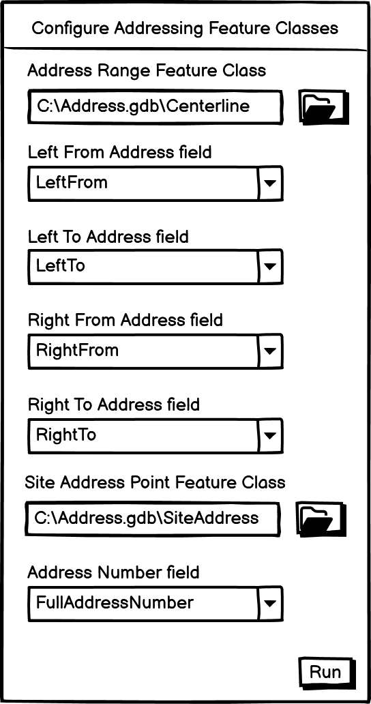

# Configure Addressing Feature Classes

|   |   |
| --- | --- |
| **Kind** | User Story · Pro |
| **Release** | — |
| **Product** | Roads & Highways · Utility Network |
| **Source** | [ConfigureAddressingFeatureClasses.pptx](<https://esriis.sharepoint.com/sites/LocationReferencing/Shared%20Documents/General/ConfigureAddressingFeatureClasses.pptx>) |
| **Edited** | 2024-01-02 16:59 by Nathan Easley |
| **Extracted** | 2026-09-04 · lane `xmlstrip` |

<!-- metadata
```yaml
title: "Configure Addressing Feature Classes"
source_file: "ConfigureAddressingFeatureClasses.pptx"
source_url: "https://esriis.sharepoint.com/sites/LocationReferencing/Shared%20Documents/General/ConfigureAddressingFeatureClasses.pptx"
doc_id: 450
doc_kind: "User Story"
surface: "Pro"
doc_revision: ""
target_release: ""
pe: ""
dev: ""
author: "William Isley"
last_edited_by: "Nathan Easley"
last_edited: "2024-01-02T16:59:30Z"
extracted: 2026-09-04
extraction_lane: xmlstrip
prompt_version: "v2.0.2"
keywords: ["addressing feature classes", "address range", "site address point", "dynamic segmentation", "geoprocessing tool", "configuration", "address data management"]
tools: ["Append Routes", "Overlay Events GP tool", "Query Attribute Set REST endpoint"]
products: ["Roads & Highways", "Utility Network"]
issues: []
related: [{"doc":424,"file":"configure-addressing-feature-classes-gp-tool-test-plan__doc424.md","s":5.477},{"doc":249,"file":"configure-address-feature-classes-location-referencing__doc249.md","s":4.774},{"doc":427,"file":"configure-addressing-feature-classes-location-referencing__doc427.md","s":4.366},{"doc":190,"file":"lrs-addressing-and-utility-network-properties-user-story__doc190.md","s":3.956},{"doc":344,"file":"update-address-range-information-in-overlay-events-and-query-attribute-sets__doc344.md","s":3.188}]
```
-->

## Summary

User story for configuring addressing feature classes with the LRS in ArcGIS Pro to enable proper use of addressing information in dynamic segmentation and data loading. Includes requirements for a geoprocessing tool to configure address range and site address point feature classes, validation checks, metadata storage, REST endpoint exposure, and indexing. Also covers testing scenarios, automation, documentation, and UI compliance.

## Related documents

<!-- related:begin -->
- [Configure Addressing Feature Classes GP Tool Test Plan](<https://esriis.sharepoint.com/sites/lrsworkspace/LRS Doc Index/Test Plans/configure-addressing-feature-classes-gp-tool-test-plan__doc424.md>) — similar text 0.39 · 4 title words · 1 filename word · same surface <!-- rel:424 -->
- [Configure Address Feature Classes (Location Referencing)](<https://esriis.sharepoint.com/sites/lrsworkspace/LRS Doc Index/Other/configure-address-feature-classes-location-referencing__doc249.md>) — similar text 0.21 · 3 title words · 3 filename words · same surface <!-- rel:249 -->
- [Configure Addressing Feature Classes (Location Referencing)](<https://esriis.sharepoint.com/sites/lrsworkspace/LRS Doc Index/Other/configure-addressing-feature-classes-location-referencing__doc427.md>) — similar text 0.27 · 4 title words · 1 filename word · same surface <!-- rel:427 -->
- [LRS Addressing and Utility Network Properties User Story](<https://esriis.sharepoint.com/sites/lrsworkspace/LRS Doc Index/User Stories/lrs-addressing-and-utility-network-properties-user-story__doc190.md>) — similar text 0.28 · 1 title word · 1 filename word · same kind/surface/folder <!-- rel:190 -->
- [Update Address Range Information in Overlay Events and Query Attribute Sets](<https://esriis.sharepoint.com/sites/lrsworkspace/LRS Doc Index/User Stories/update-address-range-information-in-overlay-events-and-query-attribute-sets__doc344.md>) — similar text 0.18 · same kind/surface/folder <!-- rel:344 -->
<!-- related:end -->

<!-- docs:begin -->
## Esri documentation

[View site address point properties](https://doc.esri.com/en/arcgis-pro/latest/help/production/roads-highways/view-site-address-point-properties.html) · [Apply dynamic segmentation](https://doc.esri.com/en/arcgis-pro/latest/help/production/roads-highways/apply-dynamic-segmentation.html) · [Manage address and roadway characteristic data together](https://doc.esri.com/en/arcgis-pro/latest/help/production/roads-highways/manage-address-and-roadway-characteristic-data-together.html)

_No page matched:_ [Append Routes](https://www.google.com/search?q=%22Append%20Routes%22+site%3Adoc.esri.com) · [Overlay Events GP tool](https://www.google.com/search?q=%22Overlay%20Events%20GP%20tool%22+site%3Adoc.esri.com) · [Query Attribute Set REST endpoint](https://www.google.com/search?q=%22Query%20Attribute%20Set%20REST%20endpoint%22+site%3Adoc.esri.com)
<!-- docs:end -->

---

## Slide 1 — Configure Addressing feature classes

User Story
ArcGIS Pro

## Slide 2 — User Story

As an LRS/Addressing data modeler/administrator, I need the ability to configure the addressing feature classes with the LRS, so that I can correctly utilize addressing information in dynamic segmentation and during data loading.
Persona:
Data Modeler/Administrator: This user is responsible for doing the configuration, modeling, and even loading of the LRS.  For local government organizations that will be maintaining addressing information along with linear referencing, configuring the feature classes with addressing information will make it easier to update this information when it’s included in dynamic segmentation.

## Slide 3 — Requirements

Create a geoprocessing tool that will allow users to configure the addressing feature classes with the LRS.
Address Range Feature Class/Layer is the centerline feature class that includes addressing information
Left From, Left To, Right From, and Right To Address fields should all be Short or Long Integer type
Site Address Point should be a feature class
Address number fields will be either a Short, Long, or Text field
Add the following checks to the tool:

  - Verify the two feature classes are in the same feature dataset as the LRS minimum schema items
  - Verify the spatial references and all tolerances match with the LRS minimum schema feature classes
Place the tool in the configuration toolbox at the same level as the Configure Utility Network Feature Class tool
Store this information in the LRS Metadata (similar to the UN info)
Expose this information at the LRS Server REST endpoints (can used for verification during testing)
Create indices for all the configured fields (if they’re not already present).



## Slide 4 — Testing

Test client-server with both traditional and branch versioned connection files.
Test in model builder (chained with other tools), python inline, python stand alone, and batch mode.
Test with feature classes that aren’t part of the same gdb, are part of the same gdb but not in a feature dataset, and within the feature dataset
508 and i18n testing.

Note: Use the dataset that was created for use in the demos to potential customer's last fall.  PEs should continue to add to this dataset so it can be utilized for additional user stories in this area and in future regression testing.

## Slide 5 — Other requirements

Configure the Append Routes tool to automatically check the “Consider Existing Centerlines” option (checked but still able to be unchecked) when the network selected is part of an LRS configured with addressing
In the Overlay Events GP tool/Query Attribute Set REST endpoint, make sure this tool is configured with the LRS to allow the centerline to participate in the input for the tool (like the check we make with the UN being configured)

Developer will provide new or updated error messages before testing begins.
i18n must be supported for all text, including error and warning messages.
Make the UIs 508 compliant.

## Slide 6 — Automation

Automate the tool the same way as the other configuration GP tools in python.

## Slide 7 — Documentation

Create doc and code samples for this new tool only in the Roads and Highways section.  The documentation should go into a new topic area called “Managing Roads and Highways with Addressing information” and the first topic should be called “Configuring Addressing with Roads and Highways”. (Note this is a similar pattern to what we did with the Utility Network, feel free to use it as a guide for formatting and layout)

  - The topic should go into depth about the integration with the Address Data Management solution.
  - It should highlight the step in the configuration where this tool would be run (after the LRS is created).
  - We should also add information about the enhancements to the Append Routes tool to support route loading as well as Overlay Events supporting centerlines in the dyn seg.
Add any new error messages to the existing GP error list for Location Referencing.
Add the fields to the attribute index fields for centerline FC

## Slide 8 — Story Points

Story Points:
Dev:
PE:
