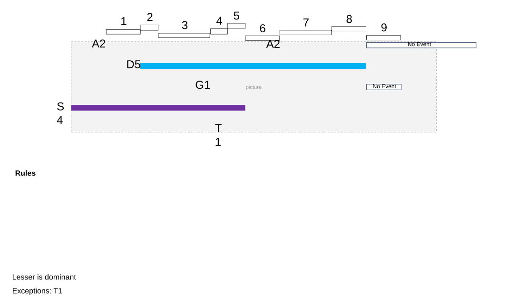
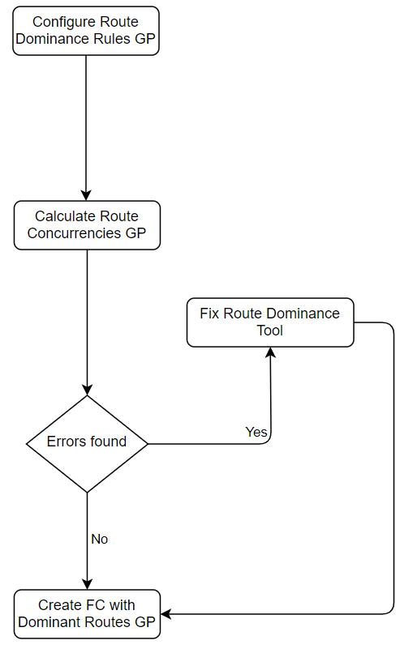
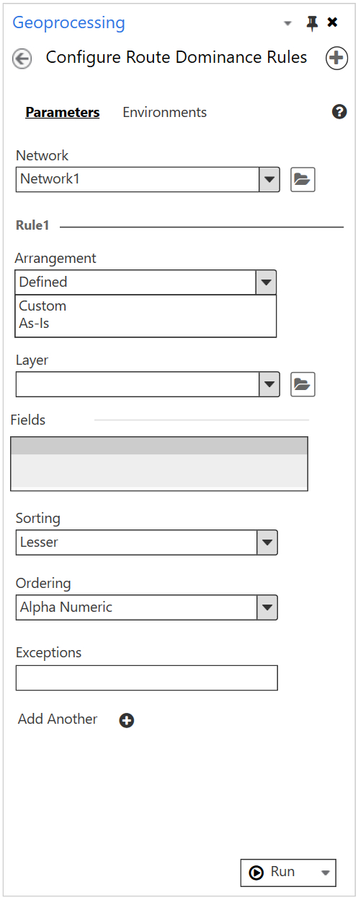
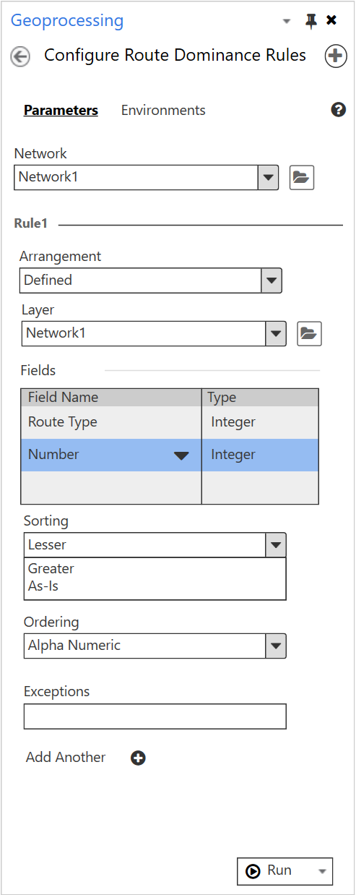
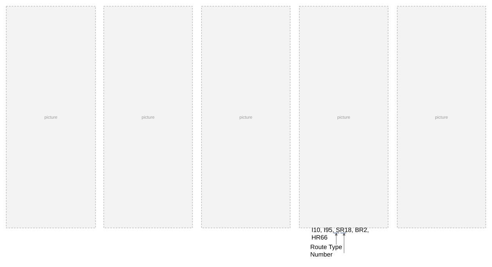
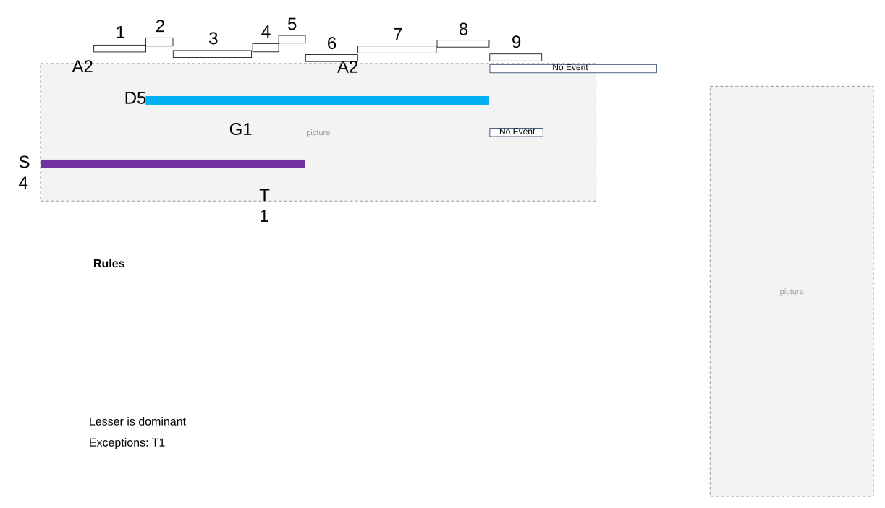
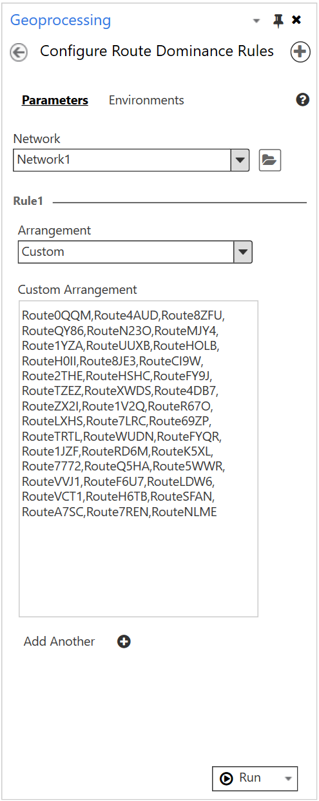

# Configure Route Priority User Story

| Field | Value |
| --- | --- |
| **Doc** | 723 · User Story · Pro |
| **Product** | Roads & Highways |
| **Release** | — |
| **Issues** | — |
| **Source** | [Configure_Route_Priority_UserStory.pptx](<https://esriis.sharepoint.com/sites/LocationReferencing/Shared%20Documents/General/Configure_Route_Priority_UserStory.pptx>) |
| **People** | author Rahul Rakshit · PE — · dev — |
| **Edited** | 2021-04-12 18:52 by Rahul Rakshit |
| **Extracted** | 2026-09-04 · lane xmlstrip · format 3.0 · prompt v2.0.2 |
| **Keywords** | route dominance · dominance rules · route hierarchy · concurrent routes · route configuration · geoprocessing tool · route priority |
| **Tools** | Configure Route Dominance Rules Geoprocessing Tool |

## Summary

Describes the need for a configuration tool to set rules determining route hierarchy and dominance in concurrent route sections within the LRS. Details user personas, acceptance criteria, interface elements, and testing considerations for the Route Dominance Rules geoprocessing tool. Covers configuration options, error handling, sorting and ordering rules, and automation plans.

## Related documents

<!-- related:begin -->
- [Cover Event Behavior in Realign Route with Concurrencies](<https://esriis.sharepoint.com/sites/lrsworkspace/LRS Doc Index/User Stories/cover-eb-in-realign-route-with-concurrencies.md>) — similar text 0.14 · 1 title word · 1 filename word · same kind/surface/folder <!-- rel:715 s=3.459 -->
- [Consider concurrencies in Update Measures from LRS](<https://esriis.sharepoint.com/sites/lrsworkspace/LRS Doc Index/User Stories/consider-concurrencies-in-update-measures-from-lrs.md>) — similar text 0.13 · 1 filename word · same kind/surface/folder <!-- rel:710 s=3.041 -->
- [Create LRS Intersection Geoprocessing Tool User Story](<https://esriis.sharepoint.com/sites/lrsworkspace/LRS Doc Index/User Stories/create-lrs-intersection-gp.md>) — similar text 0.30 · same kind/surface/folder <!-- rel:882 s=2.729 -->
- [Configure External Event Behaviors With LRS](<https://esriis.sharepoint.com/sites/lrsworkspace/LRS Doc Index/Other/configure-external-eb-with-lrs.md>) — similar text 0.06 · 1 title word · 1 filename word · same surface <!-- rel:248 s=2.575 -->
- [Modify LRS Intersection Feature Class Geoprocessing Tool](<https://esriis.sharepoint.com/sites/lrsworkspace/LRS Doc Index/Test Plans/modify-lrs-intersection-feature-class-gp.md>) — similar text 0.29 · same surface/folder <!-- rel:878 s=2.197 -->
<!-- related:end -->

<!-- docs:begin -->
## Esri documentation

_No page matched:_ [Configure Route Dominance Rules Geoprocessing Tool](https://www.google.com/search?q=%22Configure%20Route%20Dominance%20Rules%20Geoprocessing%20Tool%22+site%3Adoc.esri.com)
<!-- docs:end -->

---

## Slide 1

| Section ID | Dominant Route | Dominance Error |
| --- | --- | --- |
| 1 | S4 |  |
| 2 | S4 |  |
| 3 | S4 |  |
| 4 | S4 |  |
| 5 | T1 |  |
| 6 | T1 |  |
| 7 | T1 |  |
| 8 | A2 | More than one route as per dominance rules |
| 9 | A2 | No values were present for the attributes used to calculate the dominant route |

| Code | Functional Class |
| --- | --- |
| 1 | Interstates |
| 2 | Freeways and Expressways |
| 3 | Principal Arterials |
| 4 | Minor Arterials |
| 5 | Collectors |
| 6 | Local Roads |

style.visibilitystyle.visibilitystyle.visibilitystyle.visibilitystyle.visibilitystyle.visibility
[figure: 1–9 · Exceptions: T1 · No Event · T1 · S4 · G1 · D5 · A2 · Rules · Lesser is dominant]

## Slide 2

## Slide 3 — Configure Route Dominance Rules Geoprocessing Tool

As a LRS configurer/data loader, I want to be able to configure a set of rules to determine the hierarchy of my routes, so I can ensure that the dominant route is identified where there are concurrent routes.
Persona:
LRS configurer/data loader: This user is responsible for configuration/ongoing maintenance of the LRS along with initial and supplemental bulk data loading in the LRS. When a user first adopts Roads and Highways, they typically oversee or work with a partner to migrate their data into our information model and ensure the LRS is configured to meet their business rules. Once their organization is in production, this user would be responsible for bulk loading new data as needed (for example a pipeline operator is acquired) along with making any changes to configuration (such as changing an event behavior for an event). Many DoTs have modeled their routes to have concurrencies (two or more routes that share a common piece of pavement/centerlines). These concurrent routes provide some challenges for users, including the need to have events only locate on a single route (the dominant one) in these concurrent sections. To ensure that Roads and Highways can determine which route is the dominant one in each concurrent section, we need to support the ability for users to configure rules to determine which route is dominant. These rules are based on fields in the LRS Network (or LRS Event) that can be compared to order the routes (an example is dominance rules based on higher route type and lower route number; Interstate 20 is dominant over Interstate 35 and US Highways 60 is dominant over State Road 15).

## Slide 4

I10, I95, SR18, BR2, HR66
Route Type
            Number
style.visibilitystyle.visibilitystyle.visibilitystyle.visibility

## Slide 5

If the dominant route cannot be determined using the first rule due to any of the error conditions, then the next rule is used until rules are exhausted. In that case, lesser and alpha-numeric from the first rule will be used to determine the dominant route.

| RouteID | Dominance Order |
| --- | --- |
| RouteZ1 | 1 |
| RouteA2 | 2 |
| RouteQ345 | 3 |
| RouteW | 4 |

style.visibilitystyle.visibilitystyle.visibility

## Slide 6

| Code | Functional Class |
| --- | --- |
| 1 | Interstates |
| 2 | Freeways and Expressways |
| 3 | Principal Arterials |
| 4 | Minor Arterials |
| 5 | Collectors |
| 6 | Local Roads |

[figure: 1–9 · Exceptions: T1 · No Event · T1 · S4 · G1 · D5 · A2 · Rules · Lesser is dominant]

## Slide 7

| RouteID | Dominance Order |
| --- | --- |
| RouteZ1 | 1 |
| RouteA2 | 2 |
| RouteQ345 | 3 |
| RouteW | 4 |

style.visibility

## Slide 8 — Acceptance Criteria - 1

- This GP tool will be used to configure and modify the Route Dominance Rules
- Tool to be located in the Configuration>Network toolset
- The information should be stored in the LR Metadata
- Can be used in DC only

Network:

- Only a valid LRS network can be used as an input

Arrangement:

- Defined and Custom options. Defined by default.

Layer:

- Any Line event that is registered to the Network selected above or the Network itself can be used. Only non-spanning line events for now.
- Show only the valid events and the network in the drop-down list. The events or the network don’t have to be on the TOC.
- This parameter can be populated only if the Network parameter is populated.

Fields:

- In the Field Name column, list all the attribute field aliases in the drop-down that are not LR, branch database fields, ObjectID, Shape and Shape Length
- List the fields alphabetically
- Make sure that the complete field alias is shown
- Do not allow adding the same field more than once
- If more than one field is added, then concatenate the fields in the order they appear in the list to determine the order
- Empty by default but error out if empty when running the tool

## Slide 9 — Acceptance Criteria - 2

Sorting:

- Lesser and Greater options
- Lesser by default

Ordering:

- Alpha Numeric and Numeric options
- Alpha Numeric by default
- If there is a single field and that field is numeric, then allow only Numeric ordering
- If there is a single field and that field is non-numeric, then allow only Alpha-Numeric ordering
- If there is more than one field and they are numeric, then allow only Numeric ordering
- If there is more than one field and they are non-numeric, then allow only Alpha-Numeric ordering
- If there is more than one field and they are a mix of numeric and non-numeric, then allow only Alpha-Numeric ordering

Exceptions:

- The exceptions can be listed separated by a comma
- The dominance is determined in the order they are listed
- Route IDs will be used for non-line networks and Route Names will be used for line networks
- Validate only for duplicate values. Error out in that case.
- Empty by default

Add Another:

- Another rule can be added
- The next rule can have a different type of arrangement

## Slide 10 — Acceptance Criteria - 3

Custom Arrangement:

- The custom arrangement can be listed separated by a comma
- The dominance is determined in the order they are listed
- Route IDs will be used for non-line networks and Route Names will be used for line networks
- Validate only for duplicate values. Error out in that case.
- Empty by default but error out if empty when running the tool

In addition:

- Get the tool ratified through the GP review process before being closed
- Dev to provide the new error messages (if any) to the PE

## Slide 11

Testing
Databases

- DC and FS
- Oracle and SQL Server

Networks

- Non-line, line and PoM
- Error if the FC is non Network

Layers

- Networks, Non-spanning events
- PY – Error if the layer is not an event for the network or the same network

Error Messages

- Validate the error messages developed
    specifically for this tool

Python

- In-line and stand-alone

Model Builder

- Stand alone and chained

Rules

- Single rule and multiple rules
Fields

- Single field and multiple fields

## Slide 12

Automation
1. PY for negative cases
2. Test complete for positive cases that involves comparing the metadata

## Slide 13 — 1. GP doc to be written by Jim

Documentation

## Slide 14

Estimates
Dev:
PE:
Points:
