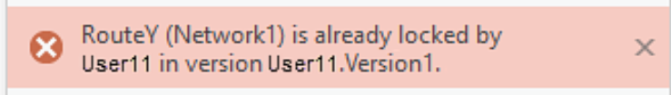
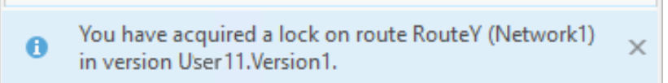

# Conflict Prevention Reassign Route User Story

| Field | Value |
| --- | --- |
| **Doc** | 559 · User Story · Pro |
| **Product** | — |
| **Release** | — |
| **Issues** | — |
| **Source** | [Conflict.Prevention.ReassignV1.pptx](<https://esriis.sharepoint.com/sites/LocationReferencing/Shared%20Documents/General/Conflict.Prevention.ReassignV1.pptx>) · rev V1 |
| **People** | author William Isley · PE — · dev — |
| **Edited** | 2023-06-05 18:02 by unknown |
| **Extracted** | 2026-09-04 · lane xmlstrip · format 3.0 · prompt v2.0.2 |
| **Keywords** | conflict prevention · reassign route · lock acquisition · lock transfer · route editing · arcgis pro |
| **Tools** | — |

## Summary

This document describes a user story for conflict prevention when reassigning routes to existing or new lines in ArcGIS Pro. It details lock acquisition and transfer scenarios to prevent editing conflicts among multiple users. Testing guidelines for REST and Pro tools are also included to verify lock behavior and messaging.

## Related documents

<!-- related:begin -->
- [Conflict Prevention: Acquire Locks when creating new routes in Create, Extend, Realign, and Reassign Route](<https://esriis.sharepoint.com/sites/lrsworkspace/LRS Doc Index/User Stories/conflict-prevention-acquire-locks-when-creating-new-routes.md>) — similar text 0.22 · 4 title words · 2 filename words · same kind/surface/folder <!-- rel:826 s=5.485 -->
- [Reassign Transfer Conflict Prevention Test Plan](<https://esriis.sharepoint.com/sites/lrsworkspace/LRS Doc Index/Test Plans/reassign-transfer-conflict-prevention.md>) — similar text 0.35 · 3 title words · 3 filename words · same surface <!-- rel:534 s=5.07 -->
- [Conflict Prevention: Acquire Locks in Create Route](<https://esriis.sharepoint.com/sites/lrsworkspace/LRS Doc Index/User Stories/conflict-prevention-acquire-locks-in-create-route.md>) — similar text 0.22 · 3 title words · 2 filename words · same kind/surface/folder <!-- rel:830 s=4.778 -->
- [Experience Builder Conflict Prevention User Story](<https://esriis.sharepoint.com/sites/lrsworkspace/LRS Doc Index/User Stories/exb-conflict-prevention.md>) — similar text 0.44 · 2 title words · 2 filename words · same kind/folder <!-- rel:433 s=4.688 -->
- [Conflict Prevention for Event Editing in Pro](<https://esriis.sharepoint.com/sites/lrsworkspace/LRS Doc Index/User Stories/conflict-prevention-for-event-editing-in-pro.md>) — similar text 0.26 · 2 title words · 2 filename words · same kind/surface/folder <!-- rel:683 s=4.668 -->
<!-- related:end -->

<!-- docs:begin -->
## Esri documentation

[Conflict prevention](https://doc.esri.com/en/arcgis-pro/latest/help/production/location-referencing-pipelines/conflict-prevention.html) · [Route reassignment](https://doc.esri.com/en/arcgis-pro/latest/help/production/location-referencing-pipelines/reassign-routes.html)
<!-- docs:end -->

---

## Story
### Conflict Prevention <!-- slide 1 -->
Reassign Route: Existing & New Line
User Story

### User Story <!-- slide 2 -->
As an LRS Editor, I need conflict prevention supported when Reassigning a route to an existing or a new line in ArcGIS Pro, so no conflicts can be introduced if other users edit the same route or event.

Persona: LRS Editor

- LRS route and event edits can come from field crews/contractors in a variety of file formats. The LRS Editor is responsible for making the route and event edits based on these documents.
- These users want Conflict Prevention supported (for route + events) when they reassign a route to a different or existing new line.

## Acceptance Criteria
### Conflict Prevention Reassign Route – Existing (another) Line <!-- slide 3 -->
| R1L1 Locked? | R1L2 Locked? | User | Version (In Use) | Reconcile Required? | Result | Releasable Status (After Edit goes through)* | Messages |
| --- | --- | --- | --- | --- | --- | --- | --- |
| 1- No | No | User1 | U1.V1 | No | Acquire lock on both lines, allow edit to proceed | No | Provide notification message on pane, see example below: |
| 2- No | No | User1 | U1.V1 | Yes | Auto reconcile and acquire lock on both lines, allow edit to proceed | No |  |
| 3- Yes | No | User1 | U1.V1 | No | Acquire lock on R1L2, allow edit to proceed | No |  |
| 3- Yes | No | User1 | U1.V1 | Yes | Auto reconcile and acquire lock on R1L2, allow edit to proceed | No |  |
| 5- No | Yes | User1 | U1.V1 | No | Acquire lock on R1L1, allow edit to proceed | No |  |
| 6- No | Yes | User1 | U1.V1 | Yes | Auto reconcile and acquire lock on R1L1, allow edit to proceed | No |  |
| 7- Yes | No | User2 | U2.V1 | No | Do not acquire lock | N/A | Provide error message on pane, see example below: |
| 8- No | Yes | User2 | U2.V1 | No | Do not acquire lock | N/A | Provide error message on pane |
| 9- Yes | Yes | User2 | U2.V1 | No | Do not acquire lock | N/A |  |

- Follow a similar pattern for lock acquisition & messages as we do in Route Editing tools today!
- R1L1 is being reassigned to R2L2 in table below User1 in U1.V1 :
- Releasable status will remain ‘yes’ if the Reassign tool is not run or reassign tool fails!
- Acquire lock if user selects another route / line on map or Type the name in the text box.
- Locks will be acquired and auto released in default version.

### Conflict Prevention Reassign Route – Existing (another) Line <!-- slide 4 -->
| R1L1 Locked? | R1L2 Locked? | User | Version (Not being used) | Version Type | Result | Releasable Status (After Edit goes through)* | Messages |
| --- | --- | --- | --- | --- | --- | --- | --- |
| 1- Yes | No | User2 | U2.V1 | Public | R1L1 lock gets transferred to User2 Acquire lock on R1L2 Allow the edit to proceed | No | Provide notification message on pane, see example below: |
| 2- No | Yes | User2 | U2.V1 | Public | R1L2 lock gets transferred to User2 Acquire lock on R1L1 Allow the edit to proceed | No | Provide error message on pane |
| 3- Yes | Yes | User2 | U2.V1 | Public | Both R1L2 and R1L1 lock gets transferred to User2 Allow the edit to proceed | No |  |
| 4- Yes | No | User2 | U2.V1 | Protected | Do not acquire lock any lock | N/A | Should we display a message? |
| 5- No | Yes | User2 | U2.V1 | Pvt | Do not acquire lock any lock | N/A | Should we display a message? |

- R1L1 is being reassigned to R2L2 in table below by User1 in U1.V1.
- Transfer lock cases:
- Releasable status will remain ‘yes’ if the Reassign tool is not run or reassign tool fails!
- Locks will be acquired and auto released in default version.
- Acquire lock if user selects another route / line on map or Type the name in the text box.
- Note that:
  - Lock transfer happen b/w 2 users.
  - Lock can only be transferred if, version is not being used by any other user (in which lock was acquired) and version type is public.

### Conflict Prevention Reassign Route – New Line <!-- slide 5 -->
| R1L1 Locked | R1L2 Locked | User | Version (In Use) | Reconcile Required? | Result | Releasable Status (After Edit goes through)* | Messages |
| --- | --- | --- | --- | --- | --- | --- | --- |
| 1- No | N/A | User1 | U1.V1 | No | Acquire lock on both lines, allow edit to proceed | No | Provide notification message on pane, see example below: |
| 2- No | N/A | User1 | U1.V1 | Yes | Auto reconcile and acquire lock on both lines, allow edit to proceed | No |  |
| 3- Yes | N/A | User1 | U1.V1 | No | Acquire lock on R1L2, allow edit to proceed | No |  |
| 3- Yes | N/A | User1 | U1.V1 | Yes | Auto reconcile and acquire lock on R1L2, allow edit to proceed | No |  |
| 5- No | N/A | User1 | U1.V1 | No | Acquire lock on R1L1, allow edit to proceed | No |  |
| 6- No | N/A | User1 | U1.V1 | Yes | Auto reconcile and acquire lock on R1L1, allow edit to proceed | No |  |
| 7- Yes | N/A | User2 | U2.V1 | No | Do not acquire lock | N/A | Provide error message on pane, see example below: |
| 8- No | N/A | User2 | U2.V1 | No | Do not acquire lock | N/A | Provide error message on pane |
| 9- Yes | N/A | User2 | U2.V1 | No | Do not acquire lock | N/A |  |

- Follow a similar pattern for lock acquisition & messages as we do in Route Editing tools today!
- R1L1 is being reassigned to R2L2 (new line) User1 in U1.V1 in table below:
- Releasable status will remain ‘yes’ if the Reassign tool is not run or reassign tool fails!
- Acquire lock if user selects another route / line on map or Type the name in the text box.
- Locks will be acquired and auto released in default version.

## Testing
<!-- slide 7 -->
- Verify in REST and Pro
- Verify the tools work as they do today with no conflict prevention enabled. If conflict prevention is disabled locks do not have effect
- Do a couple of cases on REST side.
- Verify on a variety of route shapes (mix and match with cases above, no need to run every test case on each route type)
- Verify the existing confirmation and error messages
- Verify, only owner of a lock can release locks
- Verify, if a version no longer exists, allow lock to be released by anyone?
- Test on lock transfers as well

## Assignment
### Estimation <!-- slide 6 -->
- Dev:
- PE:
- Story Points:
