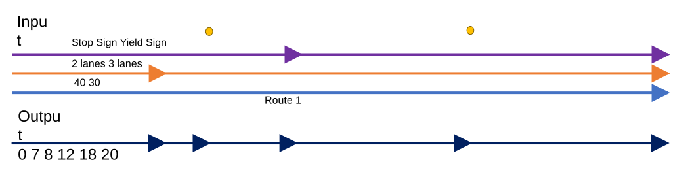

# Consider Point Events in Query Attribute Set and Overlay Events

| Field | Value |
| --- | --- |
| **Doc** | 392 · User Story · Pro |
| **Product** | — |
| **Release** | — |
| **Issues** | — |
| **Source** | [SupportPointEventsOverlayEventsQueryAttSet.pptx](<https://esriis.sharepoint.com/sites/LocationReferencing/Shared%20Documents/General/SupportPointEventsOverlayEventsQueryAttSet.pptx>) |
| **People** | author William Isley · PE — · dev — |
| **Edited** | 2024-03-20 18:45 by Nathan Easley |
| **Extracted** | 2026-09-04 · lane xmlstrip · format 3.0 · prompt v2.0.2 |
| **Keywords** | point event · dynamic segmentation · route editing · overlay events · attribute set · linear event |
| **Tools** | Query Attribute Set · Overlay Events |

## Summary

This document describes a user story for including point events in dynamic segmentation within the Query Attribute Set REST endpoint and Overlay Events geoprocessing tool. It outlines requirements for handling point events alongside linear events, testing scenarios, automation updates, and documentation enhancements. The goal is to enable LRS editors to see a complete representation of all events along a route.

## Related documents

<!-- related:begin -->
- [REST/GP: Consider Centerline Direction in Query Attribute Set/Overlay Events](<https://esriis.sharepoint.com/sites/lrsworkspace/LRS Doc Index/User Stories/rest-gp-consider-centerline-direction-in-query-attribute-set.md>) — similar text 0.45 · 6 title words · 4 filename words · same kind/surface/folder <!-- rel:436 s=7.647 -->
- [Dynamic Segmentation Table: Consider Point Events in DynSeg Table](<https://esriis.sharepoint.com/sites/lrsworkspace/LRS Doc Index/User Stories/dynseg-table-consider-point-events-in-dynseg-table.md>) — similar text 0.65 · 3 title words · 3 filename words · same kind/surface/folder <!-- rel:394 s=7.068 -->
- [REST/GP: Support the centerline feature class like an event in Query Attribute Set/Overlay Events](<https://esriis.sharepoint.com/sites/lrsworkspace/LRS Doc Index/User Stories/rest-gp-support-the-centerline-feature-class-like-an-event.md>) — similar text 0.38 · 5 title words · 4 filename words · same kind/surface/folder <!-- rel:475 s=7.039 -->
- [Support Overlapping Events in Query Attribute Set and Overlay Events GP Tool](<https://esriis.sharepoint.com/sites/lrsworkspace/LRS Doc Index/User Stories/support-overlapping-events-in-query-attribute-set.md>) — similar text 0.20 · 5 title words · 2 filename words · same kind/surface/folder <!-- rel:290 s=5.977 -->
- [Update Address Range Information in Overlay Events and Query Attribute Sets](<https://esriis.sharepoint.com/sites/lrsworkspace/LRS Doc Index/User Stories/5537-update-address-range-information-in-overlay-events-and-query.md>) — similar text 0.23 · 4 title words · 3 filename words · same kind/surface/folder <!-- rel:344 s=5.844 -->
<!-- related:end -->

<!-- docs:begin -->
## Esri documentation

[Apply dynamic segmentation](https://doc.esri.com/en/arcgis-pro/latest/help/production/location-referencing-pipelines/apply-dynamic-segmentation.html)

_No page matched:_ [Query Attribute Set](https://www.google.com/search?q=%22Query%20Attribute%20Set%22+site%3Adoc.esri.com) · [Overlay Events](https://www.google.com/search?q=%22Overlay%20Events%22+site%3Adoc.esri.com)
<!-- docs:end -->

---

## Story
### REST/GP: Consider point events in Query Attribute Set/Overlay Events <!-- slide 1 -->
User Story
ArcGIS Pro

### User Story <!-- slide 2 -->
As an LRS data editor, I need point events to be included in dynamic segmentation, so that I can see a complete representation of all events along a route.
Persona
LRS Editor: This user is responsible for making edits to the LRS.  The edits they need to make come in from field crews/contractors in a variety of formats (shapefiles, engineering drawing, fgdbs).  The LRS Editor is responsible for making the route edits based on these documents.  This user will also dynamically segment data as needed for analysis.  Users want to be able to include point events along side linear events in the dynamic segmentation so they can see a complete representation of the route(s) being dynseged.

## Acceptance Criteria
### Requirements <!-- slide 3 -->
- In the Query Attribute Set REST endpoint and Overlay Events GP tool, allow point events to be included as input event layers
- When a point event from a route is overlaid, make sure the tool does the following:
  - For point event, a record will be created, that shows the same From/To Measure and From/To Route ID. These records should include the point event attribute(s) and the linear event(s) attributes at that location
  - Continue to create the linear event output records like we do today; leave the point event attribute(s) null
  - Make sure other field information is correct such as From Date, To Date, and other attribute fields
  - The correct shape should be built (if the output format is a feature class) as a point where the point event exists
  - If there a multiple point events (in the same layer or different input point event layers) at the same location, only include one record with the attributes for all the point events at that location
  - Make sure user can input multiple point event layers in the GP tool (like we do for the input line events)
  - Support allowing both point and line events as part of the input event layers

### Example <!-- slide 4 -->
2 lanes						        3 lanes
0                                     7           8                      12                                          18			   20

| From Measure | To Measure | Route | Speed | Lanes | Sign |
| --- | --- | --- | --- | --- | --- |
| 0 | 7 | Rte1 | 40 | 2 | Null |
| 7 | 8 | Rte1 | 30 | 2 | Null |
| 8 | Null | Rte1 | 30 | 2 | Stop |
| 8 | 12 | Rte1 | 30 | 2 | Null |
| 12 | 18 | Rte1 | 30 | 3 | Null |
| 18 | Null | Rte1 | 30 | 3 | Yield |
| 18 | 20 | Rte1 | 30 | 3 | Null |

                                                 Stop Sign				Yield Sign

[figure: 40 30 · Route 1 · Input · Output]

## Testing
<!-- slide 5 -->
- Test with services with the VMS enabled, fgdb, and direct connect egdb
- Test a variety of route types
  - Non-Line network normal routes
  - Line network normal routes
  - Vertical routes
  - Complex routes
- Test at least one case where events are associated with a different network and translation needs to occur

## Automation
<!-- slide 6 -->
- Add to the existing automation cases for the endpoint and gp tool.

## Documentation
<!-- slide 7 -->
- Update language to the existing REST API and GP topic that mentions that point and line events are supported as inputs.
- Providing a diagram to show the example input/output for a scenario with both point and line events would be good.

## Assignment
### Story Points <!-- slide 8 -->
Story Points:
Dev:
PE:
