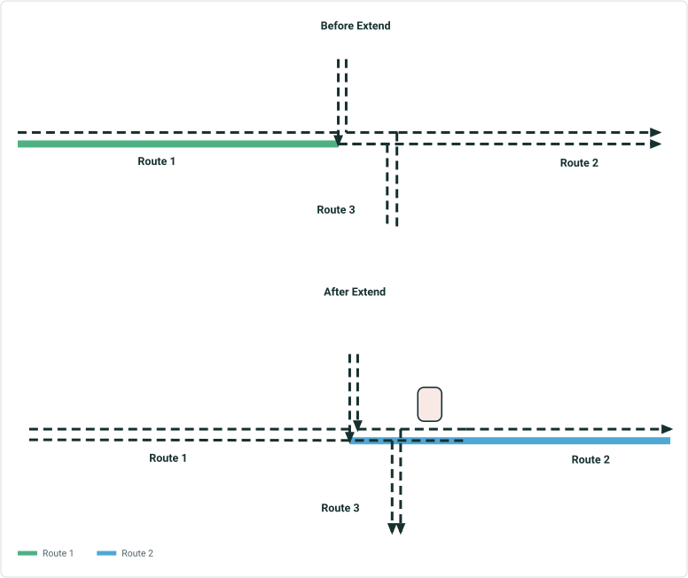

# Cover Event Behavior in Extend Route with Concurrencies

|   |   |
| --- | --- |
| **Kind** | User Story · Pro |
| **Release** | — |
| **Product** | Roads & Highways · Pipeline Referencing |
| **Source** | [Cover Event Behavior in Extend Route with Concurrencies.pptx](<https://esriis.sharepoint.com/sites/LocationReferencing/Shared%20Documents/General/Cover%20Event%20Behavior%20in%20Extend%20Route%20with%20Concurrencies.pptx>) |
| **Edited** | 2021-03-25 22:35 by Nathan Easley |
| **Extracted** | 2026-09-04 · lane `xmlstrip` |

<!-- metadata
```yaml
title: "Cover Event Behavior in Extend Route with Concurrencies"
source_file: "Cover Event Behavior in Extend Route with Concurrencies.pptx"
source_url: "https://esriis.sharepoint.com/sites/LocationReferencing/Shared%20Documents/General/Cover%20Event%20Behavior%20in%20Extend%20Route%20with%20Concurrencies.pptx"
doc_id: 726
doc_kind: "User Story"
surface: "Pro"
doc_revision: ""
target_release: ""
pe: ""
dev: ""
author: "William Isley"
last_edited_by: "Nathan Easley"
last_edited: "2021-03-25T22:35:16Z"
extracted: 2026-09-04
extraction_lane: xmlstrip
prompt_version: "v2.0.2"
keywords: ["event behavior", "extend route", "concurrency", "route dominance", "functional class", "roads and highways", "arcmap"]
tools: []
products: ["Roads & Highways", "Pipeline Referencing"]
issues: []
related: [{"doc":715,"file":"cover-event-behavior-in-realign-route-with-concurrencies__doc715.md","s":8.842},{"doc":731,"file":"cover-event-behavior-in-extend-route__doc731.md","s":8.458},{"doc":725,"file":"cover-event-behavior-in-realign-route__doc725.md","s":7.399},{"doc":839,"file":"support-event-behaviors-on-complex-route-shapes-in-extend-route__doc839.md","s":6.115},{"doc":732,"file":"support-configuration-of-cover-event-behavior__doc732.md","s":5.674}]
```
-->

## Summary

Describes a user story for an event behavior that ensures full coverage of events like Functional Class when extending routes with concurrencies in the LRS. It includes rules for handling route dominance in concurrent sections, example use cases, testing guidelines, automation plans, and documentation updates. Development is targeted for ArcMap in Roads and Highways.

## Related documents

<!-- related:begin -->
- [Cover Event Behavior in Realign Route with Concurrencies](<https://esriis.sharepoint.com/sites/lrsworkspace/LRS Doc Index/User Stories/cover-event-behavior-in-realign-route-with-concurrencies__doc715.md>) — similar text 0.76 · 5 title words · 5 filename words · same kind/surface/folder <!-- rel:715 -->
- [Cover Event Behavior in Extend Route](<https://esriis.sharepoint.com/sites/lrsworkspace/LRS Doc Index/User Stories/cover-event-behavior-in-extend-route__doc731.md>) — similar text 0.57 · 5 title words · 5 filename words · same kind/surface/folder <!-- rel:731 -->
- [Cover Event Behavior in Realign Route](<https://esriis.sharepoint.com/sites/lrsworkspace/LRS Doc Index/User Stories/cover-event-behavior-in-realign-route__doc725.md>) — similar text 0.59 · 4 title words · 4 filename words · same kind/surface/folder <!-- rel:725 -->
- [Support Event Behaviors on Complex Route Shapes in Extend Route](<https://esriis.sharepoint.com/sites/lrsworkspace/LRS Doc Index/User Stories/support-event-behaviors-on-complex-route-shapes-in-extend-route__doc839.md>) — similar text 0.28 · 3 title words · 4 filename words · same kind/surface/folder <!-- rel:839 -->
- [Support configuration of Cover event behavior](<https://esriis.sharepoint.com/sites/lrsworkspace/LRS Doc Index/User Stories/support-configuration-of-cover-event-behavior__doc732.md>) — similar text 0.36 · 3 title words · 3 filename words · same kind/surface/folder <!-- rel:732 -->
<!-- related:end -->

<!-- docs:begin -->
## Esri documentation

[Event behavior](https://doc.esri.com/en/arcgis-pro/latest/help/production/roads-highways/what-is-event-behavior.html) · [Extend a route](https://doc.esri.com/en/arcgis-pro/latest/help/production/roads-highways/extend-a-route.html) · [3D in Roads and Highways](https://doc.esri.com/en/arcgis-pro/latest/help/production/roads-highways/3d-in-roads-and-highways.html)
<!-- docs:end -->

---

## Slide 1 — Cover Event Behavior in Extend Route with concurrencies

User Story

## Slide 2 — User Story

As an LRS Editor, I would like an event behavior that will always cover the entire route for events like Functional Class when I perform an extend since there is usually one event record for these events that goes across the entire route, so that I don't have to go to Event Editor to add/merge events after performing one of these edits.

Persona
LRS Editor: This user is responsible for making edits to the LRS.  The edits they need to make come in from field crews/contractors in a variety of formats (shapefiles, engineering drawing, fgdbs).  The LRS Editor is responsible for making the route edits based on these documents.  Many DoTs have events that should be “full coverage” for each route in the network.  An example is functional class.  Typically, the functional class for each route doesn’t change over time across the entire route (i.e. if the functional class for a route is state road, it’s going to be state road across the entire route and only have one event record for the entire route).  Cover event behavior provides a way for users to have these events continue to provide full coverage on a route even when it’s extended or realigned.

## Slide 3 — Cover with route dominance rules

When route dominance rules are configured for the network being edited AND cover behavior is configured for an event, cover behavior should do the following:

  - For any newly created concurrent section created by a extend, determine which route is dominant in each concurrent section and only apply cover behavior for the route being extended where it is dominant in each section.  If the non-dominant route(s) in the newly created concurrent section had events, they should be retired so only the dominant route event exists at the location of the concurrency.

## Slide 4 — Additional Rules

- If the route being extended is not dominant in a concurrent section, follow stay put behavior in the extended section.
- If there are no route dominance rules configured for the network being edited AND cover behavior is configured for an event AND the extend created concurrencies, follow stay put rules in the concurrent sections (Nathan to follow up with DOTs to make sure this is what they want or makes sense).
- If there is an existing concurrency in the extended portion and the route being extended is not dominant in the concurrent section, do not change any events in the concurrent section (even if the current event is not associated with the dominant route; that is user error and should be corrected by the user)
- Development is only in ArcMap for Roads and Highways

## Slide 5 — Example Use Cases



Route 1 is extended and now has two concurrent sections.
Concurrency 1 is between Route 1 and Route 3.
(Route 3 is dominant)
Concurrency 2 is between Route 1 and Route 2.
(Route 1 is dominant)
Event on Route 1 only extends to cover concurrency where it is dominant.

Event on Rte 1
Event on Rte 2
Event on Rte 3

Event on Rte 1 only extends to cover this section, event on Rte 2 splits and gets retired in concurrent section
Event on Rte 1
Event on Rte 2
Event on Rte 3

## Slide 6 — Testing

Test on both spanning and non spanning events
It shouldn’t matter whether the data is Roads and Highways or Pipeline Referencing
Should work on simple and gapped routes
Make sure to test cases where there are existing concurrent sections before extending, in addition, to cases where concurrent sections are created after making the edit.
Cover is automated in the ArcMap experience, use the test plan and test data from that story (we should be able to take the ArcMap data, make the same edits in Pro then compare it with the expected results)
Look at the bugs reported for cover extend since the capability was released in ArcMap and include those scenarios as test cases

## Slide 7 — Automation

Create a new python automated test that follows the same pattern as other automated tests for event behaviors.

## Slide 8 — Documentation

Add information about concurrent route scenario support for Cover in https://pro.arcgis.com/en/pro-app/latest/help/production/location-referencing-pipelines/behavior-for-extending-an-event.htm and the Roads and Highways version of the topic.

## Slide 9 — Assignment

Story Points:
Dev:
PE:
