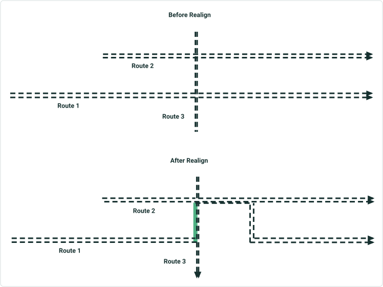
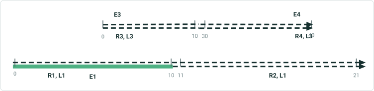
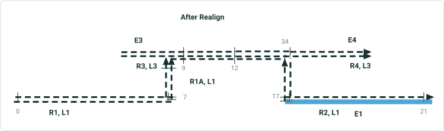

# Cover Event Behavior in Realign Route with Concurrencies

|   |   |
| --- | --- |
| **Kind** | User Story · Pro |
| **Release** | — |
| **Product** | Roads & Highways · Pipeline Referencing |
| **Source** | [Cover Event Behavior in Realign Route with Concurrencies.pptx](<https://esriis.sharepoint.com/sites/LocationReferencing/Shared%20Documents/General/Cover%20Event%20Behavior%20in%20Realign%20Route%20with%20Concurrencies.pptx>) |
| **Edited** | 2021-04-30 00:55 by Nathan Easley |
| **Extracted** | 2026-09-04 · lane `xmlstrip` |

<!-- metadata
```yaml
title: "Cover Event Behavior in Realign Route with Concurrencies"
source_file: "Cover Event Behavior in Realign Route with Concurrencies.pptx"
source_url: "https://esriis.sharepoint.com/sites/LocationReferencing/Shared%20Documents/General/Cover%20Event%20Behavior%20in%20Realign%20Route%20with%20Concurrencies.pptx"
doc_id: 715
doc_kind: "User Story"
surface: "Pro"
doc_revision: ""
target_release: ""
pe: ""
dev: ""
author: "William Isley"
last_edited_by: "Nathan Easley"
last_edited: "2021-04-30T00:55:00Z"
extracted: 2026-09-04
extraction_lane: xmlstrip
prompt_version: "v2.0.2"
keywords: ["cover event behavior", "realign route", "concurrency", "route dominance", "event spanning", "event behavior", "route editing"]
tools: []
products: ["Roads & Highways", "Pipeline Referencing"]
issues: []
related: [{"doc":725,"file":"cover-event-behavior-in-realign-route__doc725.md","s":9.389},{"doc":726,"file":"cover-event-behavior-in-extend-route-with-concurrencies__doc726.md","s":8.842},{"doc":731,"file":"cover-event-behavior-in-extend-route__doc731.md","s":7.979},{"doc":730,"file":"support-snap-event-behavior-in-realign-route__doc730.md","s":6.926},{"doc":732,"file":"support-configuration-of-cover-event-behavior__doc732.md","s":6.636}]
```
-->

## Summary

Describes the user story for implementing cover event behavior during route realignment with concurrencies in the LRS. It explains how event coverage should be managed based on route dominance rules, including handling of concurrent sections and spanning events. The document also outlines testing, automation, and documentation plans for this behavior.

## Related documents

<!-- related:begin -->
- [Cover Event Behavior in Realign Route](<https://esriis.sharepoint.com/sites/lrsworkspace/LRS Doc Index/User Stories/cover-event-behavior-in-realign-route__doc725.md>) — similar text 0.59 · 5 title words · 5 filename words · same kind/surface/folder <!-- rel:725 -->
- [Cover Event Behavior in Extend Route with Concurrencies](<https://esriis.sharepoint.com/sites/lrsworkspace/LRS Doc Index/User Stories/cover-event-behavior-in-extend-route-with-concurrencies__doc726.md>) — similar text 0.76 · 5 title words · 5 filename words · same kind/surface/folder <!-- rel:726 -->
- [Cover Event Behavior in Extend Route](<https://esriis.sharepoint.com/sites/lrsworkspace/LRS Doc Index/User Stories/cover-event-behavior-in-extend-route__doc731.md>) — similar text 0.46 · 4 title words · 4 filename words · same kind/surface/folder <!-- rel:731 -->
- [Support Snap Event Behavior in Realign Route](<https://esriis.sharepoint.com/sites/lrsworkspace/LRS Doc Index/User Stories/support-snap-event-behavior-in-realign-route__doc730.md>) — similar text 0.34 · 4 title words · 4 filename words · same kind/surface/folder <!-- rel:730 -->
- [Support configuration of Cover event behavior](<https://esriis.sharepoint.com/sites/lrsworkspace/LRS Doc Index/User Stories/support-configuration-of-cover-event-behavior__doc732.md>) — similar text 0.32 · 3 title words · 3 filename words · same kind/surface/folder <!-- rel:732 -->
<!-- related:end -->

<!-- docs:begin -->
## Esri documentation

[Realign routes](https://doc.esri.com/en/arcgis-pro/latest/help/production/roads-highways/realign-routes.html) · [Event behavior](https://doc.esri.com/en/arcgis-pro/latest/help/production/roads-highways/what-is-event-behavior.html)
<!-- docs:end -->

---

## Slide 1 — Cover Event Behavior in Realign Route with Concurrencies

User Story

## Slide 2 — User Story

As an LRS Editor, I would like an event behavior that will always cover the entire route for events like Functional Class when I perform a realign since there is usually one event record for these events that goes across the entire route, so that I don't have to go to Event Editor to add/merge events after performing one of these edits.

Persona
LRS Editor: This user is responsible for making edits to the LRS.  The edits they need to make come in from field crews/contractors in a variety of formats (shapefiles, engineering drawing, fgdbs).  The LRS Editor is responsible for making the route edits based on these documents.  Many DoTs have events that should be “full coverage” for each route in the network.  An example is functional class.  Typically, the functional class for each route doesn’t change over time across the entire route (i.e. if the functional class for a route is state road, it’s going to be state road across the entire route and only have one event record for the entire route).  Cover event behavior provides a way for users to have these events continue to provide full coverage on a route even when it’s extended or realigned.

## Slide 3 — Realign Route Cover with Concurrencies

When route dominance rules are configured for the network with routes being edited AND cover behavior is configured for an event, cover event behavior should do the following:

  - For any newly created concurrent section(s) created by the realign, determine which route is dominant in each concurrent section
  - If the realigned route is realigned to a newly created concurrent section and it is the dominant route in that section, apply cover behavior for that section
  - If the realigned route is realigned to a newly created concurrent section and it is NOT the dominant route in that section, apply stay put behavior for that section
  - If the non dominant routes in the newly created concurrent section had events, they should be retired so only the dominant routes exists in the concurrent section
- If there are either no dominance rules configured or the current dominance rules configured can’t determine which route is dominant in a section, we should take whatever route the concurrency logic provides as dominant in that section and apply cover based on the criteria in previous slides.
- If there is an existing concurrency in the realigned portion and the route being realigned is not dominant in the concurrent section, do not change any events in the concurrent section (even if the current event is not associated with the dominant route; that is user error and should be corrected by the user)
Note that the basic rules for cover still apply (i.e. in order to invoke cover behavior that event must be completely covering, touching the end, partially within, or completely within the realigned section, otherwise Stay Put is applied) to determine if cover is applied at all.

## Slide 4 — Example Use Case



Route 1 is realigned and has 2 concurrent sections (1+3, 1+2).
Concurrency 1 is between Route 1 and Route 3.
(Route 3 is dominant)
Concurrency 2 is between Route 1 and Route 2.
(Route 1 is dominant)
Event on Route 1 only extends to cover concurrency where it is dominant (or there is no concurrency).
Event on Rte 1
Event on Rte 2
Event on Rte 3
Event on Rte 1
Event on Rte 2
Event on Rte 3

## Slide 5 — Events spanning routes

- If the event is configured to span routes, we can apply the same basic principles.
  - Determine any concurrencies created by the realign
  - Determine the dominant route in each section
  - Where the realigned route is dominant, apply cover, otherwise apply stay put
- Note that if there is an abandonment, that is a different edit operation/event behavior, so it’s not applicable to determining concurrencies and applying cover to the realigned section
- Note that for both spanning and non spanning routes, the event could end up being split if there are multiple unique concurrent sections in the realigned portion

## Slide 6 — Example Use Case

Realignment from middle of R1 to middle of R2 results in 2 concurrent sections (R1A-R3 and R1A-R4).
Concurrency 1 with R3 (R3 is dominant).
Concurrency 2 with R4 (R1A is dominant).
E1 only extends to cover concurrency where it is dominant (or there is no concurrency).



| Ev | FR | TR | FM | TM |
| --- | --- | --- | --- | --- |
| E1 | R1 | R2 | 0 | 21 |
| E3 | R3 | R3 | 0 | 10 |
| E4 | R4 | R4 | 30 | 40 |



| Ev | FR | TR | FM | TM |
| --- | --- | --- | --- | --- |
| E1 | R1 | R1A | 0 | 9 |
| E1 | R1A | R2 | 12 | 21 |
| E3 | R3 | R3 | 0 | 10 |
| E4 | R4 | R4 | 34 | 40 |

## Slide 7 — Testing

Test on both spanning and non spanning events
It shouldn’t matter whether the data is Roads and Highways or Pipeline Referencing
Should work on simple, gapped, complex, and vertical routes
Make sure to test cases where there are existing concurrent sections before realigning, in addition, to cases where concurrent sections are created after making the edit.
Cover is automated in the ArcMap experience, use the test plan and test data from that story (we should be able to take the ArcMap data, make the same edits in Pro then compare it with the expected results)
Look at the bugs reported for cover realign since the capability was released in ArcMap and include those scenarios as test cases

## Slide 8 — Automation

Create a new python automated test that follows the same pattern as other automated tests for event behaviors.

## Slide 9 — Documentation

Add information about concurrent route scenario support for Cover in https://pro.arcgis.com/en/pro-app/latest/help/production/location-referencing-pipelines/event-behavior-for-route-realignment.htm and the Roads and Highways version of the topic.

## Slide 10 — Assignment

Story Points:
Dev:
PE:
