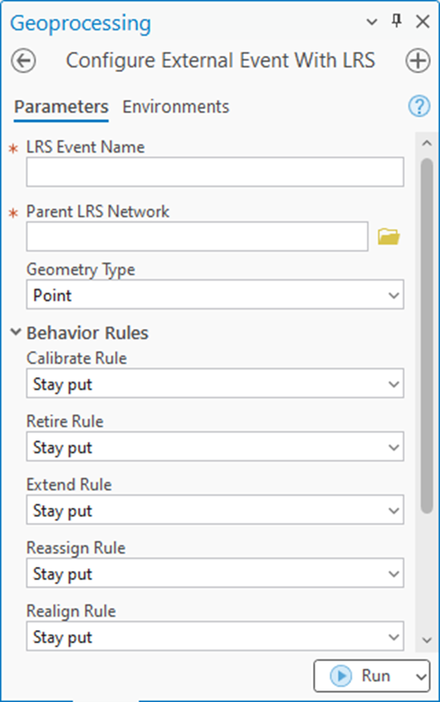

# Create External Event with No Connection File

|   |   |
| --- | --- |
| **Kind** | User Story · Pro |
| **Release** | — |
| **Product** | Roads & Highways |
| **Source** | [CreateExternalEventNoConnectionFile.pptx](<https://esriis.sharepoint.com/sites/LocationReferencing/Shared%20Documents/General/CreateExternalEventNoConnectionFile.pptx>) |
| **Edited** | 2024-11-15 00:14 by Nathan Easley |
| **Extracted** | 2026-09-04 · lane `xmlstrip` |

<!-- metadata
```yaml
title: "Create External Event with No Connection File"
source_file: "CreateExternalEventNoConnectionFile.pptx"
source_url: "https://esriis.sharepoint.com/sites/LocationReferencing/Shared%20Documents/General/CreateExternalEventNoConnectionFile.pptx"
doc_id: 288
doc_kind: "User Story"
surface: "Pro"
doc_revision: ""
target_release: ""
pe: ""
dev: ""
author: "William Isley"
last_edited_by: "Nathan Easley"
last_edited: "2024-11-15T00:14:58Z"
extracted: 2026-09-04
extraction_lane: xmlstrip
prompt_version: "v2.0.2"
keywords: ["external event", "event behavior", "geoprocessing tool", "lrs metadata", "external system integrator"]
tools: ["Remove LRS Entity"]
products: ["Roads & Highways"]
issues: []
related: [{"doc":287,"file":"relocate-event-support-for-external-event-with-no-connection-file__doc287.md","s":4.752},{"doc":744,"file":"support-updating-external-event-configuration__doc744.md","s":4.725},{"doc":275,"file":"support-external-event-configuration-without-connection-file-test-plan__doc275.md","s":4.722},{"doc":745,"file":"support-adding-external-event-to-pro-map-local-scene__doc745.md","s":4.349},{"doc":811,"file":"configure-external-events__doc811.md","s":3.588}]
```
-->

## Summary

User story for creating a geoprocessing tool in ArcGIS Pro that allows external system integrators to configure external event behaviors without requiring a connection file. The tool will register external events in the LRS metadata and display them in the LRS hierarchy but will not allow mapping due to lack of data reference. Testing includes line and non-line networks and automation via python and model builder. Documentation updates will cover usage notes and integration patterns.

## Related documents

<!-- related:begin -->
- [Relocate Event Support for External Event with No Connection File](<https://esriis.sharepoint.com/sites/lrsworkspace/LRS Doc Index/Design Spikes/relocate-event-support-for-external-event-with-no-connection-file__doc287.md>) — similar text 0.47 · 3 title words · 1 filename word · same surface/folder <!-- rel:287 -->
- [Support updating External Event configuration](<https://esriis.sharepoint.com/sites/lrsworkspace/LRS Doc Index/User Stories/support-updating-external-event-configuration__doc744.md>) — similar text 0.23 · 2 title words · 2 filename words · same kind/surface/folder <!-- rel:744 -->
- [Support External Event Configuration Without Connection File – Test Plan](<https://esriis.sharepoint.com/sites/lrsworkspace/LRS Doc Index/Test Plans/support-external-event-configuration-without-connection-file-test-plan__doc275.md>) — similar text 0.50 · 3 title words · 1 filename word · same surface <!-- rel:275 -->
- [Support adding External Event to Pro map/local scene](<https://esriis.sharepoint.com/sites/lrsworkspace/LRS Doc Index/User Stories/support-adding-external-event-to-pro-map-local-scene__doc745.md>) — similar text 0.22 · 2 title words · 2 filename words · same kind/surface/folder <!-- rel:745 -->
- [Configure External Events](<https://esriis.sharepoint.com/sites/lrsworkspace/LRS%20Doc%20Index/Design%20Spikes/configure-external-events__doc811.md>) — similar text 0.24 · 1 title word · 1 filename word · same surface/folder <!-- rel:811 -->
<!-- related:end -->

<!-- docs:begin -->
## Esri documentation

[External event registration](https://doc.esri.com/en/arcgis-pro/latest/help/production/roads-highways/external-event-registration.html) · [Event behavior](https://doc.esri.com/en/arcgis-pro/latest/help/production/roads-highways/what-is-event-behavior.html)

_No page matched:_ [Remove LRS Entity](https://www.google.com/search?q=%22Remove%20LRS%20Entity%22+site%3Adoc.esri.com)
<!-- docs:end -->

---

## Slide 1 — Create External Event with no connection file

User Story
ArcGIS Pro

## Slide 2 — User Story

As an external system integrator, I need to be able to configure event behaviors for external event data with the authoritative LRS without a connection file, so I can ensure the correct event behaviors are applied each time I sync with the LRS.
Persona
External System Integrator: These users are responsible for configuring and syncing external systems with the authoritative LRS (in Roads and Highways).  As they move their LRS to the cloud, the legacy connection file requirement for external events is causing issues.  They want to be able to register an external event that doesn’t require a connection file so the event information can be sent via the Relocate Events request.  This story will create the new tool to register the external event without the connection file.

## Slide 3 — Requirements

Create a geoprocessing tool to support configuring an external event without a connection file
Call the tool “Open to recommendations on this one”
The parameters include:

  - LRS Event Name
  - Parent LRS Network
  - Geometry Type (to determine which event behaviors to support for each edit type)
  - Behavior Rules (one parameter for each event behavior to define)
When executed, create an entry in the LRS metadata for the external event the same way we do today for external events with a connection file
Show this external event the same way we do for existing external events today in the LRS Hierarchy
Do not allow the event to be added to the map because there is no data to reference
Allow this event to still be removed from the LRS using the Remove LRS Entity tool



## Slide 4 — Testing

Test with line and non line networks
Verify the event that is created is visible in the LRS Hierarchy and in the LRS metadata with the correct behaviors but none of the other properties from the legacy external event (connection file path, eventID field, routeID field, etc.)
Test in python and model builder

## Slide 5 — Automation

Automate using the existing GP tool pattern in python

## Slide 6 — Documentation

Create a new topic for the GP tool
Make sure the usage notes mention how this type of external event would require additional parameters/data to be shared in Relocate Events
Update the External Event registration topic to mention the two patterns of external events now supported.  Provide a paragraph/table/graphics providing context for the differences and the different requirements for each type of external event.
Update the External System Integration with ArcGIS Roads and Highways topic to discuss these changes.  It would be good to include graphics showing the architectural differences between the two types (connection file vs no connection file).  Nathan has graphics to share in the External System Integrations Diagrams ppt.

## Slide 7 — Story Points

Story Points:
Dev:
PE:
