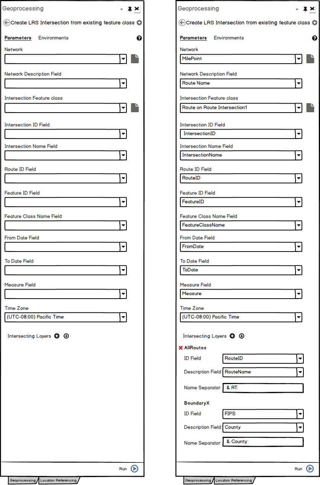
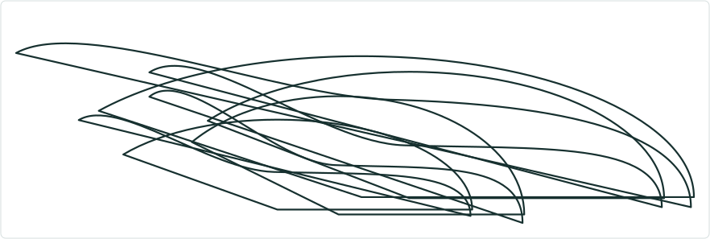

# Create LRS Intersection From Existing Feature Class Geoprocessing Tool

|   |   |
| --- | --- |
| **Kind** | User Story · Pro |
| **Release** | — |
| **Product** | Roads & Highways · Pipeline Referencing · Utility Network |
| **Source** | [Intersections_For_Pro_UserStories2.pptx](<https://esriis.sharepoint.com/sites/LocationReferencing/Shared%20Documents/General/Intersections_For_Pro_UserStories2.pptx>) |
| **Edited** | 2019-09-29 05:32 by Rahul Rakshit |
| **Extracted** | 2026-09-04 · lane `xmlstrip` |

<!-- metadata
```yaml
title: "Create LRS Intersection From Existing Feature Class Geoprocessing Tool"
source_file: "Intersections_For_Pro_UserStories2.pptx"
source_url: "https://esriis.sharepoint.com/sites/LocationReferencing/Shared%20Documents/General/Intersections_For_Pro_UserStories2.pptx"
doc_id: 881
doc_kind: "User Story"
surface: "Pro"
doc_revision: ""
target_release: ""
pe: ""
dev: ""
author: "Rahul Rakshit"
last_edited_by: "Rahul Rakshit"
last_edited: "2019-09-29T05:32:29Z"
extracted: 2026-09-04
extraction_lane: xmlstrip
prompt_version: "v2.0.2"
keywords: ["intersection", "feature class", "geoprocessing", "m enabled", "z enabled", "network", "database", "validation", "versioning"]
tools: ["Create LRS Intersection"]
products: ["Roads & Highways", "Pipeline Referencing", "Utility Network"]
issues: []
related: [{"doc":882,"file":"create-lrs-intersection-geoprocessing-tool-user-story__doc882.md","s":6.897},{"doc":878,"file":"modify-lrs-intersection-feature-class-geoprocessing-tool__doc878.md","s":5.882},{"doc":238,"file":"generate-lrs-data-product-gp-tool-support-database-tables__doc238.md","s":2.946},{"doc":823,"file":"support-rounding-output-measures-in-derive-event-measures-tool__doc823.md","s":2.878},{"doc":877,"file":"remove-lrs-entity-to-support-intersections__doc877.md","s":2.837}]
```
-->

## Summary

Describes the requirements and conditions for a geoprocessing tool that registers an existing m and z enabled intersection feature class to an LRS network. Includes validation rules for input feature classes, database and network compatibility, and user interface behavior. Lists positive and negative test scenarios for tool functionality and error handling.

## Related documents

<!-- related:begin -->
- [Create LRS Intersection Geoprocessing Tool User Story](<https://esriis.sharepoint.com/sites/lrsworkspace/LRS Doc Index/User Stories/create-lrs-intersection-geoprocessing-tool-user-story__doc882.md>) — similar text 0.57 · 4 title words · 2 filename words · same kind/surface/folder <!-- rel:882 -->
- [Modify LRS Intersection Feature Class Geoprocessing Tool](<https://esriis.sharepoint.com/sites/lrsworkspace/LRS Doc Index/Test Plans/modify-lrs-intersection-feature-class-geoprocessing-tool__doc878.md>) — similar text 0.60 · 5 title words · same surface/folder <!-- rel:878 -->
- [Generate LRS Data Product GP Tool: Support Database Tables](<https://esriis.sharepoint.com/sites/lrsworkspace/LRS Doc Index/User Stories/generate-lrs-data-product-gp-tool-support-database-tables__doc238.md>) — similar text 0.08 · 1 title word · same kind/surface/folder <!-- rel:238 -->
- [Support rounding output measures in Derive Event Measures tool](<https://esriis.sharepoint.com/sites/lrsworkspace/LRS Doc Index/User Stories/support-rounding-output-measures-in-derive-event-measures-tool__doc823.md>) — similar text 0.06 · 1 title word · same kind/surface/folder <!-- rel:823 -->
- [Remove LRS Entity To Support Intersections](<https://esriis.sharepoint.com/sites/lrsworkspace/LRS Doc Index/User Stories/remove-lrs-entity-to-support-intersections__doc877.md>) — similar text 0.16 · 1 filename word · same kind/surface/folder <!-- rel:877 -->
<!-- related:end -->

<!-- docs:begin -->
## Esri documentation

[Create and modify LRS intersections](https://doc.esri.com/en/arcgis-pro/latest/help/production/roads-highways/create-and-modify-lrs-intersections.html) · [View LRS intersection properties](https://doc.esri.com/en/arcgis-pro/latest/help/production/roads-highways/view-lrs-intersection-properties.html) · [View utility network feature class properties](https://doc.esri.com/en/arcgis-pro/latest/help/production/location-referencing-pipelines/view-utility-network-feature-class-properties.html) · [LRS network](https://doc.esri.com/en/arcgis-pro/latest/help/production/location-referencing-pipelines/what-is-an-lrs-network.html)
<!-- docs:end -->

---

## Slide 1

Create LRS Intersection From Existing Feature Class Geoprocessing Tool
As an LRS maintainer, I need the ability to register an existing intersection feature class to a network.

## Slide 2

- This tool will register an existing m and z enabled point FC to the network
- Verify that the input point FC is m and z enabled
- The point FC should reside in the same database as of the Network
- The spatial reference, tolerance and resolution of the point FC should be the same as that is defined for the LRS
- Verify the field properties of the intersection FC using the table in the next pages
- For the text fields, allow the length that is less that or equal to the desired length
- Intelligently try to prefill the fields once the intersection FC is added
- In the field drop-down list, show the fields that fulfil the required properties
- In the Intersection FC fields, do not allow to map the same field more than once
- Allow empty and non-empty FCs to be registered
- Do not verify the contents of the non-empty FCs except one: Do not allow multi-point features
- Should work with DC and not with services
- Support traditional and branch versioning
- Only allow LR networks in the Network parameter
- Do not allow derived network



## Slide 3

- Do not allow the tool to run unless at least one intersecting layer is provided
- The intersecting FC’s should be either line or polygon layers
- Do not allow same FC twice as intersecting layers
- The intersecting FC’s should reside in the same database as that of the network
- In the field drop-downs, do not list editor tracking or globalID fields
- The ID field and the description field can be same for the inputs
- Tabbing should work
- Internationalization
- Attribute Index: RouteID, FromDate, ToDate
- Do not allow to register an already registered FC
- Place the tool in a new group named ‘LRS Intersection’ under Location Referencing Tools>Configuration toolbox
- Write* to the LRS controller dataset.
- We will have to make the controller dataset copiable. Another user story.
style.visibilitystyle.visibilitystyle.visibilitystyle.visibilitystyle.visibilitystyle.visibilitystyle.visibilitystyle.visibilitystyle.visibility


## Slide 4


## Slide 5

- SQL Server, Oracle and FGDB
- APR, UN, PoM and RH datasets
- Line, Non-Line and PoM Networks
- Intersecting layers = Parent Network
- Intersecting layers = Another Network
- Intersecting layer = Parent Network + Boundary layers
- Test with Model Builder with chaining the tools
- Test inline and standalone python
- PY: Global ID is provided in the ID field
- PY: Global ID is provided in the Description field
- PY: An editor tracking field is provided in the ID field
- PY: An editor tracking field is provided in the ID field
- Intersecting layer is a point layer
- PY: No intersecting layers are provided
- No ID AND/OR Description field chosen
- The user does not have the permissions to create a FC in the database
- Use the same FC twice as an intersecting layer
- The projection on the intersection layer does not match with that of the network
- The intersecting layer comes from a database that is not the network’s database
- Positive tests in Test Complete metadata PY harness
- Negative tests in PY harness
- The Intersection FC’s projection does not match to the LRS
- The Intersection FC’s tolerance does not match to that of the network
- The Intersection FC’s  resolution does not match to that of the network
- The Intersection FC’s tolerance and resolution does not match to that of the network
- The Intersection FC is not m enabled
- The Intersection FC is not z enabled
- The Intersection FC is not m and z enabled
- Intersection FC is already registered as an intersection FC
- The intersection FC is not a point layer
- PY: Network Not provided
- PY: Network is not a LRS Network layer
- PY: Network description field not provided
- PY: Intersection FC not provided
- PY: Intersection ID field not provided
- PY: Intersection ID field  does not match the requirements
- PY: Intersection Name field not provided
- PY: Intersection Name field does not match the requirements
- PY: RouteID field is not provided
- PY: RouteID field does not match the requirements
- PY: FeatureID field is not provided
- PY: FeatureID field does not match the requirements
- PY: Feature Class Name field is not provided
- PY: Feature Class Name field does not match the requirements
- PY: From Date field is not provided
- PY: From Date field does not match the requirements
- PY: To Date field is not provided
- PY: To Date field does not match the requirements
- PY: Measure field is not provided
- PY: Measure field does not match the requirements
- PY: Time Zone field is not provided
- PY: Time Zone field does not match the requirements

  

## Slide 6

- Get the error codes from the Dev and get them added to the excel
- Write GP Doc


## Slide 7



style.visibilitystyle.visibilitystyle.visibilitystyle.visibilitystyle.visibilitystyle.visibilitystyle.visibility

## Slide 8


