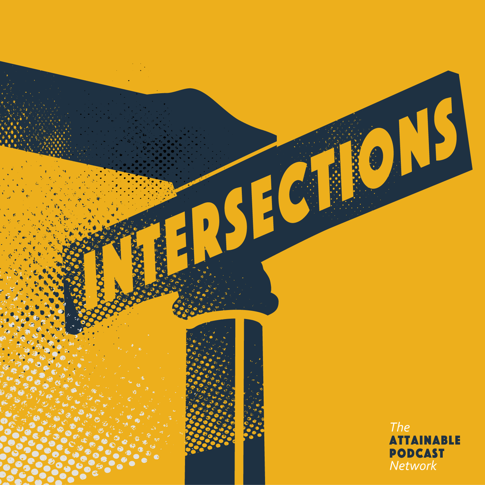
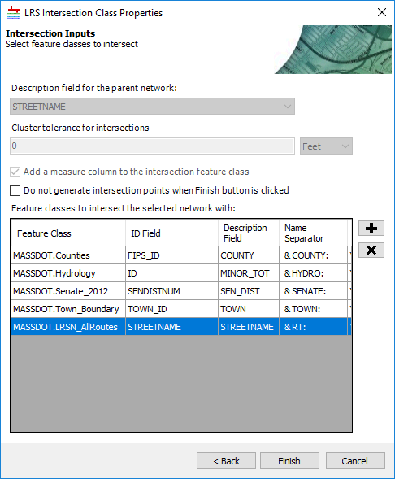
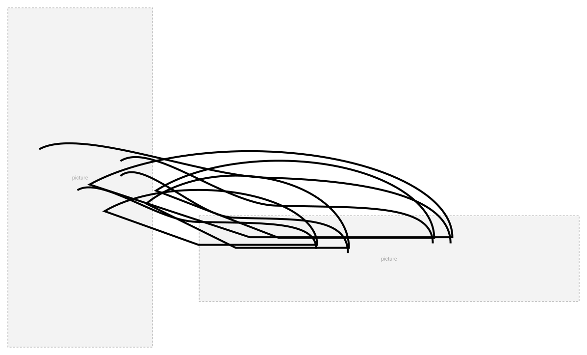

# Create LRS Intersection Geoprocessing Tool User Story

| Field | Value |
| --- | --- |
| **Doc** | 882 · User Story · Pro |
| **Product** | Roads & Highways · Pipeline Referencing · Utility Network |
| **Release** | — |
| **Issues** | — |
| **Source** | [Intersections_For_Pro_UserStories1.pptx](<https://esriis.sharepoint.com/sites/LocationReferencing/Shared%20Documents/General/Intersections_For_Pro_UserStories1.pptx>) |
| **People** | author Rahul Rakshit · PE — · dev — |
| **Edited** | 2019-09-27 23:23 by Rahul Rakshit |
| **Extracted** | 2026-09-04 · lane xmlstrip · format 3.0 · prompt v2.0.2 |
| **Keywords** | intersection · feature class · geoprocessing · network · polyline · polygon · location referencing |
| **Tools** | Create LRS Intersection |

## Summary

User story describing the need and requirements for a geoprocessing tool to generate intersection feature classes between a network and polyline or polygon feature classes. It includes functional requirements, constraints, supported data sources, and test scenarios for the tool within the Location Referencing framework.

## Related documents

<!-- related:begin -->
- [Create LRS Intersection From Existing Feature Class Geoprocessing Tool](<https://esriis.sharepoint.com/sites/lrsworkspace/LRS Doc Index/User Stories/create-lrs-intersection-from-existing-feature-class-gp.md>) — similar text 0.57 · 4 title words · 2 filename words · same kind/surface/folder <!-- rel:881 s=6.897 -->
- [Modify LRS Intersection Feature Class Geoprocessing Tool](<https://esriis.sharepoint.com/sites/lrsworkspace/LRS Doc Index/Test Plans/modify-lrs-intersection-feature-class-gp.md>) — similar text 0.63 · 3 title words · same surface/folder <!-- rel:878 s=4.618 -->
- [LRS Intersection Properties User Story](<https://esriis.sharepoint.com/sites/lrsworkspace/LRS Doc Index/User Stories/lrs-intersection-properties.md>) — similar text 0.11 · 1 title word · same kind/surface/folder <!-- rel:843 s=2.967 -->
- [Length Data Product Support Features Enhancement](<https://esriis.sharepoint.com/sites/lrsworkspace/LRS Doc Index/User Stories/length-data-product-support-features-enhancement.md>) — similar text 0.26 · same kind/surface/folder <!-- rel:47 s=2.761 -->
- [Configure Route Priority User Story](<https://esriis.sharepoint.com/sites/lrsworkspace/LRS Doc Index/User Stories/configure-route-priority.md>) — similar text 0.30 · same kind/surface/folder <!-- rel:723 s=2.729 -->
<!-- related:end -->

<!-- docs:begin -->
## Esri documentation

[Create and modify LRS intersections](https://doc.esri.com/en/arcgis-pro/latest/help/production/roads-highways/create-and-modify-lrs-intersections.html) · [View LRS intersection properties](https://doc.esri.com/en/arcgis-pro/latest/help/production/roads-highways/view-lrs-intersection-properties.html) · [View utility network feature class properties](https://doc.esri.com/en/arcgis-pro/latest/help/production/location-referencing-pipelines/view-utility-network-feature-class-properties.html) · [LRS network](https://doc.esri.com/en/arcgis-pro/latest/help/production/location-referencing-pipelines/what-is-an-lrs-network.html) · [Set Location Referencing options](https://doc.esri.com/en/arcgis-pro/latest/help/production/roads-highways/set-location-referencing-options.html)
<!-- docs:end -->

---

## Slide 1

Why we need them?
Intersection features can be used in Event Editor to provide measures based on intersection reference offset for creating new event records.

A location where a feature in the routes in the network cross another feature in either the network or the other FC in 3D space.
style.visibility

## Slide 2

## Slide 3

style.visibility

## Slide 4 — Create LRS Intersection Geoprocessing Tool

As an LRS maintainer, I need the ability to generate an intersection feature class between a network and any polyline or polygon FCs in order to support attribution of roadway/pipelines from the intersection locations.

## Slide 5

## Slide 6

style.visibilitystyle.visibilitystyle.visibilitystyle.visibilitystyle.visibilitystyle.visibilitystyle.visibilitystyle.visibility

## Slide 7

- Create an M and Z enabled point FC with the fields outlined in the table
- Create the FC within the feature dataset that houses the LRS CD
- The spatial reference, tolerance and resolution of the FC should be the same as that is defined for the LRS
- The FC should be empty
- The intersecting FC’s should be either line or polygon layers
- Do not allow same FC twice as intersecting layers
- The intersecting FC’s should reside in the same database as that of the network
- Tabbing should work
- Internationalization
- Do not allow creation of a duplicate FC
- Should work on DC and not in services
- Support traditional and branch versioning
- Only allow LR networks in the Network parameter
- Do not allow derived network
- In the field drop-downs, do not list editor tracking or globalID fields
- The ID field and the description field can be same for the inputs
- Place the tool in a new group named ‘LRS Intersection’ under Location Referencing Tools>Configuration toolbox
- Write* to the LRS controller dataset.
- We will have to make the controller dataset copiable. Another user story.
style.visibilitystyle.visibilitystyle.visibilitystyle.visibilitystyle.visibilitystyle.visibilitystyle.visibilitystyle.visibilitystyle.visibilitystyle.visibilitystyle.visibilitystyle.visibility

## Slide 8

- SQL Server, Oracle and FGDB
- APR, UN, PoM and RH datasets
- Line, Non-Line and PoM Networks
- Intersecting layers = Parent Network
- Intersecting layers = Another Network
- Intersecting layer = Parent Network + Boundary layers
- The input for network is not a network layer
- PY: Global ID is provided in the ID field
- PY: Global ID is provided in the Description field
- PY: An editor tracking field is provided in the ID field
- PY: An editor tracking field is provided in the ID field
- Intersecting layer is a point layer
- PY: No intersecting layers are provided
- No ID AND/OR Description field chosen
- The user does not have the permissions to create a FC in the database
- Use the same FC twice as an intersecting layer
- The projection on the intersection layer does not match with that of the network
- The intersecting layer comes from a database that is not the network’s database
- Positive tests in Test Complete metadata PY harness
- Negative tests in PY harness

## Slide 9

- Get the error codes from the Dev and get them added to the excel
- Write GP Doc

## Slide 10

