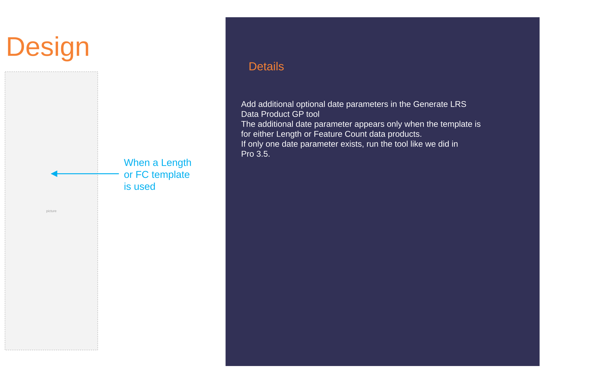
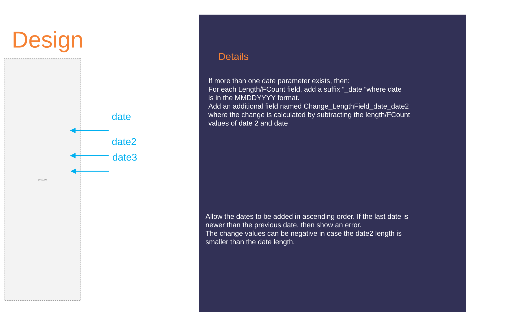
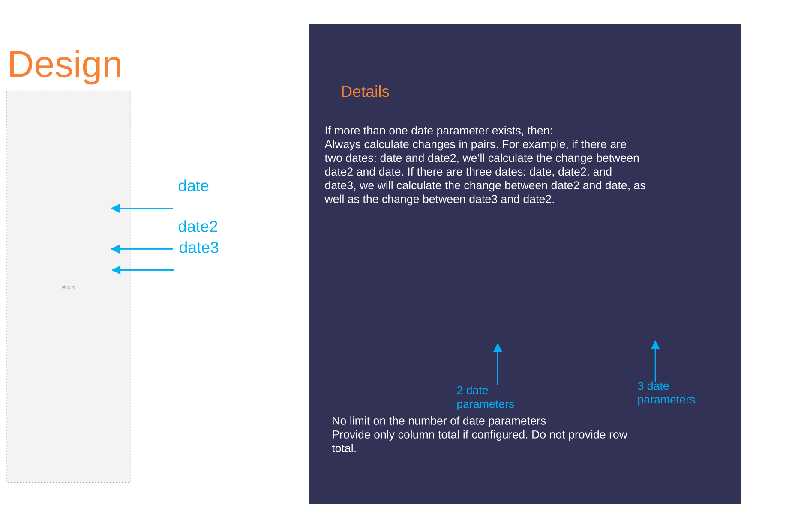

# Date Comparison Data Product User Story and Design

| Field | Value |
| --- | --- |
| **Doc** | 162 · User Story · Pro |
| **Product** | — |
| **Release** | — |
| **Issues** | — |
| **Source** | [Reporting_GP_TimeCompare.pptx](<https://esriis.sharepoint.com/sites/LocationReferencing/Shared%20Documents/General/Reporting_GP_TimeCompare.pptx>) |
| **People** | author Rahul Rakshit · PE LRS Editor or Analyst · dev — |
| **Edited** | 2025-05-28 22:00 by Rahul Rakshit |
| **Extracted** | 2026-09-04 · lane xmlstrip · format 3.0 · prompt v2.0.2 |
| **Keywords** | date comparison · length · feature count · change matrix · data product · generate lrs data product · time comparison |
| **Tools** | Generate LRS Data Product |

## Summary

This document describes a user story and design for enhancing the Generate LRS Data Product geoprocessing tool to calculate length and feature count for different points in time and produce a change matrix. It includes design details for handling multiple date parameters, scenarios for data comparison, testing considerations, automation notes, and documentation responsibilities.

## Related documents

<!-- related:begin -->
- [Generate LRS Data Product Support Summary and Length](<https://esriis.sharepoint.com/sites/lrsworkspace/LRS%20Doc%20Index/User%20Stories/generate-lrs-data-product-support-summary-and-length.md>) — similar text 0.20 · 1 title word · same kind/surface/folder <!-- rel:357 s=4.188 -->
- [User Story: Support Multiple Summary Fields in Generate LRS Data Product](<https://esriis.sharepoint.com/sites/lrsworkspace/LRS Doc Index/User Stories/support-multiple-summary-fields-in-generate-lrs-data-product.md>) — similar text 0.19 · 1 title word · same kind/surface/folder <!-- rel:353 s=3.389 -->
- [User Story for LRS Data Product Template with Length Range Values](<https://esriis.sharepoint.com/sites/lrsworkspace/LRS Doc Index/User Stories/for-lrs-data-product-template-with-length-range-values.md>) — similar text 0.28 · 1 title word · same kind/surface/folder <!-- rel:343 s=3.126 -->
- [Reporting Location Referencing Mileage for Line Network](<https://esriis.sharepoint.com/sites/lrsworkspace/LRS Doc Index/User Stories/reporting-lr-mileage-for-line-network.md>) — similar text 0.25 · 1 filename word · same kind/surface/folder <!-- rel:368 s=3.117 -->
- [LR Data Products: Support multiple summary fields](<https://esriis.sharepoint.com/sites/lrsworkspace/LRS Doc Index/User Stories/lr-data-products-support-multiple-summary-fields.md>) — similar text 0.22 · same kind/surface/folder <!-- rel:356 s=3.081 -->
<!-- related:end -->

<!-- docs:begin -->
## Esri documentation

[Create a template for an LRS length data product](https://doc.esri.com/en/arcgis-pro/latest/help/production/roads-highways/create-a-template-for-an-lrs-length-data-product.html) · [Create a template for an LRS feature count data product](https://doc.esri.com/en/arcgis-pro/latest/help/production/roads-highways/create-a-template-for-an-lrs-feature-count-data-product.html) · [LRS data products](https://doc.esri.com/en/arcgis-pro/latest/help/production/roads-highways/lrs-data-products.html)

_No page matched:_ [Generate LRS Data Product](https://www.google.com/search?q=%22Generate%20LRS%20Data%20Product%22+site%3Adoc.esri.com)
<!-- docs:end -->

---

## Slide 1

Data Products
LOCATION REFERENCING
Date Comparison data product

## Slide 2 — User Story

In the Generate LRS Data Product GP tool, provide the ability to calculate the length/feature count for different points in time and provide a change matrix in the output.

- LRS Editor or Analyst
These users know how to work with ArcGIS Pro. They will design a reusable data template based on an existing paper or digital report. Their duty will be to ensure that the Data Product’s constituents closely mirror those of its predecessors.

Persona

## Slide 3 — Single Time in Pro 3.5

Time Comparison

## Slide 4

Design

- Add additional optional date parameters in the Generate LRS Data Product GP tool
- The additional date parameter appears only when the template is for either Length or Feature Count data products.
- If only one date parameter exists, run the tool like we did in Pro 3.5.
Details

|  | Summary Field 1 | Length Field 1 | Total |
| --- | --- | --- | --- |
| Total |  |  |  |

When a Length or FC template is used

## Slide 5

- If more than one date parameter exists, then:
  - For each Length/FCount field, add a suffix “_date “where date is in the MMDDYYYY format.
  - Add an additional field named Change_LengthField_date_date2 where the change is calculated by subtracting the length/FCount values of date 2  and date
  - Allow the dates to be added in ascending order. If the last date is newer than the previous date, then show an error.
  - The change values can be negative in case the date2 length is smaller than the date length.

|  | Summary Field 1 | Length Field 1_date | Length Field 1_date2 | Change_Length Field 1_date_date2 |
| --- | --- | --- | --- | --- |
| Total |  |  |  |  |

[figure: Design · Details · date · date2 · date3]

## Slide 6

- If more than one date parameter exists, then:
  - Always calculate changes in pairs. For example, if there are two dates: date and date2, we’ll calculate the change between date2 and date. If there are three dates: date, date2, and date3, we will calculate the change between date2 and date, as well as the change between date3 and date2.
  - No limit on the number of date parameters
  - Provide only column total if configured. Do not provide row total.

|  | Summary Field 1 | Length Field 1_date | Length Field 1_date2 | Change_Length Field 1_date_date2 | Length Field 1_date3 | Change_Length Field 1_date2_date3 |
| --- | --- | --- | --- | --- | --- | --- |
| Total |  |  |  |  |  |  |

[figure: Design · Details · date · date2 · date3 · 2 date parameters · 3 date parameters]

## Slide 7

Scenarios

|  | Summary Field 1 | Length Field 1_date | Length Field 1_date2 | Change_Length Field 1_date_date2 |
| --- | --- | --- | --- | --- |
| Total | County1 | 101 |  | -101 |

Length/FCount does not exist for date2

|  | Summary Field 1 | Length Field 1_date | Length Field 1_date2 | Change_Length Field 1_date_date2 |
| --- | --- | --- | --- | --- |
| Total | County1 |  | 101 | 101 |

Length/FCount does not exist for date

## Slide 8

Testing

- Test with all supported network types, events, intersections
- Use multiple dates

## Slide 9

Automation

Automate using PY.

## Slide 10

Documentation

- Documentation to be done by the PE. To be appended to the previous GP doc.

