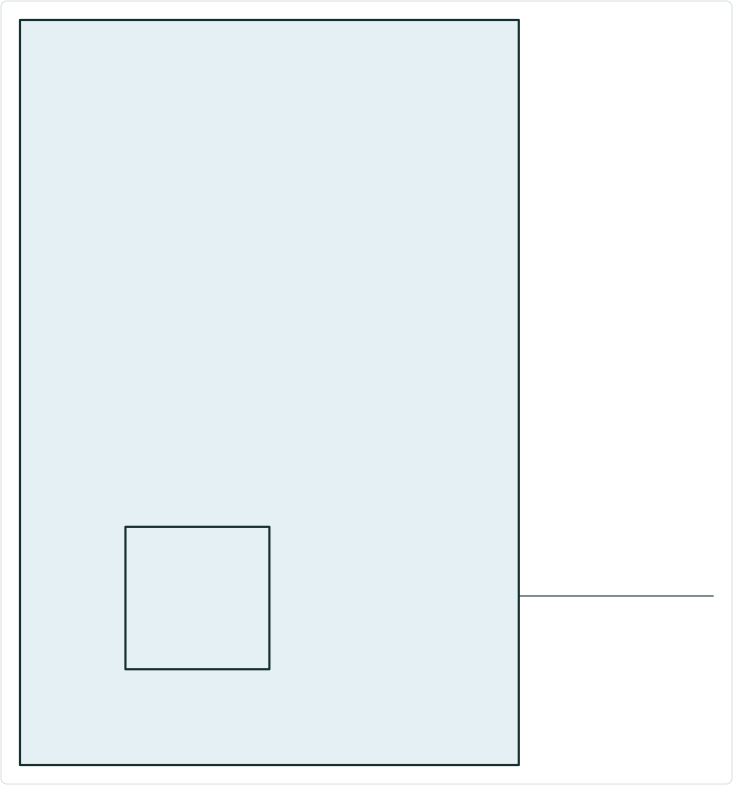
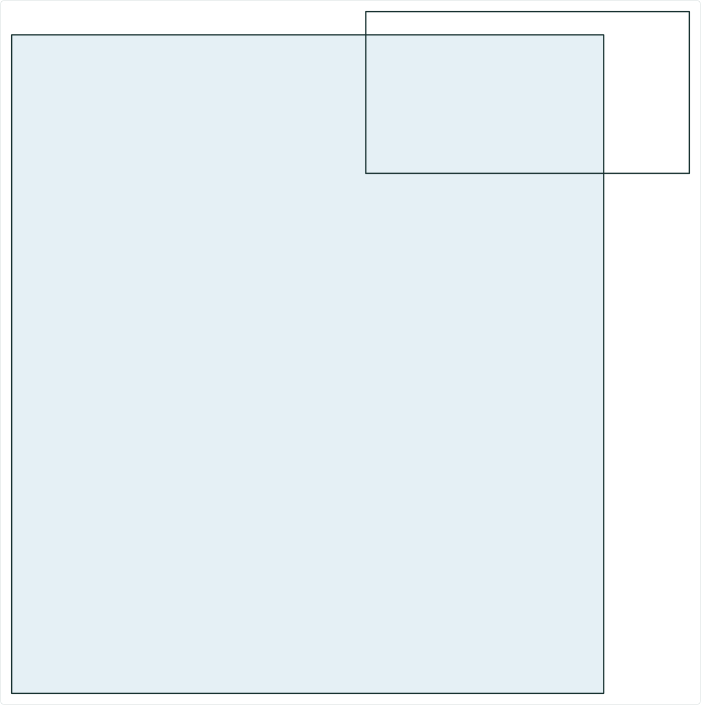
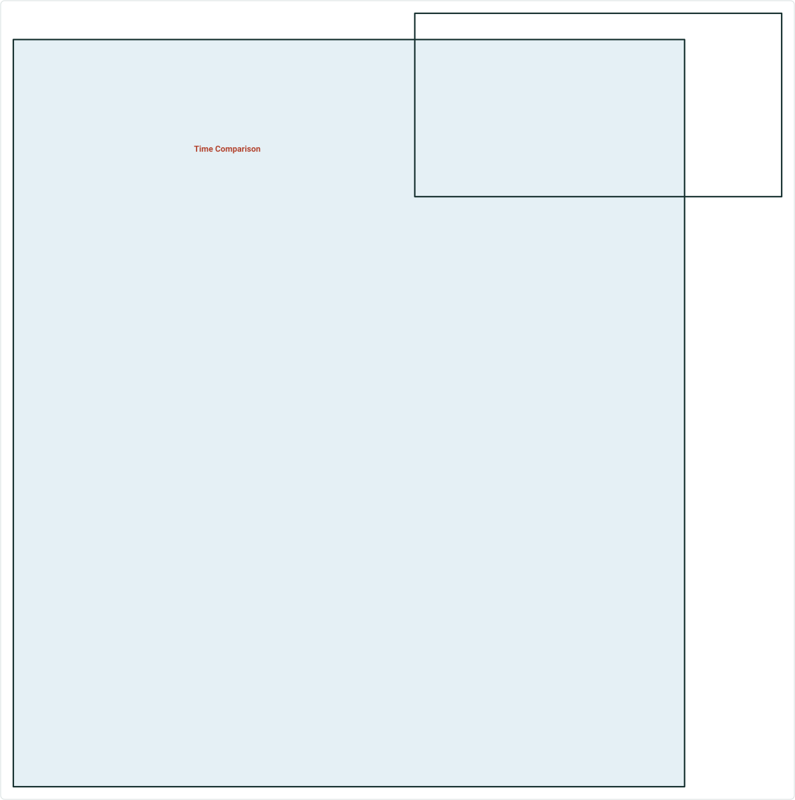
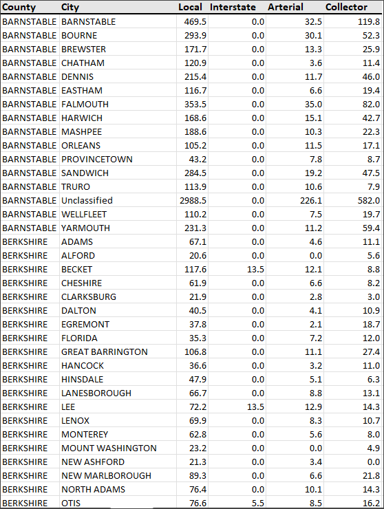
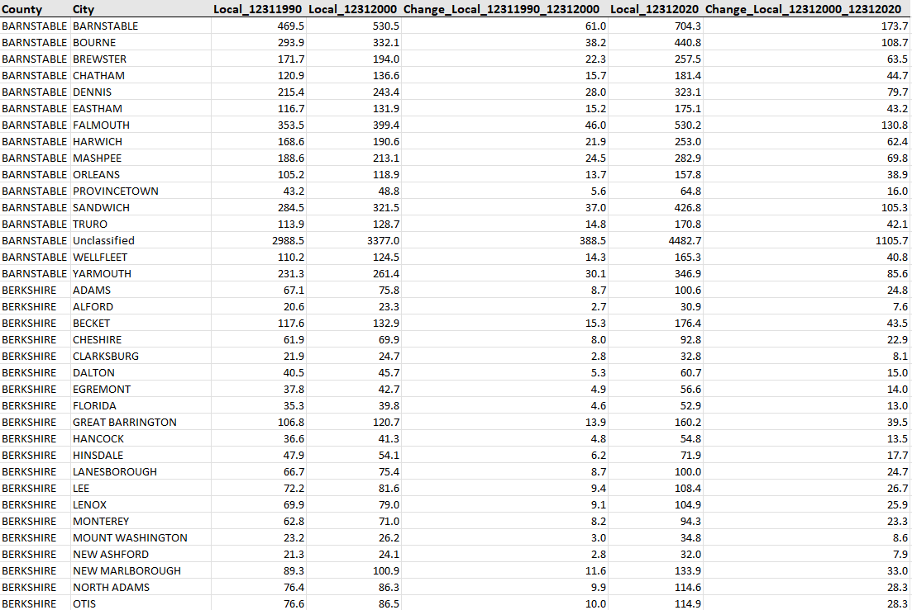
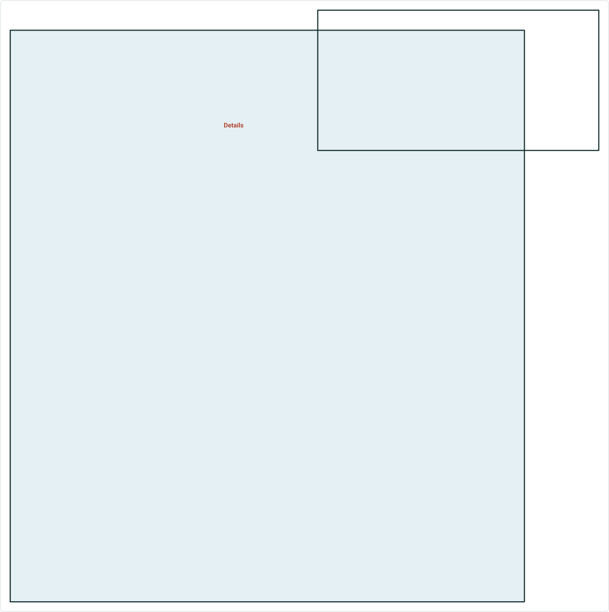
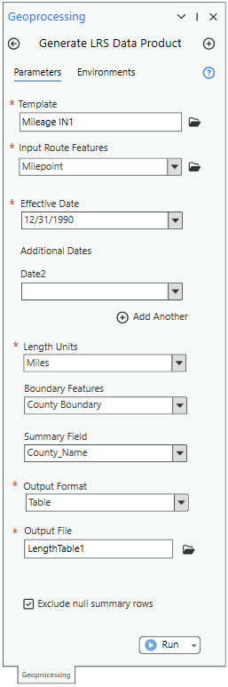
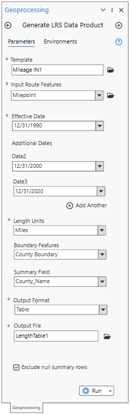
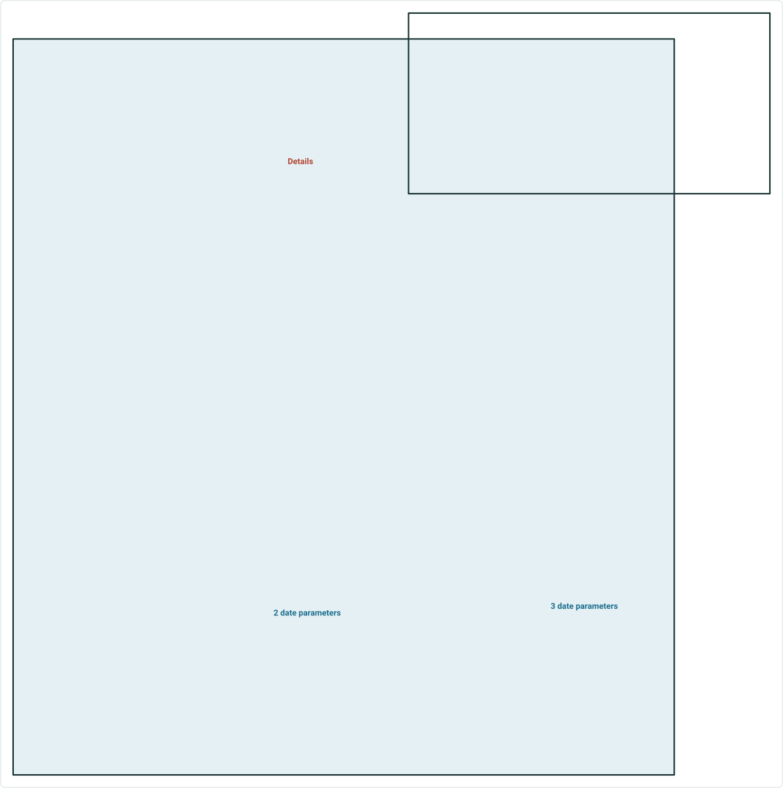

# Date Comparison Data Product User Story and Design

|   |   |
| --- | --- |
| **Kind** | User Story · Pro |
| **Release** | — |
| **Source** | [Reporting_GP_TimeCompare.pptx](<https://esriis.sharepoint.com/sites/LocationReferencing/Shared%20Documents/General/Reporting_GP_TimeCompare.pptx>) |
| **Edited** | 2025-05-28 22:00 by Rahul Rakshit |
| **Extracted** | 2026-09-04 · lane `xmlstrip` |

<!-- metadata
```yaml
title: "Date Comparison Data Product User Story and Design"
source_file: "Reporting_GP_TimeCompare.pptx"
source_url: "https://esriis.sharepoint.com/sites/LocationReferencing/Shared%20Documents/General/Reporting_GP_TimeCompare.pptx"
doc_id: 162
doc_kind: "User Story"
surface: "Pro"
doc_revision: ""
target_release: ""
pe: "LRS Editor or Analyst"
dev: ""
author: "Rahul Rakshit"
last_edited_by: "Rahul Rakshit"
last_edited: "2025-05-28T22:00:33Z"
extracted: 2026-09-04
extraction_lane: xmlstrip
prompt_version: "v2.0.2"
keywords: ["date comparison", "length", "feature count", "change matrix", "data product", "generate lrs data product", "time comparison"]
tools: ["Generate LRS Data Product"]
products: []
issues: []
related: [{"doc":357,"file":"generate-lrs-data-product-support-summary-and-length__doc357.md","s":4.188},{"doc":353,"file":"user-story-support-multiple-summary-fields-in-generate-lrs-data-product__doc353.md","s":3.389},{"doc":343,"file":"user-story-for-lrs-data-product-template-with-length-range-values__doc343.md","s":3.126},{"doc":368,"file":"reporting-location-referencing-mileage-for-line-network__doc368.md","s":3.117},{"doc":356,"file":"lr-data-products-support-multiple-summary-fields__doc356.md","s":3.081}]
```
-->

## Summary

This document describes a user story and design for enhancing the Generate LRS Data Product geoprocessing tool to calculate length and feature count for different points in time and produce a change matrix. It includes design details for handling multiple date parameters, scenarios for data comparison, testing considerations, automation notes, and documentation responsibilities.

## Related documents

<!-- related:begin -->
- [Generate LRS Data Product Support Summary and Length](<https://esriis.sharepoint.com/sites/lrsworkspace/LRS%20Doc%20Index/User%20Stories/generate-lrs-data-product-support-summary-and-length__doc357.md>) — similar text 0.20 · 1 title word · same kind/surface/folder <!-- rel:357 -->
- [User Story: Support Multiple Summary Fields in Generate LRS Data Product](<https://esriis.sharepoint.com/sites/lrsworkspace/LRS Doc Index/User Stories/user-story-support-multiple-summary-fields-in-generate-lrs-data-product__doc353.md>) — similar text 0.19 · 1 title word · same kind/surface/folder <!-- rel:353 -->
- [User Story for LRS Data Product Template with Length Range Values](<https://esriis.sharepoint.com/sites/lrsworkspace/LRS Doc Index/User Stories/user-story-for-lrs-data-product-template-with-length-range-values__doc343.md>) — similar text 0.28 · 1 title word · same kind/surface/folder <!-- rel:343 -->
- [Reporting Location Referencing Mileage for Line Network](<https://esriis.sharepoint.com/sites/lrsworkspace/LRS Doc Index/User Stories/reporting-location-referencing-mileage-for-line-network__doc368.md>) — similar text 0.25 · 1 filename word · same kind/surface/folder <!-- rel:368 -->
- [LR Data Products: Support multiple summary fields](<https://esriis.sharepoint.com/sites/lrsworkspace/LRS Doc Index/User Stories/lr-data-products-support-multiple-summary-fields__doc356.md>) — similar text 0.22 · same kind/surface/folder <!-- rel:356 -->
<!-- related:end -->

<!-- docs:begin -->
## Esri documentation

[Create a template for an LRS length data product](https://doc.esri.com/en/arcgis-pro/latest/help/production/roads-highways/create-a-template-for-an-lrs-length-data-product.html) · [Create a template for an LRS feature count data product](https://doc.esri.com/en/arcgis-pro/latest/help/production/roads-highways/create-a-template-for-an-lrs-feature-count-data-product.html) · [LRS data products](https://doc.esri.com/en/arcgis-pro/latest/help/production/roads-highways/lrs-data-products.html)

_No page matched:_ [Generate LRS Data Product](https://www.google.com/search?q=%22Generate%20LRS%20Data%20Product%22+site%3Adoc.esri.com)
<!-- docs:end -->

---

## Slide 1




Data Products
LOCATION REFERENCING
Date Comparison data product

 

## Slide 2



User Story
In the Generate LRS Data Product GP tool, provide the ability to calculate the length/feature count for different points in time and provide a change matrix in the output.

- LRS Editor or Analyst
These users know how to work with ArcGIS Pro. They will design a reusable data template based on an existing paper or digital report. Their duty will be to ensure that the Data Product’s constituents closely mirror those of its predecessors.

Persona


## Slide 3



Single Time in Pro 3.5
Time Comparison

  

## Slide 4


Design

- Add additional optional date parameters in the Generate LRS Data Product GP tool
- The additional date parameter appears only when the template is for either Length or Feature Count data products.
- If only one date parameter exists, run the tool like we did in Pro 3.5.
Details



|  | Summary Field 1 | Length Field 1 | Total |
| --- | --- | --- | --- |
| Total |  |  |  |

When a Length or FC template is used

 

## Slide 5


- If more than one date parameter exists, then:
  - For each Length/FCount field, add a suffix “_date “where date is in the MMDDYYYY format.
  - Add an additional field named Change_LengthField_date_date2 where the change is calculated by subtracting the length/FCount values of date 2  and date
  - Allow the dates to be added in ascending order. If the last date is newer than the previous date, then show an error.
  - The change values can be negative in case the date2 length is smaller than the date length.


|  | Summary Field 1 | Length Field 1_date | Length Field 1_date2 | Change_Length Field 1_date_date2 |
| --- | --- | --- | --- | --- |
| Total |  |  |  |  |

 

## Slide 6


- If more than one date parameter exists, then:
  - Always calculate changes in pairs. For example, if there are two dates: date and date2, we’ll calculate the change between date2 and date. If there are three dates: date, date2, and date3, we will calculate the change between date2 and date, as well as the change between date3 and date2.
  - No limit on the number of date parameters
  - Provide only column total if configured. Do not provide row total.



|  | Summary Field 1 | Length Field 1_date | Length Field 1_date2 | Change_Length Field 1_date_date2 | Length Field 1_date3 | Change_Length Field 1_date2_date3 |
| --- | --- | --- | --- | --- | --- | --- |
| Total |  |  |  |  |  |  |

 

## Slide 7

Scenarios


|  | Summary Field 1 | Length Field 1_date | Length Field 1_date2 | Change_Length Field 1_date_date2 |
| --- | --- | --- | --- | --- |
| Total | County1 | 101 |  | -101 |

Length/FCount does not exist for date2

|  | Summary Field 1 | Length Field 1_date | Length Field 1_date2 | Change_Length Field 1_date_date2 |
| --- | --- | --- | --- | --- |
| Total | County1 |  | 101 | 101 |

Length/FCount does not exist for date


## Slide 8

Testing

- Test with all supported network types, events, intersections
- Use multiple dates

 

## Slide 9

Automation

Automate using PY.

 

## Slide 10

Documentation

- Documentation to be done by the PE. To be appended to the previous GP doc.

 
