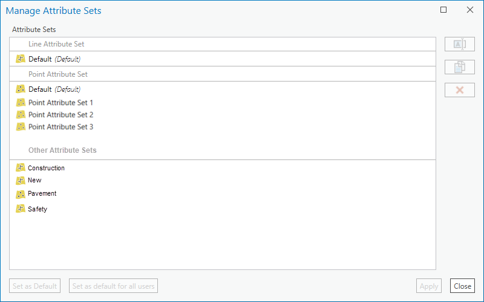

# Delete Attribute Sets User Story

|   |   |
| --- | --- |
| **Kind** | User Story · Enterprise |
| **Release** | — |
| **Source** | [DeleteAttributeSets.pptx](<https://esriis.sharepoint.com/sites/LocationReferencing/Shared%20Documents/General/DeleteAttributeSets.pptx>) |
| **Edited** | 2022-03-14 17:57 by Nathan Easley |
| **Extracted** | 2026-09-04 · lane `xmlstrip` |

<!-- metadata
```yaml
title: "Delete Attribute Sets User Story"
source_file: "DeleteAttributeSets.pptx"
source_url: "https://esriis.sharepoint.com/sites/LocationReferencing/Shared%20Documents/General/DeleteAttributeSets.pptx"
doc_id: 676
doc_kind: "User Story"
surface: "Enterprise"
doc_revision: ""
target_release: ""
pe: ""
dev: ""
author: "William Isley"
last_edited_by: "Nathan Easley"
last_edited: "2022-03-14T17:57:46Z"
extracted: 2026-09-04
extraction_lane: xmlstrip
prompt_version: "v2.0.2"
keywords: ["attribute sets", "delete attribute sets", "lrs administrator", "controller dataset", "manage attributes"]
tools: []
products: []
issues: []
related: [{"doc":689,"file":"managing-attribute-sets-user-story__doc689.md","s":4.423},{"doc":680,"file":"import-existing-attribute-sets-from-event-editor__doc680.md","s":4.39},{"doc":562,"file":"migrate-attribute-sets-to-map-cim-service-test-plan__doc562.md","s":2.588},{"doc":552,"file":"producing-attribute-sets__doc552.md","s":2.375},{"doc":555,"file":"configure-attribute-sets__doc555.md","s":2.073}]
```
-->

## Summary

This user story describes the need for a tool to delete attribute sets in the Linear Referencing System (LRS) to help administrators manage the number of attribute sets. It specifies UI changes to show attribute sets not associated with the current map service and allow deletion of these sets without impacting current users. Testing involves various attribute sets from different sources, and no automation is planned. Documentation will be updated to reflect these changes.

## Related documents

<!-- related:begin -->
- [Managing Attribute Sets User Story](<https://esriis.sharepoint.com/sites/lrsworkspace/LRS%20Doc%20Index/User%20Stories/managing-attribute-sets-user-story__doc689.md>) — similar text 0.15 · 2 title words · 2 filename words · same kind/folder <!-- rel:689 -->
- [Import Existing Attribute Sets from Event Editor](<https://esriis.sharepoint.com/sites/lrsworkspace/LRS Doc Index/User Stories/import-existing-attribute-sets-from-event-editor__doc680.md>) — similar text 0.26 · 2 title words · 2 filename words · same kind/folder <!-- rel:680 -->
- [Migrate Attribute Sets to Map CIM/Service – Test Plan](<https://esriis.sharepoint.com/sites/lrsworkspace/LRS Doc Index/Test Plans/migrate-attribute-sets-to-map-cim-service-test-plan__doc562.md>) — similar text 0.20 · 2 title words · 2 filename words <!-- rel:562 -->
- [Producing Attribute Sets](<https://esriis.sharepoint.com/sites/lrsworkspace/LRS Doc Index/Other/producing-attribute-sets__doc552.md>) — similar text 0.16 · 2 title words · same surface <!-- rel:552 -->
- [Configure Attribute Sets](<https://esriis.sharepoint.com/sites/lrsworkspace/LRS Doc Index/Other/configure-attribute-sets__doc555.md>) — similar text 0.22 · 2 title words <!-- rel:555 -->
<!-- related:end -->

---

## Slide 1

User Story
Click to add text

## Slide 2 — User Story

As a LRS Administrator, I want to be able to delete attribute sets, so I can keep the list of attribute sets available to editors at a manageable size.
Persona
LRS Administrator: This user is responsible for administration of the LRS.  Typically, they have administrator rights to make changes to the LRS such as event behaviors.  This user also does other tasks such as service publishing and other maintenance of the LRS gdb.  With attribute sets now being stored centrally within the LRS, there is the possibility of the number of attribute sets growing to a large number over time.  Creating a tool to delete attribute sets would allow this user to keep the number of attribute sets to a manageable number for their organization.

## Slide 3 — Delete Attribute Sets

In the manage attributes section of the existing Attribute Sets UI, show a third section called “Other Attribute Sets”
Show all the other attribute sets that are part of the LRS, but not associated with the service in the map
If a user selects any of these attribute sets, only allow them to Delete them
Support being able to shift click or ctrl click to select multiple
For any attribute sets that are deleted, remove them from the controller dataset and don’t show them in the list of available attribute sets any longer
Note: As discussed during the first estimation, deleting the attribute sets shouldn’t impact any users that are currently using them.  They should see them disappear during the next refresh (map, attribute set UI, etc.)



## Slide 4 — Testing

Test with a variety of attribute sets that have been created in Pro, EE, and imported from the old rhas format
Test a combination of deleting attribute sets in the current service in the map as well as those in other services not in the map

## Slide 5 — Automation

No automation

## Slide 6 — Documentation

Add some additional context to the topic related to modifying attribute sets that this section will show the attribute sets not in the current service/map and that a user can delete them along with those attribute sets that are part of the current map/service

## Slide 7 — Assignment

Story Points:
Dev:
PE:
