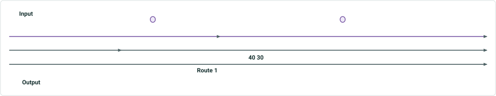

# Dynamic Segmentation Table: Consider Point Events in DynSeg Table

|   |   |
| --- | --- |
| **Kind** | User Story · Pro |
| **Release** | — |
| **Product** | Roads & Highways · Pipeline Referencing |
| **Source** | [SupportPointEventsProDynSegTable.pptx](<https://esriis.sharepoint.com/sites/LocationReferencing/Shared%20Documents/General/SupportPointEventsProDynSegTable.pptx>) |
| **Edited** | 2024-03-21 16:06 by Nathan Easley |
| **Extracted** | 2026-09-04 · lane `xmlstrip` |

<!-- metadata
```yaml
title: "Dynamic Segmentation Table: Consider Point Events in DynSeg Table"
source_file: "SupportPointEventsProDynSegTable.pptx"
source_url: "https://esriis.sharepoint.com/sites/LocationReferencing/Shared%20Documents/General/SupportPointEventsProDynSegTable.pptx"
doc_id: 394
doc_kind: "User Story"
surface: "Pro"
doc_revision: ""
target_release: ""
pe: ""
dev: ""
author: "William Isley"
last_edited_by: "Nathan Easley"
last_edited: "2024-03-21T16:06:09Z"
extracted: 2026-09-04
extraction_lane: xmlstrip
prompt_version: "v2.0.2"
keywords: ["point event", "dynamic segmentation", "attribute set", "route editing", "line event", "event editing", "arcgis pro"]
tools: ["Dynamic Segmentation"]
products: ["Roads & Highways", "Pipeline Referencing"]
issues: []
related: [{"doc":392,"file":"consider-point-events-in-query-attribute-set-and-overlay-events__doc392.md","s":7.068},{"doc":289,"file":"support-overlapping-events-in-dynseg-tool__doc289.md","s":5.089},{"doc":290,"file":"support-overlapping-events-in-query-attribute-set-and-overlay-events-gp-tool__doc290.md","s":4.387},{"doc":604,"file":"merge-coincident-option-in-dynseg-tool-in-pro__doc604.md","s":4.198},{"doc":685,"file":"add-multiple-point-events-tool-in-arcgis-pro__doc685.md","s":4.092}]
```
-->

## Summary

This document describes a user story for including point events in the Dynamic Segmentation tool in ArcGIS Pro. It outlines requirements for handling point and line attribute sets, how point events should appear in the segmentation results, and testing scenarios for various route types. It also covers automation and documentation updates to support point event editing alongside linear events.

## Related documents

<!-- related:begin -->
- [Consider Point Events in Query Attribute Set and Overlay Events](<https://esriis.sharepoint.com/sites/lrsworkspace/LRS Doc Index/User Stories/consider-point-events-in-query-attribute-set-and-overlay-events__doc392.md>) — similar text 0.65 · 3 title words · 3 filename words · same kind/surface/folder <!-- rel:392 -->
- [Support Overlapping Events in DynSeg Tool](<https://esriis.sharepoint.com/sites/lrsworkspace/LRS Doc Index/User Stories/support-overlapping-events-in-dynseg-tool__doc289.md>) — similar text 0.25 · 2 title words · 4 filename words · same kind/folder <!-- rel:289 -->
- [Support Overlapping Events in Query Attribute Set and Overlay Events GP Tool](<https://esriis.sharepoint.com/sites/lrsworkspace/LRS Doc Index/User Stories/support-overlapping-events-in-query-attribute-set-and-overlay-events-gp-tool__doc290.md>) — similar text 0.26 · 1 title word · 2 filename words · same kind/surface/folder <!-- rel:290 -->
- [Merge coincident option in DynSeg tool in Pro](<https://esriis.sharepoint.com/sites/lrsworkspace/LRS Doc Index/User Stories/merge-coincident-option-in-dynseg-tool-in-pro__doc604.md>) — similar text 0.24 · 1 title word · 2 filename words · same kind/surface/folder <!-- rel:604 -->
- [Add Multiple Point Events tool in ArcGIS Pro](<https://esriis.sharepoint.com/sites/lrsworkspace/LRS Doc Index/User Stories/add-multiple-point-events-tool-in-arcgis-pro__doc685.md>) — similar text 0.20 · 2 title words · 1 filename word · same kind/surface/folder <!-- rel:685 -->
<!-- related:end -->

<!-- docs:begin -->
## Esri documentation

[Apply dynamic segmentation](https://doc.esri.com/en/arcgis-pro/latest/help/production/roads-highways/apply-dynamic-segmentation.html) · [Event editing using the attribute table](https://doc.esri.com/en/arcgis-pro/latest/help/production/roads-highways/event-editing-using-the-attribute-table.html)
<!-- docs:end -->

---

## Slide 1 — Dynamic Segmentation table: Consider point events in DynSeg table

User Story
ArcGIS Pro

## Slide 2 — User Story

As an LRS data editor, I need point events to be included in a dynamic segmentation tool, so that I can edit all events along a route.
Persona
LRS Editor: This user is responsible for making edits to the LRS.  The edits they need to make come in from field crews/contractors in a variety of formats (shapefiles, engineering drawing, fgdbs).  The LRS Editor is responsible for making the route edits based on these documents.  This user will also dynamically segment data as needed for editing in the Dynamic Segmentation tool in Pro.  Users want to be able to include point events along side linear events in the dynamic segmentation results so they can edit both point and line events in this experience.

## Slide 3 — Requirements


In the Dynamic Segmentation tool in Pro, allow point events to be included as input event layers
In the existing UI, separate the Attribute Set section to include two parameters, one for line attribute sets and one for point attribute sets
Line attribute sets would be mandatory, point attribute sets would be optional and should include a “none” option to be selected (this would be the default value)
In the event section, add a label to each event layer showing what type of event it is
When a point event from a route is overlaid, make sure the results in the table do include the following:

  - At a location where there is a point event, a record in the table will be created, that shows the same From/To Measure and From/To Route ID.
    - These records should include the point event attribute(s) and the linear event(s) attributes at that location.
    - The linear event attributes will not be editable, but the point event attribute will be editable
  - Continue to create the linear event output records like we do today; leave the point event attribute(s) null
  - Make sure other field information is correct such as From Date, To Date, and other attribute fields
  - If there a multiple point events (in the same layer or different input point event layers) at the same location, only include one record with the attributes for all the point events at that location


## Slide 4 — Example

2 lanes						        3 lanes



| From Measure | To Measure | Route | Speed | Lanes | Sign |
| --- | --- | --- | --- | --- | --- |
| 0 | 7 | Rte1 | 40 | 2 | Null |
| 7 | 8 | Rte1 | 30 | 2 | Null |
| 8 | Null | Rte1 | 30* | 2* | Stop |
| 8 | 12 | Rte1 | 30 | 2 | Null |
| 12 | 18 | Rte1 | 30 | 3 | Null |
| 18 | Null | Rte1 | 30* | 3* | Yield |
| 18 | 20 | Rte1 | 30 | 3 | Null |

                                                 Stop Sign				Yield Sign

- Field is not editable in the table

## Slide 5 — Testing

Test with line attribute sets only as well as line and point attribute sets
Test with RH and APR data
Test a variety of route types

  - Non-Line network normal routes
  - Line network normal routes
  - Vertical routes
  - Complex routes
Do a test with address information on the centerline and make sure that information is still returned in the table correctly

## Slide 6 — Automation

Add to the existing UI test cases for this tool

## Slide 7 — Documentation

Update the existing documentation topics in RH and APR to mention that point events are now supported in the tool

  - Make sure to mention that the point event attributes will be editable
  - Provide a sample diagram/output so users will see how the data is presented and which fields will/won’t be editable for rows representing where point events are present

## Slide 8 — Story Points

Story Points:
Dev:
PE:
