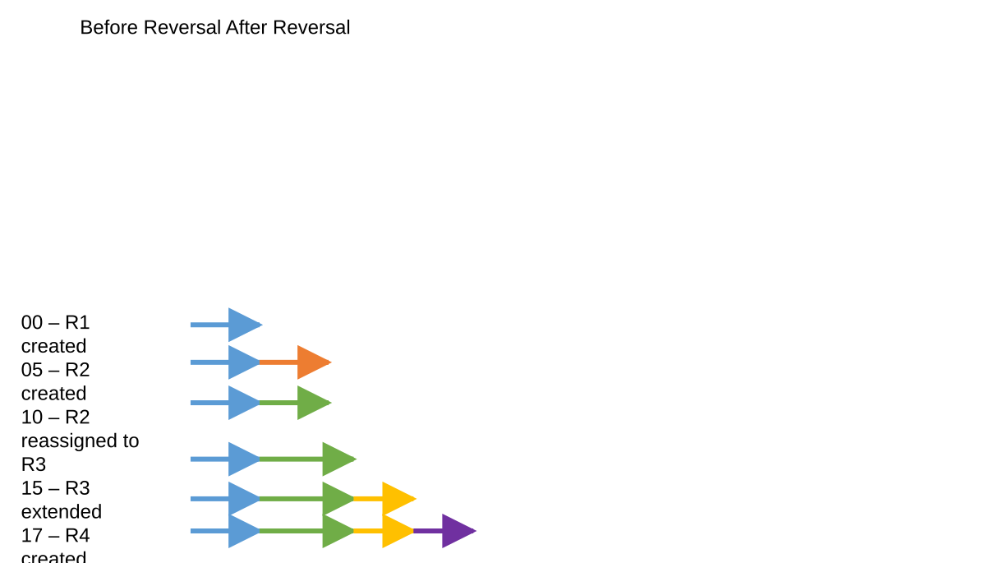

# Enhance Reverse Line Orders tool to create common time slice

| Field | Value |
| --- | --- |
| **Doc** | 530 · User Story · Pro |
| **Product** | — |
| **Release** | — |
| **Issues** | — |
| **Source** | [ReverseLineOrdersCommonTimeslice.pptx](<https://esriis.sharepoint.com/sites/LocationReferencing/Shared%20Documents/General/ReverseLineOrdersCommonTimeslice.pptx>) |
| **People** | author William Isley · PE — · dev — |
| **Edited** | 2023-07-31 18:19 by Nathan Easley |
| **Extracted** | 2026-09-04 · lane xmlstrip · format 3.0 · prompt v2.0.2 |
| **Keywords** | reverse line orders · time slice · route reversal · derived routes · centerline sequence table |
| **Tools** | Reverse Line Orders |

## Summary

This document describes a user story for enhancing the Reverse Line Orders tool to handle routes on a line with different time slices by creating common time slices before reversal. It includes the scenario, testing scope, automation notes, and documentation requirements for the tool update.

## Related documents

<!-- related:begin -->
- [Reverse Line Orders tool](<https://esriis.sharepoint.com/sites/lrsworkspace/LRS Doc Index/User Stories/reverse-line-orders-tool.md>) — similar text 0.54 · 4 title words · 2 filename words · same kind/surface/folder <!-- rel:576 s=6.764 -->
- [Test Plan: Reverse Line Orders GP Tool](<https://esriis.sharepoint.com/sites/lrsworkspace/LRS Doc Index/Test Plans/4983-reverse-line-orders-gp.md>) — similar text 0.22 · 4 title words · 2 filename words · same surface <!-- rel:547 s=4.604 -->
- [Investigate Line Order with Reverse Stationing](<https://esriis.sharepoint.com/sites/lrsworkspace/LRS Doc Index/Other/investigate-line-order-with-reverse-stationing.md>) — similar text 0.17 · 2 title words · 2 filename words · same surface/folder <!-- rel:629 s=4.069 -->
- [Add Multiple Line Events tool in ArcGIS Pro](<https://esriis.sharepoint.com/sites/lrsworkspace/LRS Doc Index/User Stories/add-multiple-line-events-tool-in-pro.md>) — similar text 0.19 · 2 title words · 1 filename word · same kind/surface/folder <!-- rel:686 s=3.498 -->
- [Add Line Event tool in ArcGIS Pro](<https://esriis.sharepoint.com/sites/lrsworkspace/LRS Doc Index/User Stories/add-line-event-tool-in-pro.md>) — similar text 0.18 · 2 title words · 1 filename word · same kind/surface/folder <!-- rel:687 s=3.483 -->
<!-- related:end -->

<!-- docs:begin -->
## Esri documentation

[Event behavior for route reversal](https://doc.esri.com/en/arcgis-pro/latest/help/production/location-referencing-pipelines/event-behavior-for-route-reversal.html) · [View centerline sequence table properties](https://doc.esri.com/en/arcgis-pro/latest/help/production/location-referencing-pipelines/view-centerline-sequence-table-properties.html)

_No page matched:_ [Reverse Line Orders](https://www.google.com/search?q=%22Reverse%20Line%20Orders%22+site%3Adoc.esri.com)
<!-- docs:end -->

---

## Story
### Enhance Reverse Line Orders tool to create common time slice <!-- slide 1 -->

### User Story <!-- slide 2 -->
As an LRS editor, I need to be able to reverse the line order for the routes on a line, so I can ensure derived routes are created correctly in reverse stationing scenarios.

Persona
LRS Editor: This user is responsible for making edits to the LRS.  The edits they need to make come in from field crews/contractors in a variety of formats (shapefiles, engineering drawing, fgdbs).  The LRS Editor is responsible for making the route edits based on these documents.  In some scenarios, the line order for routes on a line may need to be reversed in order to build the derived route correctly (Buckeye is an example of a customer that needs this).

## Acceptance Criteria
### Reverse Line Orders tool <!-- slide 3 -->
- This is a result of scenarios uncovered in the initial user story testing where multiple routes on the same line don’t have common time slices and after reversal, their line orders are incorrect
- Enhance the Reverse Line Orders tool to create common time slices of routes on a line before they’re reversed
- When all the routes on the line have the same date ranges, the tool can continue to work as it does today
- When there are different dates and time slice ranges on the routes on the line, all the routes need to be updated so that their time slices align (and can be reversed correctly)
- As part of this update, the centerline sequence table will need to be updated to account for the new time slices of route(s)
- Example scenario on the next page

### Before Reversal After Reversal <!-- slide 4 -->
| Route | From Date | To Date | Line Order |
| --- | --- | --- | --- |
| R1 | 1/1/00 | Null | 100 |
| R2 | 1/1/05 | 1/1/10 | 200 |
| R3 | 1/1/10 | 1/1/15 | 200 |
| R3 | 1/1/15 | Null | 200 |
| R4 | 1/1/17 | Null | 300 |
| R5 | 1/1/20 | Null | 400 |

| Route | From Date | To Date | Line Order |
| --- | --- | --- | --- |
| R1 | 1/1/00 | 1/1/05 | 100 |
| R1 | 1/1/05 | 1/1/10 | 200 |
| R1 | 1/1/10 | 1/1/15 | 200 |
| R1 | 1/1/15 | 1/1/17 | 200 |
| R1 | 1/1/17 | 1/1/20 | 300 |
| R1 | 1/1/20 | Null | 400 |
| R2 | 1/1/05 | 1/1/10 | 100 |
| R3 | 1/1/10 | 1/1/15 | 100 |
| R3 | 1/1/15 | 1/1/17 | 100 |
| R3 | 1/1/17 | 1/1/20 | 200 |
| R3 | 1/1/20 | Null | 300 |
| R4 | 1/1/17 | 1/1/20 | 100 |
| R4 | 1/1/20 | Null | 200 |
| R5 | 1/1/20 | Null | 100 |

00 – R1 created
05 – R2 created
10 – R2 reassigned to R3
15 – R3 extended
17 – R4 created
20 – R5 created

## Testing
<!-- slide 5 -->
- Test only the scenarios from the previous test plan that included multiple routes on a line with different from/to dates

## Automation
<!-- slide 6 -->
These test cases should already be included in the automation from the previous user story for the tool

## Documentation
<!-- slide 7 -->
- Provide a usage note in the topic written for the tool that let’s the user know that routes with different time slices on the line being reversed will be time sliced as part of the process

## Assignment
<!-- slide 8 -->
Story Points:
Dev:
PE:
