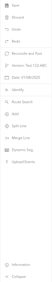

# Experience Builder Time and Versioning widget

| Field | Value |
| --- | --- |
| **Doc** | 167 · User Story · Experience Builder |
| **Product** | Roads & Highways · Pipeline Referencing |
| **Release** | — |
| **Issues** | — |
| **Source** | [ExB - Support TimeConfiguration & FullVersioning Capabilities.pptx](<https://esriis.sharepoint.com/sites/LocationReferencing/Shared%20Documents/General/ExB%20-%20Support%20TimeConfiguration%20%26%20FullVersioning%20Capabilities.pptx>) |
| **People** | author — · PE — · dev — |
| **Edited** | 2025-05-25 22:05 by Nathan Easley |
| **Extracted** | 2026-09-04 · lane xmlstrip · format 3.0 · prompt v2.0.2 |
| **Keywords** | versioning · time configuration · event editor · experience builder widget · lrs configuration · editing session · web editing |
| **Tools** | LRS Configuration · Dynamic Segmentation · Search by Route · LRS Identify |

## Summary

User story for an Experience Builder widget that configures time and versioning for LRS layers in ArcGIS Enterprise. It supports setting a single view date, versioned editing with reconcile/post, save/discard, undo/redo, and applies settings across all LRS widgets in an application. The widget can be full or floating and allows adding other LRS and non-LRS widgets with configurable layout.

## Related documents

<!-- related:begin -->
- [Experience Builder Branch Versioning widget](<https://esriis.sharepoint.com/sites/lrsworkspace/LRS Doc Index/User Stories/exb-branch-versioning-widget.md>) — similar text 0.59 · 4 title words · 1 filename word · same kind/surface/folder <!-- rel:101 s=7.653 -->
- [Advanced Versioning Capabilities in LRS Configuration Widget](<https://esriis.sharepoint.com/sites/lrsworkspace/LRS Doc Index/Test Plans/26708-advanced-versioning-capabilities-in-lrs-configuration-widget.md>) — similar text 0.40 · 2 title words · 2 filename words · same surface <!-- rel:157 s=6.262 -->
- [Experience Builder Support Multiple LRS Services in Web Map](<https://esriis.sharepoint.com/sites/lrsworkspace/LRS Doc Index/User Stories/exb-support-multiple-lrs-services-in-web-map.md>) — similar text 0.28 · 2 title words · 1 filename word · same kind/surface/folder <!-- rel:178 s=5.377 -->
- [LRS Controller Widget](<https://esriis.sharepoint.com/sites/lrsworkspace/LRS Doc Index/Other/26748-lrs-controller-widget.md>) — similar text 0.38 · 1 title word · same surface <!-- rel:64 s=4.394 -->
- [Experience Builder Versioning Test Plan](<https://esriis.sharepoint.com/sites/lrsworkspace/LRS Doc Index/Test Plans/exb-versioning.md>) — similar text 0.26 · 3 title words · 1 filename word · same surface <!-- rel:73 s=4.364 -->
<!-- related:end -->

<!-- docs:begin -->
## Esri documentation

[Apply dynamic segmentation](https://doc.esri.com/en/arcgis-pro/latest/help/production/roads-highways/apply-dynamic-segmentation.html)

_No page matched:_ [LRS Configuration](https://www.google.com/search?q=%22LRS%20Configuration%22+site%3Adoc.esri.com) · [Search by Route](https://www.google.com/search?q=%22Search%20by%20Route%22+site%3Adoc.esri.com) · [LRS Identify](https://www.google.com/search?q=%22LRS%20Identify%22+site%3Adoc.esri.com)
<!-- docs:end -->

---

## Story
### Experience Builder Time and Versioning widget <!-- slide 1 -->
User Story
ArcGIS Enterprise

### User Story <!-- slide 2 -->
As an event editor, I need the easily configure a single view date of LRS layers and utilize versioned editing, so I can streamline workflows around data comparison based on dates and take advantage of complete editing workflows in the web without having to go to Pro or other applications.
Persona
Event Editor: These users are responsible for making edits to route characteristics and assets.  Typically located in different business units/departments than the LRS route editors, these users have varied GIS experience, but a high level of knowledge about the characteristics they maintain (safety, pavement, crashes, etc.). These edits almost always begin with the users configuring a view date of the data.  Additionally, users want to be able to utilize versioned editing to not only edit in a version, but have an editing experience and the ability to reconcile and post data once the edit is complete.

## Acceptance Criteria
### LRS Configuration widget <!-- slide 3 -->
- Create a new Experience Builder widget called LRS Configuration
- This widget should support being able to configure time for all LRS layers and the following versioning options: reconcile/post, save/discard, undo/redo
- The time settings should be applied to all LRS widgets in an application along with the table and other non LRS widgets when opened with LRS data
- The versioning settings of the widget should allow a user to select a version, create a version, and delete a version. The version configured should be applied to all widgets in the application
- When in a version other than default, allow the user to have an editing session with save/discard and undo/redo (make the undo/redo stack the last 5 edits) and reconcile and post (these settings can only be applied to LRS widgets in the app)
- Note that all the versioning back-end work should utilize the components that exist already in the Javascript 4.x API
- To see the designs and prototype of the LRS Configuration widget as reference, see https://www.figma.com/design/dIN1OfZDxhT7i9pbefdoTj/LRS?node-id=2808-42149&p=f&t=1LC1alnL98DUWcvg-0

### LRS Configuration widget <!-- slide 4 -->
- The widget should support a full or floating configuration
- Full would make the widget take entire top, bottom, left, or right side of the application
- Floating would allow the widget to float (but still be docked to the sides as needed)
- Allow the widget to have additional LRS and other widgets added to it (like the widget controller concept).  The default is to only include the time and versioning capabilities.
- When an LRS editing widget (add point, add line, split, merge) is added, they should appear as slide outs from the configuration widget (this is not configurable)
- When the DynSeg widget is added, it will appear at the bottom of the screen by default, but the user can update the height, etc.
- When the Search by Route and Identify widgets are added, allow the user to configure where the Search by Route appears and where the LRS Identify results appear
- For the other widgets, like table, allow the user to choose where the widget will appear

### Configuration <!-- slide 5 -->
In the configuration for the tool, support the following:

- Allow user to configure a default date (default it today)
- Allow user to default the app to load with today’s date always
- Allow user to select a default version to open to (default is Default)
- Allow user to enable/disable reconcile/post (default is enabled)
- Allow user to enable/disable save/discard (default is enabled)
- Allow user to enable/disable undo/redo (default is enabled)
- Allow the user to configure the default orientation of the widget, full or floating (default is full)
- If full is configured, allow the user to determine the default orientation as either vertical or horizontal (default is vertical)

## Testing
<!-- slide 6 -->
- Test with a mix of APR and RH data
- Test with a variety of event types
- Verify all widgets can be added to this widget
- Verify changing time updates the map and results in the table widget
- Verify all the versioning components

## Automation
<!-- slide 7 -->
- How do we want to automate this?

## Documentation
<!-- slide 8 -->
- Add a topic for this LRS configuration option
- Make sure to include how this widget can be used to provide a ribbon experience for users to place all their widgets for a streamlined UI for an application
- Should we add a note to the other LRS widgets topics to alert them that the settings in this widget will apply to those widgets when it’s present in the application?

## Assignment
### Story Points <!-- slide 9 -->
Story Points:
Dev:  days
PE:  days
