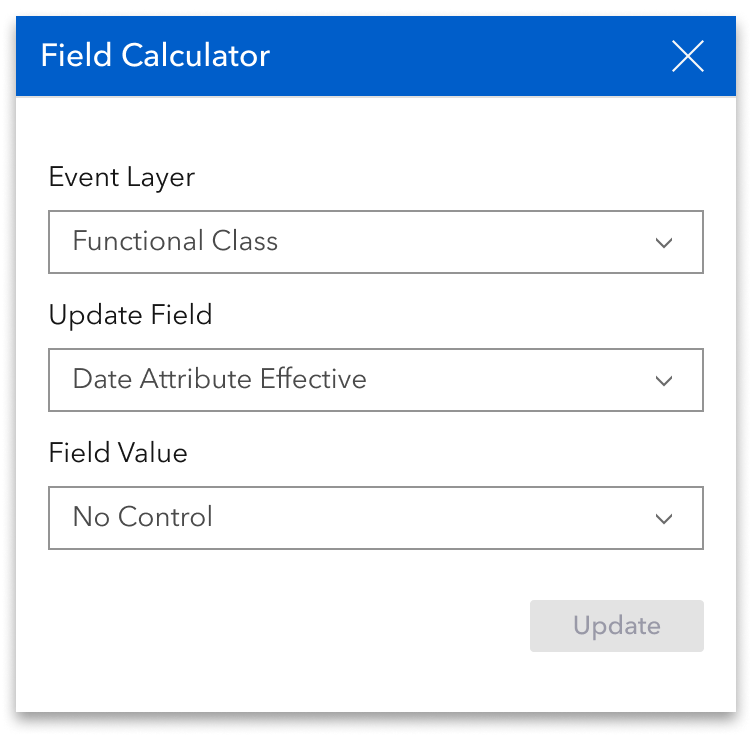

# Experience Builder Dynamic Segmentation Widget Additional Options

|   |   |
| --- | --- |
| **Kind** | User Story · Experience Builder |
| **Release** | — |
| **Source** | [ExpBld DynamicSegmentationTableAdditionalOptions.pptx](<https://esriis.sharepoint.com/sites/LocationReferencing/Shared%20Documents/General/ExpBld%20DynamicSegmentationTableAdditionalOptions.pptx>) |
| **Edited** | 2024-06-11 17:33 by Nathan Easley |
| **Extracted** | 2026-09-04 · lane `xmlstrip` |

<!-- metadata
```yaml
title: "Experience Builder Dynamic Segmentation Widget Additional Options"
source_file: "ExpBld DynamicSegmentationTableAdditionalOptions.pptx"
source_url: "https://esriis.sharepoint.com/sites/LocationReferencing/Shared%20Documents/General/ExpBld%20DynamicSegmentationTableAdditionalOptions.pptx"
doc_id: 361
doc_kind: "User Story"
surface: "Experience Builder"
doc_revision: ""
target_release: ""
pe: ""
dev: ""
author: ""
last_edited_by: "Nathan Easley"
last_edited: "2024-06-11T17:33:08Z"
extracted: 2026-09-04
extraction_lane: xmlstrip
prompt_version: "v2.0.2"
keywords: ["dynamic segmentation", "experience builder", "event editor", "field calculator", "zoom to selected", "select layers", "export", "attribute editing"]
tools: ["Dynamic Segmentation"]
products: []
issues: []
related: [{"doc":362,"file":"experience-builder-dynamic-segmentation-widget__doc362.md","s":7.847},{"doc":337,"file":"dynamic-segmentation-table-test-plan-options__doc337.md","s":5.669},{"doc":345,"file":"experience-builder-straight-line-diagram-event-attributes-editing-on-click__doc345.md","s":5.066},{"doc":476,"file":"search-by-referent-experience-builder-widget__doc476.md","s":4.731},{"doc":490,"file":"search-by-station-experience-builder-widget-user-story__doc490.md","s":4.711}]
```
-->

## Summary

This document describes a user story for enhancing the Dynamic Segmentation widget in ArcGIS Experience Builder. It details additional options for the widget's table, including Field Calculator, Zoom to Selected, Select Layers, and Export functionalities, along with testing and documentation plans.

## Related documents

<!-- related:begin -->
- [Experience Builder Dynamic Segmentation widget](<https://esriis.sharepoint.com/sites/lrsworkspace/LRS Doc Index/User Stories/experience-builder-dynamic-segmentation-widget__doc362.md>) — similar text 0.43 · 5 title words · 5 filename words · same kind/surface/folder <!-- rel:362 -->
- [Dynamic Segmentation Table Test Plan Options](<https://esriis.sharepoint.com/sites/lrsworkspace/LRS Doc Index/Test Plans/dynamic-segmentation-table-test-plan-options__doc337.md>) — similar text 0.29 · 3 title words · 2 filename words · same surface <!-- rel:337 -->
- [Experience Builder Straight Line Diagram Event Attributes/Editing on Click](<https://esriis.sharepoint.com/sites/lrsworkspace/LRS Doc Index/User Stories/experience-builder-straight-line-diagram-event-attributes-editing-on-click__doc345.md>) — similar text 0.35 · 2 title words · 2 filename words · same kind/surface/folder <!-- rel:345 -->
- [Search by Referent Experience Builder widget](<https://esriis.sharepoint.com/sites/lrsworkspace/LRS Doc Index/User Stories/search-by-referent-experience-builder-widget__doc476.md>) — similar text 0.28 · 3 title words · 2 filename words · same kind/surface/folder <!-- rel:476 -->
- [Search by Station Experience Builder widget User Story](<https://esriis.sharepoint.com/sites/lrsworkspace/LRS%20Doc%20Index/User%20Stories/search-by-station-experience-builder-widget-user-story__doc490.md>) — similar text 0.28 · 3 title words · 2 filename words · same kind/surface/folder <!-- rel:490 -->
<!-- related:end -->

<!-- docs:begin -->
## Esri documentation

[Apply dynamic segmentation](https://doc.esri.com/en/arcgis-pro/latest/help/production/location-referencing-pipelines/apply-dynamic-segmentation.html) · [Event editing using the attribute table](https://doc.esri.com/en/arcgis-pro/latest/help/production/location-referencing-pipelines/event-editing-using-the-attribute-table.html)
<!-- docs:end -->

---

## Slide 1 — Experience Builder Dynamic Segmentation widget additional options

User Story
ArcGIS Enterprise

## Slide 2 — User Story

As an event editor, I need the ability to edit multiple LRS event attributes in a dynamically segmented view, so I can view the relationships between different data layers attributes while editing.
Persona
Event Editor: These users are responsible for making edits to route characteristics and assets.  Typically located in different business units/departments than the LRS route editors, these users have varied GIS experience, but a high level of knowledge about the characteristics they maintain (safety, pavement, crashes, etc.). One workflow editors will utilize is to view the results of dynamic segmentation of LRS events and then edit the attributes in the table.  We supported this workflow in Event Editor and ArcGIS Pro and now want to support it within Experience Builder deployed applications for these users.

## Slide 3 — Dynamic Segmentation widget additional options


Add the following additional buttons as options to the Dynamic Segmentation widget table in the top right of the widget:

  - Field Calculator (always available)
  - Zoom to selected (available when one or more records are selected)
  - Select layers (always available)
  - Export (always available)
For the Field Calculator, if possible, utilize the same Field Calculator experience the ExB team worked on last release
When clicked, the dialog should pop up and allow the user to select a layer and field that will have its records calculated
Honor domains, ranges, etc. in the Field Value and have it change from text box to drop down as needed depending on the Field Value selected
Update all the records in the column/field for now
To see the designs as reference, see https://www.figma.com/design/dIN1OfZDxhT7i9pbefdoTj/LRS?node-id=506-130104&t=wxNbCEfAcfChEXKx-0



## Slide 4 — Dynamic Segmentation widget additional options

For Zoom to selected, follow the existing pattern of zooming on the map to whichever records are selected in the table
Users can select one or more records in the table to zoom to (and the zoom extent should include all the records)
For Select Layers, when the user clicks, show a drop down with all the layers (point and line) included in the table
By default, all layers from the attribute set(s) will be on
Allow users to turn layers on/off
When a layer is turned on/off, update the table to show/hide the fields from that layer (can this be done in a way where the data doesn’t need to be dynseged again?)
Allow users to turn off all the point layers, but at least 1 line layer must stay on
For Export, follow the existing paradigm in Experience Builder to export from a table
Allow the export formats ExB already supports (csv, json, and geojson)
Export everything in the table for now (an enhancement to allow selected records can be added in the future)

## Slide 5 — Testing

Test zooming to a variety of records in the table with varying locations in the map
Test turning on/off multiple layers and focus on performance of the table update
Test with a variety of fields with drop downs/validations (defaults, contingent, subtypes, domains, ranges, etc.) for the field calculator
Test exporting the table to all three formats; verify csv looks correct when opened in excel

## Slide 6 — Automation

Don’t automate the widget yet as this is the first of multiple user stories for this widget.

## Slide 7 — Documentation

Add to the existing documentation for this widget from the first user story
Add context about the various options available and describe how each of them work

## Slide 8 — Story Points

Story Points:
Dev:
PE:
