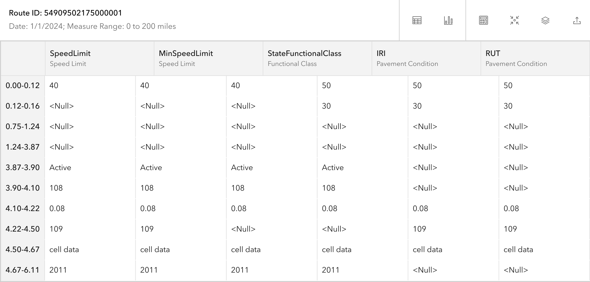

# Experience Builder Dynamic Segmentation widget

|   |   |
| --- | --- |
| **Kind** | User Story · Experience Builder |
| **Release** | — |
| **Product** | Roads & Highways · Pipeline Referencing |
| **Source** | [ExpBld DynamicSegmentationTable.pptx](<https://esriis.sharepoint.com/sites/LocationReferencing/Shared%20Documents/General/ExpBld%20DynamicSegmentationTable.pptx>) |
| **Edited** | 2024-06-11 03:03 by Nathan Easley |
| **Extracted** | 2026-09-04 · lane `xmlstrip` |

<!-- metadata
```yaml
title: "Experience Builder Dynamic Segmentation widget"
source_file: "ExpBld DynamicSegmentationTable.pptx"
source_url: "https://esriis.sharepoint.com/sites/LocationReferencing/Shared%20Documents/General/ExpBld%20DynamicSegmentationTable.pptx"
doc_id: 362
doc_kind: "User Story"
surface: "Experience Builder"
doc_revision: ""
target_release: ""
pe: ""
dev: ""
author: ""
last_edited_by: "Nathan Easley"
last_edited: "2024-06-11T03:03:38Z"
extracted: 2026-09-04
extraction_lane: xmlstrip
prompt_version: "v2.0.2"
keywords: ["dynamic segmentation", "event editor", "lrs attributes", "experience builder widget", "route search", "attribute editing", "measure range"]
tools: ["Dynamic Segmentation", "LRS Search"]
products: ["Roads & Highways", "Pipeline Referencing"]
issues: []
related: [{"doc":361,"file":"experience-builder-dynamic-segmentation-widget-additional-options__doc361.md","s":7.847},{"doc":529,"file":"search-by-route-and-measure-experience-builder-widget__doc529.md","s":5.809},{"doc":490,"file":"search-by-station-experience-builder-widget-user-story__doc490.md","s":5.25},{"doc":464,"file":"search-by-line-experience-builder-widget__doc464.md","s":5.07},{"doc":476,"file":"search-by-referent-experience-builder-widget__doc476.md","s":5.003}]
```
-->

## Summary

User story for a new Dynamic Segmentation widget in Experience Builder to enable event editors to view and edit multiple LRS event attributes in a dynamically segmented table. The widget supports searching by route and measure, displays LRS attributes with editable fields, and requires configuration of LRS map service, attribute sets, and table orientation. Testing includes various event types and fields, with documentation planned for initial concepts and usability.

## Related documents

<!-- related:begin -->
- [Experience Builder Dynamic Segmentation Widget Additional Options](<https://esriis.sharepoint.com/sites/lrsworkspace/LRS Doc Index/User Stories/experience-builder-dynamic-segmentation-widget-additional-options__doc361.md>) — similar text 0.43 · 5 title words · 5 filename words · same kind/surface/folder <!-- rel:361 -->
- [Search by Route and Measure Experience Builder widget](<https://esriis.sharepoint.com/sites/lrsworkspace/LRS Doc Index/User Stories/search-by-route-and-measure-experience-builder-widget__doc529.md>) — similar text 0.28 · 3 title words · 2 filename words · same kind/surface/folder <!-- rel:529 -->
- [Search by Station Experience Builder widget User Story](<https://esriis.sharepoint.com/sites/lrsworkspace/LRS%20Doc%20Index/User%20Stories/search-by-station-experience-builder-widget-user-story__doc490.md>) — similar text 0.25 · 3 title words · 2 filename words · same kind/surface/folder <!-- rel:490 -->
- [Search by Line Experience Builder widget](<https://esriis.sharepoint.com/sites/lrsworkspace/LRS Doc Index/User Stories/search-by-line-experience-builder-widget__doc464.md>) — similar text 0.26 · 3 title words · 2 filename words · same kind/surface/folder <!-- rel:464 -->
- [Search by Referent Experience Builder widget](<https://esriis.sharepoint.com/sites/lrsworkspace/LRS Doc Index/User Stories/search-by-referent-experience-builder-widget__doc476.md>) — similar text 0.26 · 3 title words · 2 filename words · same kind/surface/folder <!-- rel:476 -->
<!-- related:end -->

<!-- docs:begin -->
## Esri documentation

[Apply dynamic segmentation](https://doc.esri.com/en/arcgis-pro/latest/help/production/roads-highways/apply-dynamic-segmentation.html) · [Event editing using the attribute table](https://doc.esri.com/en/arcgis-pro/latest/help/production/roads-highways/event-editing-using-the-attribute-table.html)

_No page matched:_ [LRS Search](https://www.google.com/search?q=%22LRS%20Search%22+site%3Adoc.esri.com)
<!-- docs:end -->

---

## Slide 1 — Experience Builder Dynamic Segmentation widget

User Story
ArcGIS Enterprise

## Slide 2 — User Story

As an event editor, I need the ability to edit multiple LRS event attributes in a dynamically segmented view, so I can view the relationships between different data layers attributes while editing.
Persona
Event Editor: These users are responsible for making edits to route characteristics and assets.  Typically located in different business units/departments than the LRS route editors, these users have varied GIS experience, but a high level of knowledge about the characteristics they maintain (safety, pavement, crashes, etc.). One workflow editors will utilize is to view the results of dynamic segmentation of LRS events and then edit the attributes in the table.  We supported this workflow in Event Editor and ArcGIS Pro and now want to support it within Experience Builder deployed applications for these users.

## Slide 3 — Dynamic Segmentation widget

Create a new widget called Dynamic Segmentation within the Location Referencing group of widgets
The widget should be a similar experience to the table widget (it can be deployed as a floating widget or docked within the app)
The initial state for the widget is empty
To get results in the widget, users should search for a route in the LRS search widget

  - By Route and Measure for an entire route
  - By Route and Measure for a measure range
  - By Line and Measure (with a route selected in the results)
Only provide results for one route for now
From the results, they should use data actions to launch “Dynamic Segmentation”
When this data action is triggered, use Query Attribute Set REST to execute against the default line (and point if configured) attribute sets from the configuration of the widget and show the results in the table
To see the designs as reference, see https://www.figma.com/design/dIN1OfZDxhT7i9pbefdoTj/LRS?node-id=506-130104&t=wxNbCEfAcfChEXKx-0

## Slide 4 — Dynamic Segmentation widget

By default, show the dyn seg table with the LRS attributes as columns in the format Field then Layer
Show the measure ranges for each unique measure range as rows
The date will come from the date set in the map via the filter or time widget
Allow users to edit each LRS attribute field
When a field is edited and focus is changed, show the background of the edited cell in a different color
To apply the edits (to the changed fields), users need to click the Apply Button

Follow the Pro pattern for the table and only allow fields for line events or point event to be edited
Only show the fields that are part of the attribute set and the LRS Network for the route selected
The table should support all the fields and values (domains, subtypes, ranges, etc.)
When a range of measures is returned, we will need the measure range in the table to be inclusive of the entire range and potentially beyond the ends of the measure range (ex. If the measure range is 3-5 in the search, but one of the events goes from 2.7-3.2, then we’ll need to show back to 2.7 to allow for editing of that record)



## Slide 5 — Configuration

In the configuration for the tool, require the following:

  - LRS Map Service (from the web map)
  - Default Dynamic Segmentation result (Table or Diagram), only show Table as option for now
  - LRS Network (default to whichever is returned first)
  - Default Attribute Set type (line only or line and point, default to line only)
  - Line Attribute Set (show all available from the LRS server, default to first in the list)
  - Point Attribute Set (optional)
  - Table Orientation (measures as columns, measures as rows, default is rows)

## Slide 6 — Testing

Test with a mix of APR and RH data
Test with a mix or point, line, and spanning events
Test making a single edit or multiple edits within a session
Test with a variety of fields (defaults, contingent, subtypes, domains, ranges, etc.)
Test with an entire route and with a measure range

## Slide 7 — Automation

Don’t automate the widget yet as this is the first of multiple user stories for this widget.

## Slide 8 — Documentation

Add a new topic for this widget in the Experience Builder documentation
Even though this is the first user story of many for this widget, the PE for this user story should at least author the initial section introducing the concepts of dynamic segmentation and put together the usability of the widget around its current state when this story completes
Focus specifically on the need to configure the defaults and that the widget gets populated/launches as a data action from the LRS Search widget (and therefore needs to be deployed together in an app to work as expected)

## Slide 9 — Story Points

Story Points:
Dev:
PE:
