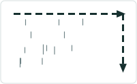
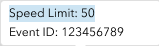
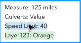

# Experience Builder Straight Line Diagram Event Attributes on Hover/Click

|   |   |
| --- | --- |
| **Kind** | User Story · Experience Builder |
| **Release** | — |
| **Product** | Roads & Highways · Pipeline Referencing |
| **Source** | [ExpBld StraightLineDiagramShowAttributesHover.pptx](<https://esriis.sharepoint.com/sites/LocationReferencing/Shared%20Documents/General/ExpBld%20StraightLineDiagramShowAttributesHover.pptx>) |
| **Edited** | 2024-07-23 15:56 by Nathan Easley |
| **Extracted** | 2026-09-04 · lane `xmlstrip` |

<!-- metadata
```yaml
title: "Experience Builder Straight Line Diagram Event Attributes on Hover/Click"
source_file: "ExpBld StraightLineDiagramShowAttributesHover.pptx"
source_url: "https://esriis.sharepoint.com/sites/LocationReferencing/Shared%20Documents/General/ExpBld%20StraightLineDiagramShowAttributesHover.pptx"
doc_id: 348
doc_kind: "User Story"
surface: "Experience Builder"
doc_revision: ""
target_release: ""
pe: ""
dev: ""
author: ""
last_edited_by: "Nathan Easley"
last_edited: "2024-07-23T15:56:47Z"
extracted: 2026-09-04
extraction_lane: xmlstrip
prompt_version: "v2.0.2"
keywords: ["straight line diagram", "event attributes", "event editor", "dynamic segmentation", "experience builder", "route measures", "event visualization"]
tools: []
products: ["Roads & Highways", "Pipeline Referencing"]
issues: []
related: [{"doc":349,"file":"experience-builder-straight-line-diagram-symbology-and-display-field__doc349.md","s":8.922},{"doc":345,"file":"experience-builder-straight-line-diagram-event-attributes-editing-on-click__doc345.md","s":8.755},{"doc":292,"file":"support-overlapping-events-in-experience-builder-straight-line-diagram__doc292.md","s":5.227},{"doc":464,"file":"search-by-line-experience-builder-widget__doc464.md","s":5.223},{"doc":362,"file":"experience-builder-dynamic-segmentation-widget__doc362.md","s":4.832}]
```
-->

## Summary

User story for an Experience Builder widget that allows event editors to view and edit multiple LRS event attributes visualized in a straight line diagram based on measures along a route. The diagram supports hover and click interactions to display event attributes and relationships between data layers, facilitating identification of gaps and overlaps in event data.

## Related documents

<!-- related:begin -->
- [Experience Builder Straight Line Diagram Symbology and Display Field](<https://esriis.sharepoint.com/sites/lrsworkspace/LRS Doc Index/User Stories/experience-builder-straight-line-diagram-symbology-and-display-field__doc349.md>) — similar text 0.63 · 5 title words · 5 filename words · same kind/surface/folder <!-- rel:349 -->
- [Experience Builder Straight Line Diagram Event Attributes/Editing on Click](<https://esriis.sharepoint.com/sites/lrsworkspace/LRS Doc Index/User Stories/experience-builder-straight-line-diagram-event-attributes-editing-on-click__doc345.md>) — similar text 0.58 · 6 title words · 5 filename words · same kind/surface/folder <!-- rel:345 -->
- [Support Overlapping Events in Experience Builder Straight Line Diagram](<https://esriis.sharepoint.com/sites/lrsworkspace/LRS Doc Index/User Stories/support-overlapping-events-in-experience-builder-straight-line-diagram__doc292.md>) — similar text 0.22 · 5 title words · same kind/surface/folder <!-- rel:292 -->
- [Search by Line Experience Builder widget](<https://esriis.sharepoint.com/sites/lrsworkspace/LRS Doc Index/User Stories/search-by-line-experience-builder-widget__doc464.md>) — similar text 0.26 · 3 title words · 3 filename words · same kind/surface/folder <!-- rel:464 -->
- [Experience Builder Dynamic Segmentation widget](<https://esriis.sharepoint.com/sites/lrsworkspace/LRS Doc Index/User Stories/experience-builder-dynamic-segmentation-widget__doc362.md>) — similar text 0.35 · 2 title words · 2 filename words · same kind/surface/folder <!-- rel:362 -->
<!-- related:end -->

<!-- docs:begin -->
## Esri documentation

[Event editing using the attribute table](https://doc.esri.com/en/arcgis-pro/latest/help/production/roads-highways/event-editing-using-the-attribute-table.html) · [Apply dynamic segmentation](https://doc.esri.com/en/arcgis-pro/latest/help/production/roads-highways/apply-dynamic-segmentation.html)

_No page matched:_ [experience builder](https://www.google.com/search?q=%22experience%20builder%22+site%3Adoc.esri.com)
<!-- docs:end -->

---

## Slide 1 — Experience Builder Straight Line Diagram Event Attributes on hover/click

User Story
ArcGIS Enterprise

## Slide 2 — User Story

As an event editor, I need the ability to view and edit multiple LRS event attributes visualized in a diagram based on measures along the route, so I can view the relationships between different data layers attributes while editing.
Persona
Event Editor: These users are responsible for making edits to route characteristics and assets.  Typically located in different business units/departments than the LRS route editors, these users have varied GIS experience, but a high level of knowledge about the characteristics they maintain (safety, pavement, crashes, etc.). One workflow editors will utilize is to view event data in a straight-line diagram view where the layers are visualized, and gaps and overlaps can easily be identified.  In addition to being used for editing, this diagram will be utilized by many users throughout the organization as it will provide a visualization of event layers and how they align spatially along a route with each other.

## Slide 3 — Straight Line Diagram


## Slide 4 — Straight Line Diagram



In the SLD, when a user hovers over one of the records (for what amount of time?), show a pop up that shows the Layer Name, EventID, and Display Field attribute for that record

When a user clicks the measures on the measure bar at the top of the SLD, show a pop up that shows the Measure and all the Display Field attributes for that cross section (both point and line events)

Show a dotted line that runs vertically from the measure bar down through all the events that intersect that measure
If the location being hovered over/clicked is at the beginning/end of two events, choose the upstream event and show its attribute(s)
Note that in the mobile experience, the click option will work, but the hover will not
To see the designs as reference, see https://www.figma.com/design/dIN1OfZDxhT7i9pbefdoTj/LRS?node-id=506-130104&t=wxNbCEfAcfChEXKx-0

 

## Slide 5 — Configuration

No additions to the configuration with this story

## Slide 6 — Testing

Test with a mix of APR, RH data (INDOT cracking layer as one of the layers in the dynseg)
Test with a mix or point, line, and spanning events
Test with a variety of fields as the display field (defaults, contingent, subtypes, domains, ranges, etc.)
Test with results that produce lots of results for a layer, so we can see how the labeling performs with limited space
Test changing the measure scale to large/small values to validate snapping and the measures provided

## Slide 7 — Automation

Don’t automate the widget yet as this is the first of multiple user stories for this widget.

## Slide 8 — Documentation

Add to the existing topic created in the previous user story
Focus specifically on these hover/click options and how they will show one events attributes or all the event attributes at a single measure

## Slide 9 — Story Points

Story Points:
Dev:
PE:
