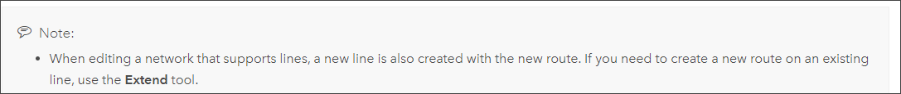

# Extend Route Tool User Story and Testing

|   |   |
| --- | --- |
| **Kind** | User Story · Pro |
| **Release** | — |
| **Product** | Pipeline Referencing · Utility Network |
| **Source** | [Extend_No_New_Route_UserStory.pptx](<https://esriis.sharepoint.com/sites/LocationReferencing/Shared%20Documents/General/Extend_No_New_Route_UserStory.pptx>) |
| **Edited** | 2019-11-20 16:53 by Rahul Rakshit |
| **Extracted** | 2026-09-04 · lane `xmlstrip` |

<!-- metadata
```yaml
title: "Extend Route Tool User Story and Testing"
source_file: "Extend_No_New_Route_UserStory.pptx"
source_url: "https://esriis.sharepoint.com/sites/LocationReferencing/Shared%20Documents/General/Extend_No_New_Route_UserStory.pptx"
doc_id: 871
doc_kind: "User Story"
surface: "Pro"
doc_revision: ""
target_release: ""
pe: ""
dev: ""
author: "Rahul Rakshit"
last_edited_by: "Rahul Rakshit"
last_edited: "2019-11-20T16:53:18Z"
extracted: 2026-09-04
extraction_lane: xmlstrip
prompt_version: "v2.0.2"
keywords: ["extend route", "route extension", "equation point", "line network", "create route", "user story", "testing"]
tools: ["Extend Route"]
products: ["Pipeline Referencing", "Utility Network"]
issues: []
related: [{"doc":873,"file":"support-complex-route-shapes-in-extend-route__doc873.md","s":4.507},{"doc":839,"file":"support-event-behaviors-on-complex-route-shapes-in-extend-route__doc839.md","s":4.205},{"doc":826,"file":"conflict-prevention-acquire-locks-when-creating-new-routes-in-create-extend__doc826.md","s":3.995},{"doc":760,"file":"support-event-behaviors-on-vertical-route-shapes-in-extend-route__doc760.md","s":3.752},{"doc":775,"file":"support-extend-route-in-local-scenes-in-pro__doc775.md","s":3.695}]
```
-->

## Summary

This document describes a user story to restrict the Extend Route tool to only extend existing routes and prevent creating new routes when measures result in an equation point. It includes instructions for updating documentation and outlines testing requirements across different line network types and datasets, including UI and REST verification. Automation tests related to equation points in the Extend Route tool are to be removed.

## Related documents

<!-- related:begin -->
- [Support Complex Route Shapes in Extend Route](<https://esriis.sharepoint.com/sites/lrsworkspace/LRS%20Doc%20Index/User%20Stories/support-complex-route-shapes-in-extend-route__doc873.md>) — similar text 0.19 · 2 title words · 2 filename words · same kind/surface/folder <!-- rel:873 -->
- [Support Event Behaviors on Complex Route Shapes in Extend Route](<https://esriis.sharepoint.com/sites/lrsworkspace/LRS Doc Index/User Stories/support-event-behaviors-on-complex-route-shapes-in-extend-route__doc839.md>) — similar text 0.18 · 2 title words · 2 filename words · same kind/surface/folder <!-- rel:839 -->
- [Conflict Prevention: Acquire Locks when creating new routes in Create, Extend, Realign, and Reassign Route](<https://esriis.sharepoint.com/sites/lrsworkspace/LRS Doc Index/User Stories/conflict-prevention-acquire-locks-when-creating-new-routes-in-create-extend__doc826.md>) — similar text 0.14 · 2 title words · 1 filename word · same kind/surface/folder <!-- rel:826 -->
- [Support Event Behaviors on Vertical Route Shapes in Extend Route](<https://esriis.sharepoint.com/sites/lrsworkspace/LRS Doc Index/User Stories/support-event-behaviors-on-vertical-route-shapes-in-extend-route__doc760.md>) — similar text 0.15 · 2 title words · 1 filename word · same kind/surface/folder <!-- rel:760 -->
- [Support Extend Route in Local Scenes in Pro](<https://esriis.sharepoint.com/sites/lrsworkspace/LRS Doc Index/User Stories/support-extend-route-in-local-scenes-in-pro__doc775.md>) — similar text 0.14 · 2 title words · 1 filename word · same kind/surface/folder <!-- rel:775 -->
<!-- related:end -->

<!-- docs:begin -->
## Esri documentation

[Extend a route](https://doc.esri.com/en/arcgis-pro/latest/help/production/location-referencing-pipelines/extend-a-route.html) · [Event behavior for route extension](https://doc.esri.com/en/arcgis-pro/latest/help/production/roads-highways/event-behavior-for-route-extension.html) · [Create a route](https://doc.esri.com/en/arcgis-pro/latest/help/production/location-referencing-pipelines/create-a-new-route.html)
<!-- docs:end -->

---

## Slide 1 — Do not allow creating a route in the Extend route tool

Extend route to be used only for extending a route

## Slide 2 — Extending a route

Right Now: When the measures result in an equation point, a new route has to be created.
User Story: When the measures result in an equation point:

  - Do not allow the extension to go through.
  - Provide the message as we show today for the equation point including the information on the forward and back stationing values.
  - Suggest to use Create route instead.
For both DC and FS.
Only for Line Networks.

## Slide 3 — Documentation

Update the Pro doc for extend route for APR. This can be done by the tech writer. PE to verify.
Remove this part of the note from the Create Route doc:



## Slide 4 — Testing

Test with all types of line networks
APR, UN and PoM datasets
DC and FS
Test on UI and REST
Verify that the original extend route tool works as expected (without the create route part)
Automation – Remove the equation point tests from Extend Route tests across the board

## Slide 5 — Estimates
