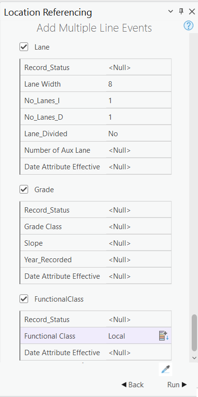

# Eyedropper for Event tools User Story

| Field | Value |
| --- | --- |
| **Doc** | 657 · User Story · Experience Builder |
| **Product** | — |
| **Release** | — |
| **Issues** | — |
| **Source** | [Eyedropper for Event tools.pptx](<https://esriis.sharepoint.com/sites/LocationReferencing/Shared%20Documents/General/Eyedropper%20for%20Event%20tools.pptx>) |
| **People** | author William Isley · PE — · dev — |
| **Edited** | 2022-06-24 16:01 by Johum Khushk |
| **Extracted** | 2026-09-04 · lane xmlstrip · format 3.0 · prompt v2.0.2 |
| **Keywords** | eyedropper tool · event tools · attribute copying · point event · line event · multiple point event · multiple line event · event replacement |
| **Tools** | — |

## Summary

User story describing the addition of an eyedropper tool to event attribute tools to enable copying attribute values from another route. The tool applies to point, line, multiple point, multiple line events, and event replacement, with behavior defined for overlapping routes and attribute overwriting. Testing and documentation updates are planned.

## Related documents

<!-- related:begin -->
- [Eyedropper Tool for Attribute Copying in Route Editing Tools](<https://esriis.sharepoint.com/sites/lrsworkspace/LRS Doc Index/User Stories/eyedropper-tool-for-attribute-copying-in-route-editing-tools.md>) — similar text 0.20 · 2 title words · 1 filename word · same kind/folder <!-- rel:605 s=5.256 -->
- [Add Line Event Length Method](<https://esriis.sharepoint.com/sites/lrsworkspace/LRS Doc Index/User Stories/add-line-event-length-method.md>) — similar text 0.21 · 1 title word · 1 filename word · same kind/folder <!-- rel:269 s=4.029 -->
- [Add Point Event Point Offset Method](<https://esriis.sharepoint.com/sites/lrsworkspace/LRS Doc Index/User Stories/add-point-event-point-offset-method.md>) — similar text 0.27 · 1 title word · 1 filename word · same kind/folder <!-- rel:272 s=3.933 -->
- [Add Line Events Point Offset Method](<https://esriis.sharepoint.com/sites/lrsworkspace/LRS Doc Index/User Stories/add-line-events-point-offset-method.md>) — similar text 0.25 · 1 filename word · same kind/folder <!-- rel:268 s=3.251 -->
- [Add Line Event tool in ArcGIS Pro](<https://esriis.sharepoint.com/sites/lrsworkspace/LRS Doc Index/User Stories/add-line-event-tool-in-pro.md>) — similar text 0.25 · 1 title word · 1 filename word · same kind/folder <!-- rel:687 s=3.24 -->
<!-- related:end -->

<!-- docs:begin -->
## Esri documentation

[Event editing using the attribute table](https://doc.esri.com/en/arcgis-pro/latest/help/production/location-referencing-pipelines/event-editing-using-the-attribute-table.html)
<!-- docs:end -->

---

## Story
### Eyedropper for Event tools <!-- slide 1 -->
User Story

### User Story <!-- slide 2 -->
As an LRS Editor, I need the capability to copy attribute values from another route so that event attributes can be populated at once instead of filling them out one by one.

## Acceptance Criteria
### Eyedropper for Event tools <!-- slide 3 -->
- Add eye dropper tool in all the 5 event tools on the pane where attributes are shown:
  - Point Event
  - Line Event
  - Multiple Point Events
  - Multiple Line Events
  - Event Replacement
- Clicking this tool enables the user to click on the map and select a location
- The tool will copy all attribute values in the attribute set for the location clicked into the attribute selections
- The tool button should have "selected state" look when chosen.
- The tool should have a "de active state" look when not available for clicking.
- If there are overlapping routes / time slices, show route picker window for the user to select the route (and populated the attribute values for selected routes).
- If no events are present, keep attribute values in the pane as-is.
- If no are event, and null not possible, make entry blank.
- If user already started filling out attributes, overwrite all of them.
- Icon

## Testing
<!-- slide 4 -->
- Test on a variety of network types (Line, NonLine with multifield RouteID, NonLine with singlefield RouteID, NonLine with autogenerated RouteID)
- Make sure to test with both Projected and Unprojected data
- Feature Service testing only (no need to worry about direct connect or fgdb)
- Test on the following route types
  - Normal
  - Gapped (include different gap calibration methods)
  - Loops
  - Lollipops
  - Alpha
  - Branch
  - Vertical
- Test with and without referents configured for an event
- 508/i18n testing

## Automation
<!-- slide 5 -->
- Create few 2,3 UI cases

## Documentation
<!-- slide 6 -->
- Update UI in the doc topics for all the event tools and add a note
  - Point Event
  - Line Event
  - Multiple Point Events
  - Multiple Line Events
  - Event Replacement

## Assignment
<!-- slide 7 -->
Story Points:
Dev:
PE:
