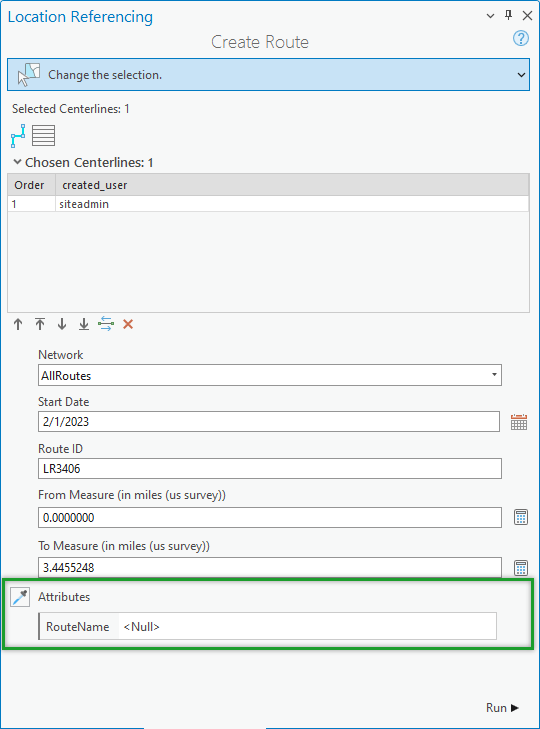

# Eyedropper Tool for Attribute Copying in Route Editing Tools

| Field | Value |
| --- | --- |
| **Doc** | 605 · User Story · Pro |
| **Product** | Roads & Highways · Pipeline Referencing |
| **Release** | — |
| **Issues** | — |
| **Source** | [Eyedropper tool for Create Route.pptx](<https://esriis.sharepoint.com/sites/LocationReferencing/Shared%20Documents/General/Eyedropper%20tool%20for%20Create%20Route.pptx>) |
| **People** | author William Isley · PE — · dev — |
| **Edited** | 2023-03-01 00:16 by Nathan Easley |
| **Extracted** | 2026-09-04 · lane xmlstrip · format 3.0 · prompt v2.0.2 |
| **Keywords** | eyedropper tool · attribute copying · route editing · non lrs attributes · create route · realign route · reassign route |
| **Tools** | Create Route · Realign Route · Reassign Route |

## Summary

This document describes a user story for adding an eyedropper tool to route editing tools in the LRS. The tool enables LRS editors to quickly copy non-LRS attributes from existing routes to newly created routes in Create, Realign, and Reassign Route tools. It includes testing and automation plans and references documentation for usage.

## Related documents

<!-- related:begin -->
- [Eyedropper for Event tools User Story](<https://esriis.sharepoint.com/sites/lrsworkspace/LRS%20Doc%20Index/User%20Stories/eyedropper-for-event-tools.md>) — similar text 0.20 · 2 title words · 1 filename word · same kind/folder <!-- rel:657 s=4.259 -->
- [Flip Centerline Tool In-Memory Flip User Story](<https://esriis.sharepoint.com/sites/lrsworkspace/LRS Doc Index/User Stories/4613-flip-centerline-tool-in-memory-flip-rh-apr-un-2023-02.md>) — similar text 0.23 · 1 title word · 1 filename word · same kind/surface/folder <!-- rel:609 s=3.565 -->
- [Flip Centerline Tool In-Memory Flip User Story](<https://esriis.sharepoint.com/sites/lrsworkspace/LRS Doc Index/User Stories/4613-flip-centerline-tool-in-memory-flip-rh-apr-un-2023-03.md>) — similar text 0.23 · 1 title word · 1 filename word · same kind/surface/folder <!-- rel:601 s=3.557 -->
- [Conflict Prevention: Acquire Locks when creating new routes in Create, Extend, Realign, and Reassign Route](<https://esriis.sharepoint.com/sites/lrsworkspace/LRS Doc Index/User Stories/conflict-prevention-acquire-locks-when-creating-new-routes.md>) — similar text 0.11 · 1 title word · 1 filename word · same kind/surface/folder <!-- rel:826 s=3.342 -->
- [Merge coincident option in DynSeg tool in Pro](<https://esriis.sharepoint.com/sites/lrsworkspace/LRS Doc Index/User Stories/merge-coincident-option-in-dynseg-tool-in-pro.md>) — similar text 0.30 · 1 title word · 1 filename word · same kind/surface/folder <!-- rel:604 s=3.304 -->
<!-- related:end -->

<!-- docs:begin -->
## Esri documentation

[Create a route](https://doc.esri.com/en/arcgis-pro/latest/help/production/roads-highways/create-a-new-route.html) · [Realign routes](https://doc.esri.com/en/arcgis-pro/latest/help/production/roads-highways/realign-routes.html) · [Route reassignment](https://doc.esri.com/en/arcgis-pro/latest/help/production/roads-highways/reassign-routes.html)
<!-- docs:end -->

---

## Story
### Eyedropper tool for attribute copying in route editing tools <!-- slide 1 -->
User Story

### User Story <!-- slide 2 -->
As an LRS editor, I need the ability to quickly copy attributes from existing routes, so that I can quickly and efficiently populate dozens of non LRS attributes on newly created routes.

Persona
LRS Editor: This user is responsible for making edits to the LRS.  The edits they need to make come in from field crews/contractors in a variety of formats (shapefiles, engineering drawing, fgdbs).  The LRS Editor is responsible for making the route edits based on these documents.  As our users in both the transportation and pipeline space begin to model additional non LRS attributes on their LRS Networks, it makes sense to make it simple for them to populate dozens of attributes in as efficient a manner as possible.  Adding the eyedropper tool to Create, Realign, and Reassign Route when new routes are created will allow users to quickly populate the majority of their attributes in a single operation.

## Acceptance Criteria
### Eyedropper tool in route editing tools <!-- slide 3 -->
- Add an eyedropper tool to the attributes section for newly created routes in Create, Realign, and Reassign Route tools
- The eyedropper should work the same as in the Add Events tools.  When a user clicks the eyedropper, they can click any route on the network and the non-LRS attributes will be copied from the clicked route to the attributes table of the soon to be created route
- Follow Pro design standards to place the eyedropper tool in the best location in relation to the Attributes section of the tools

## Testing
<!-- slide 4 -->
- Test with a mix of APR and RH data
- Test with UPDM
- Verify the all field types work as well as coded value domains, range domains, and contingent values

## Automation
<!-- slide 5 -->
Create a UI automation test for each tool

## Documentation
<!-- slide 6 -->
Mention this button as an option for populating additional field attributes in the Create, Realign, and Reassign Route tool topics
https://pro.arcgis.com/en/pro-app/latest/help/production/location-referencing-pipelines/create-a-new-route.htm
https://pro.arcgis.com/en/pro-app/latest/help/production/roads-highways/create-a-new-route.htm
https://pro.arcgis.com/en/pro-app/latest/help/production/location-referencing-pipelines/realign-routes.htm
https://pro.arcgis.com/en/pro-app/latest/help/production/roads-highways/realign-routes.htm
https://pro.arcgis.com/en/pro-app/latest/help/production/location-referencing-pipelines/reassign-routes.htm
https://pro.arcgis.com/en/pro-app/latest/help/production/roads-highways/reassign-routes.htm

## Assignment
<!-- slide 7 -->
Story Points:
Dev:
PE:
