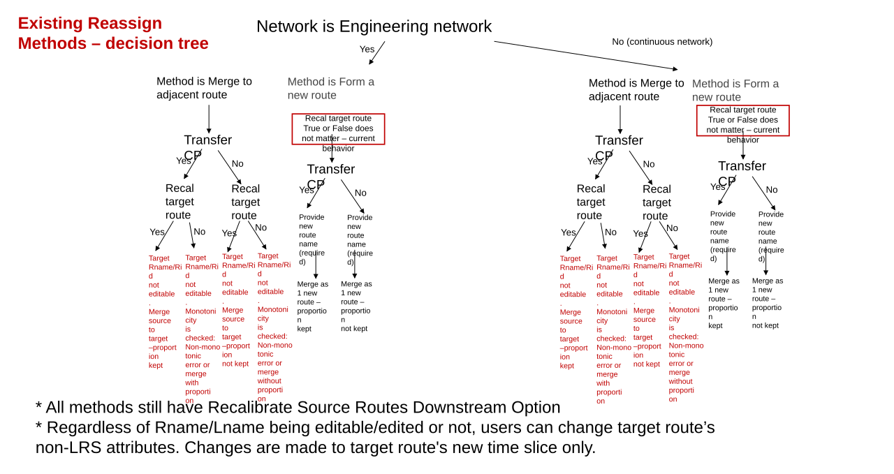

# Fix existing Reassign UI automations

| Field | Value |
| --- | --- |
| **Doc** | 582 · User Story · Pro |
| **Product** | — |
| **Release** | — |
| **Issues** | — |
| **Source** | [ReassignUI_fixUIautomation.pptx](<https://esriis.sharepoint.com/sites/LocationReferencing/Shared%20Documents/General/ReassignUI_fixUIautomation.pptx>) |
| **People** | author William Isley · PE — · dev — |
| **Edited** | 2023-04-05 23:25 by Claire Wang |
| **Extracted** | 2026-09-04 · lane xmlstrip · format 3.0 · prompt v2.0.2 |
| **Keywords** | reassign ui · reassign routes · ui automation · line network · non line network · merge routes · route recalibration |
| **Tools** | Reassign Routes |

## Summary

This user story addresses updating the Reassign UI to support a new Reassign method alongside four existing methods in the Reassign Routes tool. It focuses on fixing UI automations that break due to the UI update, ensuring continued functionality for both line and non-line network methods.

## Related documents

<!-- related:begin -->
- [Reassign UI Change to Dynamically Support Existing Reassign Methods - Pro](<https://esriis.sharepoint.com/sites/lrsworkspace/LRS%20Doc%20Index/User%20Stories/reassign-ui-change-to-dynamically-support-existing-reassign.md>) — similar text 0.57 · 2 title words · 1 filename word · same kind/surface/folder <!-- rel:586 s=5.752 -->
- [Fix Existing Automations for Reassign REST Signature Update](<https://esriis.sharepoint.com/sites/lrsworkspace/LRS%20Doc%20Index/User%20Stories/fix-existing-automations-for-reassign-rest-signature-update.md>) — similar text 0.31 · 4 title words · 1 filename word · same kind/folder <!-- rel:593 s=4.345 -->
- [Reassign to a New or Existing Line with Original Route ID/Name Maintained on the Target Line - REST](<https://esriis.sharepoint.com/sites/lrsworkspace/LRS%20Doc%20Index/User%20Stories/565-reassign-to-a-new-or-existing-line-with-original-route-id.md>) — similar text 0.52 · 2 title words · 1 filename word · same kind/folder <!-- rel:594 s=4.181 -->
- [Reassign to a new or existing line with original Route ID/Name maintained on the target line - REST](<https://esriis.sharepoint.com/sites/lrsworkspace/LRS%20Doc%20Index/User%20Stories/reassign-to-a-new-or-existing-line-with-original-route-id.md>) — similar text 0.47 · 2 title words · 1 filename word · same kind/folder <!-- rel:607 s=4.052 -->
- [Pro AI Assistant Reassign Route User Story](<https://esriis.sharepoint.com/sites/lrsworkspace/LRS%20Doc%20Index/User%20Stories/pro-ai-assistant-reassign-route.md>) — similar text 0.13 · 1 title word · 1 filename word · same kind/surface/folder <!-- rel:100 s=3.882 -->
<!-- related:end -->

<!-- docs:begin -->
## Esri documentation

[Reassign routes](https://doc.esri.com/en/arcgis-pro/latest/help/production/roads-highways/reassign-routes.html) · [Route reassignment](https://doc.esri.com/en/arcgis-pro/latest/help/production/location-referencing-pipelines/reassign-routes.html) · [Merge to adjacent route method](https://doc.esri.com/en/arcgis-pro/latest/help/production/location-referencing-pipelines/merge-to-adjacent-route-method.html)
<!-- docs:end -->

---

## Story
### Fix existing Reassign UI automations <!-- slide 1 -->
User Story

### User Story <!-- slide 2 -->
As a new Reassign method is needed in Reassign Routes tool, team has decided to update Reassign UI to efficiently support all Reassign methods (4 existing methods and 1 new methods). As changes take place, UI automations on existing Reassign methods will fail.
This user story is to make sure existing Reassign UI automations are fixed after UI update is done.

## Acceptance Criteria
### Automation : Fixing existing UI automation due to Reassign UI update <!-- slide 3 -->
- For the 4 existing methods (2 for Line network; 2 for non-line network), fix any UI automation that is expected to break per the UI changes. Create issues when needed. Do not need to show Route Eyedropper.

### Existing Reassign Methods – decision tree <!-- slide 4 -->
Network is Engineering network
Method is Merge to adjacent route
Method is Form a new route
Method is Merge to adjacent route
Method is Form a new route
Target Rname/Rid not editable. Merge source to target –proportion kept

Target Rname/Rid not editable. Monotonicity is checked: Non-monotonic error or merge with proportion

Target Rname/Rid not editable. Merge source to target –proportion not kept

Target Rname/Rid not editable. Monotonicity is checked: Non-monotonic error or merge without proportion

Provide new route name (required)
Provide new route name (required)
Merge as 1 new route – proportion kept
Merge as 1 new route – proportion not kept
Recal target route True or False does not matter – current behavior
Target Rname/Rid not editable. Merge source to target –proportion kept

Target Rname/Rid not editable. Monotonicity is checked: Non-monotonic error or merge with proportion

Target Rname/Rid not editable. Merge source to target –proportion not kept

Target Rname/Rid not editable. Monotonicity is checked: Non-monotonic error or merge without proportion

Provide new route name (required)
Provide new route name (required)
Merge as 1 new route – proportion kept
Merge as 1 new route – proportion not kept
- All methods still have Recalibrate Source Routes Downstream Option
- Regardless of Rname/Lname being editable/edited or not, users can change target route’s non-LRS attributes. Changes are made to target route's new time slice only.
Recal target route True or False does not matter – current behavior

[figure: Yes · No (continuous network) · Transfer CP · No · Recal target route]

## Testing
<!-- slide 5 -->
- N/A

## Documentation
<!-- slide 6 -->
N/A – doc updating is covered in a separate user story

## Assignment
<!-- slide 7 -->
Story Points:
Dev: N/A
PE:
