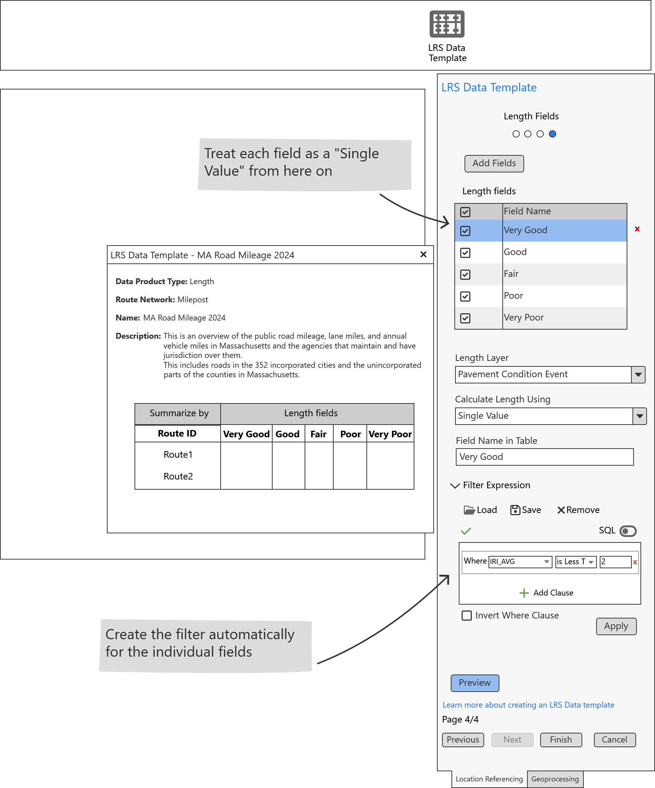
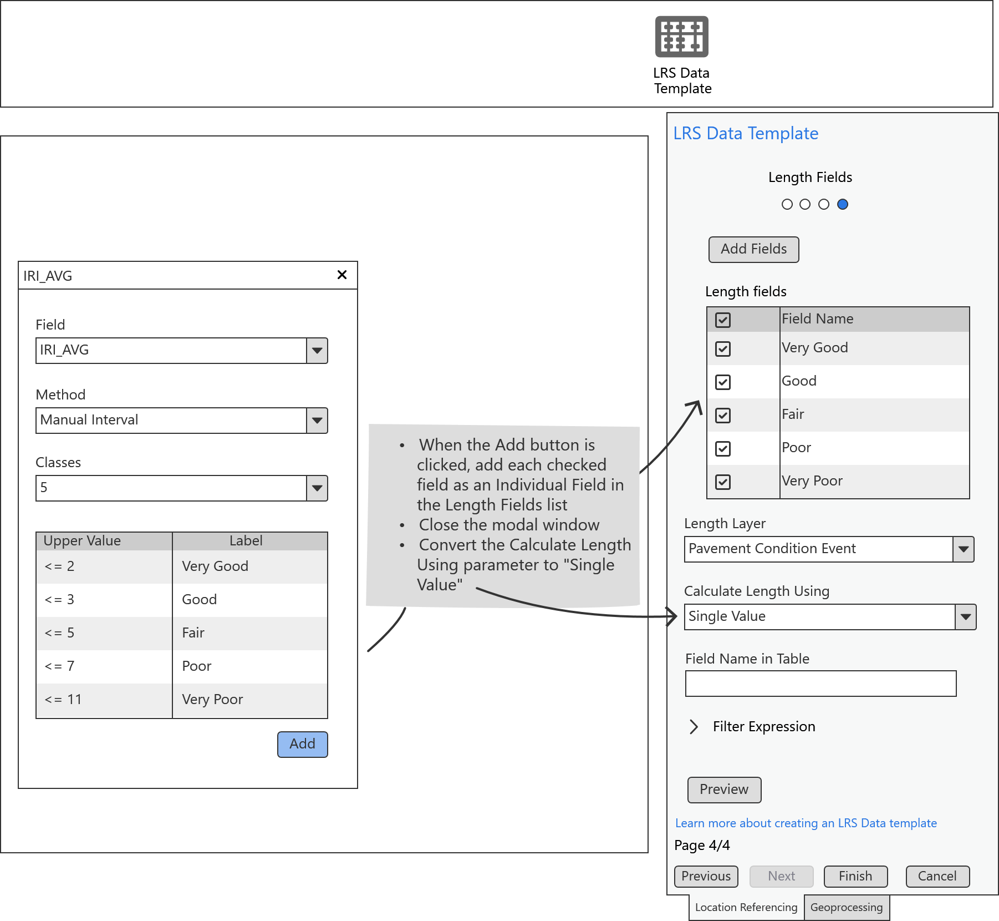

# User Story for LRS Data Product Template with Length Range Values

| Field | Value |
| --- | --- |
| **Doc** | 343 · User Story · Pro |
| **Product** | — |
| **Release** | — |
| **Issues** | — |
| **Source** | [Report_Canvas7_Length_RangeValues.pptx](<https://esriis.sharepoint.com/sites/LocationReferencing/Shared%20Documents/General/Report_Canvas7_Length_RangeValues.pptx>) |
| **People** | author Rahul Rakshit · PE — · dev — |
| **Edited** | 2024-07-31 22:40 by Rahul Rakshit |
| **Extracted** | 2026-09-04 · lane xmlstrip · format 3.0 · prompt v2.0.2 |
| **Keywords** | length fields · range values · data template · lrs data product · json · workflow |
| **Tools** | Generate LRS Data Product |

## Summary

This document describes a user story for GIS Analysts to create a reusable LRS data product template that supports adding multiple length fields using range values. It outlines the workflow for using the LRS Data Template wizard, including UI interactions and constraints such as a maximum of 20 range values per field. The document also mentions testing for theme and accessibility compliance, documentation, and automation considerations.

## Related documents

<!-- related:begin -->
- [User Story for LRS Data Product Template with Multiple Length Fields](<https://esriis.sharepoint.com/sites/lrsworkspace/LRS%20Doc%20Index/User%20Stories/for-lrs-data-product-template-with-multiple-length-fields.md>) — similar text 0.60 · 2 title words · 4 filename words · same kind/surface/folder <!-- rel:342 s=7.584 -->
- [LR Data Products: Support multiple summary fields](<https://esriis.sharepoint.com/sites/lrsworkspace/LRS Doc Index/User Stories/lr-data-products-support-multiple-summary-fields.md>) — similar text 0.53 · 2 filename words · same kind/surface/folder <!-- rel:356 s=4.959 -->
- [Generate LRS Data Product Support Summary and Length](<https://esriis.sharepoint.com/sites/lrsworkspace/LRS%20Doc%20Index/User%20Stories/generate-lrs-data-product-support-summary-and-length.md>) — similar text 0.32 · 2 title words · 1 filename word · same kind/surface/folder <!-- rel:357 s=4.404 -->
- [LR Reporting Canvas Experience User Story](<https://esriis.sharepoint.com/sites/lrsworkspace/LRS%20Doc%20Index/User%20Stories/5797-lr-reporting-canvas-experience.md>) — similar text 0.40 · 2 filename words · same kind/surface/folder <!-- rel:367 s=4.007 -->
- [LR Reporting: Create a template tool User Story](<https://esriis.sharepoint.com/sites/lrsworkspace/LRS Doc Index/User Stories/lr-reporting-create-a-template-tool.md>) — similar text 0.46 · 1 filename word · same kind/surface/folder <!-- rel:374 s=3.737 -->
<!-- related:end -->

<!-- docs:begin -->
## Esri documentation

[Create a template for an LRS length data product](https://doc.esri.com/en/arcgis-pro/latest/help/production/roads-highways/create-a-template-for-an-lrs-length-data-product.html) · [LRS data products](https://doc.esri.com/en/arcgis-pro/latest/help/production/roads-highways/lrs-data-products.html)

_No page matched:_ [Generate LRS Data Product](https://www.google.com/search?q=%22Generate%20LRS%20Data%20Product%22+site%3Adoc.esri.com)
<!-- docs:end -->

---

## Story
### LR Data Products: Support length fields using range values <!-- slide 1 -->
User Story
As a GIS Analyst, I need the ability to create a reusable LRS data product template that can be used by the Generate LRS Data Product geoprocessing tool. It’d be very helpful if I can add multiple length fields (using range values) to the template using a single operation.
Persona
GIS Analyst: These users know how to work with ArcGIS Pro. They will design a reusable data template based on an existing paper or digital report. Their duty will be to ensure that the Data Product’s constituents closely mirror those of its predecessors.
They may also create a new templates as needed by their agency.
Workflow

- The user opens the LRS Data Template wizard
- The LRS Data Template pane opens in the right
- The type of data product is selected
- The name, network and description are provided
- A  summary field is chosen
- Length fields are chosen

style.visibilitystyle.visibility

### User Story <!-- slide 3 -->

### User Story <!-- slide 4 -->

### User Story <!-- slide 6 -->
- Save the info on each length field in the Json file upon clicking the Finish button.
- Do not allow more than 20 range values in the list. In case more than 20 unique values exist, provide a message “This field exceeds the limit of 20 range values. Only 20 range values will be used.”

## Acceptance Criteria
### User Story: Details <!-- slide 2 -->
Note: These symbols        are only for explaining the workflow. Do not create them in the UI.
Workflow

- Click on the add fields button

This is how the pane looks upon first run.

### User Story: Workflow Details <!-- slide 5 -->

<!-- slide 7 -->
Testing

- Test with dark and light theme
- 508 and i18n compliance
- Test with different type of length layers such as line events and networks.

<!-- slide 8 -->
Documentation

<!-- slide 9 -->
Automation

<!-- slide 10 -->
Estimate
