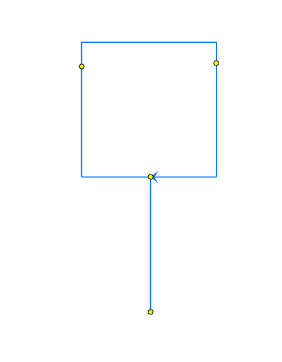

# Generate Intersection at Self-Intersecting Routes

|   |   |
| --- | --- |
| **Kind** | User Story · Pro |
| **Release** | — |
| **Product** | Roads & Highways · Pipeline Referencing · Utility Network |
| **Source** | [GenerateIntersectionsatselfintersectingRoutes.pptx](<https://esriis.sharepoint.com/sites/LocationReferencing/Shared%20Documents/General/GenerateIntersectionsatselfintersectingRoutes.pptx>) |
| **Edited** | 2023-09-01 16:36 by Lakshmi Ananthanarayanan |
| **Extracted** | 2026-09-04 · lane `xmlstrip` |

<!-- metadata
```yaml
title: "Generate Intersection at Self-Intersecting Routes"
source_file: "GenerateIntersectionsatselfintersectingRoutes.pptx"
source_url: "https://esriis.sharepoint.com/sites/LocationReferencing/Shared%20Documents/General/GenerateIntersectionsatselfintersectingRoutes.pptx"
doc_id: 509
doc_kind: "User Story"
surface: "Pro"
doc_revision: ""
target_release: ""
pe: ""
dev: ""
author: "Lakshmi Ananthanarayanan"
last_edited_by: "Lakshmi Ananthanarayanan"
last_edited: "2023-09-01T16:36:06Z"
extracted: 2026-09-04
extraction_lane: xmlstrip
prompt_version: "v2.0.2"
keywords: ["intersection", "self intersecting route", "route editing", "generate intersection tool", "cartographic realign", "measure", "conflict prevention"]
tools: ["Generate Intersection"]
products: ["Roads & Highways", "Pipeline Referencing", "Utility Network"]
issues: []
related: [{"doc":163,"file":"allow-lrs-intersections-to-be-updated-without-locking-intersecting-routes__doc163.md","s":4.16},{"doc":267,"file":"generate-intersections-at-route-endpoints__doc267.md","s":4.055},{"doc":849,"file":"support-complex-route-shapes-in-generate-routes__doc849.md","s":4.011},{"doc":834,"file":"generate-lrs-intersection-gp-tool__doc834.md","s":3.755},{"doc":155,"file":"allow-lrs-intersections-to-be-updated-without-locking-intersecting-routes-test__doc155.md","s":3.272}]
```
-->

## Summary

This document describes a user story for enhancing the generate intersection tool to create intersection points at locations where a route self-intersects in the LRS. It covers the behavior of intersection creation, updating, and retirement based on route edits and cartographic realignments. Testing scenarios include various database types, route shapes, conflict prevention, and measure calculations.

## Related documents

<!-- related:begin -->
- [Allow LRS Intersections to be updated without locking intersecting routes](<https://esriis.sharepoint.com/sites/lrsworkspace/LRS Doc Index/User Stories/allow-lrs-intersections-to-be-updated-without-locking-intersecting-routes__doc163.md>) — similar text 0.23 · 2 title words · 1 filename word · same kind/surface/folder <!-- rel:163 -->
- [Generate Intersections at Route Endpoints](<https://esriis.sharepoint.com/sites/lrsworkspace/LRS Doc Index/User Stories/generate-intersections-at-route-endpoints__doc267.md>) — similar text 0.24 · 1 title word · 1 filename word · same kind/surface/folder <!-- rel:267 -->
- [Support Complex Route Shapes in Generate Routes](<https://esriis.sharepoint.com/sites/lrsworkspace/LRS Doc Index/User Stories/support-complex-route-shapes-in-generate-routes__doc849.md>) — similar text 0.24 · 2 title words · 2 filename words · same kind/surface/folder <!-- rel:849 -->
- [Generate LRS Intersection GP Tool](<https://esriis.sharepoint.com/sites/lrsworkspace/LRS Doc Index/Other/generate-lrs-intersection-gp-tool__doc834.md>) — similar text 0.23 · 2 title words · 1 filename word · same surface/folder <!-- rel:834 -->
- [Allow LRS Intersections to be updated without locking intersecting routes - Test Plan](<https://esriis.sharepoint.com/sites/lrsworkspace/LRS Doc Index/Test Plans/allow-lrs-intersections-to-be-updated-without-locking-intersecting-routes-test__doc155.md>) — similar text 0.30 · 2 title words · 1 filename word · same surface <!-- rel:155 -->
<!-- related:end -->

<!-- docs:begin -->
## Esri documentation

[View LRS intersection properties](https://doc.esri.com/en/arcgis-pro/latest/help/production/roads-highways/view-lrs-intersection-properties.html) · [Apply cartographic realignment](https://doc.esri.com/en/arcgis-pro/latest/help/production/roads-highways/apply-cartographic-realignment.html) · [Split a centerline by measure](https://doc.esri.com/en/arcgis-pro/latest/help/production/roads-highways/split-a-centerline-by-measure.html) · [Conflict prevention](https://doc.esri.com/en/arcgis-pro/latest/help/production/roads-highways/conflict-prevention.html)

_No page matched:_ [Generate Intersection](https://www.google.com/search?q=%22Generate%20Intersection%22+site%3Adoc.esri.com)
<!-- docs:end -->

---

## Slide 1 — Generate Intersection at self closing routes

User Story

## Slide 2

User Story
As an LRS editor, I want to generate intersection points at the location where a route self closes.
This is a request from local government customers.
Persona
LRS Editor: This user is responsible for making edits to the LRS.
In Pro, Currently we do not support generation of intersections at the self intersecting location on the routes. We need to enhance the generate intersection tool to generate intersection points at these self intersecting locations.

## Slide 3

Generate Intersection at the self intersecting location of a route

If the intersection layer is same as the parent LRS network for an intersection feature class, then generate intersection GP tool should generate intersection at the self intersecting locations of the route.
Since there will be more than one measure value at the intersection, the measure column can have any one of the value.
When updating the intersection

- If a self intersecting route is created due to edit activities, new intersection will be created.
- If the route do not self intersect anymore due to an edit activity, then the intersection is retired.
- If the self intersecting point moves due to cartographic realign, present intersection will be moved
- If the route is deleted or do not intersect anymore due to carto realign, then the intersection point is deleted

[figure: R1 · 0 · 3.6 · 2.3 · 1 · 5]



## Slide 4

Testing

Database Type

Test in  Fgdb, direct connect, Branch Versioned FS – default and in a version
Test in RH ,APR,  UN and PoM data
Test with the intersection combination : Route –Route (Same Network)
Test with complex route shapes
Test with intersection creation and updating after route edit activities
Test with & without conflict prevention enabled. If conflict prevention is enabled, then lock should be acquired for the route on which intersection is generated
While creating the LRS intersection feature class, if the option Z values are considered for intersection is checked or unchecked accordingly  self intersection is decided and intersection is generated. Have test cases to cover this scenario.
If the Only Create Intersections for Routes Edited by Me in the Current Version option is checked, while generating intersections, it should be honored
Run the GP tool Calculate Intersecting Route Measures for related Table with all intersecting route measures and verify records are created for all the valid measures on the self intersecting location of the route.

## Slide 5

Documentation

Database Type

Modify already existing usage note related to this user story as
“Intersections are generated at the self intersecting locations of the route”
Automation
To the automation of generate intersection GP tool add couple of  cases for self intersecting route scenario

## Slide 6

Assignment

Story Points:
Dev:
PE:
