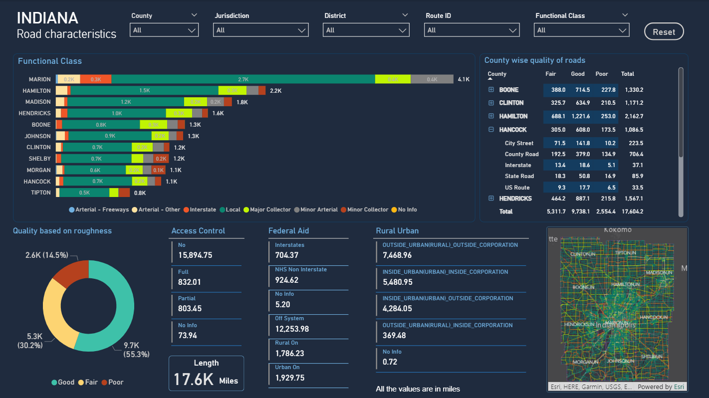
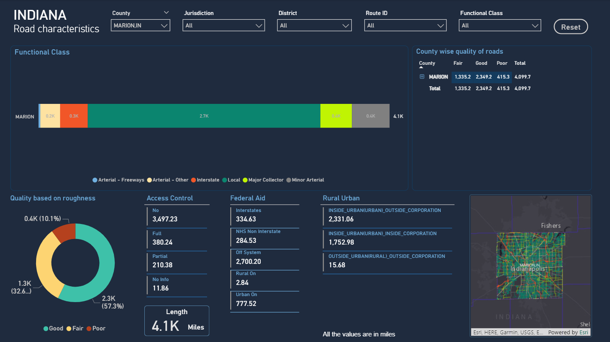
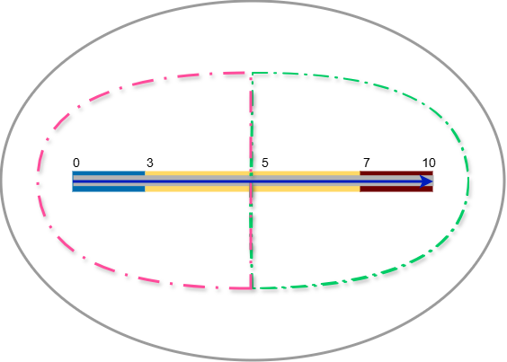
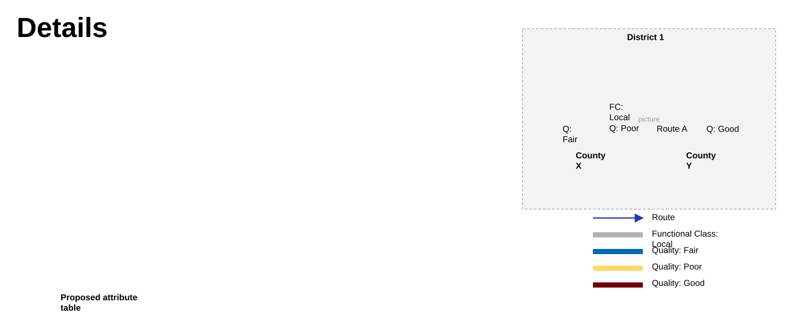
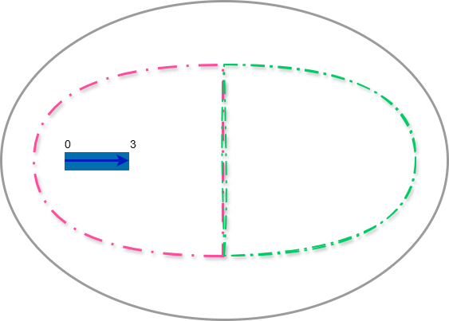

# Generate LRS Data Product and Linear Referenced Length Summary Enhancement

| Field | Value |
| --- | --- |
| **Doc** | 107 · User Story · Pro |
| **Product** | Roads & Highways · Pipeline Referencing · Utility Network |
| **Release** | — |
| **Issues** | — |
| **Source** | [GLRSDP_GP_Support_Features.pptx](<https://esriis.sharepoint.com/sites/LocationReferencing/Shared%20Documents/General/GLRSDP_GP_Support_Features.pptx>) |
| **People** | author Rahul Rakshit · PE GIS Analyst · dev — |
| **Edited** | 2025-11-14 20:04 by Rahul Rakshit |
| **Extracted** | 2026-09-04 · lane xmlstrip · format 3.0 · prompt v2.0.2 |
| **Keywords** | length data product · feature class output · geodatabase · geoprocessing tools · gis analyst · arcgis dashboards · power bi |
| **Tools** | Generate LRS Data Product · Generate Linear Referenced Length Summary |

## Summary

This document describes a user story to enhance the Generate LRS Data Product and Generate Linear Referenced Length Summary geoprocessing tools by adding an optional output of the Length Data Product as a geodatabase feature class. The feature class output supports geometry display in ArcGIS Dashboards and Power BI. It includes details on new parameters, expected behavior, testing, documentation, and automation updates.

## Related documents

<!-- related:begin -->
- [Length Data Product Support Features Enhancement](<https://esriis.sharepoint.com/sites/lrsworkspace/LRS Doc Index/User Stories/length-data-product-support-features-enhancement.md>) — similar text 0.73 · 3 title words · 2 filename words · same kind/surface/folder <!-- rel:47 s=7.703 -->
- [Generate LRS Data Product Support Summary and Length](<https://esriis.sharepoint.com/sites/lrsworkspace/LRS%20Doc%20Index/User%20Stories/generate-lrs-data-product-support-summary-and-length.md>) — similar text 0.14 · 4 title words · 1 filename word · same kind/surface/pe/folder <!-- rel:357 s=5.75 -->
- [User Story: Support Multiple Summary Fields in Generate LRS Data Product](<https://esriis.sharepoint.com/sites/lrsworkspace/LRS Doc Index/User Stories/support-multiple-summary-fields-in-generate-lrs-data-product.md>) — similar text 0.16 · 3 title words · 1 filename word · same kind/surface/folder <!-- rel:353 s=4.667 -->
- [Generate LRS Data Product GP Tool: Support Database Tables](<https://esriis.sharepoint.com/sites/lrsworkspace/LRS Doc Index/User Stories/generate-lrs-data-product-gp-support-database-tables.md>) — similar text 0.19 · 2 title words · 2 filename words · same kind/surface/folder <!-- rel:238 s=4.54 -->
- [LR Data Products: Support multiple summary fields](<https://esriis.sharepoint.com/sites/lrsworkspace/LRS Doc Index/User Stories/lr-data-products-support-multiple-summary-fields.md>) — similar text 0.19 · 1 title word · same kind/surface/pe/folder <!-- rel:356 s=4.191 -->
<!-- related:end -->

<!-- docs:begin -->
## Esri documentation

[Create a template for an LRS length data product](https://doc.esri.com/en/arcgis-pro/latest/help/production/roads-highways/create-a-template-for-an-lrs-length-data-product.html)

_No page matched:_ [Generate LRS Data Product](https://www.google.com/search?q=%22Generate%20LRS%20Data%20Product%22+site%3Adoc.esri.com) · [Generate Linear Referenced Length Summary](https://www.google.com/search?q=%22Generate%20Linear%20Referenced%20Length%20Summary%22+site%3Adoc.esri.com)
<!-- docs:end -->

---

## Slide 1 — Data Product GP tools: Support geometry output

User Story
The Generate LRS Data Product and the Generate Linear Referenced Length Summary GP tools currently output a  table for the Length Data Product.
Requested Enhancement:
Add an optional capability to output the Length Data Product as a geodatabase feature class. A feature class is needed to display geometry in ArcGIS Dashboards and Power BI.
Capability requested by:

- Users of Roadway Reporter
- Feature request during GIS-T
- Esri-Canada
- Esri solution Engineers
Persona
GIS Analyst: These users know how to work with ArcGIS Pro. They provide the data product outputs in form of a report or a table as asked by their stakeholders.
style.visibility

## Slide 2

## Slide 3

## Slide 4

| Template | Summary Fields |  | Length Fields |  |  |  |  |  |  |
| --- | --- | --- | --- | --- | --- | --- | --- | --- | --- |
|  | District | County | Local | Interstate | Arterial | Collector | Good Quality | Fair Quality | Poor Quality |
|  | District1 | County X |  |  |  |  |  |  |  |
|  |  | County Y |  |  |  |  |  |  |  |

| Table Output | District | County | Local | Interstate | Arterial | Collector | Good Quality | Fair Quality | Poor Quality |
| --- | --- | --- | --- | --- | --- | --- | --- | --- | --- |
|  | District 1 | County X | 5 |  |  |  |  | 3 | 2 |
|  | District 1 | County Y | 5 |  |  |  | 3 |  | 2 |

| Feature Class Output | Object ID | Route ID | Date | District | County | Functional Class | Quality | Length | Shape Length | Shape |
| --- | --- | --- | --- | --- | --- | --- | --- | --- | --- | --- |
|  | 1 | Route A | 12/31/2024 | District 1 | County X | Local | Fair | 3 | 15840 | Polyline |
|  | 2 | Route A | 12/31/2024 | District 1 | County X | Local | Poor | 2 | 10560 | Polyline |
|  | 3 | Route A | 12/31/2024 | District 1 | County Y | Local | Poor | 2 | 10560 | Polyline |
|  | 4 | Route A | 12/31/2024 | District 1 | County Y | Local | Good | 3 | 15840 | Polyline |

[figure: District 1 · County X · County Y · Route A · FC: Local · Q: Fair · Q: Poor · Q: Good · Proposed attribute table · Details · Route · Functional Class: Local · Quality: Fair · Quality: Poor · Quality: Good]

## Slide 5 — Applying Slicers - 1

| Feature Class Output | Object ID | Route ID | Date | District | County | Functional Class | Quality | Length | Shape Length | Shape |
| --- | --- | --- | --- | --- | --- | --- | --- | --- | --- | --- |
|  | 1 | Route A | 12/31/2024 | District 1 | County X | Local | Fair | 3 | 15840 | Polyline |
|  | 2 | Route A | 12/31/2024 | District 1 | County X | Local | Poor | 2 | 10560 | Polyline |
|  | 3 | Route A | 12/31/2024 | District 1 | County Y | Local | Poor | 2 | 10560 | Polyline |
|  | 4 | Route A | 12/31/2024 | District 1 | County Y | Local | Good | 3 | 15840 | Polyline |

| Filtered | Object ID | Route ID | Date | District | County | Functional Class | Quality | Length | Shape Length | Shape |
| --- | --- | --- | --- | --- | --- | --- | --- | --- | --- | --- |
|  | 1 | Route A | 12/31/2024 | District 1 | County X | Local | Fair | 3 | 15840 | Polyline |
|  | 2 | Route A | 12/31/2024 | District 1 | County X | Local | Poor | 2 | 10560 | Polyline |

[figure: District 1 · County X · County Y · Route A · FC: Local · Q: Fair · Q: Poor · Q: Good · Slicers]

## Slide 6 — Applying Slicers - 2

| Feature Class Output | Object ID | Route ID | Date | District | County | Functional Class | Quality | Length | Shape Length | Shape |
| --- | --- | --- | --- | --- | --- | --- | --- | --- | --- | --- |
|  | 1 | Route A | 12/31/2024 | District 1 | County X | Local | Fair | 3 | 15840 | Polyline |
|  | 2 | Route A | 12/31/2024 | District 1 | County X | Local | Poor | 2 | 10560 | Polyline |
|  | 3 | Route A | 12/31/2024 | District 1 | County Y | Local | Poor | 2 | 10560 | Polyline |
|  | 4 | Route A | 12/31/2024 | District 1 | County Y | Local | Good | 3 | 15840 | Polyline |

| Filtered | Object ID | Route ID | Date | District | County | Functional Class | Quality | Length | Shape Length | Shape |
| --- | --- | --- | --- | --- | --- | --- | --- | --- | --- | --- |
|  | 1 | Route A | 12/31/2024 | District 1 | County X | Local | Fair | 3 | 15840 | Polyline |

[figure: District 1 · County X · County Y · Route A · FC: Local · Q: Fair · Q: Poor · Q: Good · Slicers]

## Slide 7

| Template | Summary Fields |  | Length Fields |  |  |  |
| --- | --- | --- | --- | --- | --- | --- |
|  | District | County | Local | Good Quality | Fair Quality | Poor Quality |
|  | District1 | County X |  |  |  |  |
|  |  | County Y |  |  |  |  |

| Table Output | District | County | Local_ 12312010 | Local_ 123120205 | Change_ Local 12312010_ 123120205 | Good Quality_ 12312010 | Good Quality_ 123120205 | Change_Good Quality_ 12312010_ 123120205 | Fair Quality_ 12312010 | Fair Quality_ 123120205 | Change_ Fair Quality_ 12312010_ 123120205 | Poor Quality_ 12312010 | Poor Quality_ 123120205 | Change_ Poor Quality_ 12312010_ 123120205 |
| --- | --- | --- | --- | --- | --- | --- | --- | --- | --- | --- | --- | --- | --- | --- |
|  | District 1 | County X | 5 | 5 | 0 | 0 | 3.5 | 3.5 | 3 | 1 | -2 | 2 | 0.5 | -1.5 |
|  | District 1 | County Y | 5 | 5 | 0 | 3 | 5 | 2 | 0 | 0 | 0 | 2 | 0 | -2 |

| Feature Class Output | Object ID | Route ID | Date | District | County | Functional Class | Quality | Length | Shape Length | Shape |
| --- | --- | --- | --- | --- | --- | --- | --- | --- | --- | --- |
|  | 1 | Route A | 12/31/2010 | District 1 | County X | Local | Fair | 3 | 15840 | Polyline |
|  | 2 | Route A | 12/31/2025 | District 1 | County X | Local | Fair | 1 | 5280 | Polyline |
|  | 3 | Route A | 12/31/2010 | District 1 | County X | Local | Poor | 2 | 10560 | Polyline |
|  | 4 | Route A | 12/31/2025 | District 1 | County X | Local | Good | 3 | 15840 | Polyline |
|  | 5 | Route A | 12/31/2025 | District 1 | County X | Local | Poor | 0.5 | 2640 | Polyline |
|  | 6 | Route A | 12/31/2025 | District 1 | County X | Local | Good | 0.5 | 2640 | Polyline |
|  | 7 | Route A | 12/31/2010 | District 1 | County Y | Local | Poor | 2 | 10560 | Polyline |
|  | 8 | Route A | 12/31/2010 | District 1 | County Y | Local | Good | 3 | 15840 | Polyline |
|  | 9 | Route A | 12/31/2025 | District 1 | County X | Local | Good | 5 | 26400 | Polyline |

[figure: District 1 · County X · County Y · Route A · FC: Local · Q: Fair · Q: Poor · Q: Good · 12/31/2010 · 12/31/2025 · Multiple Dates]

## Slide 8

| Feature Class Output | Object ID | Route ID | Date | District | County | Functional Class | Quality | Length | Shape Length | Shape |
| --- | --- | --- | --- | --- | --- | --- | --- | --- | --- | --- |
|  | 1 | Route A | 12/31/2010 | District 1 | County X | Local | Fair | 3 | 15840 | Polyline |
|  | 2 | Route A | 12/31/2025 | District 1 | County X | Local | Fair | 1 | 5280 | Polyline |
|  | 3 | Route A | 12/31/2010 | District 1 | County X | Local | Poor | 2 | 10560 | Polyline |
|  | 4 | Route A | 12/31/2025 | District 1 | County X | Local | Good | 3 | 15840 | Polyline |
|  | 5 | Route A | 12/31/2025 | District 1 | County X | Local | Poor | 0.5 | 2640 | Polyline |
|  | 6 | Route A | 12/31/2025 | District 1 | County X | Local | Good | 0.5 | 2640 | Polyline |
|  | 7 | Route A | 12/31/2010 | District 1 | County Y | Local | Poor | 2 | 10560 | Polyline |
|  | 8 | Route A | 12/31/2010 | District 1 | County Y | Local | Good | 3 | 15840 | Polyline |
|  | 9 | Route A | 12/31/2025 | District 1 | County X | Local | Good | 5 | 26400 | Polyline |

| Filtered | Object ID | Route ID | Date | District | County | Functional Class | Quality | Length | Shape Length | Shape |
| --- | --- | --- | --- | --- | --- | --- | --- | --- | --- | --- |
|  | 2 | Route A | 12/31/2025 | District 1 | County X | Local | Fair | 1 | 5280 | Polyline |
|  | 4 | Route A | 12/31/2025 | District 1 | County X | Local | Good | 3 | 15840 | Polyline |
|  | 5 | Route A | 12/31/2025 | District 1 | County X | Local | Poor | 0.5 | 2640 | Polyline |
|  | 6 | Route A | 12/31/2025 | District 1 | County X | Local | Good | 0.5 | 2640 | Polyline |
|  | 9 | Route A | 12/31/2025 | District 1 | County X | Local | Good | 5 | 26400 | Polyline |

[figure: District 1 · County X · County Y · Route A · FC: Local · Q: Fair · Q: Poor · Q: Good · 12/31/2025 · Applying Slicers -3 · Slicers]

## Slide 9 — User Story

Add two new parameters in these two GP tools:

- Generate LRS Data Product
- Generate Linear Referenced Length Summary:
- Checkbox: Include Geometry
  - Appears only when a Length Template is used in the Generate LRS Data Product GP tool
  - Always appears in the Generate Linear Referenced Length Summary GP tool
- Output Dataset: Combo box to locate and name the feature class
  - Displays only when the Include Geometry option is checked/hidden when unchecked
  - The output type is a polyline feature class without z and m values
  - Use the field properties of the input layers for the fields in the output feature class
- The output contains the geometry and attribute table as shown in the previous slides
- If Include Geometry is checked and Output Dataset is not provided, an error is thrown.
- If Exclude Null Summary Rows is unchecked and Include Geometry is checked, do not include any rows with zero shape length in the feature class output.

## Slide 10

Testing

- Make sure that the table and FC mileages match
- Test with/without summary fields
- Test with multiple summary fields
- Test with a combination of polygon and line summary fields
- Test with multiple dates
- Data Type: RH, APR-UN, Addressing, PostMile
- Database Connection: Direct Connect and Feature Service
- Database Type: FGDB, Oracle and SQL
- Test that the output works with Power BI, Microsoft Fabric and ArcGIS Dashboards

## Slide 11

Documentation

- Add to the documentation of the existing GP tools where the enhancement has been made.
- Add a note : Do not expect the formatting of the FC attribute table to match that of the CSV or database table, although they show the same numbers.

## Slide 12

Automation

- Add to existing automation (may have to update the existing scripts)

## Slide 13

Estimate

- Dev
- Testing
