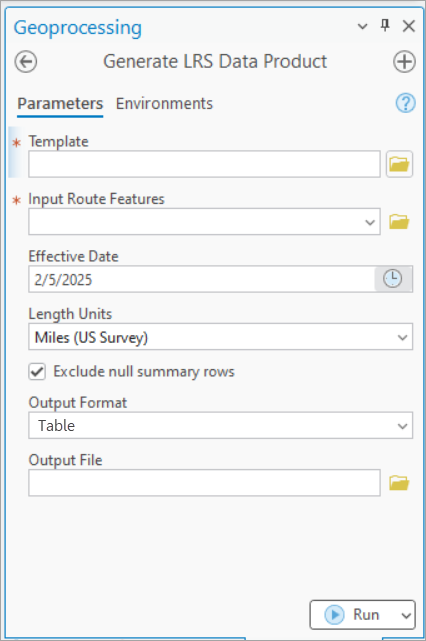

# Generate LRS Data Product GP Tool: Support Database Tables

|   |   |
| --- | --- |
| **Kind** | User Story · Pro |
| **Release** | — |
| **Source** | [GLRSDP_GP_Support_DatabaseTables.pptx](<https://esriis.sharepoint.com/sites/LocationReferencing/Shared%20Documents/General/GLRSDP_GP_Support_DatabaseTables.pptx>) |
| **Edited** | 2025-02-05 21:15 by Rahul Rakshit |
| **Extracted** | 2026-09-04 · lane `xmlstrip` |

<!-- metadata
```yaml
title: "Generate LRS Data Product GP Tool: Support Database Tables"
source_file: "GLRSDP_GP_Support_DatabaseTables.pptx"
source_url: "https://esriis.sharepoint.com/sites/LocationReferencing/Shared%20Documents/General/GLRSDP_GP_Support_DatabaseTables.pptx"
doc_id: 238
doc_kind: "User Story"
surface: "Pro"
doc_revision: ""
target_release: ""
pe: ""
dev: ""
author: "Rahul Rakshit"
last_edited_by: "Rahul Rakshit"
last_edited: "2025-02-05T21:15:41Z"
extracted: 2026-09-04
extraction_lane: xmlstrip
prompt_version: "v2.0.2"
keywords: ["generate lrs data product", "database table", "geoprocessing", "fgdb", "egdb", "oracle", "sql server"]
tools: ["Generate LRS Data Product"]
products: []
issues: []
related: [{"doc":107,"file":"generate-lrs-data-product-and-linear-referenced-length-summary-enhancement__doc107.md","s":4.54},{"doc":357,"file":"generate-lrs-data-product-support-summary-and-length__doc357.md","s":4.069},{"doc":353,"file":"user-story-support-multiple-summary-fields-in-generate-lrs-data-product__doc353.md","s":4.025},{"doc":356,"file":"lr-data-products-support-multiple-summary-fields__doc356.md","s":2.976},{"doc":881,"file":"create-lrs-intersection-from-existing-feature-class-geoprocessing-tool__doc881.md","s":2.946}]
```
-->

## Summary

This document describes the user story for enhancing the Generate LRS Data Product geoprocessing tool to support output in the form of database tables in addition to CSV files. It includes personas, sample data requests, testing plans for various geodatabases, documentation, automation, and development estimates.

## Related documents

<!-- related:begin -->
- [Generate LRS Data Product and Linear Referenced Length Summary Enhancement](<https://esriis.sharepoint.com/sites/lrsworkspace/LRS Doc Index/User Stories/generate-lrs-data-product-and-linear-referenced-length-summary-enhancement__doc107.md>) — similar text 0.19 · 2 title words · 2 filename words · same kind/surface/folder <!-- rel:107 -->
- [Generate LRS Data Product Support Summary and Length](<https://esriis.sharepoint.com/sites/lrsworkspace/LRS%20Doc%20Index/User%20Stories/generate-lrs-data-product-support-summary-and-length__doc357.md>) — similar text 0.18 · 3 title words · 1 filename word · same kind/surface/folder <!-- rel:357 -->
- [User Story: Support Multiple Summary Fields in Generate LRS Data Product](<https://esriis.sharepoint.com/sites/lrsworkspace/LRS Doc Index/User Stories/user-story-support-multiple-summary-fields-in-generate-lrs-data-product__doc353.md>) — similar text 0.17 · 3 title words · 1 filename word · same kind/surface/folder <!-- rel:353 -->
- [LR Data Products: Support multiple summary fields](<https://esriis.sharepoint.com/sites/lrsworkspace/LRS Doc Index/User Stories/lr-data-products-support-multiple-summary-fields__doc356.md>) — similar text 0.16 · 1 title word · same kind/surface/folder <!-- rel:356 -->
- [Create LRS Intersection From Existing Feature Class Geoprocessing Tool](<https://esriis.sharepoint.com/sites/lrsworkspace/LRS Doc Index/User Stories/create-lrs-intersection-from-existing-feature-class-geoprocessing-tool__doc881.md>) — similar text 0.08 · 1 title word · same kind/surface/folder <!-- rel:881 -->
<!-- related:end -->

<!-- docs:begin -->
## Esri documentation

_No page matched:_ [Generate LRS Data Product](https://www.google.com/search?q=%22Generate%20LRS%20Data%20Product%22+site%3Adoc.esri.com)
<!-- docs:end -->

---

## Slide 1

User Story
The Generate LRS Data Product GP tool outputs CSV files as of now. Add the capability to output in the form of a database table.
Persona
GIS Analyst: These users know how to work with ArcGIS Pro. They provide the data product outputs in form of a report or a table as asked by their stakeholders.
Sample asks:

- Provide me county wise VMT
- Provide me lane miles for county X
- How many signals are present on route X
Generate LRS Data Product GP tool: Support Database Tables
style.visibility


## Slide 2

Existing GP tool supporting output as a database table


## Slide 3

Testing

- Test the output using FGDB, EGDB (Oracle and SQL Server)

## Slide 4

Documentation

## Slide 5

Automation

- Add to existing automation.

## Slide 6

Estimate

- D days dev
- D days testing
