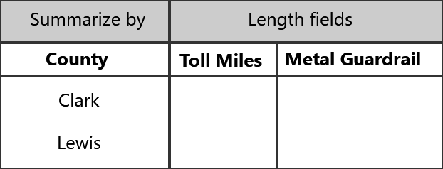
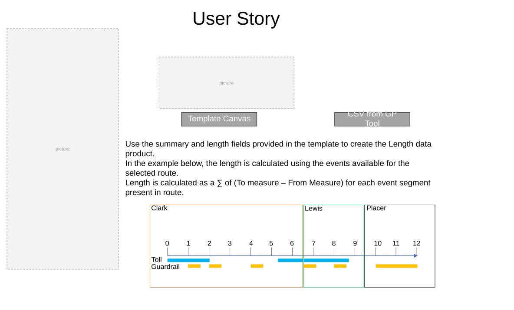
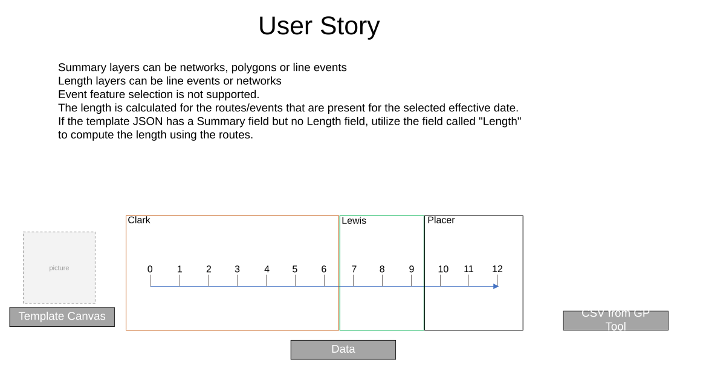
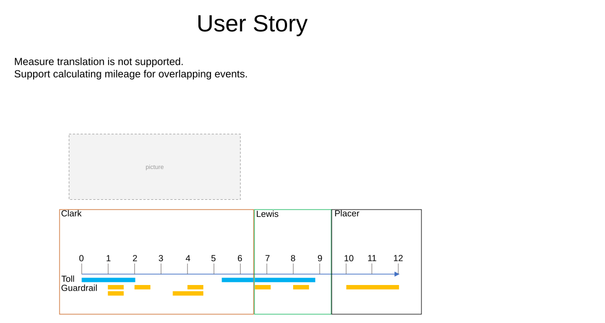

# Generate LRS Data Product Support Summary and Length

| Field | Value |
| --- | --- |
| **Doc** | 357 · User Story · Pro |
| **Product** | — |
| **Release** | — |
| **Issues** | — |
| **Source** | [GenerateLRDP_GP4_Support_Summary_Length_V2.pptx](<https://esriis.sharepoint.com/sites/LocationReferencing/Shared%20Documents/General/GenerateLRDP_GP4_Support_Summary_Length_V2.pptx>) · rev V2 |
| **People** | author Rahul Rakshit · PE GIS Analyst · dev — |
| **Edited** | 2024-07-02 21:36 by Rahul Rakshit |
| **Extracted** | 2026-09-04 · lane xmlstrip · format 3.0 · prompt v2.0.2 |
| **Keywords** | length data product · summary field · route · event · geoprocessing tool · template · length calculation |
| **Tools** | Generate LRS Data Product |

## Summary

This document describes user stories and requirements for using the Generate LRS Data Product geoprocessing tool with a reusable data template. It covers how summary and length fields in the template are used to calculate length data products, validation of inputs, and handling of overlapping and complex route events. Testing scenarios and automation notes are also included.

## Related documents

<!-- related:begin -->
- [User Story: Support Multiple Summary Fields in Generate LRS Data Product](<https://esriis.sharepoint.com/sites/lrsworkspace/LRS Doc Index/User Stories/support-multiple-summary-fields-in-generate-lrs-data-product.md>) — similar text 0.36 · 4 title words · 4 filename words · same kind/surface/folder <!-- rel:353 s=9.516 -->
- [LR Data Products: Support multiple summary fields](<https://esriis.sharepoint.com/sites/lrsworkspace/LRS Doc Index/User Stories/lr-data-products-support-multiple-summary-fields.md>) — similar text 0.32 · 2 title words · 1 filename word · same kind/surface/pe/folder <!-- rel:356 s=5.9 -->
- [Generate Length Summary (Location Referencing)](<https://esriis.sharepoint.com/sites/lrsworkspace/LRS Doc Index/Other/6748-generate-length-summary-lr.md>) — similar text 0.14 · 3 title words · 3 filename words · same surface <!-- rel:158 s=5.298 -->
- [Support table output with the length product template – Test Plan](<https://esriis.sharepoint.com/sites/lrsworkspace/LRS Doc Index/Test Plans/6458-support-table-output-with-the-length-product-template.md>) — similar text 0.20 · 3 title words · 1 filename word · same surface/folder <!-- rel:232 s=5.027 -->
- [Support multiple summary fields in Generate LRS Data Product – Test Plan](<https://esriis.sharepoint.com/sites/lrsworkspace/LRS Doc Index/Test Plans/5773-support-multiple-summary-fields-in-generate-lrs-data-product.md>) — similar text 0.16 · 4 title words · 1 filename word · same surface <!-- rel:321 s=4.834 -->
<!-- related:end -->

<!-- docs:begin -->
## Esri documentation

[Create a template for an LRS length data product](https://doc.esri.com/en/arcgis-pro/latest/help/production/roads-highways/create-a-template-for-an-lrs-length-data-product.html)

_No page matched:_ [Generate LRS Data Product](https://www.google.com/search?q=%22Generate%20LRS%20Data%20Product%22+site%3Adoc.esri.com)
<!-- docs:end -->

---

## Slide 1

User Story
As a GIS Analyst, I need the ability to use the LRS Data Product template that can be used by the Generate LRS Data Products geoprocessing tool. It’d be very helpful if I can use the summary field and length fields present in the template to produce the data product.
Persona
GIS Analyst: These users know how to work with ArcGIS Pro. They will design a reusable data template based on an existing paper or digital report. Their duty will be to ensure that the Data Product’s constituents closely mirror those of its predecessors.
They may also create a new templates as needed by their agency.
Generate LR Data Product:
Support summary and length fields from the template
style.visibility

## Slide 2

  - Use the summary and length fields provided in the template to create the Length data product.
  - In the example below, the length is calculated using the events available for the selected route.
  - Length is calculated as a ∑ of (To measure – From Measure) for each event segment present in route.

| County | Toll Miles | Metal Guardrail |
| --- | --- | --- |
| Clark | 3.2889033 | 1.7855936 |
| Lewis | 2.1008387 | 1.21927546 |

CSV from GP Tool

[figure: User Story · Template Canvas · 0 · 10 · 1–9 · 11 · 12 · Toll · Lewis · Placer · Clark · Guardrail]

## Slide 3

  - Summary layers can be networks, polygons or line events
  - Length layers can be line events or networks
  - Event feature selection is not supported.
  - The length is calculated for the routes/events that are present for the selected effective date.
  - If the template JSON has a Summary field but no Length field, utilize the field called "Length" to compute the length using the routes.

| County | Length |
| --- | --- |
| Clark | 6.50 |
| Lewis | 3.00 |

CSV from GP Tool

[figure: User Story · 0 · 10 · 1–9 · 11 · 12 · Lewis · Placer · Clark · Template Canvas · Data]

## Slide 4

  - Measure translation is not supported.
  - Support calculating mileage for overlapping events.

| County | Toll Miles | Metal Guardrail |
| --- | --- | --- |
| Clark | 3.2889033 | 3.56428001 |
| Lewis | 2.1008387 | 1.21927546 |

[figure: User Story · 0 · 10 · 1–9 · 11 · 12 · Toll · Lewis · Placer · Clark · Guardrail]

## Slide 5 — User Story

- The summary layer and summary field parameters in the Generate LRS Data Product Geoprocessing tool will be displayed if Route ID/Route Name is the sole summary field in the template JSON with Length as the Length field.
  - If the user still does not select any summary layer in the GP tool, then calculate the length per Route ID
- The summary layer and summary field parameters in the Generate LRS Data Product Geoprocessing tool should not be displayed if a summary field exists that is not the RouteID or Route Name in the template JSON.
  - The GP tool will error out if a user attempts to utilize the PY version of the tool with an extra summary layer utilizing the tool settings for the case mentioned above.

## Slide 6 — User Story: Validate the inputs when running the GP tool

- For the summary fields in the template:
  - Validate the existence of the summary layers and fields in the database while running the geoprocessing tool.
- For the length fields present in the template:
  - Validate the existence of the length layers and fields in the database while running the geoprocessing tool.

## Slide 7

Testing

- Test with and without route selection
- Use a template with no event data required
- Line and non-line networks
- Gapped routes
- Routes with complex shapes
- Spanning and non spanning events
- Overlapping events
- Gaps in events
- The length units are different from units of measure
- Test the PY version

## Slide 8

Documentation

## Slide 9

Automation
