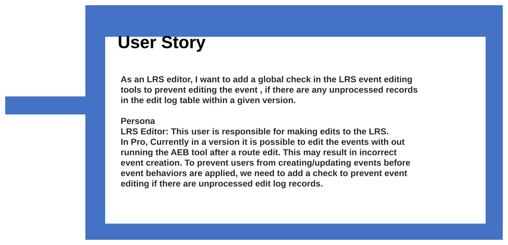
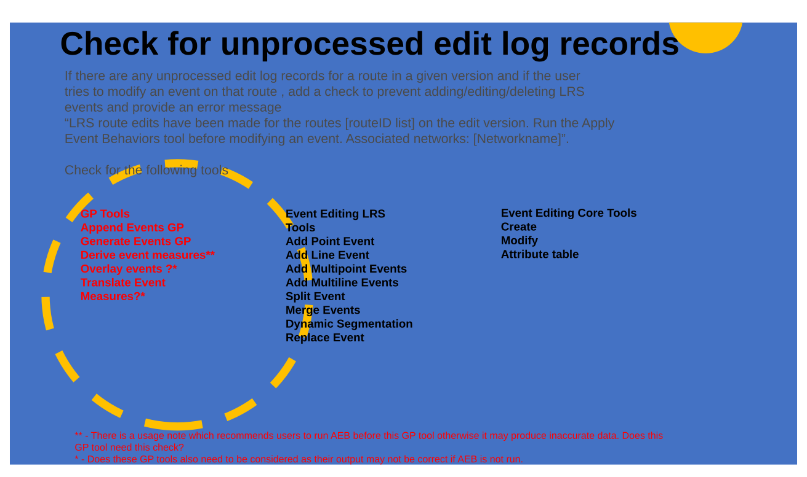
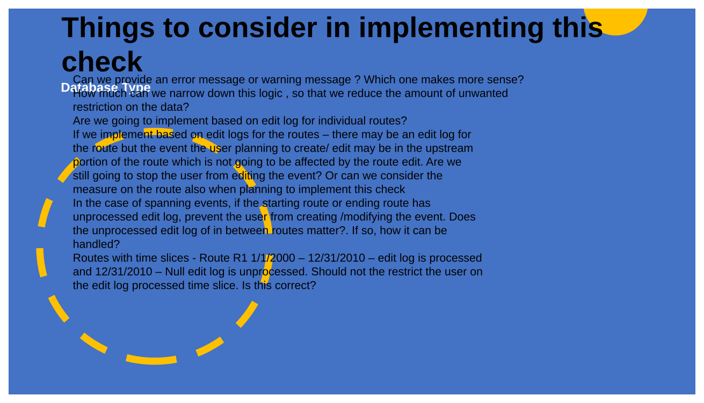
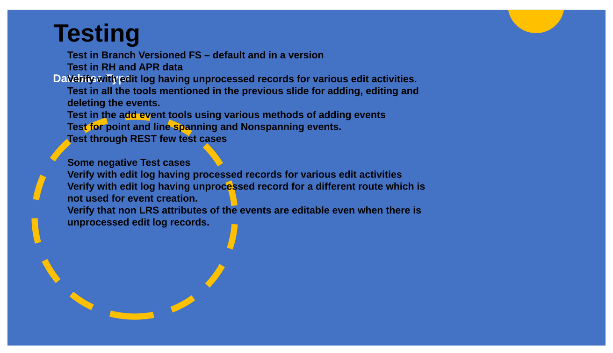
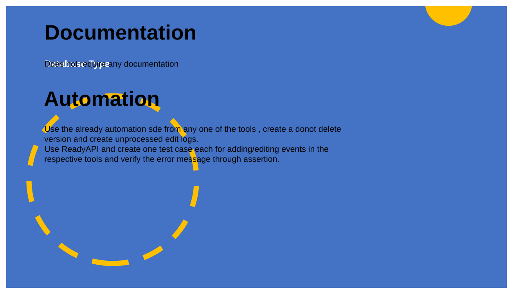
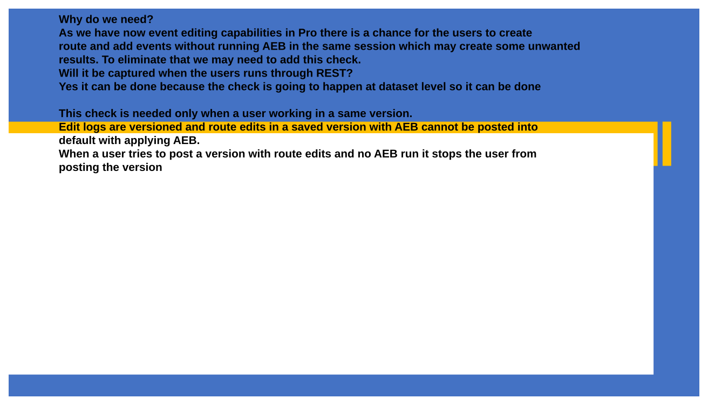

# Global Check for Unprocessed Edit Log Records Before Allowing Event Edit Within a Version

| Field | Value |
| --- | --- |
| **Doc** | 573 · User Story · Pro |
| **Product** | Roads & Highways · Pipeline Referencing |
| **Release** | — |
| **Issues** | — |
| **Source** | [Global Check for unprocessed edit log records .pptx](<https://esriis.sharepoint.com/sites/LocationReferencing/Shared%20Documents/General/Global%20Check%20for%20unprocessed%20edit%20log%20records%C2%A0.pptx>) |
| **People** | author Lakshmi Ananthanarayanan · PE — · dev — |
| **Edited** | 2023-04-21 17:16 by Lakshmi Ananthanarayanan |
| **Extracted** | 2026-09-04 · lane xmlstrip · format 3.0 · prompt v2.0.2 |
| **Keywords** | edit log · event editing · unprocessed records · versioning · apply event behaviors · route edit · event tools |
| **Tools** | Create · Modify · Attribute table · Add Point Event · Add Line Event · Add Multipoint Events · Add Multiline Events · Split Event · Merge Events · Dynamic Segmentation · Replace Event · Append Events GP · Generate Events GP · Derive event measures |

## Summary

This document describes a user story for adding a global check in LRS event editing tools to prevent editing events if unprocessed edit log records exist in a version. It outlines the need for the check, tools affected, implementation considerations, testing scenarios, and automation approach. The goal is to ensure event behaviors are applied before event edits to avoid incorrect event creation.

## Related documents

<!-- related:begin -->
- [Regression Testing Task List V1](<https://esriis.sharepoint.com/sites/lrsworkspace/LRS Doc Index/Test Plans/regression-testing-task-list-v1.md>) — similar text 0.11 · same surface <!-- rel:115 s=3.454 -->
- [Route Edit Log Blob Values Comparison](<https://esriis.sharepoint.com/sites/lrsworkspace/LRS Doc Index/Other/route-edit-log-blob-values-comparison.md>) — similar text 0.00 · 2 title words · 2 filename words · same surface/folder <!-- rel:804 s=3.309 -->
- [Support Running AEB, Generate Routes, and Derive Event Measures as a Single Operation via the LR Pro Ribbon](<https://esriis.sharepoint.com/sites/lrsworkspace/LRS Doc Index/User Stories/5198-support-running-aeb-generate-routes-and-derive-event.md>) — similar text 0.16 · 1 title word · same kind/surface/folder <!-- rel:506 s=3.193 -->
- [Investigate Negative Measures for LR Tools in Pro/REST/EE](<https://esriis.sharepoint.com/sites/lrsworkspace/LRS Doc Index/Test Plans/investigate-negative-measures-for-lr-tools-in-pro-rest-ee.md>) — similar text 0.11 · same surface/folder <!-- rel:628 s=2.916 -->
- [Contingent Values in Event Editor User Story](<https://esriis.sharepoint.com/sites/lrsworkspace/LRS Doc Index/User Stories/contingent-values-in-event-editor.md>) — similar text 0.10 · 1 title word · same kind/folder <!-- rel:674 s=2.88 -->
<!-- related:end -->

<!-- docs:begin -->
## Esri documentation

[Create a route](https://doc.esri.com/en/arcgis-pro/latest/help/production/roads-highways/create-a-new-route.html) · [Modify calibration points](https://doc.esri.com/en/arcgis-pro/latest/help/production/roads-highways/modify-calibration-points.html) · [Event editing using the attribute table](https://doc.esri.com/en/arcgis-pro/latest/help/production/roads-highways/event-editing-using-the-attribute-table.html) · [Merge events](https://doc.esri.com/en/arcgis-pro/latest/help/production/roads-highways/merge-events.html) · [Apply dynamic segmentation](https://doc.esri.com/en/arcgis-pro/latest/help/production/roads-highways/apply-dynamic-segmentation.html)

_No page matched:_ [Add Point Event](https://www.google.com/search?q=%22Add%20Point%20Event%22+site%3Adoc.esri.com) · [Add Line Event](https://www.google.com/search?q=%22Add%20Line%20Event%22+site%3Adoc.esri.com) · [Add Multipoint Events](https://www.google.com/search?q=%22Add%20Multipoint%20Events%22+site%3Adoc.esri.com) · [Add Multiline Events](https://www.google.com/search?q=%22Add%20Multiline%20Events%22+site%3Adoc.esri.com) · [Split Event](https://www.google.com/search?q=%22Split%20Event%22+site%3Adoc.esri.com) · [Replace Event](https://www.google.com/search?q=%22Replace%20Event%22+site%3Adoc.esri.com) · [Append Events GP](https://www.google.com/search?q=%22Append%20Events%20GP%22+site%3Adoc.esri.com) · [Generate Events GP](https://www.google.com/search?q=%22Generate%20Events%20GP%22+site%3Adoc.esri.com) · [Derive event measures](https://www.google.com/search?q=%22Derive%20event%20measures%22+site%3Adoc.esri.com)
<!-- docs:end -->

---

## Slide 1 — Global c heck for unprocessed edit log records before allowing event edit within a version

User Story

## Slide 2 — User Story

As an LRS editor, I want to add a global check in the LRS event editing tools to prevent editing the event , if there are any unprocessed records in the edit log table within a given version.

Persona
LRS Editor: This user is responsible for making edits to the LRS.
In Pro, Currently in a version it is possible to edit the events with out running the AEB tool after a route edit. This may result in incorrect event creation. To prevent users from creating/updating events before event behaviors are applied, we need to add a check to prevent event editing if there are  unprocessed edit log records.

## Slide 3 — Check for unprocessed edit log records

If there are any unprocessed edit log  records for a route  in a given version and if the user tries to modify an event on that route , add a check to prevent adding/editing/deleting  LRS events and provide an error message
“LRS route edits have been made for the routes [routeID list] on the edit version. Run the Apply Event Behaviors tool before modifying an event. Associated networks:  [Networkname]”.

Check for the following tools

Event Editing Core Tools

- Create
- Modify
- Attribute table
Event Editing LRS Tools

- Add Point Event
- Add Line Event
- Add Multipoint Events
- Add Multiline Events
- Split Event
- Merge Events
- Dynamic Segmentation
- Replace Event

GP Tools

- Append Events GP
- Generate Events GP
- Derive event measures**
- Overlay events ?*
- Translate Event Measures?*

** - There is a usage note which recommends users to run AEB before this GP tool otherwise it may produce inaccurate data. Does this GP tool need this check?
- - Does these GP tools also need to be considered as their output may not be correct if AEB is not run.

## Slide 4 — Things to consider in implementing this check

Database Type

- Can we provide an error message or warning message ?  Which one makes more sense?
- How much can we narrow down this logic , so that  we reduce the amount of unwanted restriction on the data?
  - Are we going to implement based on edit log for individual routes?
  - If  we implement based on edit logs for the routes – there may be an edit log for the route but the event the user planning to create/ edit may be in the upstream portion of the route which is not going to be affected by the route edit.  Are we still going to stop the user from editing the event? Or  can we consider the measure on the route also when planning to implement this check
  - In the case of spanning events, if the starting route or ending route has unprocessed edit log, prevent the user from creating /modifying the event.  Does the unprocessed edit log of in between routes matter?. If so, how it can be handled?
  - Routes with time slices -  Route R1 1/1/2000 – 12/31/2010 – edit log is processed and 12/31/2010 – Null edit log is unprocessed.  Should not the restrict the user on the edit log processed time slice. Is this correct?

## Slide 5 — Database Type

Testing

Test in  Branch Versioned FS – default and in a version
Test in RH and APR data
Verify with edit log having unprocessed records for various edit activities.
Test in all the tools mentioned in the previous slide for adding, editing and deleting the events.
Test in the add event  tools using various methods of adding events
Test for point and line spanning and Nonspanning events.
Test through REST few test cases

Some  negative Test cases
Verify with edit log having processed records for various edit activities
Verify with edit log having unprocessed record for a  different route which is not used for event creation.
Verify that non LRS attributes of the events are editable even when there is unprocessed edit log records.

## Slide 6 — Database Type

Documentation

Does not require any documentation

Automation
Use the  already automation sde from any one of  the tools , create a  donot delete version and create unprocessed edit logs.
Use ReadyAPI and create one test case each for adding/editing events in the respective tools and verify the error message through assertion.

## Slide 7

Assignment

Story Points:
Dev:
PE:

## Slide 8

Why do we need?
As we have now event editing capabilities in Pro there is a chance for the users to create route and add events without running AEB in the same session which may create some unwanted results. To eliminate that we may need to add this check.
Will it be captured when the users runs through REST?
Yes it can be done because the check is going to happen at dataset level so it can be done

This check is needed only when a user working in a same version.
Edit logs are versioned and route edits in a saved version with AEB cannot be posted into default with applying AEB.
When a user tries to post a version with route edits and no AEB run it stops the user from posting the version

