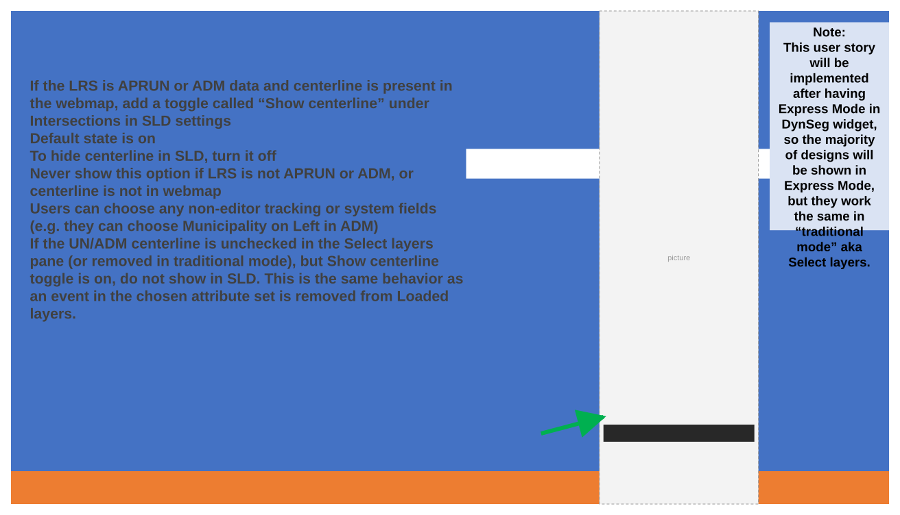
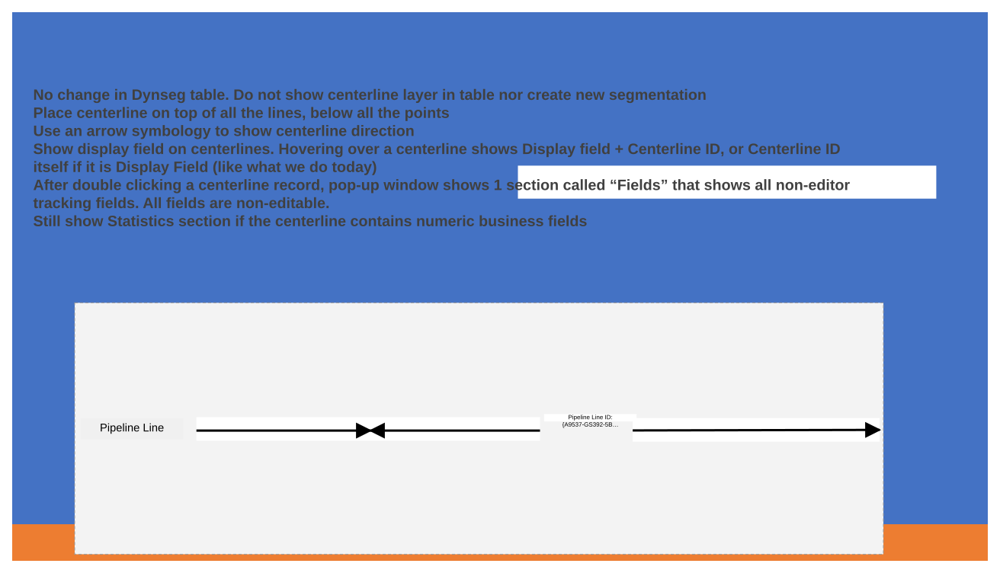
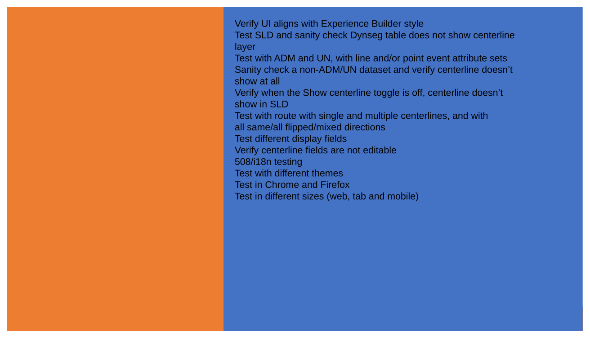
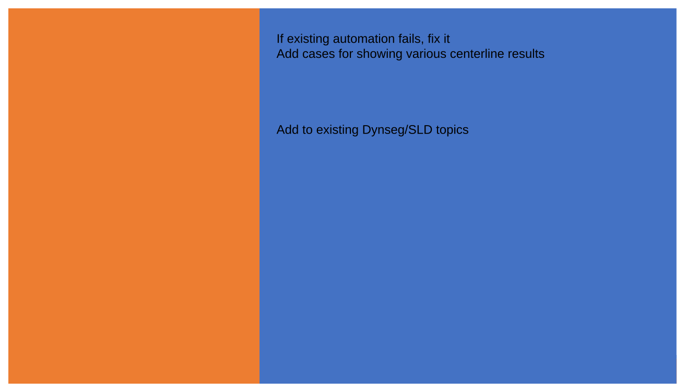
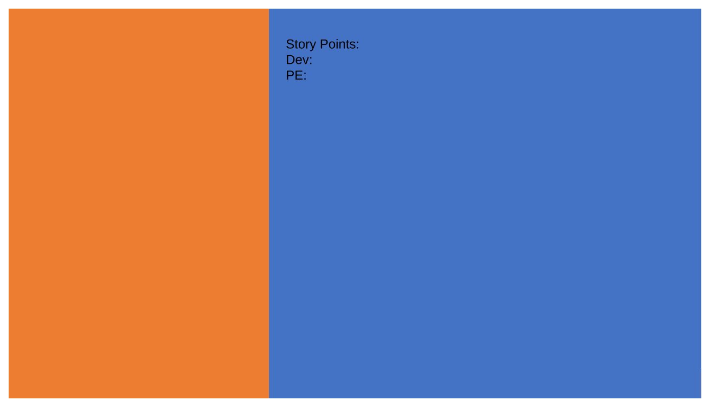

# Include Centerlines in Straight Line Diagram

| Field | Value |
| --- | --- |
| **Doc** | 182 · User Story · Experience Builder |
| **Product** | Utility Network |
| **Release** | — |
| **Issues** | — |
| **Source** | [IncludeCenterlineSLD_2.pptx](<https://esriis.sharepoint.com/sites/LocationReferencing/Shared%20Documents/General/IncludeCenterlineSLD_2.pptx>) |
| **People** | author Praveen Kumar · PE — · dev — |
| **Edited** | 2025-04-23 15:39 by Claire Wang |
| **Extracted** | 2026-09-04 · lane xmlstrip · format 3.0 · prompt v2.0.2 |
| **Keywords** | centerline · event editor · un integrated lrs · adm integrated lrs · straight line diagram · visualization · display field |
| **Tools** | Straight Line Diagram · Dynamic Segmentation |

## Summary

This user story describes the need for Event Editors and GIS analysts to visualize centerlines in the Straight Line Diagram (SLD) for UN or ADM integrated LRS data. It covers configuration options, display behavior, and testing requirements to support centerline visualization without editing capabilities.

## Related documents

<!-- related:begin -->
- [Include Site Addresses Layer in Straight Line Diagram](<https://esriis.sharepoint.com/sites/lrsworkspace/LRS Doc Index/User Stories/include-site-addresses-layer-in-sld.md>) — similar text 0.65 · 4 title words · 2 filename words · same kind/surface/folder <!-- rel:181 s=7.85 -->
- [Include Intersections in Straight Line Diagram (SLD) User Story](<https://esriis.sharepoint.com/sites/lrsworkspace/LRS%20Doc%20Index/User%20Stories/include-intersections-in-sld-sld.md>) — similar text 0.57 · 4 title words · 2 filename words · same kind/surface/folder <!-- rel:183 s=6.976 -->
- [Test Plan: Include Intersections in Straight Line Diagram](<https://esriis.sharepoint.com/sites/lrsworkspace/LRS%20Doc%20Index/Test%20Plans/include-intersections-in-sld.md>) — similar text 0.27 · 4 title words · 2 filename words · same surface <!-- rel:71 s=5.036 -->
- [Experience Builder Straight Line Diagram Symbology and Display Field](<https://esriis.sharepoint.com/sites/lrsworkspace/LRS Doc Index/User Stories/exb-sld-symbology-and-display-field.md>) — similar text 0.19 · 3 title words · same kind/surface/folder <!-- rel:349 s=4.746 -->
- [Experience Builder – Dynamic Segmentation Widget Straight Line Diagram – Measure Range Filtering](<https://esriis.sharepoint.com/sites/lrsworkspace/LRS Doc Index/User Stories/exb-dynseg-widget-sld-measure-range-filtering.md>) — similar text 0.11 · 3 title words · 1 filename word · same kind/surface/folder <!-- rel:13 s=4.532 -->
<!-- related:end -->

<!-- docs:begin -->
## Esri documentation

[Apply dynamic segmentation](https://doc.esri.com/en/arcgis-pro/latest/help/production/location-referencing-pipelines/apply-dynamic-segmentation.html)

_No page matched:_ [Straight Line Diagram](https://www.google.com/search?q=%22Straight%20Line%20Diagram%22+site%3Adoc.esri.com)
<!-- docs:end -->

---

## Story
### Include centerlines in SLD <!-- slide 1 -->
User Story

### User Story <!-- slide 2 -->
As an Event Editor, I need the ability to visualize centerline for my UN or ADM integrated LRS in SLD so that I can retrieve relationships of the centerline with my asset data and properly location and orient myself for event editing and analysis. I don’t need to edit the centerline.
Persona
These users have UN or ADM integrated LRS data. Typically located in different business units/departments than the LRS route editors, the following users have varied GIS experience, but a high level of knowledge about the characteristics they maintain/analyze (pipeline pressure, pipe asset, E911, address block, and etc.)
Event Editor: These users are responsible for making edits to route characteristics and assets. They need to be able to visualize and retrieve centerline information on the route shown in SLD in preparation for event editing. They don’t edit centerline data.
GIS analyst: These users are responsible for exporting SLD to further retrieve information for route characteristics and assets analysis. They need centerline direction, location and attribute information in their analysis. They don’t edit centerline data.
Sample workflow:
A GIS analyst wants to create a report of the pipeline line information with pipe material and pressure data.
An event editor needs to check and supplement missing Directionality event information along centerlines.

## Acceptance Criteria
### Configuration <!-- slide 3 -->
- If the LRS is APRUN or ADM data and centerline is present in the webmap, add a toggle called “Show centerline” under Intersections in SLD settings
  - Default state is on
  - To hide centerline in SLD, turn it off
- Never show this option if LRS is not APRUN or ADM, or centerline is not in webmap
- Users can choose any non-editor tracking or system fields (e.g. they can choose Municipality on Left in ADM)
- If the UN/ADM centerline is unchecked in the Select layers pane (or removed in traditional mode), but Show centerline toggle is on, do not show in SLD. This is the same behavior as an event in the chosen attribute set is removed from Loaded layers.

Note:
This user story will be implemented after having Express Mode in DynSeg widget, so the majority of designs will be shown in Express Mode, but they work the same in “traditional mode” aka Select layers.

### SLD <!-- slide 4 -->
- No change in Dynseg table. Do not show centerline layer in table nor create new segmentation
- Place centerline on top of all the lines, below all the points
- Use an arrow symbology to show centerline direction
- Show display field on centerlines. Hovering over a centerline shows Display field + Centerline ID, or Centerline ID itself if it is Display Field (like what we do today)
- After double clicking a centerline record, pop-up window shows 1 section called “Fields” that shows all non-editor tracking fields. All fields are non-editable.
- Still show Statistics section if the centerline contains numeric business fields

Pipeline Line

Pipeline Line ID: {A9537-GS392-5B…

## Testing
<!-- slide 5 -->
- Verify UI aligns with Experience Builder style
- Test SLD and sanity check Dynseg table does not show centerline layer
- Test with ADM and UN, with line and/or point event attribute sets
- Sanity check a non-ADM/UN dataset and verify centerline doesn’t show at all
- Verify when the Show centerline toggle is off, centerline doesn’t show in SLD
- Test with route with single and multiple centerlines, and with all same/all flipped/mixed directions
- Test different display fields
- Verify centerline fields are not editable
- 508/i18n testing
- Test with different themes
- Test in Chrome and Firefox
- Test in different sizes (web, tab and mobile)

## Automation
### Automation Documentation <!-- slide 6 -->
If existing automation fails, fix it
Add cases for showing various centerline results
Add to existing Dynseg/SLD topics

## Assignment
<!-- slide 7 -->
Story Points:
Dev:
PE:

