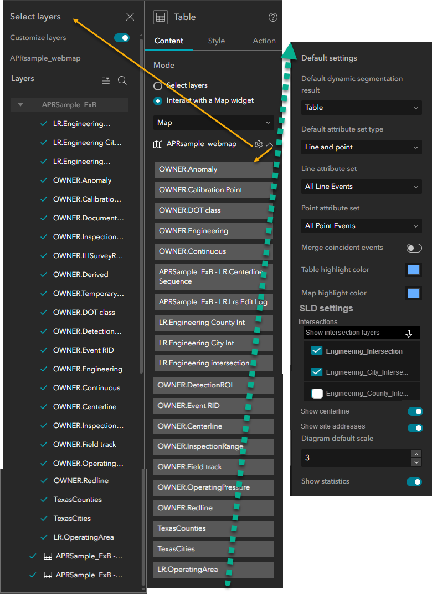
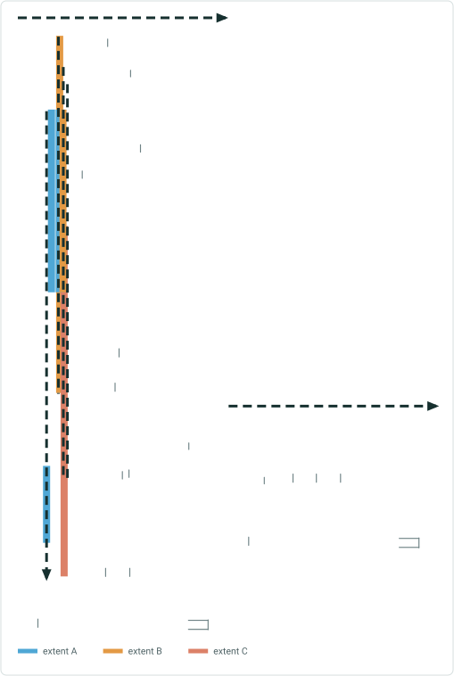
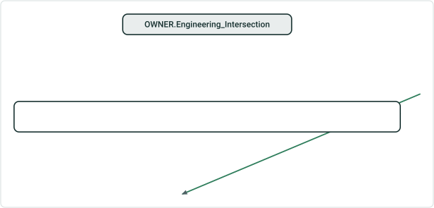
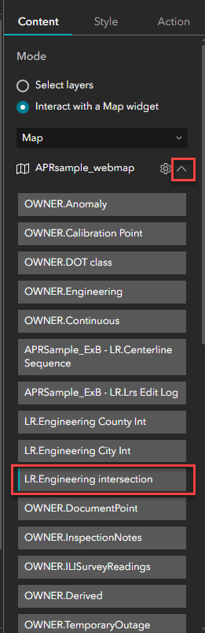
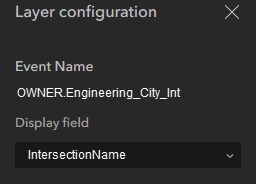
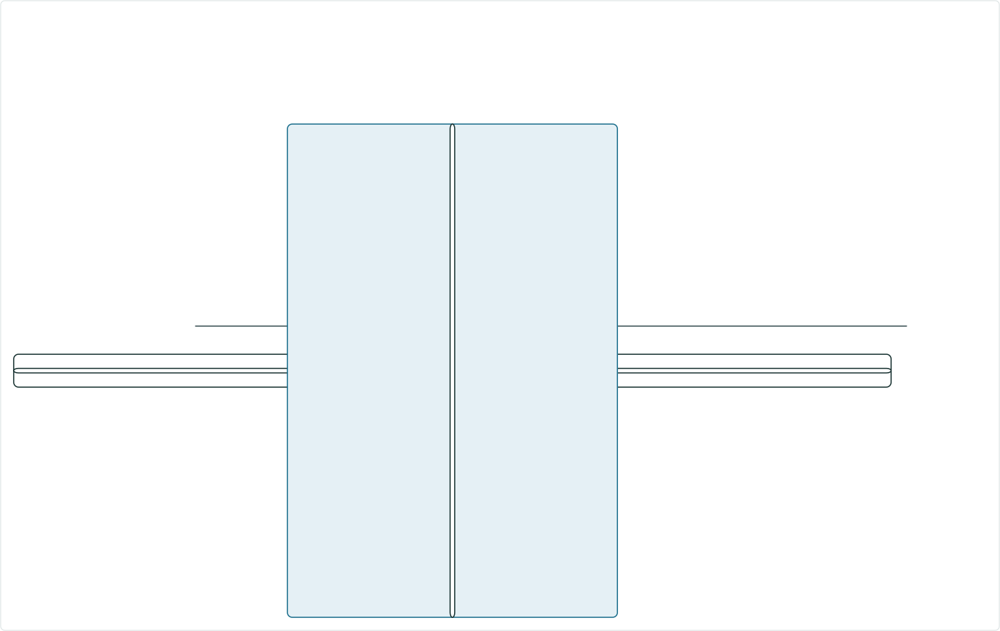

# Include Intersections in Straight Line Diagram (SLD) User Story

|   |   |
| --- | --- |
| **Kind** | User Story · Experience Builder |
| **Release** | — |
| **Source** | [IncludeIntersectionsSLD_2.pptx](<https://esriis.sharepoint.com/sites/LocationReferencing/Shared%20Documents/General/IncludeIntersectionsSLD_2.pptx>) |
| **Edited** | 2025-04-23 15:39 by Claire Wang |
| **Extracted** | 2026-09-04 · lane `xmlstrip` |

<!-- metadata
```yaml
title: "Include Intersections in Straight Line Diagram (SLD) User Story"
source_file: "IncludeIntersectionsSLD_2.pptx"
source_url: "https://esriis.sharepoint.com/sites/LocationReferencing/Shared%20Documents/General/IncludeIntersectionsSLD_2.pptx"
doc_id: 183
doc_kind: "User Story"
surface: "Experience Builder"
doc_revision: ""
target_release: ""
pe: ""
dev: ""
author: "Praveen Kumar"
last_edited_by: "Claire Wang"
last_edited: "2025-04-23T15:39:12Z"
extracted: 2026-09-04
extraction_lane: xmlstrip
prompt_version: "v2.0.2"
keywords: ["straight line diagram", "intersections", "dynamic segmentation", "event editor", "gis analyst", "experience builder", "user story"]
tools: ["Dynamic Segmentation"]
products: []
issues: []
related: [{"doc":181,"file":"include-site-addresses-layer-in-straight-line-diagram__doc181.md","s":7.184},{"doc":182,"file":"include-centerlines-in-straight-line-diagram__doc182.md","s":7.159},{"doc":71,"file":"test-plan-include-intersections-in-straight-line-diagram__doc71.md","s":6.077},{"doc":13,"file":"experience-builder-dynamic-segmentation-widget-straight-line-diagram-measure__doc13.md","s":4.644},{"doc":189,"file":"view-only-dynseg-and-sld-user-story__doc189.md","s":4.216}]
```
-->

## Summary

This document describes a user story for enabling visualization of intersections in the Straight Line Diagram (SLD) within the Dynamic Segmentation (DynSeg) widget. It covers user personas, configuration options for intersection layers, UI behavior, testing scenarios, and automation documentation related to intersection display in SLD without editing capabilities.

## Related documents

<!-- related:begin -->
- [Include Site Addresses Layer in Straight Line Diagram](<https://esriis.sharepoint.com/sites/lrsworkspace/LRS Doc Index/User Stories/include-site-addresses-layer-in-straight-line-diagram__doc181.md>) — similar text 0.55 · 4 title words · 2 filename words · same kind/surface/folder <!-- rel:181 -->
- [Include Centerlines in Straight Line Diagram](<https://esriis.sharepoint.com/sites/lrsworkspace/LRS Doc Index/User Stories/include-centerlines-in-straight-line-diagram__doc182.md>) — similar text 0.57 · 4 title words · 2 filename words · same kind/surface/folder <!-- rel:182 -->
- [Test Plan: Include Intersections in Straight Line Diagram](<https://esriis.sharepoint.com/sites/lrsworkspace/LRS Doc Index/Test Plans/test-plan-include-intersections-in-straight-line-diagram__doc71.md>) — similar text 0.35 · 5 title words · 3 filename words · same surface <!-- rel:71 -->
- [Experience Builder – Dynamic Segmentation Widget Straight Line Diagram – Measure Range Filtering](<https://esriis.sharepoint.com/sites/lrsworkspace/LRS Doc Index/User Stories/experience-builder-dynamic-segmentation-widget-straight-line-diagram-measure__doc13.md>) — similar text 0.12 · 3 title words · 1 filename word · same kind/surface/folder <!-- rel:13 -->
- [View only DynSeg and SLD User Story](<https://esriis.sharepoint.com/sites/lrsworkspace/LRS Doc Index/User Stories/view-only-dynseg-and-sld-user-story__doc189.md>) — similar text 0.29 · 1 title word · 1 filename word · same kind/surface/folder <!-- rel:189 -->
<!-- related:end -->

<!-- docs:begin -->
## Esri documentation

[Apply dynamic segmentation](https://doc.esri.com/en/arcgis-pro/latest/help/production/location-referencing-pipelines/apply-dynamic-segmentation.html) · [View LRS intersection properties](https://doc.esri.com/en/arcgis-pro/latest/help/production/location-referencing-pipelines/view-lrs-intersection-properties.html)
<!-- docs:end -->

---

## Slide 1 — Include intersections in SLD

User Story

## Slide 2 — User Story

As an Event Editor, I need the ability to visualize intersections in SLD, so that I can retrieve relationships of the intersections with my asset data and properly location and orient myself for event editing and analysis in SLD. I don’t need to edit the intersections.
Persona
Typically located in different business units/departments than the LRS route editors, the following users have varied GIS experience, but a high level of knowledge about the characteristics they maintain/analyze (traffic control, safety, pavement, crashes, etc.)
Event Editor: These users are responsible for making edits to route characteristics and assets. They need to be able to visualize and retrieve intersection information on the route shown in SLD in preparation for event editing. They don’t edit intersection data.
GIS analyst: These users are responsible for exporting SLD to further retrieve information for route characteristics and assets analysis. They need intersection location and attribute information in their analysis. They don’t edit intersection data.
Sample workflow:
A GIS analyst wants to create a report of the frequency of crashes in a 0.1 mi radius of intersections vs. crashes that are not at an intersection.
An event editor needs to check and supplement missing signal information at intersections.

## Slide 3

This user story will be implemented after having Express Mode in DynSeg widget, so the majority of designs will be shown in Express Mode, but they work the same in “traditional mode” aka Select layers.
This user story requires some UI changes in DynSeg widget as it’s the first of multiple “include additional layers in SLD” user stories.
Timeline Notes
UI overview



## Slide 4 — Configuration



Have a SLD settings section under Default settings

- If webmap doesn’t contain any intersections, SLD settings only has Diagram default scale and Show statistics
- If webmap has intersection layers, the first thing in SLD settings is a dropdown
  - Default state is Show intersection layers with all intersections layers checked below
    - To hide a particular intersection layer, uncheck it
    - If all intersection layers are unchecked, treat like B
  - The other value is Hide intersection layers. When this value is chosen, all checkboxes below are gone

    

## Slide 5 — Configuration – ctd .



- Users can choose any non-editor tracking or system fields by selecting the intersection layer in the webmap layer list
- Even when “Line only” is chosen for showing events, we still show intersections in SLD ??
- If an intersection is unchecked in the Select layers pane (or removed in traditional mode), but checked in Show intersection layers in SLD settings, do not show in SLD. This is the same behavior as an event in the chosen attribute set is removed from Loaded layers.
OWNER.Engineering_Intersection

    

## Slide 6 — SLD


- No change in Dynseg table. Do not show intersections in table nor create new segmentation
- Place Intersections at the top rows of SLD
- Honor intersection symbology
- Hovering over an intersection shows Display field + Intersection ID, or Intersection ID itself if it is Display Field (like what we do today)
- After double clicking an intersection record, pop-up window shows 1 section called “Fields” that shows all fields. All fields are non-editable.
  - IntersectionID, IntersectionName, RouteID, FeatureID, FeatureClassName, FromDate, ToDate, Measure
- No statistics section


## Slide 7 — Testing


- Verify UI aligns with Experience Builder style
- Test SLD and sanity check Dynseg table does not show any intersection
- Test with nonline and line networks, with line and/or point event attribute sets
- Test the following scenarios:
  - Webmap does not contain any intersection
  - Webmap has multiple intersections but none/one/multiple intersection layers are checked in SLD settings
- Test route-route and route-polygon intersection layers
- Test different display fields
- Use different symbology for multiple intersection layers
- Verify intersection fields are not editable
- 508/i18n testing
- Test with different themes
- Test in Chrome and Firefox
- Test in different sizes (web, tab and mobile)

## Slide 8 — Automation Documentation


If existing automation fails, fix it
Add cases for showing various intersection results
Add to existing Dynseg-SLD topic

## Slide 9 — Assignment



Story Points:
Dev:
PE:
