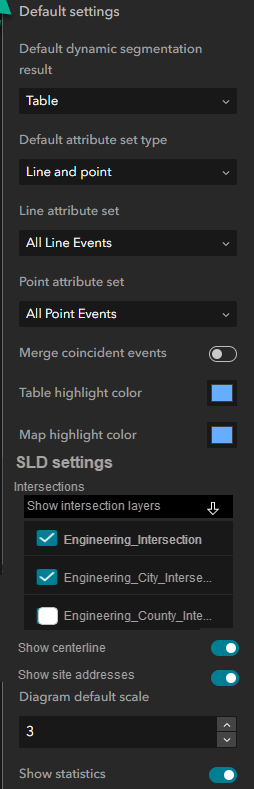
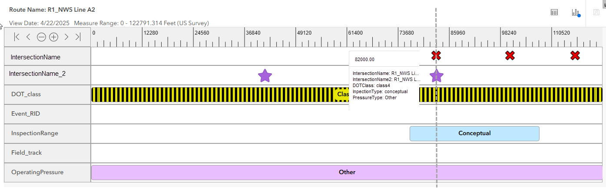
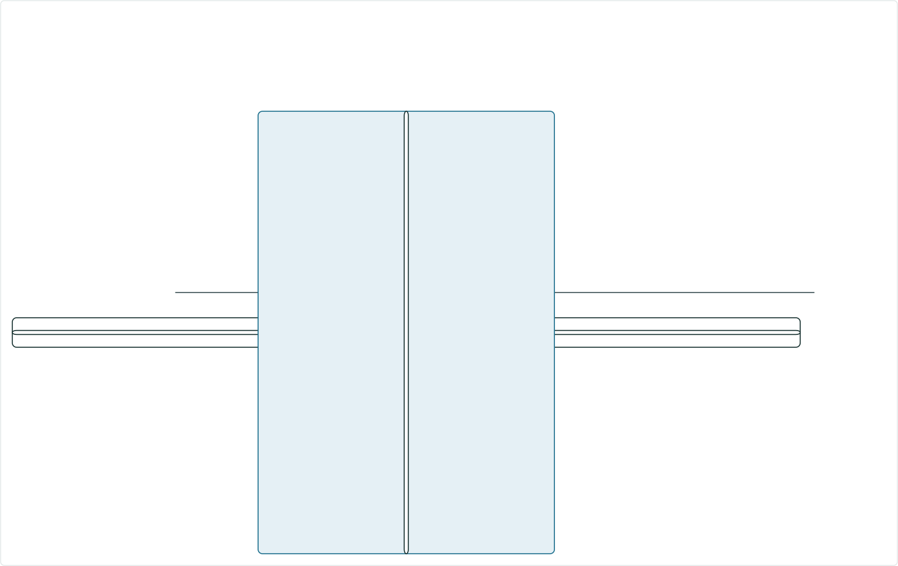

# Include Site Addresses Layer in Straight Line Diagram

|   |   |
| --- | --- |
| **Kind** | User Story · Experience Builder |
| **Release** | — |
| **Source** | [IncludeSiteAddressesSLD_2.pptx](<https://esriis.sharepoint.com/sites/LocationReferencing/Shared%20Documents/General/IncludeSiteAddressesSLD_2.pptx>) |
| **Edited** | 2025-04-23 15:39 by Claire Wang |
| **Extracted** | 2026-09-04 · lane `xmlstrip` |

<!-- metadata
```yaml
title: "Include Site Addresses Layer in Straight Line Diagram"
source_file: "IncludeSiteAddressesSLD_2.pptx"
source_url: "https://esriis.sharepoint.com/sites/LocationReferencing/Shared%20Documents/General/IncludeSiteAddressesSLD_2.pptx"
doc_id: 181
doc_kind: "User Story"
surface: "Experience Builder"
doc_revision: ""
target_release: ""
pe: ""
dev: ""
author: "Praveen Kumar"
last_edited_by: "Claire Wang"
last_edited: "2025-04-23T15:39:00Z"
extracted: 2026-09-04
extraction_lane: xmlstrip
prompt_version: "v2.0.2"
keywords: ["site address", "event editor", "adm data", "straight line diagram", "visualization", "gis analyst"]
tools: ["Straight Line Diagram", "Dynamic Segmentation"]
products: []
issues: []
related: [{"doc":182,"file":"include-centerlines-in-straight-line-diagram__doc182.md","s":7.85},{"doc":183,"file":"include-intersections-in-straight-line-diagram-sld-user-story__doc183.md","s":7.004},{"doc":13,"file":"experience-builder-dynamic-segmentation-widget-straight-line-diagram-measure__doc13.md","s":4.487},{"doc":71,"file":"test-plan-include-intersections-in-straight-line-diagram__doc71.md","s":4.451},{"doc":292,"file":"support-overlapping-events-in-experience-builder-straight-line-diagram__doc292.md","s":4.046}]
```
-->

## Summary

This user story describes the need for Event Editors and GIS analysts to visualize site address points within the Straight Line Diagram (SLD) for ADM integrated LRS data. It covers configuration options, display behavior, and interaction details for site address points in SLD without editing capabilities. Testing and automation documentation requirements are also outlined.

## Related documents

<!-- related:begin -->
- [Include Centerlines in Straight Line Diagram](<https://esriis.sharepoint.com/sites/lrsworkspace/LRS Doc Index/User Stories/include-centerlines-in-straight-line-diagram__doc182.md>) — similar text 0.65 · 4 title words · 2 filename words · same kind/surface/folder <!-- rel:182 -->
- [Include Intersections in Straight Line Diagram (SLD) User Story](<https://esriis.sharepoint.com/sites/lrsworkspace/LRS%20Doc%20Index/User%20Stories/include-intersections-in-straight-line-diagram-sld-user-story__doc183.md>) — similar text 0.55 · 4 title words · 2 filename words · same kind/surface/folder <!-- rel:183 -->
- [Experience Builder – Dynamic Segmentation Widget Straight Line Diagram – Measure Range Filtering](<https://esriis.sharepoint.com/sites/lrsworkspace/LRS Doc Index/User Stories/experience-builder-dynamic-segmentation-widget-straight-line-diagram-measure__doc13.md>) — similar text 0.12 · 3 title words · 1 filename word · same kind/surface/folder <!-- rel:13 -->
- [Test Plan: Include Intersections in Straight Line Diagram](<https://esriis.sharepoint.com/sites/lrsworkspace/LRS%20Doc%20Index/Test%20Plans/test-plan-include-intersections-in-straight-line-diagram__doc71.md>) — similar text 0.26 · 4 title words · 2 filename words · same surface <!-- rel:71 -->
- [Support Overlapping Events in Experience Builder Straight Line Diagram](<https://esriis.sharepoint.com/sites/lrsworkspace/LRS Doc Index/User Stories/support-overlapping-events-in-experience-builder-straight-line-diagram__doc292.md>) — similar text 0.26 · 3 title words · same kind/surface/folder <!-- rel:292 -->
<!-- related:end -->

<!-- docs:begin -->
## Esri documentation

[Apply dynamic segmentation](https://doc.esri.com/en/arcgis-pro/latest/help/production/location-referencing-pipelines/apply-dynamic-segmentation.html) · [View site address point properties](https://doc.esri.com/en/arcgis-pro/latest/help/production/roads-highways/view-site-address-point-properties.html)

_No page matched:_ [Straight Line Diagram](https://www.google.com/search?q=%22Straight%20Line%20Diagram%22+site%3Adoc.esri.com)
<!-- docs:end -->

---

## Slide 1 — Include site addresses layer in SLD

User Story

## Slide 2 — User Story

As an Event Editor, I need the ability to visualize site address points for my ADM integrated LRS data in SLD, so that I can retrieve relationships of the site address points with my asset data and properly location and orient myself for event editing and analysis. I don’t need to edit the site address points.
Persona
Typically located in different business units/departments than the LRS route editors, the following users have varied GIS experience, but a high level of knowledge about the characteristics they maintain/analyze (entrance points, travel lanes, districts crashes, etc.)
Event Editor: These users are responsible for making edits to route characteristics and assets. They need to be able to visualize and retrieve site address information on the route shown in SLD in preparation for event editing. They don’t edit site address data.
GIS analyst: These users are responsible for exporting SLD to further retrieve information for route characteristics and assets analysis. They need site address location and attribute information in their analysis. They don’t edit site address data.
Sample workflow:
A GIS analyst wants to create a report of the districts along ADM centerline and site addresses.
An event editor needs to check and supplement missing Service District event information according to surrounding site address points.

## Slide 3 — Configuration


- If the LRS is ADM data and site address point layer is present in the webmap, add a toggle called “Show site addresses” under Show centerline in SLD settings
  - Default state is on
  - To hide site addresses in SLD, turn it off
- Users can choose any non-editor tracking or system fields (e.g. they can choose Full Address Number)
- Even when “Line only” is chosen for showing events, we still show Site Addresses when the toggle is on ??
- If the site addresses layer is unchecked in the Select layers pane (or removed in traditional mode), but this toggle is on, do not show in SLD. This is the same behavior as an event in the chosen attribute set is removed from Loaded layers.
Note:
This user story will be implemented after having Express Mode in DynSeg widget, so the majority of designs will be shown in Express Mode, but they work the same in “traditional mode” aka Select layers.



## Slide 4 — SLD


- No change in Dynseg table. Do not show site address layer in table nor create new segmentation
- Place site address points between intersections and point events, if any
- Honor site address symbology
- Hovering over a site address point shows Display field + Site Address ID, or Site Address ID itself if it is Display Field (like what we do today)
- Site addresses don’t carry measure and they are off routes most of time. Use the nearest measure on the route.
- After double clicking a site address record, pop-up window shows 1 section called “Fields” that shows all non-editor tracking fields. All fields are non-editable.
- Still show Statistics section if the site address contains numeric business fields
- If there are overlapping site addresses, just show the first returned (we have a story in the backlog to support clusters of points like in this scenario and we'll address it in that story)

Site Addresses

Road Centerlines
Full Address Number: 1703
Road Centerline ID: {AB840-28304-…
Type: Conceptual
Note: Other



## Slide 5 — Testing



- Verify UI aligns with Experience Builder style
- Test SLD and sanity check Dynseg table does not show site addresses
- Verify the site addresses’ “measures” are calculated correctly
- Test with ADM data, with various line and/or point event attribute sets
- Sanity check a non-ADM dataset and verify Site Addresses layer doesn’t show at all
- Verify when the Show site addresses toggle is off, the layer doesn’t show in SLD
- Test different display fields
- Verify site address fields are not editable
- 508/i18n testing
- Test with different themes
- Test in Chrome and Firefox
- Test in different sizes (web, tab and mobile)

## Slide 6 — Automation Documentation


If existing automation fails, fix it
Add cases for showing various site address results
Add to existing Dynseg/SLD topics

## Slide 7 — Assignment


Story Points:
Dev:
PE:
