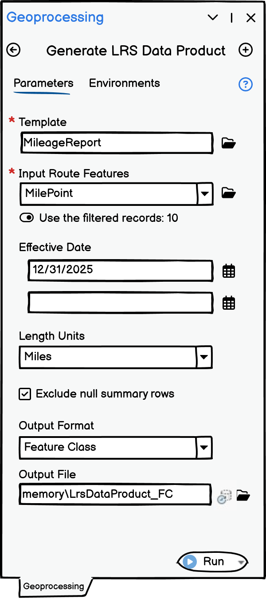
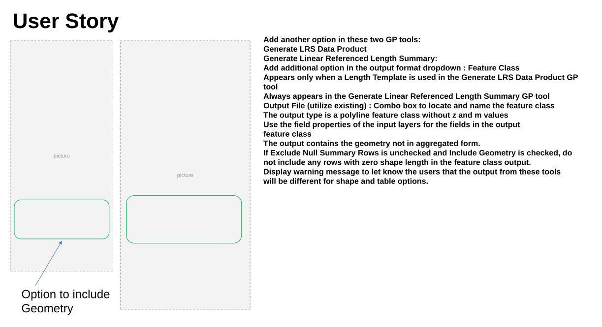
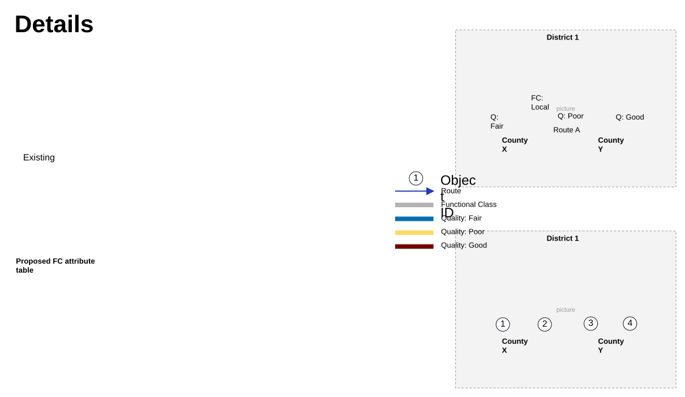
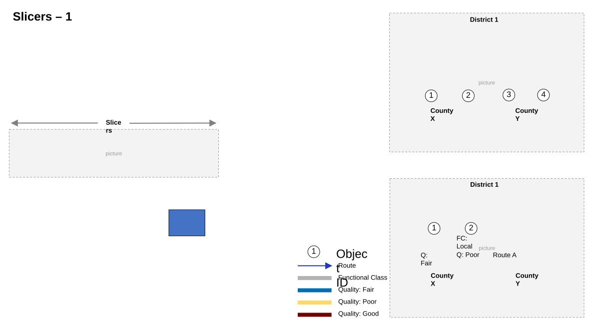
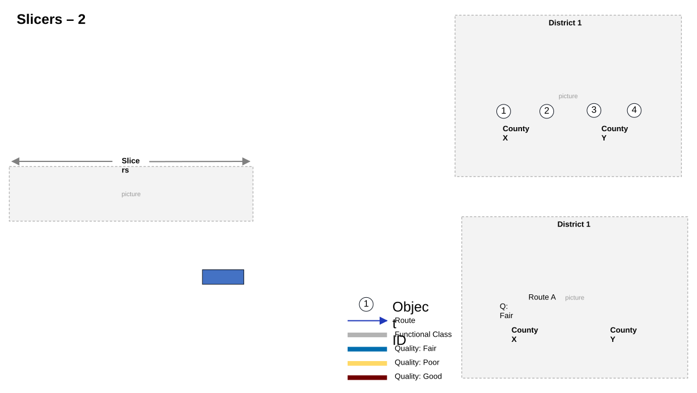
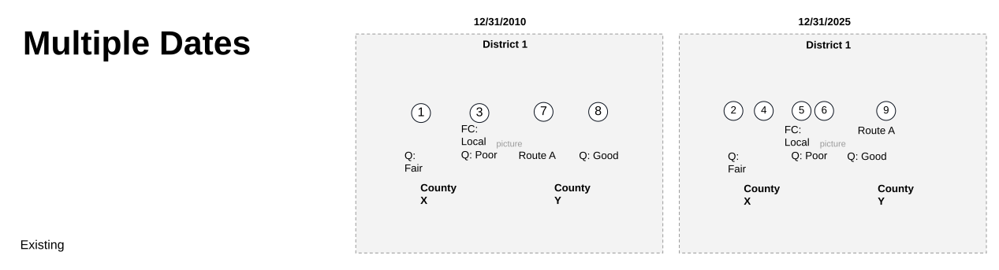
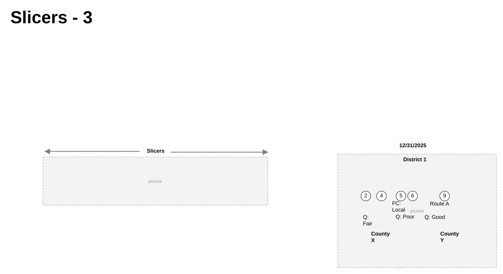
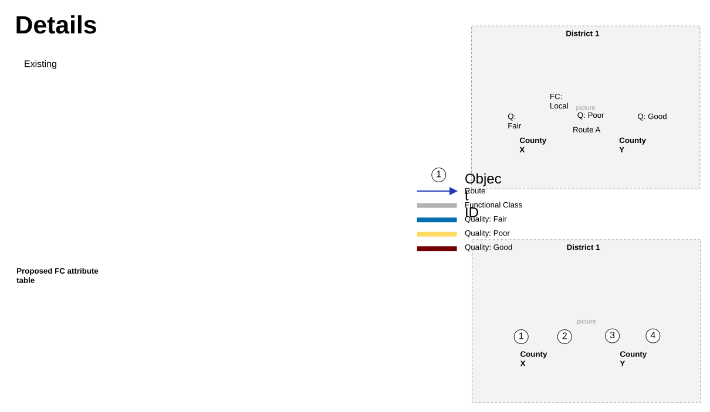

# Length Data Product Support Features Enhancement

| Field | Value |
| --- | --- |
| **Doc** | 47 · User Story · Pro |
| **Product** | Roads & Highways · Pipeline Referencing · Utility Network |
| **Release** | — |
| **Issues** | — |
| **Source** | [LengthDataProduct_Support_Features.pptx](<https://esriis.sharepoint.com/sites/LocationReferencing/Shared%20Documents/General/LengthDataProduct_Support_Features.pptx>) |
| **People** | author Rahul Rakshit · PE — · dev — |
| **Edited** | 2026-04-20 15:10 by Praveen Kumar |
| **Extracted** | 2026-09-04 · lane xmlstrip · format 3.0 · prompt v2.0.2 |
| **Keywords** | length data product · feature class · geometry output · geoprocessing · polyline · attribute table · visualization |
| **Tools** | Generate LRS Data Product · Generate Linear Referenced Length Summary |

## Summary

This document describes a user story to enhance the Generate LRS Data Product and Generate Linear Referenced Length Summary geoprocessing tools by adding an option to output feature classes with geometry. The enhancement aims to support visualization platforms like ArcGIS Dashboards and Power BI by including polyline feature classes without z and m values, with attributes matching input layers. Testing, documentation, and automation updates are also outlined.

## Related documents

<!-- related:begin -->
- [Generate LRS Data Product and Linear Referenced Length Summary Enhancement](<https://esriis.sharepoint.com/sites/lrsworkspace/LRS Doc Index/User Stories/generate-lrs-data-product-and-linear-referenced-length.md>) — similar text 0.73 · 3 title words · 2 filename words · same kind/surface/folder <!-- rel:107 s=7.703 -->
- [Generate LRS Data Product Support Summary and Length](<https://esriis.sharepoint.com/sites/lrsworkspace/LRS%20Doc%20Index/User%20Stories/generate-lrs-data-product-support-summary-and-length.md>) — similar text 0.13 · 3 title words · 2 filename words · same kind/surface/folder <!-- rel:357 s=4.701 -->
- [User Story: Support Multiple Summary Fields in Generate LRS Data Product](<https://esriis.sharepoint.com/sites/lrsworkspace/LRS Doc Index/User Stories/support-multiple-summary-fields-in-generate-lrs-data-product.md>) — similar text 0.15 · 2 title words · 1 filename word · same kind/surface/folder <!-- rel:353 s=3.862 -->
- [User Story for LRS Data Product Template with Length Range Values](<https://esriis.sharepoint.com/sites/lrsworkspace/LRS Doc Index/User Stories/for-lrs-data-product-template-with-length-range-values.md>) — similar text 0.19 · 2 title words · 1 filename word · same kind/surface/folder <!-- rel:343 s=3.676 -->
- [LR Data Products: Support multiple summary fields](<https://esriis.sharepoint.com/sites/lrsworkspace/LRS Doc Index/User Stories/lr-data-products-support-multiple-summary-fields.md>) — similar text 0.19 · 1 title word · same kind/surface/folder <!-- rel:356 s=2.787 -->
<!-- related:end -->

<!-- docs:begin -->
## Esri documentation

[Create a template for an LRS length data product](https://doc.esri.com/en/arcgis-pro/latest/help/production/roads-highways/create-a-template-for-an-lrs-length-data-product.html) · [View utility network feature class properties](https://doc.esri.com/en/arcgis-pro/latest/help/production/location-referencing-pipelines/view-utility-network-feature-class-properties.html) · [Event editing using the attribute table](https://doc.esri.com/en/arcgis-pro/latest/help/production/roads-highways/event-editing-using-the-attribute-table.html)

_No page matched:_ [Generate LRS Data Product](https://www.google.com/search?q=%22Generate%20LRS%20Data%20Product%22+site%3Adoc.esri.com) · [Generate Linear Referenced Length Summary](https://www.google.com/search?q=%22Generate%20Linear%20Referenced%20Length%20Summary%22+site%3Adoc.esri.com)
<!-- docs:end -->

---

## Slide 1 — Data Product GP tools: Support geometry output

Problem Statement:
Visualization platforms such as ArcGIS Dashboards and Power BI, requires a feature class with geometry to display spatial information

The Length Data Product generated by the Generate LRS Data Product and Generate Linear Referenced Length Summary geoprocessing (GP) tools currently lack geometry output (shapes).

Capability requested by:

- Users of Roadway Reporter
- Feature request raised during GIS-T
- Esri-Canada
- Esri solution Engineers
Solution:
To address this gap, the Length Data Product outputs must include geometry-based feature classes that represent the results, enabling seamless visualization, reporting, and downstream integration.

style.visibility

## Slide 2 — User Story

Add another option in these two GP tools:

- Generate LRS Data Product
- Generate Linear Referenced Length Summary:
- Add additional option in the output format dropdown : Feature Class
  - Appears only when a Length Template is used in the Generate LRS Data Product GP tool
  - Always appears in the Generate Linear Referenced Length Summary GP tool
- Output File (utilize existing) : Combo box to locate and name the feature class
  - The output type is a polyline feature class without z and m values
  - Use the field properties of the input layers for the fields in the output feature class
- The output contains the geometry not in aggregated form.
- If Exclude Null Summary Rows is unchecked and Include Geometry is checked, do not include any rows with zero shape length in the feature class output.
- Display warning message to let know the users that the output from these tools will be different for shape and table options.

Option to include Geometry

style.visibilitystyle.visibilityppt_xppt_ystyle.visibilitystyle.visibility

## Slide 3

## Slide 4 — ArcGIS Dashboard

## Slide 5

| Template | Summary Fields |  | Length Fields |  |  |  |  |  |  |
| --- | --- | --- | --- | --- | --- | --- | --- | --- | --- |
|  | District | County | Local | Interstate | Arterial | Collector | Good | Fair | Poor |
|  | District1 | County X |  |  |  |  |  |  |  |
|  |  | County Y |  |  |  |  |  |  |  |

| Table Output | District | County | Local | Interstate | Arterial | Collector | Good | Fair | Poor |
| --- | --- | --- | --- | --- | --- | --- | --- | --- | --- |
|  | District 1 | County X | 5 |  |  |  |  | 3 | 2 |
|  | District 1 | County Y | 5 |  |  |  | 3 |  | 2 |

| Attributes | Object ID | Route ID | Date | District | County | Functional Class | Quality | Length | Shape Length | Shape |
| --- | --- | --- | --- | --- | --- | --- | --- | --- | --- | --- |
|  | 1 | Route A | 12/31/2024 | District 1 | County X | Local | Fair | 3 | 15840 | Polyline |
|  | 2 | Route A | 12/31/2024 | District 1 | County X | Local | Poor | 2 | 10560 | Polyline |
|  | 3 | Route A | 12/31/2024 | District 1 | County Y | Local | Poor | 2 | 10560 | Polyline |
|  | 4 | Route A | 12/31/2024 | District 1 | County Y | Local | Good | 3 | 15840 | Polyline |

Proposed FC attribute table
style.visibilitystyle.visibilitystyle.visibilitystyle.visibilitystyle.visibilitystyle.visibilitystyle.visibilityppt_xppt_ystyle.visibility
[figure: Details · District 1 · County X · County Y · Route A · FC: Local · Q: Fair · Q: Poor · Q: Good · 1–4 · Route · Functional Class · Quality: Fair · Quality: Poor · Quality: Good · 1 · Object ID · Existing]

## Slide 6

| Attributes | Object ID | Route ID | Date | District | County | Functional Class | Quality | Length | Shape Length | Shape |
| --- | --- | --- | --- | --- | --- | --- | --- | --- | --- | --- |
|  | 1 | Route A | 12/31/2024 | District 1 | County X | Local | Fair | 3 | 15840 | Polyline |
|  | 2 | Route A | 12/31/2024 | District 1 | County X | Local | Poor | 2 | 10560 | Polyline |
|  | 3 | Route A | 12/31/2024 | District 1 | County Y | Local | Poor | 2 | 10560 | Polyline |
|  | 4 | Route A | 12/31/2024 | District 1 | County Y | Local | Good | 3 | 15840 | Polyline |

| Attributes | Object ID | Route ID | Date | District | County | Functional Class | Quality | Length | Shape Length | Shape |
| --- | --- | --- | --- | --- | --- | --- | --- | --- | --- | --- |
|  | 1 | Route A | 12/31/2024 | District 1 | County X | Local | Fair | 3 | 15840 | Polyline |
|  | 2 | Route A | 12/31/2024 | District 1 | County X | Local | Poor | 2 | 10560 | Polyline |

style.visibilitystyle.visibilitystyle.visibilitystyle.visibilityppt_xppt_ystyle.visibilitystyle.visibilityppt_xppt_ystyle.visibility
[figure: District 1 · County X · County Y · 1–4 · Route · Functional Class · Quality: Fair · Quality: Poor · Quality: Good · 1 · Object ID · Route A · FC: Local · Q: Fair · Q: Poor · 2 · Slicers · Slicers – 1]

## Slide 7

| Attributes | Object ID | Route ID | Date | District | County | Functional Class | Quality | Length | Shape Length | Shape |
| --- | --- | --- | --- | --- | --- | --- | --- | --- | --- | --- |
|  | 1 | Route A | 12/31/2024 | District 1 | County X | Local | Fair | 3 | 15840 | Polyline |
|  | 2 | Route A | 12/31/2024 | District 1 | County X | Local | Poor | 2 | 10560 | Polyline |
|  | 3 | Route A | 12/31/2024 | District 1 | County Y | Local | Poor | 2 | 10560 | Polyline |
|  | 4 | Route A | 12/31/2024 | District 1 | County Y | Local | Good | 3 | 15840 | Polyline |

| Attributes | Object ID | Route ID | Date | District | County | Functional Class | Quality | Length | Shape Length | Shape |
| --- | --- | --- | --- | --- | --- | --- | --- | --- | --- | --- |
|  | 1 | Route A | 12/31/2024 | District 1 | County X | Local | Fair | 3 | 15840 | Polyline |

style.visibilitystyle.visibilitystyle.visibilitystyle.visibilitystyle.visibilitystyle.visibilitystyle.visibilitystyle.visibilitystyle.visibility
[figure: District 1 · County X · County Y · 1–4 · Route · Functional Class · Quality: Fair · Quality: Poor · Quality: Good · 1 · Object ID · Slicers · Slicers – 2 · Route A · Q: Fair]

## Slide 8

| Template | Summary Fields |  | Length Fields |  |  |  |
| --- | --- | --- | --- | --- | --- | --- |
|  | District | County | Local | Good | Fair | Poor |
|  | District1 | County X |  |  |  |  |
|  |  | County Y |  |  |  |  |

| Table Output | District | County | Local_ 12312010 | Local_ 123120205 | Change_ Local 12312010_ 12312025 | Good _ 12312010 | Good _ 123120205 | Change_Good _ 12312010_ 12312025 | Fair _ 12312010 | Fair _ 12312025 | Change_ Fair _ 12312010_ 12312025 | Poor _ 12312010 | Poor _ 123120205 | Change_ Poor _ 12312010_ 12312025 |
| --- | --- | --- | --- | --- | --- | --- | --- | --- | --- | --- | --- | --- | --- | --- |
|  | District 1 | County X | 5 | 5 | 0 | 0 | 3.5 | 3.5 | 3 | 1 | -2 | 2 | 0.5 | -1.5 |
|  | District 1 | County Y | 5 | 5 | 0 | 3 | 5 | 2 | 0 | 0 | 0 | 2 | 0 | -2 |

| Attributes | Object ID | Route ID | Date | District | County | Functional Class | Quality | Length | Shape Length | Shape |
| --- | --- | --- | --- | --- | --- | --- | --- | --- | --- | --- |
|  | 1 | Route A | 12/31/2010 | District 1 | County X | Local | Fair | 3 | 15840 | Polyline |
|  | 2 | Route A | 12/31/2025 | District 1 | County X | Local | Fair | 1 | 5280 | Polyline |
|  | 3 | Route A | 12/31/2010 | District 1 | County X | Local | Poor | 2 | 10560 | Polyline |
|  | 4 | Route A | 12/31/2025 | District 1 | County X | Local | Good | 3 | 15840 | Polyline |
|  | 5 | Route A | 12/31/2025 | District 1 | County X | Local | Poor | 0.5 | 2640 | Polyline |
|  | 6 | Route A | 12/31/2025 | District 1 | County X | Local | Good | 0.5 | 2640 | Polyline |
|  | 7 | Route A | 12/31/2010 | District 1 | County Y | Local | Poor | 2 | 10560 | Polyline |
|  | 8 | Route A | 12/31/2010 | District 1 | County Y | Local | Good | 3 | 15840 | Polyline |
|  | 9 | Route A | 12/31/2025 | District 1 | County Y | Local | Good | 5 | 26400 | Polyline |

style.visibilitystyle.visibilitystyle.visibilitystyle.visibilitystyle.visibilitystyle.visibility
[figure: Multiple Dates · District 1 · County X · County Y · Route A · FC: Local · Q: Fair · Q: Poor · Q: Good · 12/31/2010 · 1 · 3 · 7 · 8 · 12/31/2025 · 2 · 4–6 · 9 · Existing]

## Slide 9

| Attributes | Object ID | Route ID | Date | District | County | Functional Class | Quality | Length | Shape Length | Shape |
| --- | --- | --- | --- | --- | --- | --- | --- | --- | --- | --- |
|  | 1 | Route A | 12/31/2010 | District 1 | County X | Local | Fair | 3 | 15840 | Polyline |
|  | 2 | Route A | 12/31/2025 | District 1 | County X | Local | Fair | 1 | 5280 | Polyline |
|  | 3 | Route A | 12/31/2010 | District 1 | County X | Local | Poor | 2 | 10560 | Polyline |
|  | 4 | Route A | 12/31/2025 | District 1 | County X | Local | Good | 3 | 15840 | Polyline |
|  | 5 | Route A | 12/31/2025 | District 1 | County X | Local | Poor | 0.5 | 2640 | Polyline |
|  | 6 | Route A | 12/31/2025 | District 1 | County X | Local | Good | 0.5 | 2640 | Polyline |
|  | 7 | Route A | 12/31/2010 | District 1 | County Y | Local | Poor | 2 | 10560 | Polyline |
|  | 8 | Route A | 12/31/2010 | District 1 | County Y | Local | Good | 3 | 15840 | Polyline |
|  | 9 | Route A | 12/31/2025 | District 1 | County Y | Local | Good | 5 | 26400 | Polyline |

| Attributes | Object ID | Route ID | Date | District | County | Functional Class | Quality | Length | Shape Length | Shape |
| --- | --- | --- | --- | --- | --- | --- | --- | --- | --- | --- |
|  | 2 | Route A | 12/31/2025 | District 1 | County X | Local | Fair | 1 | 5280 | Polyline |
|  | 4 | Route A | 12/31/2025 | District 1 | County X | Local | Good | 3 | 15840 | Polyline |
|  | 5 | Route A | 12/31/2025 | District 1 | County X | Local | Poor | 0.5 | 2640 | Polyline |
|  | 6 | Route A | 12/31/2025 | District 1 | County X | Local | Good | 0.5 | 2640 | Polyline |
|  | 9 | Route A | 12/31/2025 | District 1 | County Y | Local | Good | 5 | 26400 | Polyline |

style.visibilitystyle.visibilitystyle.visibilitystyle.visibility
[figure: Slicers - 3 · Slicers · District 1 · County X · County Y · Route A · FC: Local · Q: Fair · Q: Poor · Q: Good · 12/31/2025 · 2 · 4–6 · 9]

## Slide 10 — Generate Linear Referenced Length Summary

style.visibilitystyle.visibility

## Slide 11

| Table Output | District | County | Local | Interstate | Arterial | Collector | Good | Fair | Poor |
| --- | --- | --- | --- | --- | --- | --- | --- | --- | --- |
|  | District 1 | County X | 5 |  |  |  |  | 3 | 2 |
|  | District 1 | County Y | 5 |  |  |  | 3 |  | 2 |

| Attributes | Object ID | Route ID | Date | District | County | Functional Class | Quality | Length | Shape Length | Shape |
| --- | --- | --- | --- | --- | --- | --- | --- | --- | --- | --- |
|  | 1 | Route A | 12/31/2024 | District 1 | County X | Local | Fair | 3 | 15840 | Polyline |
|  | 2 | Route A | 12/31/2024 | District 1 | County X | Local | Poor | 2 | 10560 | Polyline |
|  | 3 | Route A | 12/31/2024 | District 1 | County Y | Local | Poor | 2 | 10560 | Polyline |
|  | 4 | Route A | 12/31/2024 | District 1 | County Y | Local | Good | 3 | 15840 | Polyline |

Proposed FC attribute table
style.visibilitystyle.visibilitystyle.visibilitystyle.visibilitystyle.visibilitystyle.visibilitystyle.visibility
[figure: Details · District 1 · County X · County Y · Route A · FC: Local · Q: Fair · Q: Poor · Q: Good · 1–4 · Route · Functional Class · Quality: Fair · Quality: Poor · Quality: Good · 1 · Object ID · Existing]

## Slide 12

Testing

- Make sure that the table and FC mileages match
- Test with/without summary fields
- Test with multiple summary fields
- Test with a combination of polygon and line summary fields
- Test with multiple dates
- Test with gapped, complex shape routes
- Data Type: RH, APR-UN, Addressing, PostMile
- Database Connection: Direct Connect and Feature Service
- Database Type: FGDB, Oracle and SQL
- Test that the output works with Power BI, Microsoft Fabric and ArcGIS Dashboards

## Slide 13

Documentation

- Add to the documentation of the existing GP tools where the enhancement has been made.
- Add a note : Do not expect the formatting of the FC attribute table to match that of the CSV or database table.

## Slide 14

Automation

- Add to existing automation (may have to update the existing scripts)
