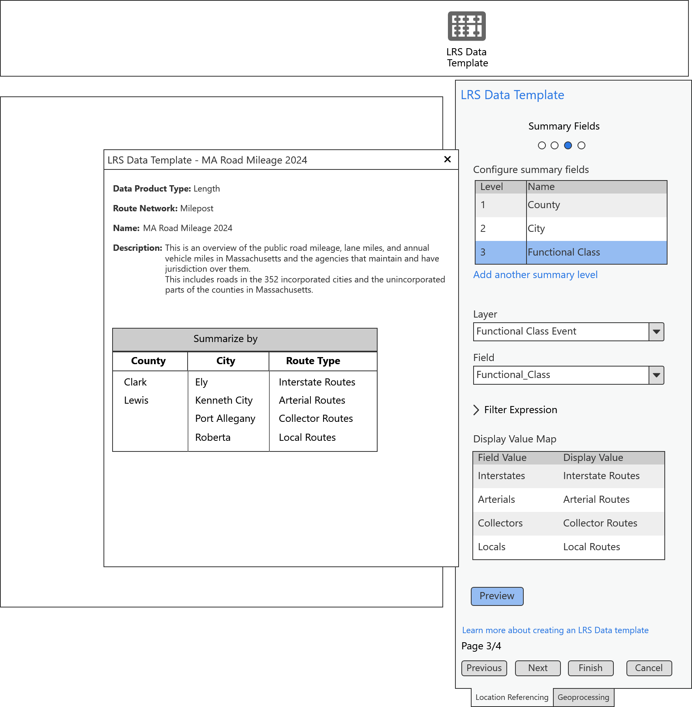
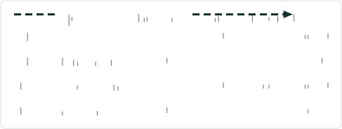
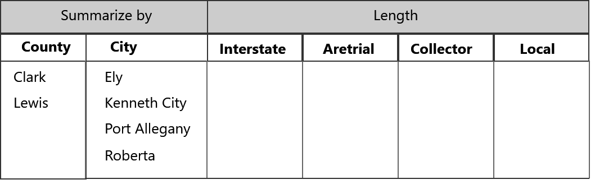
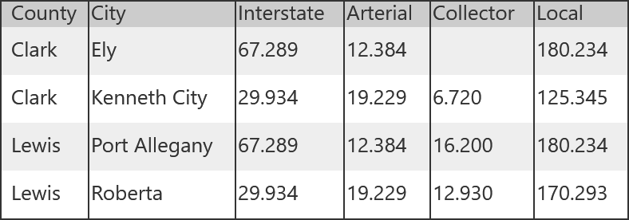

# LR Data Products: Support multiple summary fields

|   |   |
| --- | --- |
| **Kind** | User Story · Pro |
| **Release** | — |
| **Source** | [Report_Canvas5_SummaryFields_Multiple_V1.pptx](<https://esriis.sharepoint.com/sites/LocationReferencing/Shared%20Documents/General/Report_Canvas5_SummaryFields_Multiple_V1.pptx>) |
| **Edited** | 2024-07-02 22:05 by Rahul Rakshit |
| **Extracted** | 2026-09-04 · lane `xmlstrip` |

<!-- metadata
```yaml
title: "LR Data Products: Support multiple summary fields"
source_file: "Report_Canvas5_SummaryFields_Multiple_V1.pptx"
source_url: "https://esriis.sharepoint.com/sites/LocationReferencing/Shared%20Documents/General/Report_Canvas5_SummaryFields_Multiple_V1.pptx"
doc_id: 356
doc_kind: "User Story"
surface: "Pro"
doc_revision: "V1"
target_release: ""
pe: "GIS Analyst"
dev: ""
author: "Rahul Rakshit"
last_edited_by: "Rahul Rakshit"
last_edited: "2024-07-02T22:05:21Z"
extracted: 2026-09-04
extraction_lane: xmlstrip
prompt_version: "v2.0.2"
keywords: ["data product", "summary field", "template", "lrs data template", "gis analyst"]
tools: ["Generate LRS Data Product"]
products: []
issues: []
related: [{"doc":353,"file":"user-story-support-multiple-summary-fields-in-generate-lrs-data-product__doc353.md","s":6.394},{"doc":342,"file":"user-story-for-lrs-data-product-template-with-multiple-length-fields__doc342.md","s":6.021},{"doc":357,"file":"generate-lrs-data-product-support-summary-and-length__doc357.md","s":5.646},{"doc":343,"file":"user-story-for-lrs-data-product-template-with-length-range-values__doc343.md","s":4.959},{"doc":323,"file":"support-multiple-summary-fields-in-lrs-data-template-wizard-test-plan__doc323.md","s":4.771}]
```
-->

## Summary

This user story describes the need for GIS Analysts to create reusable LRS data product templates that support multiple summary fields. It outlines the workflow for adding and deleting summary levels in the template configuration pane and includes testing considerations for theme and compliance.

## Related documents

<!-- related:begin -->
- [User Story: Support Multiple Summary Fields in Generate LRS Data Product](<https://esriis.sharepoint.com/sites/lrsworkspace/LRS Doc Index/User Stories/user-story-support-multiple-summary-fields-in-generate-lrs-data-product__doc353.md>) — similar text 0.39 · 4 title words · 2 filename words · same kind/surface/folder <!-- rel:353 -->
- [User Story for LRS Data Product Template with Multiple Length Fields](<https://esriis.sharepoint.com/sites/lrsworkspace/LRS%20Doc%20Index/User%20Stories/user-story-for-lrs-data-product-template-with-multiple-length-fields__doc342.md>) — similar text 0.48 · 2 title words · 2 filename words · same kind/surface/folder <!-- rel:342 -->
- [Generate LRS Data Product Support Summary and Length](<https://esriis.sharepoint.com/sites/lrsworkspace/LRS%20Doc%20Index/User%20Stories/generate-lrs-data-product-support-summary-and-length__doc357.md>) — similar text 0.32 · 2 title words · 1 filename word · same kind/surface/pe/folder <!-- rel:357 -->
- [User Story for LRS Data Product Template with Length Range Values](<https://esriis.sharepoint.com/sites/lrsworkspace/LRS Doc Index/User Stories/user-story-for-lrs-data-product-template-with-length-range-values__doc343.md>) — similar text 0.53 · 2 filename words · same kind/surface/folder <!-- rel:343 -->
- [Support multiple summary fields in LRS Data Template wizard – Test Plan](<https://esriis.sharepoint.com/sites/lrsworkspace/LRS Doc Index/Test Plans/support-multiple-summary-fields-in-lrs-data-template-wizard-test-plan__doc323.md>) — similar text 0.23 · 4 title words · 3 filename words · same surface <!-- rel:323 -->
<!-- related:end -->

<!-- docs:begin -->
## Esri documentation

[LRS data products](https://doc.esri.com/en/arcgis-pro/latest/help/production/roads-highways/lrs-data-products.html) · [Create a template for an LRS length data product](https://doc.esri.com/en/arcgis-pro/latest/help/production/roads-highways/create-a-template-for-an-lrs-length-data-product.html)

_No page matched:_ [Generate LRS Data Product](https://www.google.com/search?q=%22Generate%20LRS%20Data%20Product%22+site%3Adoc.esri.com)
<!-- docs:end -->

---

## Slide 1

User Story
As a GIS Analyst, I need the ability to create a reusable LRS data product template that can be used by the Generate LRS Data Product geoprocessing tool. It’d be very helpful if I can add more than one level of summary to the template.
Persona
GIS Analyst: These users know how to work with ArcGIS Pro. They will design a reusable data template based on an existing paper or digital report. Their duty will be to ensure that the Data Product’s constituents closely mirror those of its predecessors.
They may also create a new templates as needed by their agency.
Workflow

- The user opens the LRS Data Template wizard
- The LRS Data Template pane opens in the right
- The type of data product is selected
- The name, network and description are provided
- A  summary field is chosen
- Another summary field is chosen
- A length field is chosen

LR Data Products: Support multiple summary fields
style.visibilitystyle.visibility

## Slide 2

User Story: Details

- Add the text “Add another summary level” at the bottom of the Configure summary fields table
- Clicking on this text adds a new summary level (n+1) where n was the previous level
- Place the cursor to the summary name cell
- Clear the contents of the rest of the parameters of the pane
- No restriction on the number of summary fields

Note: These symbols        are only for explaining the workflow.
Do not create them in the UI.

  

## Slide 3

User Story: Details
2nd summary field added
3rd summary field added

- Update the canvas accordingly
- Provide the ability to delete a row from the Configure summary fields list
x
x

 

## Slide 4

User Story
Template Canvas
CSV from GP Tool
This output is not part of this user story

 

## Slide 5



User Story:
Template Canvas
CSV from GP Tool
This output is not part of this user story

 

## Slide 6

Testing

- Test with dark and light theme
- 508 and i18n compliance
- Test with different type of summary layers such as polygon, network and line event

## Slide 7

Documentation

## Slide 8

Automation

## Slide 9

Estimate
