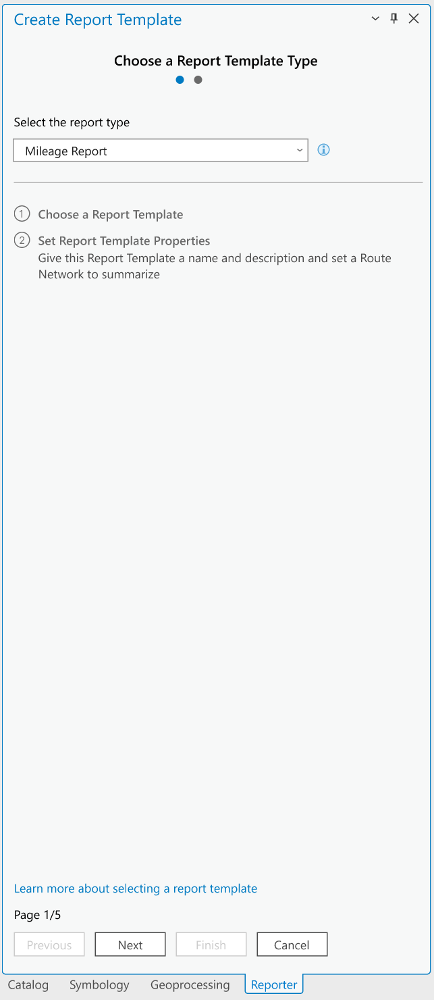
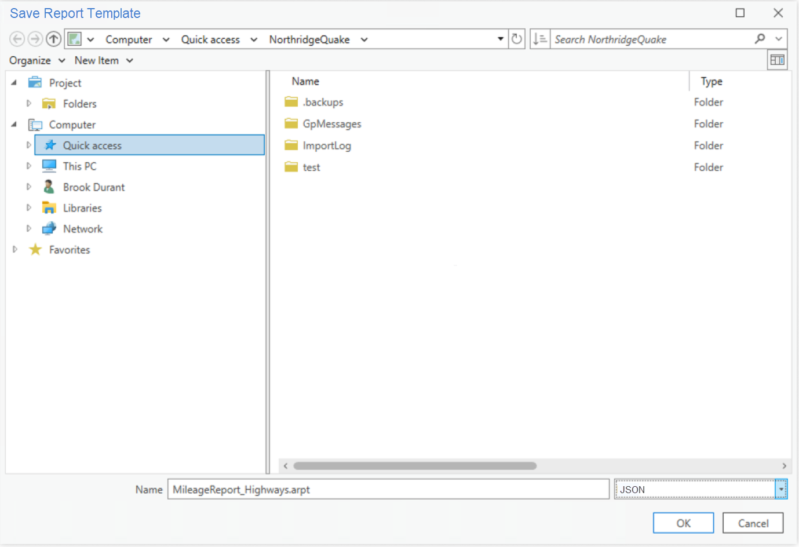
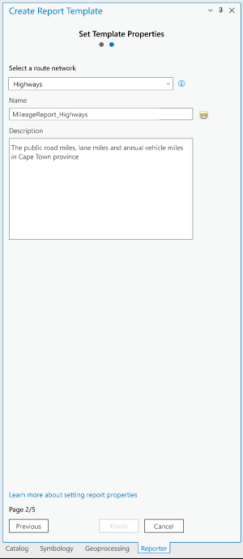
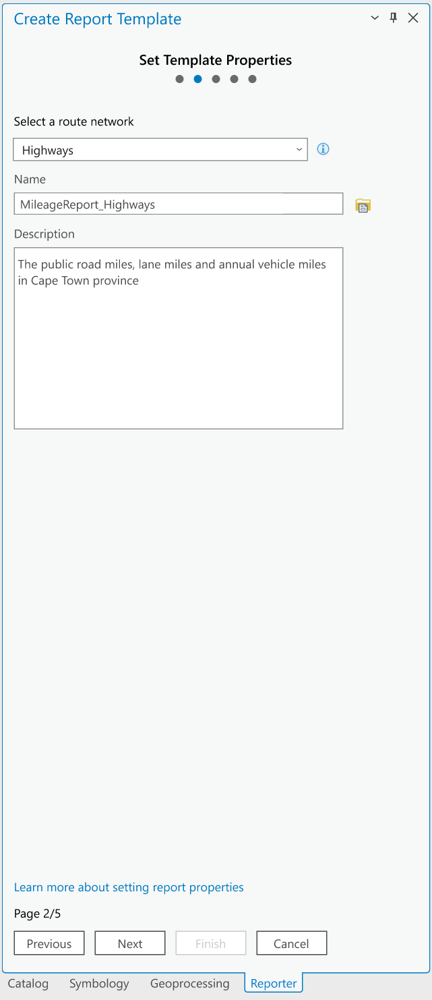
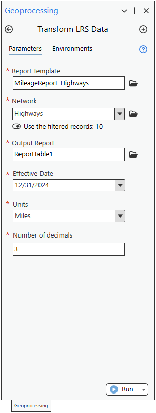

# LR Reporting: Create a template tool User Story

| Field | Value |
| --- | --- |
| **Doc** | 374 · User Story · Pro |
| **Product** | — |
| **Release** | — |
| **Issues** | — |
| **Source** | [Report_Template1_UserStory.pptx](<https://esriis.sharepoint.com/sites/LocationReferencing/Shared%20Documents/General/Report_Template1_UserStory.pptx>) |
| **People** | author Rahul Rakshit · PE — · dev — |
| **Edited** | 2024-05-14 21:24 by Rahul Rakshit |
| **Extracted** | 2026-09-04 · lane xmlstrip · format 3.0 · prompt v2.0.2 |
| **Keywords** | report template · template creation · location referencing ribbon · mileage report · json file · route network · arcgis pro |
| **Tools** | Transform LRS Data |

## Summary

Describes a user story for GIS Analysts to create reusable report templates for the Transform LRS Data geoprocessing tool in ArcGIS Pro. Details the interface design for a new Create Template tool in the Location Referencing ribbon, including template creation, updating, and saving as JSON files. Covers testing scenarios, error handling, and UI considerations such as 508 compliance and dark/light modes.

## Related documents

<!-- related:begin -->
- [LR Reporting Canvas Experience User Story](<https://esriis.sharepoint.com/sites/lrsworkspace/LRS%20Doc%20Index/User%20Stories/5797-lr-reporting-canvas-experience.md>) — similar text 0.31 · 1 title word · 1 filename word · same kind/surface/folder <!-- rel:367 s=4.544 -->
- [User Story for LRS Data Product Template with Length Range Values](<https://esriis.sharepoint.com/sites/lrsworkspace/LRS Doc Index/User Stories/for-lrs-data-product-template-with-length-range-values.md>) — similar text 0.46 · 1 filename word · same kind/surface/folder <!-- rel:343 s=3.737 -->
- [User Story for LRS Data Product Template with Multiple Length Fields](<https://esriis.sharepoint.com/sites/lrsworkspace/LRS%20Doc%20Index/User%20Stories/for-lrs-data-product-template-with-multiple-length-fields.md>) — similar text 0.31 · 1 filename word · same kind/surface/folder <!-- rel:342 s=3.519 -->
- [Reporting Location Referencing Mileage for Line Network](<https://esriis.sharepoint.com/sites/lrsworkspace/LRS Doc Index/User Stories/reporting-lr-mileage-for-line-network.md>) — similar text 0.23 · 1 title word · same kind/surface/folder <!-- rel:368 s=3.398 -->
- [LR Data Products: Support multiple summary fields](<https://esriis.sharepoint.com/sites/lrsworkspace/LRS Doc Index/User Stories/lr-data-products-support-multiple-summary-fields.md>) — similar text 0.31 · 1 filename word · same kind/surface/folder <!-- rel:356 s=3.183 -->
<!-- related:end -->

<!-- docs:begin -->
## Esri documentation

_No page matched:_ [Transform LRS Data](https://www.google.com/search?q=%22Transform%20LRS%20Data%22+site%3Adoc.esri.com)
<!-- docs:end -->

---

## Slide 1 — LR Reporting: Create a template tool

User Story
Persona
As a GIS Analyst, I need the ability to create a reusable report template that can be used by the Transform LRS Data geoprocessing tool.
GIS Analyst: These users know how to work with ArcGIS Pro. They will design a reusable report template based on an existing paper or digital report. Their duty will be to ensure that the report's constituents closely mirror those of its predecessors.
They may also create a new templates as needed by their agency.

## Slide 2

Create a new section in the LR ribbon in Pro and add a new tool called Create Template.

## Slide 3

- Open this pane upon clicking the tool
- The drop-down is disabled as only one report type (mileage report) is available in this release.
- The name of the Tab should be Location Referencing

## Slide 4

- Open this pane upon clicking Next
- Move file name to the top
- Select a route network: Select only from the LRS networks listed in the TOC.
- Name
  - Number of characters in the name follow the rules set up by ArcGIS Pro
  - File type is Json
  - Saved to the project directory by default
  - Clicking the browse button opens another dialog to select a location for saving the report template

Finish

- Description: Limit to 255 characters
- Save LRS ID, Network Name/ID, Template Name and description in the Json file.
- Clicking the Finish button saves all this info in the Json file
- At this stage, the user has saved the report template without adding any summary field or mileage fields.
- If the template is created using a FGDB then do not allow to run the GP tool on anything except FGDB and match the network name.

## Slide 5

Finish

- This wizard can be used both for creating a new template and to update the contents of an existing one. Here is the process for updating the template:
  - Select an already existing template file
    - It populates the Route Network and Description parameters
  - Make any changes as desired
  - Click Finish to save the changes

## Slide 6

| Output |  |
| --- | --- |
| Route ID | Mileage |
| Park Ave | 24 |
| Throughline | 26 |
| Wait Wait St | 22 |
| Daily | 30.174 |
| Hidden | 32.742 |

- If they use the template as-is with routes with the GP tool, we get the report that looks like this:
- This tool runs only when the Network Layer ID/Name matches to that of the one selected in the tool.

## Slide 7

Testing

- Test with multiple networks from the same database in the TOC
- Test with multiple networks from the different databases in the TOC
- 508 and i18n
- Dark and light modes
- Error Messages:
  - Invalid file name
  - No description provided
  - Number of characters exceeded the limit for description

## Slide 8

Documentation
No documentation for this user story.
Update the ribbon screenshots in the doc with this new button.

## Slide 9

Automation

## Slide 10

Estimation
