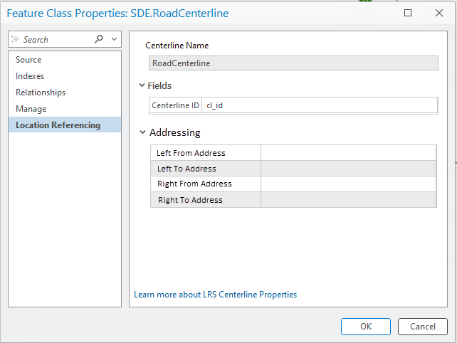
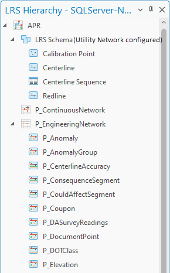

# LRS Addressing and Utility Network Properties User Story

| Field | Value |
| --- | --- |
| **Doc** | 190 · User Story · Pro |
| **Product** | Utility Network |
| **Release** | — |
| **Issues** | — |
| **Source** | [LRS Addressing UN Properties.pptx](<https://esriis.sharepoint.com/sites/LocationReferencing/Shared%20Documents/General/LRS%20Addressing%20UN%20Properties.pptx>) |
| **People** | author William Isley · PE — · dev Eric |
| **Edited** | 2025-04-03 17:01 by Nathan Easley |
| **Extracted** | 2026-09-04 · lane xmlstrip · format 3.0 · prompt v2.0.2 |
| **Keywords** | addressing · utility network · lrs hierarchy · address range · site address · centerline · location referencing · accessibility · internationalization |
| **Tools** | — |

## Summary

Describes a user story for enhancing the Location Referencing system to display properties of Address and Utility Network feature classes within the LRS Hierarchy. Includes requirements for UI elements such as icons, accordion sections, field displays, accessibility compliance, and internationalization readiness. Also covers testing scenarios and documentation updates.

## Related documents

<!-- related:begin -->
- [Show ADM and UN in LRS hierarchy and properties – Test Plan](<https://esriis.sharepoint.com/sites/lrsworkspace/LRS Doc Index/Test Plans/6383-show-adm-and-un-in-lrs-hierarchy-and-properties.md>) — similar text 0.55 · 1 title word · 1 filename word · same surface <!-- rel:159 s=5.484 -->
- [LRS Intersection Properties User Story](<https://esriis.sharepoint.com/sites/lrsworkspace/LRS Doc Index/User Stories/lrs-intersection-properties.md>) — similar text 0.39 · 1 title word · 1 filename word · same kind/surface/folder <!-- rel:843 s=4.525 -->
- [Route Dominance Properties User Story](<https://esriis.sharepoint.com/sites/lrsworkspace/LRS Doc Index/User Stories/route-dominance-properties.md>) — similar text 0.36 · 1 title word · 1 filename word · same kind/surface/folder <!-- rel:699 s=4.465 -->
- [LRS and Gap Calibration Properties User Story](<https://esriis.sharepoint.com/sites/lrsworkspace/LRS Doc Index/User Stories/lrs-and-gap-calibration-properties.md>) — similar text 0.38 · 1 title word · 1 filename word · same kind/surface/folder <!-- rel:842 s=4.116 -->
- [Configure Addressing Feature Classes](<https://esriis.sharepoint.com/sites/lrsworkspace/LRS Doc Index/User Stories/configure-addressing-feature-classes.md>) — similar text 0.28 · 1 title word · 1 filename word · same kind/surface/folder <!-- rel:450 s=3.956 -->
<!-- related:end -->

<!-- docs:begin -->
## Esri documentation

[Modify calibration points](https://doc.esri.com/en/arcgis-pro/latest/help/production/location-referencing-pipelines/modify-calibration-points.html) · [View site address point properties](https://doc.esri.com/en/arcgis-pro/latest/help/production/roads-highways/view-site-address-point-properties.html) · [View utility network feature class properties](https://doc.esri.com/en/arcgis-pro/latest/help/production/location-referencing-pipelines/view-utility-network-feature-class-properties.html) · [View the LRS hierarchy](https://doc.esri.com/en/arcgis-pro/latest/help/production/location-referencing-pipelines/view-the-lrs-hierarchy.html) · [Set Location Referencing options](https://doc.esri.com/en/arcgis-pro/latest/help/production/location-referencing-pipelines/set-location-referencing-options.html)
<!-- docs:end -->

---

## Story
### LRS Addressing and UN Properties/Hierarchy <!-- slide 1 -->
User Story

### User Story <!-- slide 2 -->
As a Location Referencing user, I need to be able to see the properties of my Address and Utility Network feature classes, so I can quickly verify which fields/layers are configured and understand which fields will be updated during LRS editing and other operations.

## Acceptance Criteria
### Addressing in LRS Hierarchy <!-- slide 3 -->
- Create a section within the LRS Hierarchy for Addressing (will need an icon for this)
- Only show when addressing is configured
- Show the Site Address (will need an icon) and Address Range Layers configured with the LRS
- Allow the user to right click and open properties like with other LRS schema items
- Allow the user to add each layer to the map like with other LRS schema items
- If the Address Range layer is the centerline or an event, continue to show it in both the addressing section and the other section it belongs to (minimum schema or with other events under the network)
- Needs to be 508 compliant – A11y, Dark Mode, Tabbing
- Should be I18n ready

### Address Properties <!-- slide 4 -->
- In the Centerline, under the Location Referencing properties add a section called Addressing
- Hide this section if Addressing isn’t configured
- Make the section an accordion that can expand/contract
- Show the following fields within the section (just the field name, not db or user)
  - Left From Address
  - Left To Address
  - Right From Address
  - Right To Address
- If the value or field name is very long, size it according to the window and provide hover content
- Support hovering over any long field names to see the full value

### UN Properties <!-- slide 5 -->
- If UN is configured, show text “Utility Network” next to the LRS Schema in the LRS Hierarchy
- Needs to be 508 compliant – A11y, Dark Mode, Tabbing
- Should be I18n ready
- Note: The UN properties in the Location Referencing section of the Centerline layer/fc should be moved out to a separate section called “Utility Network”.  Follow the same rules from the Addressing section on the previous slide around availability when it’s configured.

## Testing
<!-- slide 6 -->
- FGDB, EGDB (traditional and branch), Services
- Layers and Feature Classes
- Make change in Modify LRS Intersection tool
- Long values
- Select and copy
- Dark and light theme
- Switch maps
- Click properties link

## Automation
<!-- slide 7 -->
- No automation

## Documentation
<!-- slide 8 -->
- Update the View Centerline Properties topic and the new Addressing fields that can be present in the Fields section

## Assignment
<!-- slide 9 -->
Story Points:
Dev: Eric
