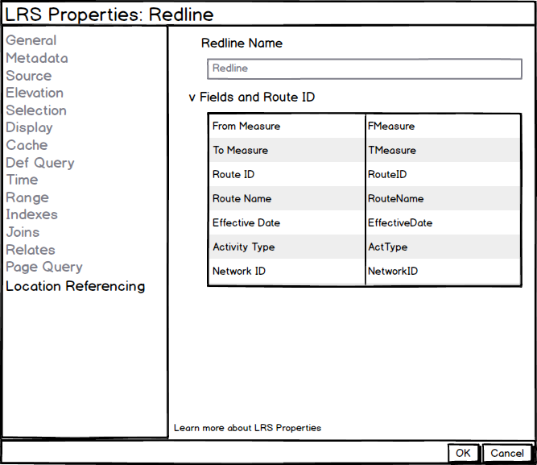
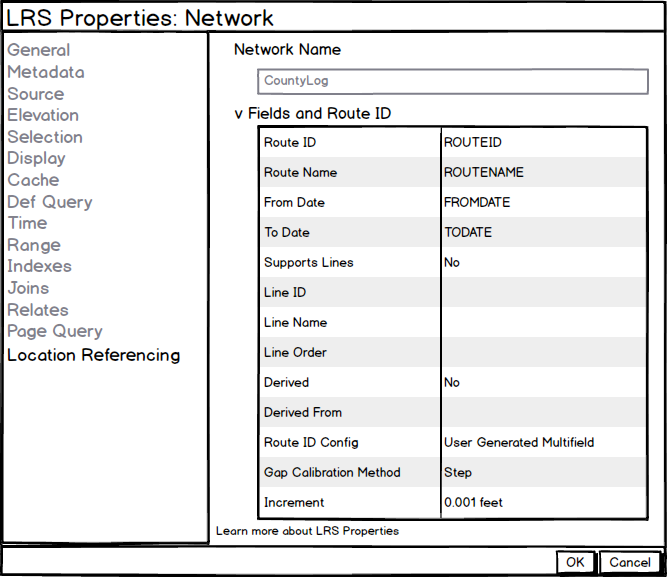

# LRS and Gap Calibration Properties User Story

|   |   |
| --- | --- |
| **Kind** | User Story · Pro |
| **Release** | — |
| **Product** | Roads & Highways · Pipeline Referencing |
| **Source** | [LRS and Gap Calibration Properties.pptx](<https://esriis.sharepoint.com/sites/LocationReferencing/Shared%20Documents/General/LRS%20and%20Gap%20Calibration%20Properties.pptx>) |
| **Edited** | 2019-12-31 19:37 by Nathan Easley |
| **Extracted** | 2026-09-04 · lane `xmlstrip` |

<!-- metadata
```yaml
title: "LRS and Gap Calibration Properties User Story"
source_file: "LRS and Gap Calibration Properties.pptx"
source_url: "https://esriis.sharepoint.com/sites/LocationReferencing/Shared%20Documents/General/LRS%20and%20Gap%20Calibration%20Properties.pptx"
doc_id: 842
doc_kind: "User Story"
surface: "Pro"
doc_revision: ""
target_release: ""
pe: ""
dev: ""
author: "William Isley"
last_edited_by: "Nathan Easley"
last_edited: "2019-12-31T19:37:08Z"
extracted: 2026-09-04
extraction_lane: xmlstrip
prompt_version: "v2.0.2"
keywords: ["gap calibration", "lrs properties", "calibration point", "centerline", "redline", "centerline sequence", "location referencing"]
tools: []
products: ["Roads & Highways", "Pipeline Referencing"]
issues: []
related: [{"doc":843,"file":"lrs-intersection-properties-user-story__doc843.md","s":4.523},{"doc":699,"file":"route-dominance-properties-user-story__doc699.md","s":4.479},{"doc":190,"file":"lrs-addressing-and-utility-network-properties-user-story__doc190.md","s":4.116},{"doc":159,"file":"show-adm-and-un-in-lrs-hierarchy-and-properties-test-plan__doc159.md","s":2.649},{"doc":687,"file":"add-line-event-tool-in-arcgis-pro__doc687.md","s":2.59}]
```
-->

## Summary

Describes user needs to view LRS properties and gap calibration configuration in LRS Networks for verification during editing. Details how LRS properties should be accessed and displayed for various feature classes and tables, including requirements for accessibility and internationalization. Specifies testing scenarios and documentation updates related to these properties.

## Related documents

<!-- related:begin -->
- [LRS Intersection Properties User Story](<https://esriis.sharepoint.com/sites/lrsworkspace/LRS Doc Index/User Stories/lrs-intersection-properties-user-story__doc843.md>) — similar text 0.65 · 1 title word · 1 filename word · same kind/surface/folder <!-- rel:843 -->
- [Route Dominance Properties User Story](<https://esriis.sharepoint.com/sites/lrsworkspace/LRS Doc Index/User Stories/route-dominance-properties-user-story__doc699.md>) — similar text 0.58 · 1 title word · 1 filename word · same kind/surface/folder <!-- rel:699 -->
- [LRS Addressing and Utility Network Properties User Story](<https://esriis.sharepoint.com/sites/lrsworkspace/LRS Doc Index/User Stories/lrs-addressing-and-utility-network-properties-user-story__doc190.md>) — similar text 0.38 · 1 title word · 1 filename word · same kind/surface/folder <!-- rel:190 -->
- [Show ADM and UN in LRS hierarchy and properties – Test Plan](<https://esriis.sharepoint.com/sites/lrsworkspace/LRS Doc Index/Test Plans/show-adm-and-un-in-lrs-hierarchy-and-properties-test-plan__doc159.md>) — similar text 0.27 · 1 title word · 1 filename word · same surface <!-- rel:159 -->
- [Add Line Event tool in ArcGIS Pro](<https://esriis.sharepoint.com/sites/lrsworkspace/LRS Doc Index/User Stories/add-line-event-tool-in-arcgis-pro__doc687.md>) — similar text 0.11 · same kind/surface/folder <!-- rel:687 -->
<!-- related:end -->

<!-- docs:begin -->
## Esri documentation

[View redline properties](https://doc.esri.com/en/arcgis-pro/latest/help/production/roads-highways/view-redline-properties.html) · [View centerline sequence table properties](https://doc.esri.com/en/arcgis-pro/latest/help/production/roads-highways/view-centerline-sequence-table-properties.html) · [Set Location Referencing options](https://doc.esri.com/en/arcgis-pro/latest/help/production/roads-highways/set-location-referencing-options.html)

_No page matched:_ [calibration point layer](https://www.google.com/search?q=%22calibration%20point%20layer%22+site%3Adoc.esri.com)
<!-- docs:end -->

---

## Slide 1 — LRS and Gap Calibration Properties

User Story

## Slide 2 — User Story

As a Location Referencing user, I need to be able to see the LRS properties, like fields configured, for the LRS minimum schema, so I can verify which fields are configured and should be populated during editing.

I also need to be able to see the gap calibration configuration in my LRS Networks, so that I can verify the correct measures are applied when introducing gaps during LRS editing.

## Slide 3 — LRS Properties

Should apply to the Centerline, Calibration Point, Redline, and Centerline Sequence
Should be able to be accessed in these two ways:

  - In the Catalog window, navigate to the FC/table, right click, select properties, and navigate to LocationReferencing tab.
  - In the map, navigate to the contents window, right click the FC/table, select properties, and navigate to LocationReferencing tab.
Should be available via fgdb (catalog and layer), egdb (catalog and layer), and feature service (layer)
Should appear if Location Referencing (RH or APR) is not licensed (Pro pattern)
Field should not be editable, but should be selectable and copiable
If the value or field name is very long, size it according to the window and provide hover content
Information should be pulled from the LRS Controller Dataset (not the LRS Metadata table)
Accordion should be closed by default like other Pro accordions
Needs to be 508 compliant – A11y, Dark Mode, Tabbing
Should be I18n ready
Green text at bottom should link to page that describes the property window
Take all of these through Integration with the Pro leadership

## Slide 4 — Centerline

Display only the field name, not the fully qualified name (db.user.field)
Field should not be blank as it’s required to be configured


## Slide 5 — Calibration Point

Display only the field name, not the fully qualified name (db.user.field)
Fields should not be blank as they’re required to be configured


## Slide 6 — Redline

Display only the field name, not the fully qualified name (db.user.field)
Fields should not be blank as they’re required to be configured



## Slide 7 — Centerline Sequence

Display only the field name, not the fully qualified name (db.user.field)
Fields should not be blank as they’re required to be configured


## Slide 8 — Gap Calibration (LRS Networks)

Add two additional rows to the Fields and Route ID section, Gap Calibration Method and Increment
For increment, get the unit of measure from the Controller Dataset
For Euclidean, leave the increment empty with no unit of measure
Should be available via fgdb (catalog and layer), egdb (catalog and layer), and feature service (layer)
Should appear if Location Referencing (RH or APR) is not licensed (Pro pattern)
Field should not be editable, but should be selectable and copiable
Information should be pulled from the LRS Controller Dataset (not the LRS Metadata table)
Needs to be 508 compliant – A11y, Dark Mode, Tabbing
Should be I18n ready



## Slide 9 — Testing

Test with and without Location Referencing license
FGDB, EGDB (traditional and branch), Services
Layers and Feature Classes/Tables
No Metadata table present
Change version
Make change in Modify LRS tool
Long values
Tab, scroll, resize, hover
Select and copy
Dark and light theme

  - L18N
  - Switch maps
  - Click properties link

## Slide 10 — Documentation

Add information related to gap calibration in Fields and RouteID properties section of View LRS Network properties topic
Create a topic for View LRS Properties that includes each of the minimum schema items and what they show

## Slide 11 — Assignment

Story Points:
Dev:
Test Plan PE:
