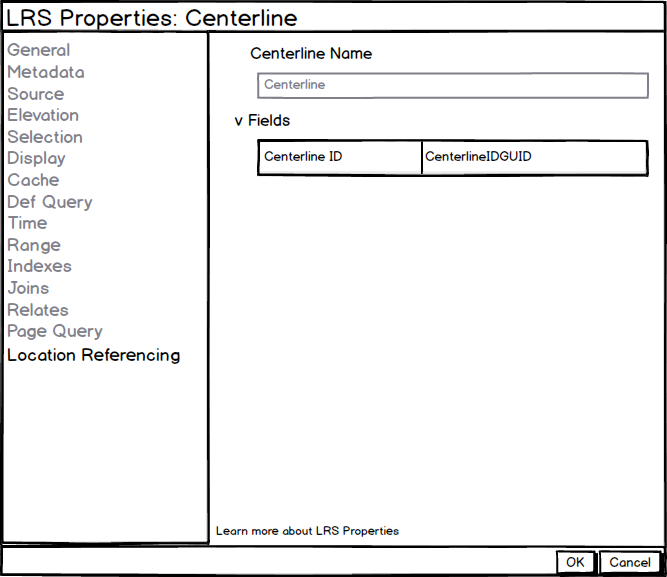
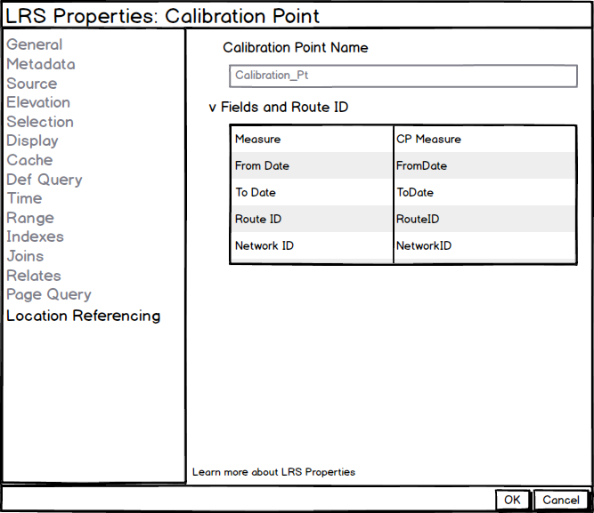
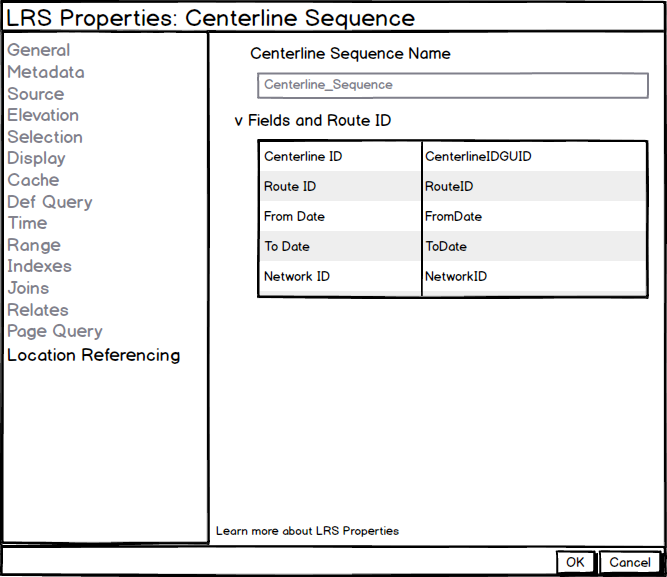

# LRS and Gap Calibration Properties User Story

| Field | Value |
| --- | --- |
| **Doc** | 842 · User Story · Pro |
| **Product** | Roads & Highways · Pipeline Referencing |
| **Release** | — |
| **Issues** | — |
| **Source** | [LRS and Gap Calibration Properties.pptx](<https://esriis.sharepoint.com/sites/LocationReferencing/Shared%20Documents/General/LRS%20and%20Gap%20Calibration%20Properties.pptx>) |
| **People** | author William Isley · PE — · dev — |
| **Edited** | 2019-12-31 19:37 by Nathan Easley |
| **Extracted** | 2026-09-04 · lane xmlstrip · format 3.0 · prompt v2.0.2 |
| **Keywords** | gap calibration · lrs properties · calibration point · centerline · redline · centerline sequence · location referencing |
| **Tools** | — |

## Summary

Describes user needs to view LRS properties and gap calibration configuration in LRS Networks for verification during editing. Details how LRS properties should be accessed and displayed for various feature classes and tables, including requirements for accessibility and internationalization. Specifies testing scenarios and documentation updates related to these properties.

## Related documents

<!-- related:begin -->
- [LRS Intersection Properties User Story](<https://esriis.sharepoint.com/sites/lrsworkspace/LRS Doc Index/User Stories/lrs-intersection-properties.md>) — similar text 0.65 · 1 title word · 1 filename word · same kind/surface/folder <!-- rel:843 s=4.523 -->
- [Route Dominance Properties User Story](<https://esriis.sharepoint.com/sites/lrsworkspace/LRS Doc Index/User Stories/route-dominance-properties.md>) — similar text 0.58 · 1 title word · 1 filename word · same kind/surface/folder <!-- rel:699 s=4.479 -->
- [LRS Addressing and Utility Network Properties User Story](<https://esriis.sharepoint.com/sites/lrsworkspace/LRS Doc Index/User Stories/lrs-addressing-and-un-properties.md>) — similar text 0.38 · 1 title word · 1 filename word · same kind/surface/folder <!-- rel:190 s=4.116 -->
- [Show ADM and UN in LRS hierarchy and properties – Test Plan](<https://esriis.sharepoint.com/sites/lrsworkspace/LRS Doc Index/Test Plans/6383-show-adm-and-un-in-lrs-hierarchy-and-properties.md>) — similar text 0.27 · 1 title word · 1 filename word · same surface <!-- rel:159 s=2.649 -->
- [Add Line Event tool in ArcGIS Pro](<https://esriis.sharepoint.com/sites/lrsworkspace/LRS Doc Index/User Stories/add-line-event-tool-in-pro.md>) — similar text 0.11 · same kind/surface/folder <!-- rel:687 s=2.59 -->
<!-- related:end -->

<!-- docs:begin -->
## Esri documentation

[View redline properties](https://doc.esri.com/en/arcgis-pro/latest/help/production/roads-highways/view-redline-properties.html) · [View centerline sequence table properties](https://doc.esri.com/en/arcgis-pro/latest/help/production/roads-highways/view-centerline-sequence-table-properties.html) · [Set Location Referencing options](https://doc.esri.com/en/arcgis-pro/latest/help/production/roads-highways/set-location-referencing-options.html)

_No page matched:_ [calibration point layer](https://www.google.com/search?q=%22calibration%20point%20layer%22+site%3Adoc.esri.com)
<!-- docs:end -->

---

## Story
### LRS and Gap Calibration Properties <!-- slide 1 -->
User Story

### User Story <!-- slide 2 -->
As a Location Referencing user, I need to be able to see the LRS properties, like fields configured, for the LRS minimum schema, so I can verify which fields are configured and should be populated during editing.

I also need to be able to see the gap calibration configuration in my LRS Networks, so that I can verify the correct measures are applied when introducing gaps during LRS editing.

## Acceptance Criteria
### LRS Properties <!-- slide 3 -->
- Should apply to the Centerline, Calibration Point, Redline, and Centerline Sequence
- Should be able to be accessed in these two ways:
  - In the Catalog window, navigate to the FC/table, right click, select properties, and navigate to LocationReferencing tab.
  - In the map, navigate to the contents window, right click the FC/table, select properties, and navigate to LocationReferencing tab.
- Should be available via fgdb (catalog and layer), egdb (catalog and layer), and feature service (layer)
- Should appear if Location Referencing (RH or APR) is not licensed (Pro pattern)
- Field should not be editable, but should be selectable and copiable
- If the value or field name is very long, size it according to the window and provide hover content
- Information should be pulled from the LRS Controller Dataset (not the LRS Metadata table)
- Accordion should be closed by default like other Pro accordions
- Needs to be 508 compliant – A11y, Dark Mode, Tabbing
- Should be I18n ready
- Green text at bottom should link to page that describes the property window
- Take all of these through Integration with the Pro leadership

### Centerline <!-- slide 4 -->
- Display only the field name, not the fully qualified name (db.user.field)
- Field should not be blank as it’s required to be configured

### Calibration Point <!-- slide 5 -->
- Display only the field name, not the fully qualified name (db.user.field)
- Fields should not be blank as they’re required to be configured

### Redline <!-- slide 6 -->
- Display only the field name, not the fully qualified name (db.user.field)
- Fields should not be blank as they’re required to be configured

### Centerline Sequence <!-- slide 7 -->
- Display only the field name, not the fully qualified name (db.user.field)
- Fields should not be blank as they’re required to be configured

### Gap Calibration (LRS Networks) <!-- slide 8 -->
- Add two additional rows to the Fields and Route ID section, Gap Calibration Method and Increment
- For increment, get the unit of measure from the Controller Dataset
- For Euclidean, leave the increment empty with no unit of measure
- Should be available via fgdb (catalog and layer), egdb (catalog and layer), and feature service (layer)
- Should appear if Location Referencing (RH or APR) is not licensed (Pro pattern)
- Field should not be editable, but should be selectable and copiable
- Information should be pulled from the LRS Controller Dataset (not the LRS Metadata table)
- Needs to be 508 compliant – A11y, Dark Mode, Tabbing
- Should be I18n ready

## Testing
<!-- slide 9 -->
- Test with and without Location Referencing license
- FGDB, EGDB (traditional and branch), Services
- Layers and Feature Classes/Tables
- No Metadata table present
- Change version
- Make change in Modify LRS tool
- Long values
- Tab, scroll, resize, hover
- Select and copy
- Dark and light theme
  - L18N
  - Switch maps
  - Click properties link

## Documentation
<!-- slide 10 -->
- Add information related to gap calibration in Fields and RouteID properties section of View LRS Network properties topic
- Create a topic for View LRS Properties that includes each of the minimum schema items and what they show

## Assignment
<!-- slide 11 -->
Story Points:
Dev:
Test Plan PE:
