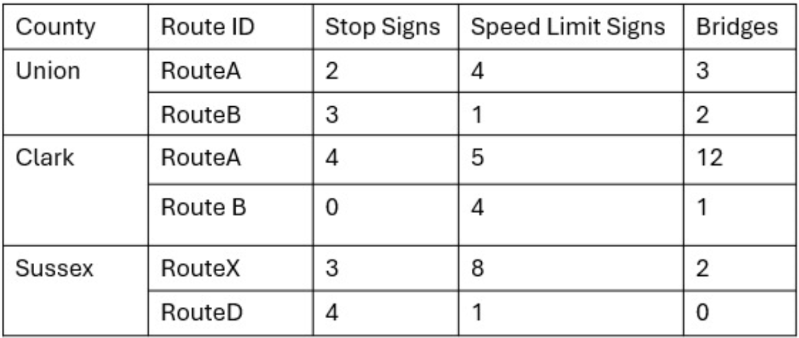
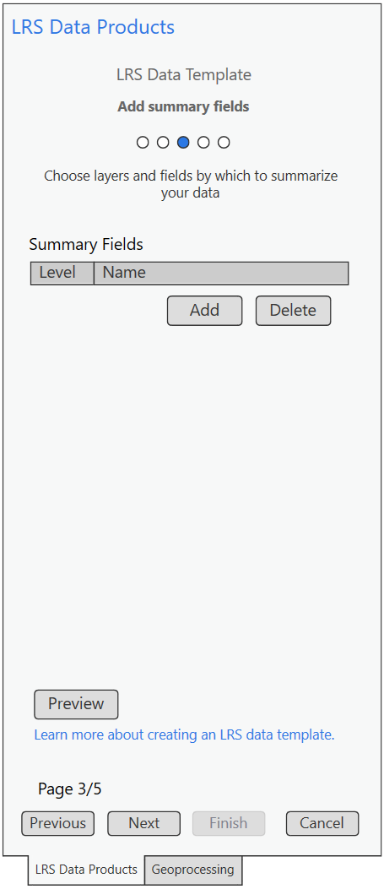
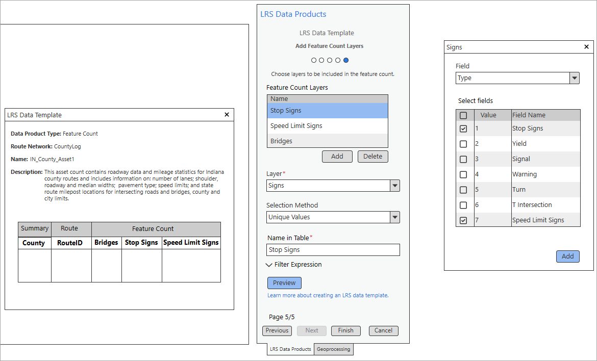

# LRS Data Template: Create a template feature count

|   |   |
| --- | --- |
| **Kind** | User Story · Pro |
| **Release** | — |
| **Source** | [5_Data_Template2_35_FeatureCount.pptx](<https://esriis.sharepoint.com/sites/LocationReferencing/Shared%20Documents/General/Test%20Plans/5_Data_Template2_35_FeatureCount.pptx>) |
| **Edited** | 2025-01-14 22:58 by Rahul Rakshit |
| **Extracted** | 2026-09-04 · lane `xmlstrip` |

<!-- metadata
```yaml
title: "LRS Data Template: Create a template feature count"
source_file: "5_Data_Template2_35_FeatureCount.pptx"
source_url: "https://esriis.sharepoint.com/sites/LocationReferencing/Shared%20Documents/General/Test%20Plans/5_Data_Template2_35_FeatureCount.pptx"
doc_id: 258
doc_kind: "User Story"
surface: "Pro"
doc_revision: ""
target_release: ""
pe: ""
dev: ""
author: "Rahul Rakshit"
last_edited_by: "Rahul Rakshit"
last_edited: "2025-01-14T22:58:19Z"
extracted: 2026-09-04
extraction_lane: xmlstrip
prompt_version: "v2.0.2"
keywords: ["feature count", "data template", "route identifier", "point event", "line event", "lrs intersections", "summary fields"]
tools: ["Generate LRS Data Product"]
products: []
issues: []
related: [{"doc":254,"file":"feature-count-template-test-plan__doc254.md","s":5.39},{"doc":196,"file":"create-a-template-for-an-lrs-feature-count-data-product__doc196.md","s":4.599},{"doc":198,"file":"create-a-template-for-an-lrs-feature-count-data-product__doc198.md","s":4.571},{"doc":173,"file":"standalone-gp-generate-feature-count-test-plan__doc173.md","s":4.065},{"doc":205,"file":"generate-lrs-data-product-location-referencing__doc205.md","s":2.861}]
```
-->

## Summary

This document describes the creation of a reusable LRS Data template for feature count data products used by the Generate LRS Data Product geoprocessing tool. It covers the feature count functionality for point and line events on routes, template configuration including route identifiers and summary fields, selection methods, and testing considerations. The document also mentions documentation and automation plans along with development and testing time estimates.

## Related documents

<!-- related:begin -->
- [Feature Count Template Test Plan](<https://esriis.sharepoint.com/sites/lrsworkspace/LRS Doc Index/Test Plans/feature-count-template-test-plan__doc254.md>) — similar text 0.46 · 2 title words · 2 filename words · same surface/folder <!-- rel:254 -->
- [Create a template for an LRS feature count data product](<https://esriis.sharepoint.com/sites/lrsworkspace/LRS Doc Index/Other/create-a-template-for-an-lrs-feature-count-data-product__doc196.md>) — similar text 0.19 · 3 title words · 2 filename words · same surface <!-- rel:196 -->
- [Create a template for an LRS feature count data product](<https://esriis.sharepoint.com/sites/lrsworkspace/LRS Doc Index/Other/create-a-template-for-an-lrs-feature-count-data-product__doc198.md>) — similar text 0.19 · 3 title words · 2 filename words · same surface <!-- rel:198 -->
- [Standalone GP – Generate Feature Count – Test Plan](<https://esriis.sharepoint.com/sites/lrsworkspace/LRS Doc Index/Test Plans/standalone-gp-generate-feature-count-test-plan__doc173.md>) — similar text 0.35 · 2 title words · 2 filename words · same surface <!-- rel:173 -->
- [Generate LRS Data Product (Location Referencing)](<https://esriis.sharepoint.com/sites/lrsworkspace/LRS Doc Index/Other/generate-lrs-data-product-location-referencing__doc205.md>) — similar text 0.14 · 2 filename words · same surface <!-- rel:205 -->
<!-- related:end -->

<!-- docs:begin -->
## Esri documentation

[Create a template for an LRS feature count data product](https://doc.esri.com/en/arcgis-pro/latest/help/production/roads-highways/create-a-template-for-an-lrs-feature-count-data-product.html) · [Create a template for an LRS length data product](https://doc.esri.com/en/arcgis-pro/latest/help/production/roads-highways/create-a-template-for-an-lrs-length-data-product.html) · [View LRS intersection properties](https://doc.esri.com/en/arcgis-pro/latest/help/production/location-referencing-pipelines/view-lrs-intersection-properties.html)

_No page matched:_ [Generate LRS Data Product](https://www.google.com/search?q=%22Generate%20LRS%20Data%20Product%22+site%3Adoc.esri.com)
<!-- docs:end -->

---

## Slide 1

LRS Data Template: Create a template feature count
User Story
Persona
As a GIS Analyst, I need the ability to create a reusable LRS Data template for feature count data product that can be used by the Generate LRS Data Product geoprocessing tool.
GIS Analyst: These users know how to work with ArcGIS Pro. They will design a reusable report template based on an existing paper or digital report. Their duty will be to ensure that the report's constituents closely mirror those of its predecessors.
They may also create a new templates as needed by their agency.

## Slide 2

Provides the number of point or line events located on a route
Feature Count



## Slide 3


- Add a new data product type in the drop-down list: Feature Count
- Update the step descriptions based on the chosen data product type. The descriptions for the Feature Count are provided in the graphic.
Page1 – Select Data Product Type


## Slide 4


- The Data Product Type will be Feature Count.
Page2 – Template name and details


## Slide 5


- Use the same controls used for the Length product template.
- The feature counts are summarized for the routes that are clipped as per the summary layers.
- The summary layers are nested.
- Support polygon layers and line events.
Page3 – Summary Fields

 

## Slide 6


- The RouteID/Route Name field will be identified in this page
- Route Identifier field has a dropdown showing the fields available in the Network FC
- Select RID for non line network automatically and do not show the drop down.
- Populate the Field Name in the table field with the Route Identifier field by default but this value is editable
- For Line Network, add an additional column named “Line name” and provide the Line name of the Route in the output

Page4 – Route Identifier field


## Slide 7

- The participants of the feature count are added in the page.
- Support Line Events, Point Events and LRS intersections.
- A feature is counted for a route when their Route IDs match.
- Intersections will be counted for each of the participating routes.
- Count only the events that can be drawn on the route
- When a point/line event is located at the common boundary of multiple polygons, then only count it for one of the polygons.
- If overlapping polygons exist, then pick one and provide a warning that overlapping polygons existed and one of them was used.
- Unclassified for routes that are not intersecting the boundary polygon.
- If loc errors exist, then provide a warning that events with loc errors are excluded from the output.
- Multi-part events are counted as one
- Feature count to be calculated Route wise. So, count the event (green) for each of the three routes (blue).
Page5 – Adding feature count layers


## Slide 8

Page5 – Selection Methods

- Provide two selection methods: Single value and unique values.
- The control for unique value should work the same as in the template for Length data product.



## Slide 9

Testing

- Test with multiple networks from the same database in the TOC
- Test with multiple networks from the different databases in the TOC
- 508 and i18n
- Dark and light modes
- Error Messages:
  - Invalid file name
  - Cannot add a layer twice

## Slide 10

Documentation
New doc.

## Slide 11

Automation

## Slide 12

Estimation
4 Days dev
4 Days testing
8
