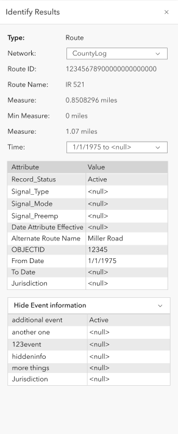
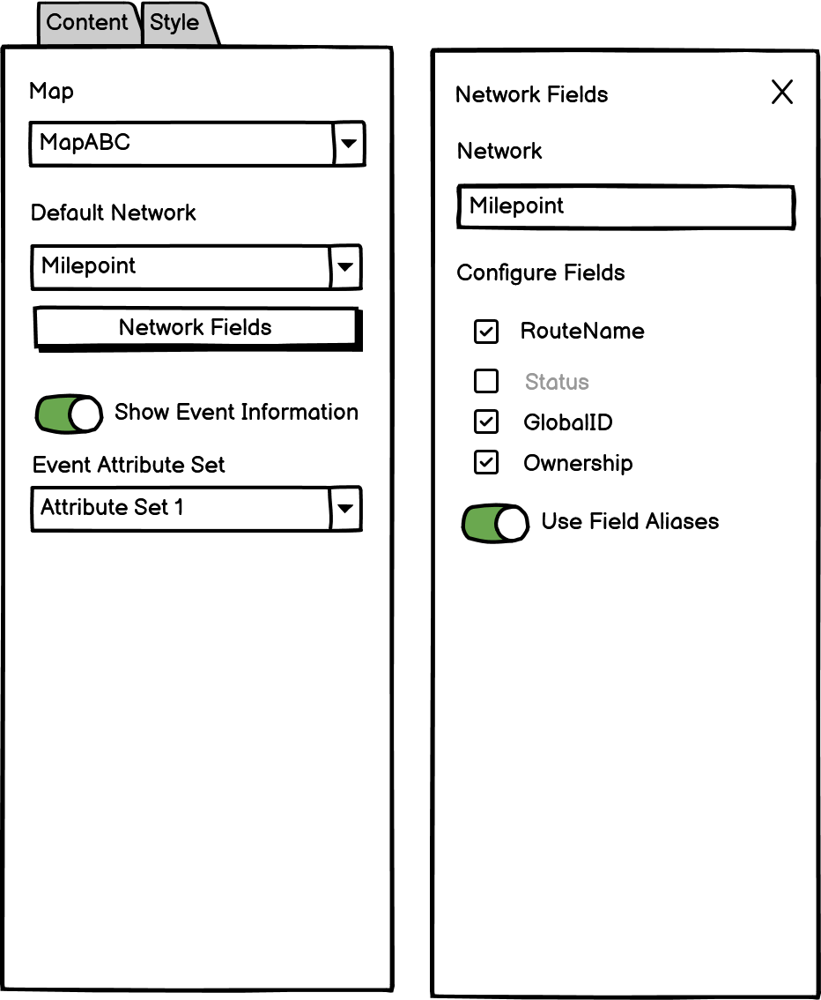

# LRS Identify widget User Story and Configuration

|   |   |
| --- | --- |
| **Kind** | User Story · Experience Builder |
| **Release** | — |
| **Product** | Roads & Highways · Pipeline Referencing |
| **Source** | [ExpBld LRS Identify.pptx](<https://esriis.sharepoint.com/sites/LocationReferencing/Shared%20Documents/General/ExpBld%20LRS%20Identify.pptx>) |
| **Edited** | 2023-11-09 20:58 by Nathan Easley |
| **Extracted** | 2026-09-04 · lane `xmlstrip` |

<!-- metadata
```yaml
title: "LRS Identify widget User Story and Configuration"
source_file: "ExpBld LRS Identify.pptx"
source_url: "https://esriis.sharepoint.com/sites/LocationReferencing/Shared%20Documents/General/ExpBld%20LRS%20Identify.pptx"
doc_id: 465
doc_kind: "User Story"
surface: "Experience Builder"
doc_revision: ""
target_release: ""
pe: ""
dev: ""
author: "William Isley"
last_edited_by: "Nathan Easley"
last_edited: "2023-11-09T20:58:12Z"
extracted: 2026-09-04
extraction_lane: xmlstrip
prompt_version: "v2.0.2"
keywords: ["route attributes", "event attributes", "experience builder widget", "map click interaction", "line attribute set"]
tools: ["LRS Identify"]
products: ["Roads & Highways", "Pipeline Referencing"]
issues: []
related: [{"doc":362,"file":"experience-builder-dynamic-segmentation-widget__doc362.md","s":4.463},{"doc":529,"file":"search-by-route-and-measure-experience-builder-widget__doc529.md","s":4.403},{"doc":476,"file":"search-by-referent-experience-builder-widget__doc476.md","s":4.301},{"doc":464,"file":"search-by-line-experience-builder-widget__doc464.md","s":4.26},{"doc":487,"file":"search-by-coordinate-experience-builder-widget__doc487.md","s":4.207}]
```
-->

## Summary

Describes the user story for the LRS Identify Experience Builder widget that allows users to click on a route location to retrieve route, measure, and event attribute information. Details configuration options for the widget, testing scenarios, automation plans, and documentation requirements.

## Related documents

<!-- related:begin -->
- [Experience Builder Dynamic Segmentation widget](<https://esriis.sharepoint.com/sites/lrsworkspace/LRS Doc Index/User Stories/experience-builder-dynamic-segmentation-widget__doc362.md>) — similar text 0.27 · 1 title word · 2 filename words · same kind/surface/folder <!-- rel:362 -->
- [Search by Route and Measure Experience Builder widget](<https://esriis.sharepoint.com/sites/lrsworkspace/LRS Doc Index/User Stories/search-by-route-and-measure-experience-builder-widget__doc529.md>) — similar text 0.38 · 1 title word · 2 filename words · same kind/surface/folder <!-- rel:529 -->
- [Search by Referent Experience Builder widget](<https://esriis.sharepoint.com/sites/lrsworkspace/LRS Doc Index/User Stories/search-by-referent-experience-builder-widget__doc476.md>) — similar text 0.32 · 1 title word · 2 filename words · same kind/surface/folder <!-- rel:476 -->
- [Search by Line Experience Builder widget](<https://esriis.sharepoint.com/sites/lrsworkspace/LRS Doc Index/User Stories/search-by-line-experience-builder-widget__doc464.md>) — similar text 0.33 · 1 title word · 2 filename words · same kind/surface/folder <!-- rel:464 -->
- [Search by Coordinate Experience Builder widget](<https://esriis.sharepoint.com/sites/lrsworkspace/LRS Doc Index/User Stories/search-by-coordinate-experience-builder-widget__doc487.md>) — similar text 0.32 · 1 title word · 2 filename words · same kind/surface/folder <!-- rel:487 -->
<!-- related:end -->

<!-- docs:begin -->
## Esri documentation

[Event editing using the attribute table](https://doc.esri.com/en/arcgis-pro/latest/help/production/roads-highways/event-editing-using-the-attribute-table.html)

_No page matched:_ [LRS Identify](https://www.google.com/search?q=%22LRS%20Identify%22+site%3Adoc.esri.com)
<!-- docs:end -->

---

## Slide 1 — LRS Identify widget

User Story

## Slide 2 — User Story

As an Event Editor and Field Technician User, I need the ability to click at a certain location on the route and get route/measure/event attribute information, so that I can capture this information for additional queries and to populate other forms/UI as needed.

Personas
Event Editor: These users are responsible for making edits to route characteristics and assets.  Typically located in different business units/departments than the LRS route editors, these users have varied GIS experience, but a high level of knowledge about the characteristics they maintain (safety, pavement, crashes, etc.)  These users need to be able to click a location on a route and get the measure along with route and event attribute information.  This information may be copied to be put into other forms/UIs for additional query and analysis.
Field Technician: This user is utilizing GIS in the field (usually through Field Maps, QuickCapture, and Survey123) to collect and update information.  One group of users that does disaster response has a need to be able to click at a given location on a route and be able to get the route/measure information along with the event information at that location to properly populate disaster response forms for funding relief.

## Slide 3 — LRS Identify widget

Create an Experience Builder widget called LRS Identify that allows users to get the route, measure, route attributes, and event attributes for a location they click on the map
Once the widget is enabled, the user can click on any route on the map and the results will appear with LRS and non LRS route attributes as well as event information
Use the configured map/service tolerance to determine whether a route is present where the user clicks on the map
If no route is present where clicked, do not have a popup and keep the cursor experience the same so the user can click again on the map on a route to get results
If more than one route is present where the user clicks, return all the routes (and provide a paging experience in the results to be able to go between routes)
The event information is optional (see the configuration slide) based on whether an attribute set is configured with the widget (note than only line attribute sets should be included for now)
If an attribute set is configured, show the event information, but allow the user to hide it via the accordion arrow
For the event information, show the first column for the field as layer name.field name (example Pavement Condition.IRI) and the second column as the attribute value
Always show the current time slice of a route (and events if configured) (but if there is more than one time slice, show all those time slices in the time drop down)
All mockups can be found at https://www.figma.com/file/dIN1OfZDxhT7i9pbefdoTj/LRS?type=design&node-id=506-130104&mode=design&t=gS2mLbqfZq6Pwoqa-0



## Slide 4 — LRS Identify widget configuration

Experience Builder widgets provide a backstage to configure options on a given widget; expose the following options to be configured for this widget

  - Require the user to configure a map/feature service that is LRS enabled
  - Allow the user to choose a default LRS Network from that service
  - Allow the user to configure specific LRS Network fields that appear in the results (default is to show all except for shape, shape length, and editor tracking fields)
  - Allow the user to configure whether events will appear
  - If they configure events to appear, provide a drop down of the line attribute sets available that will show the fields in the event section



## Slide 5 — Testing

Test with a mix of APR and RH data
Test with both network with RouteID and RouteName configured
Test with networks with additional attributes modeled
Test with and without events
Test on a variety of projections (and unprojected as well)
Test scenarios where there are multiple routes at the same location
Test scenarios where there are multiple time slices of a route
Verify the tool aligns with any other Experience Builder specifications/requirements
508/i18n
Test with various themes

## Slide 6 — Automation

Automate the tool following the process used to automate the other ExB widgets

## Slide 7 — Documentation

Create a documentation topic for this widget that follows the same format used in https://doc.arcgis.com/en/experience-builder/11.1/configure-widgets/widgets-overview.htm

## Slide 8 — Assignment

Story Points:
Dev:
PE:
