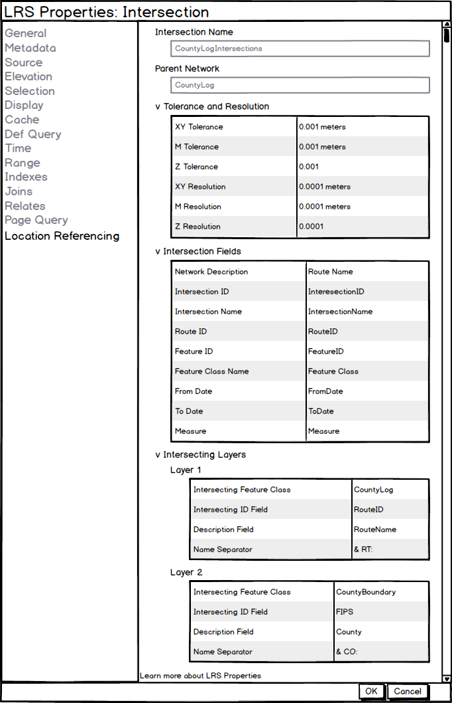

# LRS Intersection Properties User Story

|   |   |
| --- | --- |
| **Kind** | User Story · Pro |
| **Release** | — |
| **Product** | Roads & Highways · Pipeline Referencing |
| **Source** | [LRS Intersection Properties.pptx](<https://esriis.sharepoint.com/sites/LocationReferencing/Shared%20Documents/General/LRS%20Intersection%20Properties.pptx>) |
| **Edited** | 2019-12-31 17:25 by Nathan Easley |
| **Extracted** | 2026-09-04 · lane `xmlstrip` |

<!-- metadata
```yaml
title: "LRS Intersection Properties User Story"
source_file: "LRS Intersection Properties.pptx"
source_url: "https://esriis.sharepoint.com/sites/LocationReferencing/Shared%20Documents/General/LRS%20Intersection%20Properties.pptx"
doc_id: 843
doc_kind: "User Story"
surface: "Pro"
doc_revision: ""
target_release: ""
pe: ""
dev: ""
author: "William Isley"
last_edited_by: "Nathan Easley"
last_edited: "2019-12-31T17:25:32Z"
extracted: 2026-09-04
extraction_lane: xmlstrip
prompt_version: "v2.0.2"
keywords: ["intersection properties", "feature class", "location referencing", "catalog window", "pro", "fgdb", "egdb", "feature service", "accessibility", "internationalization"]
tools: ["Update Intersections"]
products: ["Roads & Highways", "Pipeline Referencing"]
issues: []
related: [{"doc":699,"file":"route-dominance-properties-user-story__doc699.md","s":6.536},{"doc":190,"file":"lrs-addressing-and-utility-network-properties-user-story__doc190.md","s":4.525},{"doc":842,"file":"lrs-and-gap-calibration-properties-user-story__doc842.md","s":4.523},{"doc":833,"file":"add-lrs-container-to-catalog-window__doc833.md","s":3.77},{"doc":696,"file":"update-intersection-referent-tool-user-story__doc696.md","s":3.742}]
```
-->

## Summary

Describes the user need to view properties of the Intersection feature class in Location Referencing, including fields and layers used for intersections. Details access methods, display requirements, and testing scenarios for the Intersection Properties window. Includes documentation and assignment information.

## Related documents

<!-- related:begin -->
- [Route Dominance Properties User Story](<https://esriis.sharepoint.com/sites/lrsworkspace/LRS Doc Index/User Stories/route-dominance-properties-user-story__doc699.md>) — similar text 0.66 · 1 title word · 1 filename word · same kind/surface/folder <!-- rel:699 -->
- [LRS Addressing and Utility Network Properties User Story](<https://esriis.sharepoint.com/sites/lrsworkspace/LRS Doc Index/User Stories/lrs-addressing-and-utility-network-properties-user-story__doc190.md>) — similar text 0.39 · 1 title word · 1 filename word · same kind/surface/folder <!-- rel:190 -->
- [LRS and Gap Calibration Properties User Story](<https://esriis.sharepoint.com/sites/lrsworkspace/LRS Doc Index/User Stories/lrs-and-gap-calibration-properties-user-story__doc842.md>) — similar text 0.65 · 1 title word · 1 filename word · same kind/surface/folder <!-- rel:842 -->
- [Add LRS Container to Catalog Window](<https://esriis.sharepoint.com/sites/lrsworkspace/LRS Doc Index/User Stories/add-lrs-container-to-catalog-window__doc833.md>) — similar text 0.25 · same kind/surface/folder <!-- rel:833 -->
- [Update Intersection Referent Tool User Story](<https://esriis.sharepoint.com/sites/lrsworkspace/LRS Doc Index/User Stories/update-intersection-referent-tool-user-story__doc696.md>) — similar text 0.11 · 1 title word · 1 filename word · same kind/surface/folder <!-- rel:696 -->
<!-- related:end -->

<!-- docs:begin -->
## Esri documentation

[View LRS intersection properties](https://doc.esri.com/en/arcgis-pro/latest/help/production/roads-highways/view-lrs-intersection-properties.html) · [View utility network feature class properties](https://doc.esri.com/en/arcgis-pro/latest/help/production/location-referencing-pipelines/view-utility-network-feature-class-properties.html) · [Set Location Referencing options](https://doc.esri.com/en/arcgis-pro/latest/help/production/roads-highways/set-location-referencing-options.html) · [Edit feature services](https://doc.esri.com/en/arcgis-pro/latest/help/production/roads-highways/edit-feature-services.html)

_No page matched:_ [Update Intersections](https://www.google.com/search?q=%22Update%20Intersections%22+site%3Adoc.esri.com)
<!-- docs:end -->

---

## Slide 1 — LRS Itersection Properties

User Story

## Slide 2 — User Story

As a Location Referencing user, I need to be able to see the properties of my Intersection feature class, like fields configured and the layers being used to created intersections, so I can verify which fields/layers are configured and where intersections will be generated when running the Update Intersections tool.

## Slide 3 — Intersection Properties

Intersection Properties should be able to be accessed in these two ways:

  - In the Catalog window, navigate to the Intersection FC, right click, select properties, and navigate to LocationReferencing tab.
  - In the map, navigate to the contents window, right click the Intersection FC, select properties, and navigate to LocationReferencing tab.
Should be available via fgdb (catalog and layer), egdb (catalog and layer), and feature service (layer)
Should appear if Location Referencing (RH or APR) is not licensed (Pro pattern)
Field should not be editable, but should be selectable and copiable
Information should be pulled from the LRS Controller Dataset (not the LRS Metadata table)
Needs to be 508 compliant – A11y, Dark Mode, Tabbing
Should be I18n ready
Green text at bottom should link to page that describes the property window
Take all of these through Integration with the Pro leadership

## Slide 4 — Intersection Properties

All accordions should be collapsed when opening the properties
Nest the Intersecting Layers so that when Intersecting Layers is expanded, Layer1-N is shown
Only show the field name, not the database or user
If the value or field name is very long, size it according to the window and provide hover content
Support hovering over any long field names to see the full value



## Slide 5 — Testing

Test with and without Location Referencing license
FGDB, EGDB (traditional and branch), Services
Layers and Feature Classes
No Metadata table present
Change version
Make change in Modify LRS Intersection tool
Long values
Tab, scroll, resize, hover
Select and copy
Dark and light theme

  - L18N
  - Switch maps
  - Click properties link

## Slide 6 — Documentation

Create a topic for View LRS Intersection Properties that includes each section and what is contained in it as well as how to navigate to open the properties

## Slide 7 — Assignment

Story Points:
Dev:
Test Plan PE:
