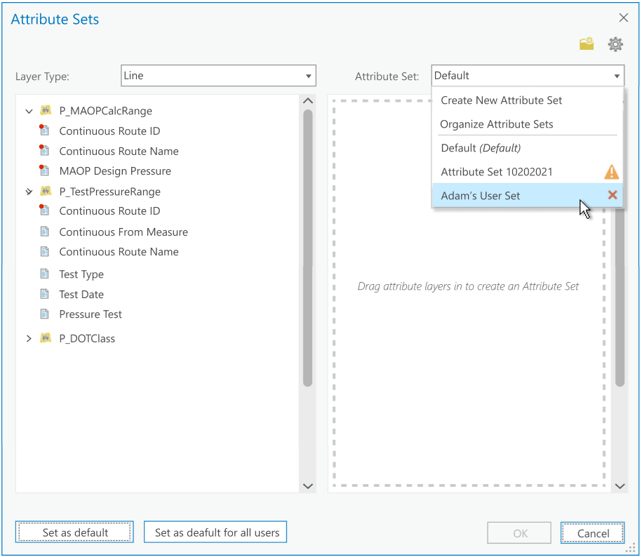
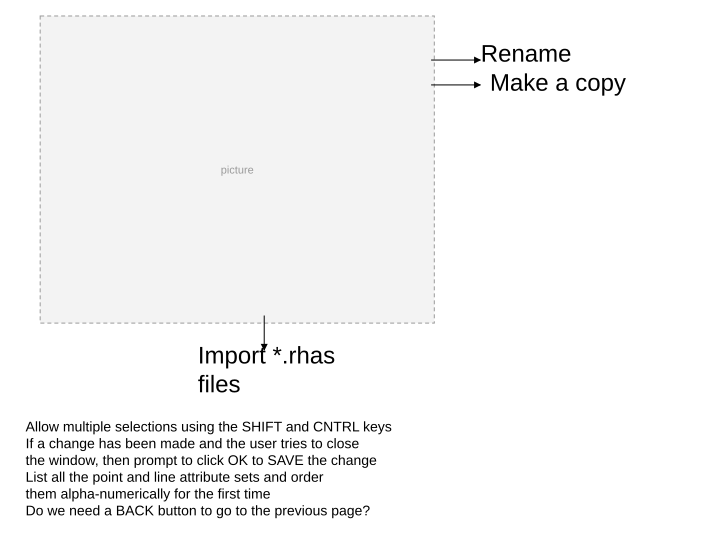

# Managing Attribute Sets User Story

| Field | Value |
| --- | --- |
| **Doc** | 689 · User Story · Pro |
| **Product** | Roads & Highways · Pipeline Referencing · Utility Network |
| **Release** | — |
| **Issues** | — |
| **Source** | [Managing_attribute sets_UserStory.pptx](<https://esriis.sharepoint.com/sites/LocationReferencing/Shared%20Documents/General/Managing_attribute%20sets_UserStory.pptx>) |
| **People** | author Rahul Rakshit · PE — · dev — |
| **Edited** | 2022-01-10 16:56 by Rahul Rakshit |
| **Extracted** | 2026-09-04 · lane xmlstrip · format 3.0 · prompt v2.0.2 |
| **Keywords** | attribute set · event editing · lrs editor · import attribute set · rename attribute set · copy attribute set · delete attribute set · default attribute set |
| **Tools** | — |

## Summary

User story describing the needs of an LRS Editor to manage attribute sets within ArcGIS Pro. It covers functionalities such as importing, renaming, copying, moving, deleting attribute sets, and setting defaults. The document also includes testing focus areas, documentation placement, and UI tool descriptions.

## Related documents

<!-- related:begin -->
- [Import Existing Attribute Sets from Event Editor](<https://esriis.sharepoint.com/sites/lrsworkspace/LRS Doc Index/User Stories/import-existing-attribute-sets-from-event-editor.md>) — similar text 0.17 · 2 title words · 2 filename words · same kind/surface/folder <!-- rel:680 s=5.105 -->
- [Delete Attribute Sets User Story](<https://esriis.sharepoint.com/sites/lrsworkspace/LRS Doc Index/User Stories/delete-attribute-sets.md>) — similar text 0.15 · 2 title words · 2 filename words · same kind/folder <!-- rel:676 s=4.648 -->
- [Reassign Method Hovers User Story](<https://esriis.sharepoint.com/sites/lrsworkspace/LRS Doc Index/User Stories/reassign-method-hovers.md>) — similar text 0.25 · same kind/surface/folder <!-- rel:584 s=2.941 -->
- [Dynamic Segmentation Table: Consider Point Events in DynSeg Table](<https://esriis.sharepoint.com/sites/lrsworkspace/LRS Doc Index/User Stories/dynseg-table-consider-point-events-in-dynseg-table.md>) — similar text 0.22 · same kind/surface/folder <!-- rel:394 s=2.824 -->
- [Add Event Intersection Offset Method](<https://esriis.sharepoint.com/sites/lrsworkspace/LRS Doc Index/User Stories/add-event-intersection-offset-method.md>) — similar text 0.26 · same kind/surface/folder <!-- rel:679 s=2.714 -->
<!-- related:end -->

<!-- docs:begin -->
## Esri documentation

[Event editing using the attribute table](https://doc.esri.com/en/arcgis-pro/latest/help/production/roads-highways/event-editing-using-the-attribute-table.html)
<!-- docs:end -->

---

## Story
### Managing attribute sets <!-- slide 1 -->

### User Story <!-- slide 2 -->
As an LRS Editor, I want so be able to manage attribute sets.

Persona
LRS Editor: This user is responsible for making edits to the LRS.  The edits they need to make come in from field crews/contractors in a variety of formats (shapefiles, engineering drawing, fgdbs).  The LRS Editor can also be responsible for editing events associated with the routes in the LRS.  Users want to be able to modify and manage attribute sets created in Pro.

## Acceptance Criteria
### Invoke the functionality when this option is clicked <!-- slide 3 -->

<!-- slide 4 -->
Import *.rhas files
Rename
Make a copy

| Tool | Details |
| --- | --- |
| Rename | Works on a single selected row If More than one row is selected, then this tool is disabled, and the tool tip says that it works with one row at a time. Do not allow to rename to an existing name Max 100 characters |
| Make a copy | Works on a single selected row. If More than one row is selected, then this tool is disabled, and the tool tip says that it works with one row at a time. Create a copy with the name suffixed by Original Name_Copy that is ready to be renamed If the Original Name_Copy already exists, then name the new one as Original Name_Copy _Copy |
| Move Up or Down | Works on a single or multiple selected rows Drag or drop to move or down is supported Save the order for the map when OK is clicked |
| Delete attribute set | Allow to delete an attribute set created by “This” user only Works on a single or multiple selected rows Prompt that this will delete the attribute sets for all users Do not allow to delete the default attribute set and the attribute set that contains all events |
| Set as default for me | Works on a single selected row. If More than one row is selected, then this tool is disabled, and the tool tip says that it works with one row at a time. |
| Set as default for all users | Works on a single selected row If More than one row is selected, then this tool is disabled, and the tool tip says that it works with one row at a time. |

- Allow multiple selections using the SHIFT and CNTRL keys
- If a change has been made and the user tries to close the window, then prompt to click OK to SAVE the change
- List all the point and line attribute sets and order them alpha-numerically for the first time
- Do we need a BACK button to go to the previous page?

<!-- slide 5 -->
- When the layers in the attribute set are not present in the FS anymore. The tooltip says which layers are missing.
- Do not allow these to be set as default.

## Testing
<!-- slide 6 -->
- Focus testing on Roads and Highways data (but do at least a few test scenarios with an APR-UN environment to ensure it works correctly)
- Test on both line and point attribute sets
- Ask a fellow PE to rename an attribute set with the same name you are renaming at the same time
- Test in both Light and Dark mode

## Automation
<!-- slide 7 -->
No automation for this story as it’s all UI based

## Documentation
<!-- slide 8 -->
- Place this in the Event Editing node in the Pro documentation
- Show how to import an attribute set created in EE
- Say why to make a copy of an existing attribute set
- Describe the functionality of the different tools

## Assignment
<!-- slide 9 -->
Story Points:
Dev:
PE:
