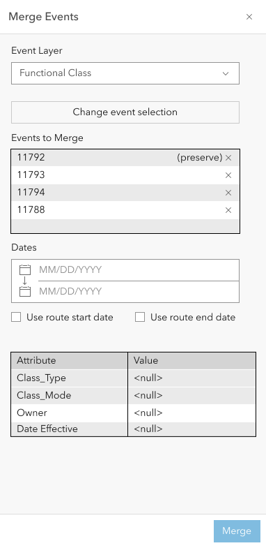
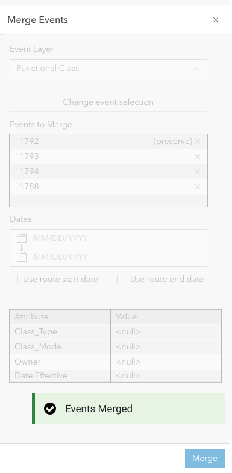
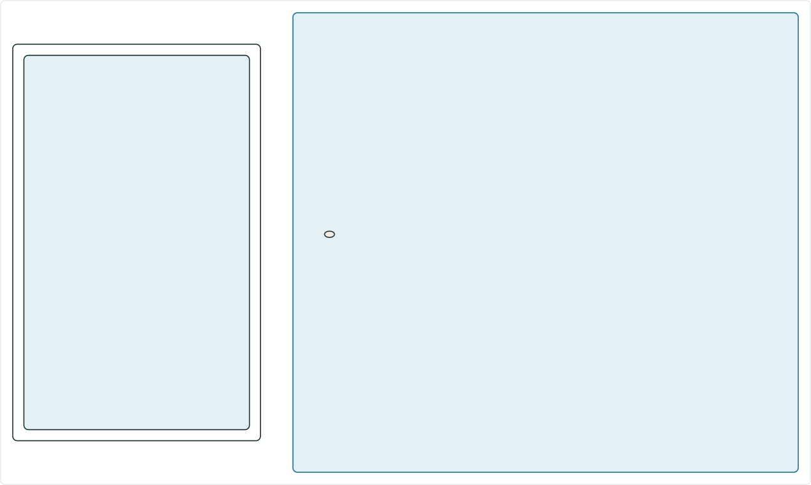
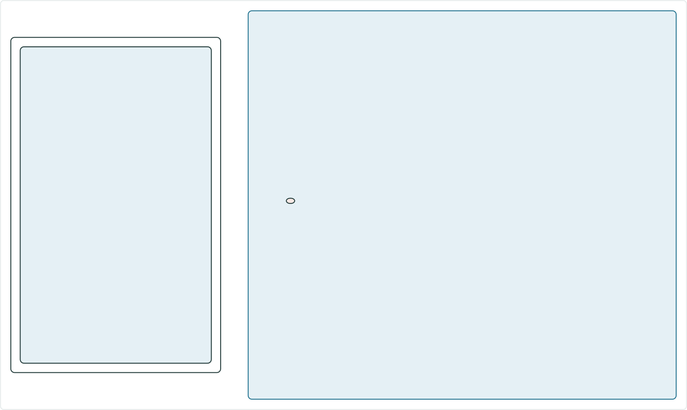
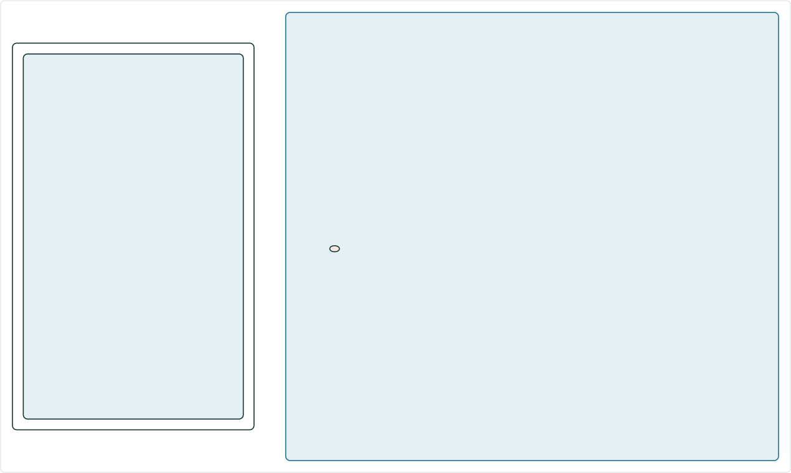

# Merge Events in Experience Builder

|   |   |
| --- | --- |
| **Kind** | User Story · Experience Builder |
| **Release** | — |
| **Source** | [ExB_MergeEvents.pptx](<https://esriis.sharepoint.com/sites/LocationReferencing/Shared%20Documents/General/ExB_MergeEvents.pptx>) |
| **Edited** | 2023-11-07 18:00 by Praveen Kumar |
| **Extracted** | 2026-09-04 · lane `xmlstrip` |

<!-- metadata
```yaml
title: "Merge Events in Experience Builder"
source_file: "ExB_MergeEvents.pptx"
source_url: "https://esriis.sharepoint.com/sites/LocationReferencing/Shared%20Documents/General/ExB_MergeEvents.pptx"
doc_id: 466
doc_kind: "User Story"
surface: "Experience Builder"
doc_revision: ""
target_release: ""
pe: ""
dev: ""
author: "William Isley"
last_edited_by: "Praveen Kumar"
last_edited: "2023-11-07T18:00:22Z"
extracted: 2026-09-04
extraction_lane: xmlstrip
prompt_version: "v2.0.2"
keywords: ["merge events", "line event", "spanning event", "event editing", "event layer", "experience builder"]
tools: ["Merge Events"]
products: []
issues: []
related: [{"doc":675,"file":"merge-events-user-story__doc675.md","s":5.379},{"doc":484,"file":"add-line-events-user-story-for-experience-builder__doc484.md","s":5.244},{"doc":472,"file":"split-event-in-experience-builder__doc472.md","s":4.806},{"doc":495,"file":"add-point-events-in-experience-builder__doc495.md","s":4.627},{"doc":496,"file":"add-point-events-in-experience-builder__doc496.md","s":4.618}]
```
-->

## Summary

This document describes the user story and configuration details for a Merge Events widget in the Experience Builder app. It covers the workflow for merging adjoining line events with the same characteristics, configuration of event layers, validation rules, and user interface behavior. It also includes test scenarios, automation approach, and documentation guidance.

## Related documents

<!-- related:begin -->
- [Merge Events User Story](<https://esriis.sharepoint.com/sites/lrsworkspace/LRS Doc Index/User Stories/merge-events-user-story__doc675.md>) — similar text 0.65 · 2 title words · 2 filename words · same kind/folder <!-- rel:675 -->
- [Add Line Events User Story for Experience Builder](<https://esriis.sharepoint.com/sites/lrsworkspace/LRS Doc Index/User Stories/add-line-events-user-story-for-experience-builder__doc484.md>) — similar text 0.45 · 3 title words · 1 filename word · same kind/surface/folder <!-- rel:484 -->
- [Split Event in Experience Builder](<https://esriis.sharepoint.com/sites/lrsworkspace/LRS Doc Index/User Stories/split-event-in-experience-builder__doc472.md>) — similar text 0.52 · 2 title words · 1 filename word · same kind/surface/folder <!-- rel:472 -->
- [Add Point Events in Experience Builder](<https://esriis.sharepoint.com/sites/lrsworkspace/LRS Doc Index/User Stories/add-point-events-in-experience-builder__doc495.md>) — similar text 0.42 · 3 title words · 1 filename word · same kind/surface/folder <!-- rel:495 -->
- [Add Point Events in Experience Builder](<https://esriis.sharepoint.com/sites/lrsworkspace/LRS Doc Index/User Stories/add-point-events-in-experience-builder__doc496.md>) — similar text 0.41 · 3 title words · 1 filename word · same kind/surface/folder <!-- rel:496 -->
<!-- related:end -->

<!-- docs:begin -->
## Esri documentation

[Merge events](https://doc.esri.com/en/arcgis-pro/latest/help/production/roads-highways/merge-events.html) · [Event editing using the attribute table](https://doc.esri.com/en/arcgis-pro/latest/help/production/location-referencing-pipelines/event-editing-using-the-attribute-table.html)
<!-- docs:end -->

---

## Slide 1 — Merge Events in ExB

User Story

## Slide 2 — User Story

As an LRS Editor, I want to be able to merge events, so that I can complete my event editing workflows.

Persona
LRS Editor: This user is responsible for making edits to the LRS. The LRS Editor is responsible for making the route and event edits based on various input documents. One workflow users will utilize is to merge adjoining events that have the same characteristics thereby reducing fragmentation.  We supported this workflow in Event Editor and now want to support it within ExB.

## Slide 3 — Configuration


## Slide 4 — Configuration

- If there is no LRS enabled service in the webmap, don’t import any event layers and provide a message that no LRS enabled service is present.
- Should be able to import all the line events and network layers from the map using the Load Layers button.
- Should be able to add any missing layer using the  ‘New editable Layer’ option.
- Should be able to reorder the imported layers.
- Should be able to remove any layer using x button next to the respective layer.
- If there are more than one web map, list all those in the ‘Select a map’ dropdown.
- Allow only importing from a single map (if another map is chosen then clear the present layers before importing layers from different map).
- Provide an error message if there are no Line event layers in the list after importing.
- Provide an error message if the network is not imported for the events (registered network for the events).

## Slide 5 — Configuration

- List only Line event layers in the ‘Event’ dropdown under default settings.
- Should be able to set the default layer for Merge events.
- Provide a message if the map has layers from more than one service.
- If there are more than one web map, list all those in the ‘Select a map’ dropdown.
- If user clicks on ‘Load Layers’ button after removing one or more imported layers load only the missing layers.

## Slide 6 — Layer Configuration

- Display the layer configuration after a layer is selected.
- Should be able to change the label in the layer configuration.
- Should be able to configure the attribute fields for each event layer to display/edit when merging the events.
- For configure fields show only business fields to display and edit, LRS fields and System fields should not be shown in the configuration.
- If needed user should be able to select \ unselect the fields to show.
- If needed user should be able to enable \ disable the fields to edit.
- Should be able to reorder the fields in the section of configure fields.
- By default, enable ‘Use field alias’ for the fields
- Should be able to add filed description using settings button for the field.

## Slide 7


Merge Events

- Add a widget called Merge Events.
- Once clicked, the Merge Events tool should open in the Experience builder app.
- The event layer drop down should include all the LRS line events within the map and should be able to select one.
- The default layer should be as per the layer set in the configuration.
- The order of the event layers dropdown should be as per the order in the configuration.
- For non-spanning line events, the events should be on the same route.
- For spanning line events, the events should be on the same line.
- If a single event is selected, then show an error.
- For non spanning events, if the events do not belong to the same route, then show “The selected events are not on the same route” error.
- For spanning events, if the events do not belong to the same line, then show “The selected events are not on the same line” error.
- Allow merging more than 2 events.



## Slide 8


- As soon as the user select events to merge show it in the Events to Merge section with a list of events that are selected
- The display field for the event will be used as the identifier.
- Allow to remove an event from the selection list.
- Keep this list synched with the selection on the map that means updating the list dynamically when the selection changes on the map/attribute table for that event layer.
- Selecting an event will result in using its attributes for the resultant merged event.
- Write (Preserve) along that event in the list
- Flash the ‘Preserve’ event 3 times
- The first event in the list will be selected by default
- If events are already selected for the chosen event layer prior to opening the tool, then upon the selection of that event layer at the top, populate this section with the list of already selected events.

Events to Merge


## Slide 9


From Date:

- Populate with today’s date as default
- Can be edited by the user
- Provide a checkbox to choose the route’s start date – Valid only for non-spanning line events
To Date:

- Populate Null as default
- Can be edited by the user
- Provide a checkbox to choose the route’s end date – Valid only for non-spanning line events


## Slide 10


- The event id should be of the ‘preserve’ event
- From and To Route id’s should be populated based on the event start and end location of the merged event.
- From and To Route names should be populated based on the event start and end location when route name field is configured for the event.
- From measure = From measure of the first event in the increasing order of calibration of the route/line
- To measure = To measure of the last event in the increasing order of calibration of the route/line
- Validate the From Measure with the From Route upon running the tool
- Validate the To Measure with the To Route upon running the tool
- Should support Subtypes, Range Domain, Coded Value Domains, Contingent values, Attribute rules, Non nullable fields
- Provide helpful error messages upon validation. E.g., if the entered value is out of range for a field, then provide the range in the error message.
- Denote required fields
- Show a vertical scroll if needed


## Slide 11


- Retire all the events by populating their To Date with the From Date from this form and create a new event with the Event ID of the preserved event and the dates, from this form
- Time slice the resulting event based on the dates provided in this form and the dates of the route/routes (spanning)
- If the From/To Date is changed to dates outside the route date range, provide an error and alert the user that the dates are outside the route date range
- If the merging events are not co-incident, then fill the gap while creating the event
- Validate the Merged event attributes
- If referents are present for both from location of the first event and to location of the last event, and if the from and to measures of the merged event are unchanged, then keep the referent information intact for the merged event
- With reference to the case above, if the from measure of the merged event is changed then remove the referent information of the From Referent from the output merged event
- With reference to the case above, if the to measure of the merged event is changed then remove the referent information of the To Referent from the output merged event
- Once the merged event is created successfully, provide a message and return the form to its initial loading stage.
- Once the merged event is created successfully, refresh the layer on the map and flash the merged event 3 times



## Slide 12 — Merge Events Case1



| RouteID | From Date | To Date | From Measure | To Measure |
| --- | --- | --- | --- | --- |
| RouteA | 1/1/2000 | Null | 0 | 10 |
| RouteB | 1/1/2000 | Null | 100 | 200 |
| RouteC | 1/1/2000 | Null | 0.23 | 1.65 |
| RouteD | 1/1/2000 | Null | 10 | 12 |

| EventID | From Date | To Date | From Route | From Measure | To Route | To Measure | Attribute |
| --- | --- | --- | --- | --- | --- | --- | --- |
| Event1 | 1/1/2000 | Null | RouteA | 0 | RouteB | 150 | X |
| Event2 | 1/1/2000 | Null | RouteB | 150 | RouteD | 12 | Y |

| EventID | From Date | To Date | From Route | From Measure | To Route | To Measure | Attribute |
| --- | --- | --- | --- | --- | --- | --- | --- |
| Event1 | 1/1/2010 | Null | RouteA | 0 | RouteD | 12 | X |
| Event1 | 1/1/2000 | 1/1/2010 | RouteA | 0 | RouteB | 150 | X |
| Event2 | 1/1/2000 | 1/1/2010 | RouteB | 150 | RouteD | 12 | Y |

Merge from date : 1/1/2010

## Slide 13 — Merge Spanning Events Case2



| RouteID | From Date | To Date | From Measure | To Measure |
| --- | --- | --- | --- | --- |
| RouteA | 1/1/2000 | Null | 0 | 10 |
| RouteB | 1/1/2000 | Null | 100 | 200 |
| RouteC | 1/1/2000 | Null | 0.23 | 1.65 |
| RouteD | 1/1/2000 | Null | 10 | 12 |

| EventID | From Date | To Date | From Route | From Measure | To Route | To Measure | Attribute |
| --- | --- | --- | --- | --- | --- | --- | --- |
| Event1 | 1/1/2000 | Null | RouteA | 0 | RouteB | 150 | X |
| Event2 | 1/1/2000 | Null | RouteB | 100 | RouteD | 12 | Y |

| EventID | From Date | To Date | From Route | From Measure | To Route | To Measure | Attribute |
| --- | --- | --- | --- | --- | --- | --- | --- |
| Event1 | 1/1/2010 | Null | RouteA | 0 | RouteD | 12 | X |
| Event1 | 1/1/2000 | 1/1/2010 | RouteA | 0 | RouteB | 150 | X |
| Event2 | 1/1/2000 | 1/1/2010 | RouteB | 100 | RouteD | 12 | Y |

Merge from date : 1/1/2010

## Slide 14 — Merge Spanning Events Case3



| RouteID | From Date | To Date | From Measure | To Measure |
| --- | --- | --- | --- | --- |
| RouteA | 1/1/2000 | Null | 0 | 10 |
| RouteB | 1/1/2000 | Null | 100 | 200 |
| RouteC | 1/1/2000 | Null | 10 | 20 |
| RouteD | 1/1/2000 | Null | 10 | 12 |

| EventID | From Date | To Date | From Route | From Measure | To Route | To Measure | Attribute |
| --- | --- | --- | --- | --- | --- | --- | --- |
| Event1 | 1/1/2000 | Null | RouteA | 0 | RouteB | 200 | X |
| Event2 | 1/1/2000 | Null | RouteC | 15 | RouteD | 12 | Y |

| EventID | From Date | To Date | From Route | From Measure | To Route | To Measure | Attribute |
| --- | --- | --- | --- | --- | --- | --- | --- |
| Event2 | 1/1/2010 | Null | RouteA | 0 | RouteD | 12 | Y |
| Event1 | 1/1/2000 | 1/1/2010 | RouteA | 0 | RouteB | 200 | X |
| Event2 | 1/1/2000 | 1/1/2010 | RouteC | 15 | RouteD | 12 | Y |

Merge from date : 1/1/2010

## Slide 15 — Testing

- Test on spanning and non spanning events
- Test on both projected and unprojected data
- Test on both line and non-line networks
- Test a scenario where the From/To Dates are changed
- Merge overlapping events
- Referents are present for the input events
- Test on the following route geometries
  - Normal
  - Gapped
  - Complex
  - Vertical
- Test with actions configured (like zoom, pan etc.,)

## Slide 16 — Automation

Follow same kind of automation like other LRS widget in the ExB

## Slide 17 — Documentation

- Create a new topic in the documentation called Merging Events.  Utilize the existing merge events topic from Pro as a guide (https://pro.arcgis.com/en/pro-app/latest/help/production/roads-highways/merge-events.htm).
- Make sure to include a graphic/example to show how the merge would work.

## Slide 18 — Assignment

Story Points:
Dev:
PE:
