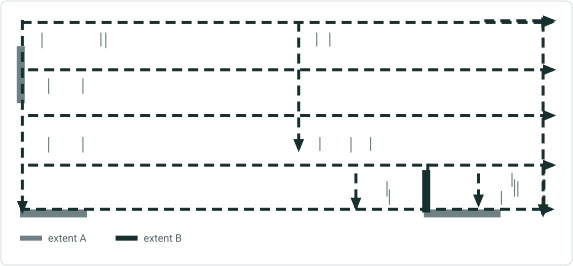
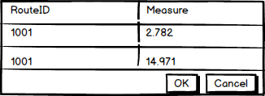

# Multiple Measures UI Picker User Story

|   |   |
| --- | --- |
| **Kind** | User Story · Pro |
| **Release** | — |
| **Source** | [MultipleMeasuresUIPicker.pptx](<https://esriis.sharepoint.com/sites/LocationReferencing/Shared%20Documents/General/MultipleMeasuresUIPicker.pptx>) |
| **Edited** | 2020-07-01 21:58 by Nathan Easley |
| **Extracted** | 2026-09-04 · lane `xmlstrip` |

<!-- metadata
```yaml
title: "Multiple Measures UI Picker User Story"
source_file: "MultipleMeasuresUIPicker.pptx"
source_url: "https://esriis.sharepoint.com/sites/LocationReferencing/Shared%20Documents/General/MultipleMeasuresUIPicker.pptx"
doc_id: 790
doc_kind: "User Story"
surface: "Pro"
doc_revision: ""
target_release: ""
pe: ""
dev: ""
author: "William Isley"
last_edited_by: "Nathan Easley"
last_edited: "2020-07-01T21:58:39Z"
extracted: 2026-09-04
extraction_lane: xmlstrip
prompt_version: "v2.0.2"
keywords: ["multiple measure picker", "measure selection", "route editing", "complex shape route", "user interface"]
tools: []
products: []
issues: []
related: [{"doc":686,"file":"add-multiple-line-events-tool-in-arcgis-pro__doc686.md","s":3.201},{"doc":685,"file":"add-multiple-point-events-tool-in-arcgis-pro__doc685.md","s":3.195},{"doc":190,"file":"lrs-addressing-and-utility-network-properties-user-story__doc190.md","s":2.997},{"doc":843,"file":"lrs-intersection-properties-user-story__doc843.md","s":2.991},{"doc":687,"file":"add-line-event-tool-in-arcgis-pro__doc687.md","s":2.984}]
```
-->

## Summary

User story describing a UI picker for selecting the correct measure at route locations with multiple measures in LRS route editing tools. The UI appears when a single route location has multiple measures, allowing users to select and populate the measure field in the editing tool. Accessibility, dark mode, and internationalization are required.

## Related documents

<!-- related:begin -->
- [Add Multiple Line Events tool in ArcGIS Pro](<https://esriis.sharepoint.com/sites/lrsworkspace/LRS Doc Index/User Stories/add-multiple-line-events-tool-in-arcgis-pro__doc686.md>) — similar text 0.27 · 1 title word · 1 filename word · same kind/surface/folder <!-- rel:686 -->
- [Add Multiple Point Events tool in ArcGIS Pro](<https://esriis.sharepoint.com/sites/lrsworkspace/LRS Doc Index/User Stories/add-multiple-point-events-tool-in-arcgis-pro__doc685.md>) — similar text 0.27 · 1 title word · 1 filename word · same kind/surface/folder <!-- rel:685 -->
- [LRS Addressing and Utility Network Properties User Story](<https://esriis.sharepoint.com/sites/lrsworkspace/LRS Doc Index/User Stories/lrs-addressing-and-utility-network-properties-user-story__doc190.md>) — similar text 0.24 · same kind/surface/folder <!-- rel:190 -->
- [LRS Intersection Properties User Story](<https://esriis.sharepoint.com/sites/lrsworkspace/LRS Doc Index/User Stories/lrs-intersection-properties-user-story__doc843.md>) — similar text 0.24 · same kind/surface/folder <!-- rel:843 -->
- [Add Line Event tool in ArcGIS Pro](<https://esriis.sharepoint.com/sites/lrsworkspace/LRS Doc Index/User Stories/add-line-event-tool-in-arcgis-pro__doc687.md>) — similar text 0.27 · same kind/surface/folder <!-- rel:687 -->
<!-- related:end -->

---

## Slide 1 — Measure picker UI for multiple measures at a single location

User Story

## Slide 2 — User Story

As a Location Referencing user, I want to be able to interact with the map to select the correct measure at route locations with multiple measures, so I can make LRS route edits on complex shape route types.

## Slide 3 — Multiple Measure picker UI

In the LRS route editing tools, if a user selects the Select by Measure button on the tool and clicks a location on the map where a single route has two or more measures (the self intersection/closing point of a complex shape route for examples), open the multiple measure picker UI to allow the user to select the correct measure to be populated for the measure in the LRS tool
The UI should show the RouteID and Measures and allow the user to select the measure they want populated in the measure parameter for the tool
Consider using one of the existing picker UIs we have (multiple route picker would be a good one)
If there is more than one route at the location where there are multiple measures, show only the RouteID/Measures for the route selected in the LRS tool
Needs to be 508 compliant – A11y, Dark Mode, Tabbing
Should be I18n ready

## Slide 4 — Multiple Measure picker UI



UI should only appear when a location on a single route where there is more than one measure is clicked
When the user selects one of the measures and clicks OK, populate the measure field in the LRS editing tool
If the user clicks cancel, close the UI and don’t populate the measure field in the LRS editing tool



## Slide 5 — Testing

Test with various complex shapes
Long values
Tab, scroll, resize, hover
Select and copy
Dark and light theme
L18N

## Slide 6 — Documentation

No doc updates for this as we don’t document the other picker options anywhere

## Slide 7 — Assignment

Story Points:
Dev:
PE:
