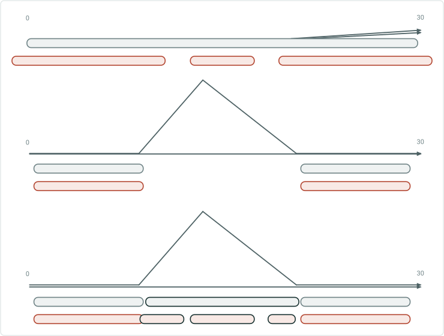
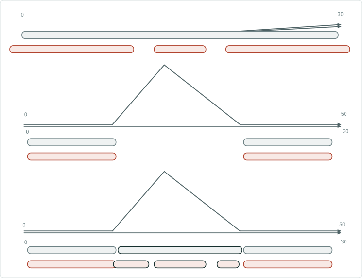
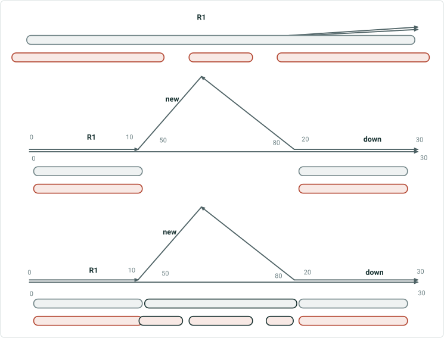
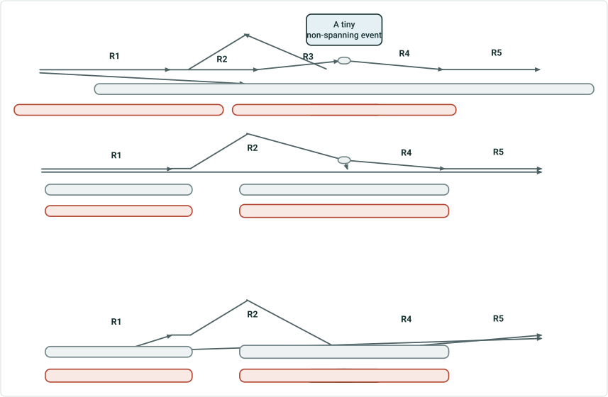
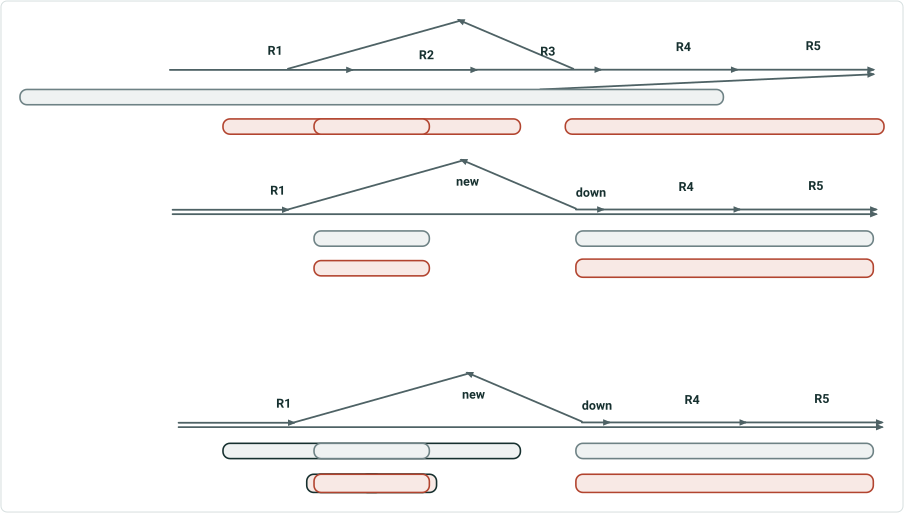

# Realign Event Behavior

|   |   |
| --- | --- |
| **Kind** | User Story · Pro |
| **Release** | ~13 |
| **Source** | [RealignFinal.pptx](<https://esriis.sharepoint.com/sites/LocationReferencing/Shared%20Documents/General/RealignFinal.pptx>) |
| **Edited** | 2024-05-15 20:02 by Claire Wang |
| **Extracted** | 2026-09-04 · lane `xmlstrip` |

<!-- metadata
```yaml
title: "Realign Event Behavior"
source_file: "RealignFinal.pptx"
source_url: "https://esriis.sharepoint.com/sites/LocationReferencing/Shared%20Documents/General/RealignFinal.pptx"
doc_id: 373
doc_kind: "User Story"
surface: "Pro"
doc_revision: ""
target_release: "~13"
pe: "Michael"
dev: ""
author: "Claire Wang"
last_edited_by: "Claire Wang"
last_edited: "2024-05-15T20:02:34Z"
extracted: 2026-09-04
extraction_lane: xmlstrip
prompt_version: "v2.0.2"
keywords: ["event behavior", "realign", "calibrate stayput", "realign snap", "downstream route", "event gap", "user story"]
tools: []
products: []
issues: []
related: [{"doc":730,"file":"support-snap-event-behavior-in-realign-route__doc730.md","s":4.325},{"doc":715,"file":"cover-event-behavior-in-realign-route-with-concurrencies__doc715.md","s":3.999},{"doc":761,"file":"support-event-behaviors-on-vertical-route-shapes-in-realign-route__doc761.md","s":3.829},{"doc":836,"file":"support-event-behaviors-on-complex-route-shapes-in-realign-route__doc836.md","s":3.697},{"doc":758,"file":"support-event-behaviors-on-vertical-route-shapes-in-reassign-route__doc758.md","s":2.965}]
```
-->

## Summary

The document discusses event behavior during route realignment in linear referencing, focusing on how events are managed on downstream routes with different realignment and calibration behaviors. It outlines decisions to keep events on downstream routes and plans for a user story to address event gaps and related fixes. Next steps include combining code changes, fixing automation, and updating documentation.

## Related documents

<!-- related:begin -->
- [Support Snap Event Behavior in Realign Route](<https://esriis.sharepoint.com/sites/lrsworkspace/LRS Doc Index/User Stories/support-snap-event-behavior-in-realign-route__doc730.md>) — similar text 0.16 · 3 title words · 1 filename word · same kind/surface/folder <!-- rel:730 -->
- [Cover Event Behavior in Realign Route with Concurrencies](<https://esriis.sharepoint.com/sites/lrsworkspace/LRS Doc Index/User Stories/cover-event-behavior-in-realign-route-with-concurrencies__doc715.md>) — similar text 0.08 · 3 title words · 1 filename word · same kind/surface/folder <!-- rel:715 -->
- [Support Event Behaviors on Vertical Route Shapes in Realign Route](<https://esriis.sharepoint.com/sites/lrsworkspace/LRS Doc Index/User Stories/support-event-behaviors-on-vertical-route-shapes-in-realign-route__doc761.md>) — similar text 0.16 · 2 title words · 1 filename word · same kind/surface/folder <!-- rel:761 -->
- [Support Event Behaviors on Complex Route Shapes in Realign Route](<https://esriis.sharepoint.com/sites/lrsworkspace/LRS Doc Index/User Stories/support-event-behaviors-on-complex-route-shapes-in-realign-route__doc836.md>) — similar text 0.19 · 2 title words · 1 filename word · same kind/surface/folder <!-- rel:836 -->
- [Support Event Behaviors on Vertical Route Shapes in Reassign Route](<https://esriis.sharepoint.com/sites/lrsworkspace/LRS Doc Index/User Stories/support-event-behaviors-on-vertical-route-shapes-in-reassign-route__doc758.md>) — similar text 0.15 · 1 title word · same kind/surface/folder <!-- rel:758 -->
<!-- related:end -->

<!-- docs:begin -->
## Esri documentation

[Event behavior](https://doc.esri.com/en/arcgis-pro/latest/help/production/location-referencing-pipelines/what-is-event-behavior.html) · [Realign routes](https://doc.esri.com/en/arcgis-pro/latest/help/production/location-referencing-pipelines/realign-routes.html)
<!-- docs:end -->

---

## Slide 1 — Realign Event Behavior

## Slide 2 — Continuous – no recal



Realign stayput Calibrate stayput
Realign snap Calibrate stayput

## Slide 3 — Continuous – recal downstream



Realign stayput Calibrate stayput
Realign snap Calibrate stayput

## Slide 4 — Line



Realign stayput Calibrate stayput
Realign snap Calibrate stayput
Change realignment measures – new route in realignment
Do not recalibrate downstream – new route downstream

Michael: If we want events to show up on the downstream new route, we change event behavior code, not edit log

We decide to keep the events on downstream route. This will be done in a user story along with the fix in 5641.

We decide to keep the events on downstream route. This will be done in a user story along with the fix in 5641.

## Slide 5 — Line



Realign stayput Calibrate stayput
Realign snap Calibrate stayput
Recalibrate downstream – remaining R3 becomes R2

A tiny non-spanning event
We decide to keep the events on downstream route. This will be done in a user story along with the fix in 5641.
We decide to keep the events on downstream route. This will be done in a user story along with the fix in 5641.

## Slide 6 — Line



Realign stayput Calibrate stayput
Realign snap Calibrate stayput
Change realignment measures – new route in realignment
Do not recalibrate downstream – new route downstream

We decide to keep the events on downstream route. This will be done in a user story along with the fix in 5641.
We decide to keep the events on downstream route. This will be done in a user story along with the fix in 5641.

## Slide 7

Next steps:
Keep the code from 5641 that will leave an event gap (no event on downstream route)
Write a ~13 user story to fix the event gap for Calibrate stayput (treat as Snap). For Move, it will still get Route not found Error just like 5015. (we assume Stayput-Snap only exists in such few Realign scenarios) 5641 code will be combined with code in this user story to check in.

Fix automation
Update doc
