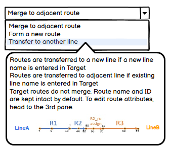
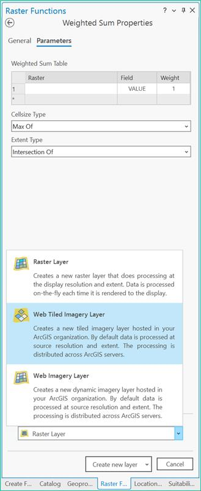
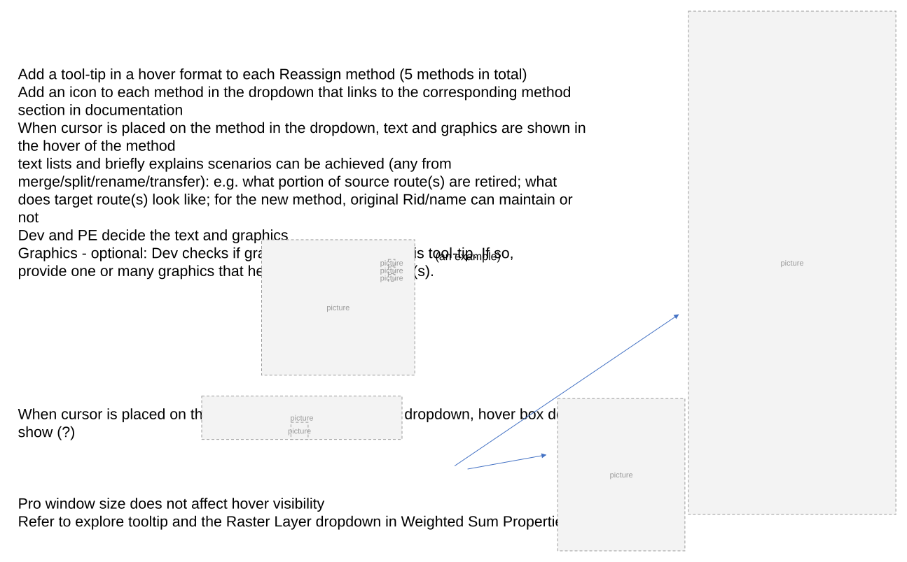
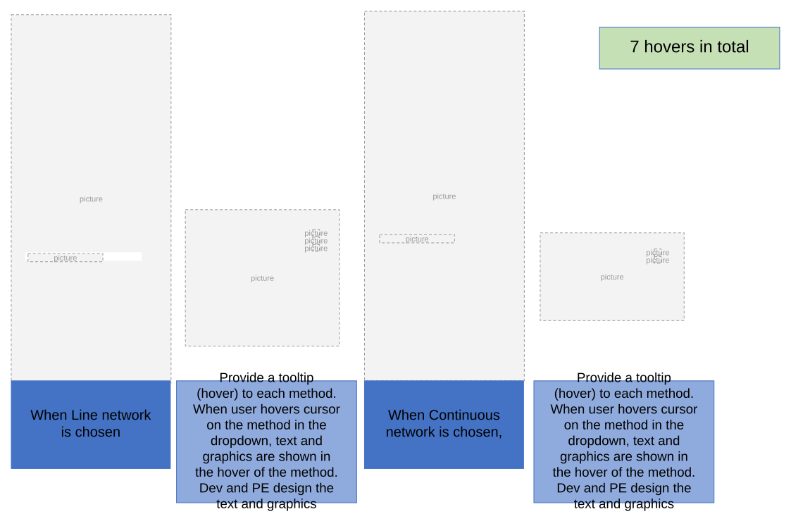

# Reassign Method Hovers User Story

| Field | Value |
| --- | --- |
| **Doc** | 584 · User Story · Pro |
| **Product** | Roads & Highways · Pipeline Referencing |
| **Release** | — |
| **Issues** | — |
| **Source** | [ReassignUI_MethodsHover.pptx](<https://esriis.sharepoint.com/sites/LocationReferencing/Shared%20Documents/General/ReassignUI_MethodsHover.pptx>) |
| **People** | author Claire Wang · PE — · dev — |
| **Edited** | 2023-04-05 23:29 by Claire Wang |
| **Extracted** | 2026-09-04 · lane xmlstrip · format 3.0 · prompt v2.0.2 |
| **Keywords** | reassign method · hover · tooltip · dropdown · route editing · lrs editor · pro |
| **Tools** | — |

## Summary

This document describes a user story for adding hover tool-tips to each Reassign method in a dropdown menu within the Pro interface. The hover provides text and optional graphics explaining scenarios achievable by each method to assist LRS editors in selecting the correct method. It includes design notes, testing instructions, and documentation updates.

## Related documents

<!-- related:begin -->
- [Reassign UI Update to Support New Reassign Methods in ArcGIS Pro](<https://esriis.sharepoint.com/sites/lrsworkspace/LRS%20Doc%20Index/User%20Stories/reassign-ui-update-to-support-new-reassign-methods-in-arcgis-pro__doc586.md>) — similar text 0.32 · 1 title word · 1 filename word · same kind/surface/folder <!-- rel:586 s=4.302 -->
- [Support Reassign: Transfer as New Route(s) to Adjacent Line Method in ArcGIS Pro](<https://esriis.sharepoint.com/sites/lrsworkspace/LRS Doc Index/User Stories/support-reassign-transfer-as-new-route-s-to-adjacent-line.md>) — similar text 0.25 · 2 title words · 1 filename word · same kind/surface/folder <!-- rel:583 s=4.149 -->
- [Support Reassign: Transfer to a New Line Method in ArcGIS Pro](<https://esriis.sharepoint.com/sites/lrsworkspace/LRS Doc Index/User Stories/support-reassign-transfer-to-a-new-line-method-in-pro.md>) — similar text 0.26 · 2 title words · 1 filename word · same kind/surface/folder <!-- rel:585 s=4.112 -->
- [Pro AI Assistant Reassign Route User Story](<https://esriis.sharepoint.com/sites/lrsworkspace/LRS Doc Index/User Stories/pro-ai-assistant-reassign-route.md>) — similar text 0.12 · 1 title word · 1 filename word · same kind/surface/folder <!-- rel:100 s=3.714 -->
- [Reassign Route Transfer to Another Line Method: Support Move Event Behavior Test Plan](<https://esriis.sharepoint.com/sites/lrsworkspace/LRS Doc Index/Test Plans/5141-reassign-route-transfer-to-another-line-method-support-move.md>) — similar text 0.13 · 2 title words · 1 filename word · same surface <!-- rel:533 s=3.184 -->
<!-- related:end -->

---

## Story
### Add a hover to each Reassign method in the dropdown (Pro) <!-- slide 1 -->
User Story

### User Story <!-- slide 2 -->
As a LRS editor, I need more details about what can be done in each Reassign method as the method names in the dropdown is generic. I would like to have a hover that contains both text and graphic about the method, that when I hover my cursor on any of the method in the dropdown, I can verify if this method is what I want.

Persona
LRS Editor: This user is responsible for reassigning route(s).  The edits they need to make come in from field crews/contractors in a variety of formats (shapefiles, engineering drawing, fgdbs). The LRS Editor is responsible for making the route edits based on these documents. As reassign methods are located in a dropdown box and the method names are in relatively short-generic texts, the user eagers more details in a hover about the method without going to look in webhelp. The hover should contain text information about what scenarios can be achieved (any from merge/split/rename/transfer) and associated graphic examples.

## Acceptance Criteria
### Reassign method hovers <!-- slide 3 -->
- Add a tool-tip in a hover format to each Reassign method (5 methods in total)
- Add an icon to each method in the dropdown that links to the corresponding method section in documentation
- When cursor is placed on the method in the dropdown, text and graphics are shown in the hover of the method
  - text lists and briefly explains scenarios can be achieved (any from merge/split/rename/transfer): e.g. what portion of source route(s) are retired; what does target route(s) look like; for the new method, original Rid/name can maintain or not
  - Dev and PE decide the text and graphics
  - Graphics - optional: Dev checks if graphics are allowed in this tool-tip. If so, provide one or many graphics that help explain the scenario(s).
- When cursor is placed on the method name outside of the dropdown, hover box does not show (?)
- Pro window size does not affect hover visibility
- Refer to explore tooltip and the Raster Layer dropdown in Weighted Sum Properties

(an example)

### 7 hovers in total <!-- slide 4 -->
When Line network is chosen
When Continuous network is chosen,
Provide a tooltip (hover) to each method. When user hovers cursor on the method in the dropdown, text and graphics are shown in the hover of the method. Dev and PE design the text and graphics
Provide a tooltip (hover) to each method. When user hovers cursor on the method in the dropdown, text and graphics are shown in the hover of the method. Dev and PE design the text and graphics

## Testing
<!-- slide 5 -->
- Test both network types in either APR or RH
- Verify the contents in each hover are correct

## Automation
<!-- slide 6 -->
- N/A

## Documentation
<!-- slide 7 -->
Add a note about the hovered tool-tips for the methods to APR and RH.

  - The note should state the contents in the hover (help links; text explaining scenarios; graphics (if any))
  - Add a sample screenshot in the note

## Assignment
<!-- slide 8 -->
Story Points:
Dev:
PE:
