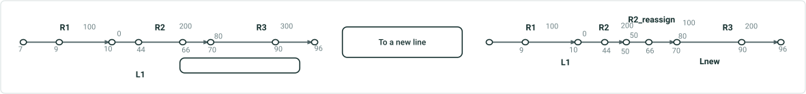
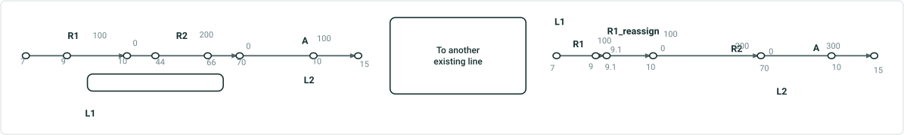
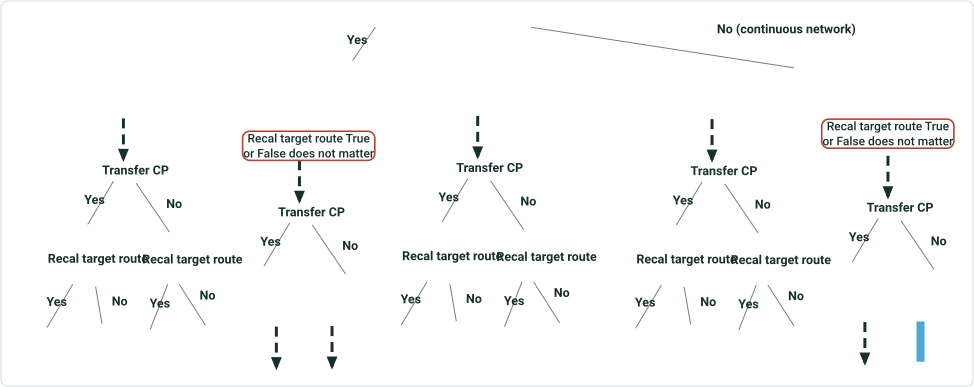
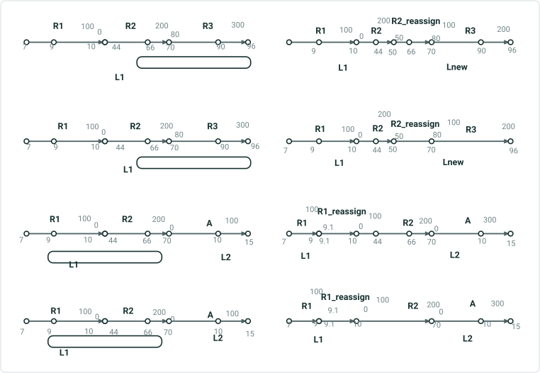
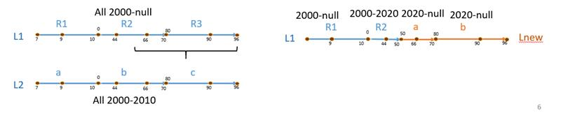

# Reassign to a New or Existing Line with Original Route ID/Name Maintained on the Target Line - REST

|   |   |
| --- | --- |
| **Kind** | User Story · Server |
| **Release** | — |
| **Product** | Pipeline Referencing |
| **Issue** | [WebGIS/location-referencing#565](https://devtopia.esri.com/WebGIS/location-referencing/issues/565) |
| **Source** | [ReassignMethodsREST_addparameter1.pptx](<https://esriis.sharepoint.com/sites/LocationReferencing/Shared%20Documents/General/ReassignMethodsREST_addparameter1.pptx>) |
| **Edited** | 2023-03-14 22:13 by Claire Wang |
| **Extracted** | 2026-09-04 · lane `xmlstrip` |

<!-- metadata
```yaml
title: "Reassign to a New or Existing Line with Original Route ID/Name Maintained on the Target Line - REST"
source_file: "ReassignMethodsREST_addparameter1.pptx"
source_url: "https://esriis.sharepoint.com/sites/LocationReferencing/Shared%20Documents/General/ReassignMethodsREST_addparameter1.pptx"
doc_id: 594
doc_kind: "User Story"
surface: "Server"
doc_revision: ""
target_release: ""
pe: ""
dev: ""
author: "William Isley"
last_edited_by: "Claire Wang"
last_edited: "2023-03-14T22:13:15Z"
extracted: 2026-09-04
extraction_lane: xmlstrip
prompt_version: "v2.0.2"
keywords: ["reassign", "route", "line network", "rest api", "route id", "route name", "calibration points", "locking"]
tools: []
products: ["Pipeline Referencing"]
issues: ["WebGIS/location-referencing#565"]
related: [{"doc":607,"file":"reassign-to-a-new-or-existing-line-with-original-route-id-name-maintained-on__doc607.md","s":11.509},{"doc":583,"file":"support-reassign-transfer-as-new-route-s-to-adjacent-line-method-in-arcgis-pro__doc583.md","s":6.062},{"doc":542,"file":"reassign-routes-to-another-line-with-original-route-id-name-maintenance-rest__doc542.md","s":5.459},{"doc":585,"file":"support-reassign-transfer-to-a-new-line-method-in-arcgis-pro__doc585.md","s":5.249},{"doc":582,"file":"fix-existing-reassign-ui-automations__doc582.md","s":4.811}]
```
-->

## Summary

This document describes user story requirements and technical details for implementing two new reassign methods in the REST API for line networks. It covers maintaining original Route ID/Name combinations during reassignment, options for transferring calibration points, error handling, locking mechanisms, and testing considerations. The document also outlines automation and documentation updates needed for these new methods.

## Related documents

<!-- related:begin -->
- [Reassign to a new or existing line with original Route ID/Name maintained on the target line - REST](<https://esriis.sharepoint.com/sites/lrsworkspace/LRS Doc Index/User Stories/reassign-to-a-new-or-existing-line-with-original-route-id-name-maintained-on__doc607.md>) — similar text 0.84 · 6 title words · 3 filename words · same kind/surface/folder <!-- rel:607 -->
- [Support Reassign: Transfer as New Route(s) to Adjacent Line Method in ArcGIS Pro](<https://esriis.sharepoint.com/sites/lrsworkspace/LRS Doc Index/User Stories/support-reassign-transfer-as-new-route-s-to-adjacent-line-method-in-arcgis-pro__doc583.md>) — similar text 0.50 · 3 title words · 1 filename word · same kind/folder <!-- rel:583 -->
- [Reassign Routes to Another Line with Original Route ID/Name Maintenance - REST Test Plan](<https://esriis.sharepoint.com/sites/lrsworkspace/LRS Doc Index/Test Plans/reassign-routes-to-another-line-with-original-route-id-name-maintenance-rest__doc542.md>) — similar text 0.29 · 6 title words · 2 filename words · same surface <!-- rel:542 -->
- [Support Reassign: Transfer to a New Line Method in ArcGIS Pro](<https://esriis.sharepoint.com/sites/lrsworkspace/LRS Doc Index/User Stories/support-reassign-transfer-to-a-new-line-method-in-arcgis-pro__doc585.md>) — similar text 0.49 · 2 title words · 1 filename word · same kind/folder <!-- rel:585 -->
- [Fix existing Reassign UI automations](<https://esriis.sharepoint.com/sites/lrsworkspace/LRS Doc Index/User Stories/fix-existing-reassign-ui-automations__doc582.md>) — similar text 0.52 · 2 title words · 1 filename word · same kind/folder <!-- rel:582 -->
<!-- related:end -->

<!-- docs:begin -->
## Esri documentation

[Route reassignment](https://doc.esri.com/en/arcgis-pro/latest/help/production/location-referencing-pipelines/reassign-routes.html) · [Release locks with the Release Locks tool](https://doc.esri.com/en/arcgis-pro/latest/help/production/location-referencing-pipelines/release-locks.html)
<!-- docs:end -->

---

## Slide 1 — Reassign to a new or existing line with original Route ID/Name maintained on the target line - REST

User Story

## Slide 2 — Reassign to a new line Context: Buckeye Energy




To a new line
To another existing line

## Slide 3 — User Story

As a pipeline editor, I need the ability to reassign routes in a line network to a new line (or another existing line) with original RouteID-Route Name combo maintained, so that I can maintain the original attribution for the route as well as the updated version after reassignment.

Persona
LRS Editor: This user is responsible for making edits to the LRS.  The edits they need to make come in from field crews/contractors in a variety of formats (shapefiles, engineering drawing, fgdbs).  The LRS Editor is responsible for making the route edits based on these documents. Pipeline companies use the line as an administrative unit for a group of pipes that are under the same administrator/operator. A pipe needs to be moved to a different line from time to time due to a variety of factors including ownership change, jurisdiction boundary change, other classification change, or more accurate analysis and management.  In these scenarios, the RouteID-Route Name combo would stay the same, only the line name would change.

## Slide 4 — Reassign Methods in REST

REST should now support two more reassign methods for Line network in addition to existing methods (structure already exists, only the ability to preserve Rid/name needs to be developed)

  - Reassign to a new line
  - Reassign as new route(s) on another line
Reassign method becomes a parameter. Line network has 5 methods (including the 2 new ones); Continuous network has 2 methods
Modify existing parameters when needed
Do not allow passing in excessive/incorrect parameters for the chosen method, see error cases and decision tree for reference
In either of the new methods, original Route ID/Name combination can be maintained on target line in non-overlapping time slices for entire routes by passing in original Route Name in newRouteAttributes, and Route ID is maintained when REST proceeds. Partial routes need non-existing Route Names and will get a brand new Route ID when REST proceeds. This is what most users will do.

  - Unlike existing Reassign methods, routes are never merged as a result of reassignment in these 2 methods.
  - Users can choose to transfer calibration points or not. If true, all calibration points are transferred to target routes. If false, only the first and last calibration points for each route are transferred (for complex shapes, follow the same requirement of keeping calibration points), and and calibration points other than the required calibration points are deleted
  - Users can maintain original Route ID/Name combination on target line by passing in the original Route Name in newRouteAttributes. Users can also change route name for entire routes. In this case, target routes must have brand new Route Names and will be assigned brand new Route IDs. For partial routes, users always need to pass in non-existing Route Names in newRouteAttributes for REST to create brand new Route ID.
Users are able to change measures on all target route(s)
Software Engineers have decided Reassign Method will become a required parameter.
Utilize the existing Reassign Route signature (e.g. newReassignLineName).
Software Engineer will modify or create new readable error messages for inputs that are not allowed in each workflow

- Make sure Line Order is rearranged after reassignment
- Make sure reassignment results are correct in terms of route attributes and measures
- Implement conflict prevention for the new methods
  - If method is Reassign to another line, source line is locked; target line is also locked due to line order change
  - If method is Reassign to a new line, source line is locked; target line is locked, too. The lock records show up on other users/version’s locks table even though these users/versions do not have the new lines yet. *Note that not all users/versions can see a complete lock record (e.g. line name and version name can show up empty in lock record, this is as designed https://devtopia.esri.com/WebGIS/location-referencing/issues/565
  - Locks are releases when the child version is posted to default.
  - If changes are made in default version, release the locks when the edit goes through.
All diagrams and graphics are attached. Dev and PE will refer to them.

## Slide 5

{ "effectiveDate" : <date>,
"sourceRouteId" : <routeId>,
"sourceToRouteId" : <routeId>,
"sourceFromMeasure" : <measure>,
"sourceToMeasure" : <measure>,
"recalibrateSourceRouteDownstream" : <bool>,
"reassignFromMeasure" : <measure>,
"reassignToMeasure" : <measure>,
"transferCalibrationPoints" : <bool>,

// optional, only needed when reassigning to an existing route
"reassignRouteId" : <routeId>,
"recalibrateReassignRouteDownstream" : <bool>,

// optional, only needed when reassigning to a new line
"newReassignLineName" : "<lineName>",

```
// optional, only needed when reassigning to new route(s)
"newRouteAttributes" : [ // either a single attributes object, or one per reassigned source route
// if only a single object and there are multiple source routes, then merging occurs
// attributes must include route name, but not route ID, line ID, or line order
```

{ "<field>" : <value>, "<field>" : <value>, ... },
{ "<field>" : <value>, "<field>" : <value>, ... },
{ "<field>" : <value>, "<field>" : <value>, ... },
... ] }
To create new routes– enter new route name
 To maintain original Route Name/ID combo – enter original route name
Consider enhancing this parameter to handle “another line” and “new line”. Consider renaming it to ReassignLineName.
Devs have determined Reassign Method will be added as a new parameter
Users should be able to change measures for all target routes in these 2 new methods

## Slide 6

- All methods still have Recalibrate Source Routes Downstream Option
- Regardless of Rname/Lname being editable/edited or not, users can change target route’s non-LRS attributes. Changes are made to target route's new time slice only.
Method is Reassign as route(s) on another line
Method is Reassign to a new line
Both intermediate and end CPs are transferred
Rname (so as Rid) are kept intact in most cases
Rname (so as Rid) can be changed when users choose to

Only end CPs are transferred
Rname (so as Rid) are kept intact in most cases
Rname (so as Rid) can be changed when users choose to

Both intermediate and end CPs are transferred
Rname (so as Rid) are kept intact in most cases
Rname (so as Rid) can be changed when users choose to

Only end CPs are transferred
Rname (so as Rid) are kept intact in most cases
Rname (so as Rid) can be changed when users choose to

Recal target route True or False does not matter
Recal target route True or False does not matter
New Reassign Methods – decision tree

[figure: Engineering network · Transfer CP · Yes · No]

## Slide 7



Network is Engineering network
Method is Reassign to an existing route on the same line

Method is Reassign as a new route on the same line
Method is Reassign to an existing route on another line

Method is Reassign to an existing route
Method is Reassign as a new route
Target Rname/Rid not editable. Merge source and target –proportion kept

Target Rname/Rid not editable. Monotonicity is checked: Non-monotonic error or merge with proportion

Target Rname/Rid not editable. Merge source and target –proportion not kept

Target Rname/Rid not editable. Monotonicity is checked: Non-monotonic error or merge without proportion

Provide new route name (required)
Provide new route name (required)
Merge as 1 new route – proportion kept
Merge as 1 new route – proportion not kept
Recal target route True or False does not matter
Target Rname/Rid not editable. Merge source and target –proportion kept

Target Rname/Rid not editable. Monotonicity is checked: Non-monotonic error or merge with proportion

Target Rname/Rid not editable. Merge source and target –proportion not kept

Target Rname/Rid not editable. Monotonicity is checked: Non-monotonic error or merge without proportion

Target Rname/Rid not editable. Merge source and target –proportion kept

Target Rname/Rid not editable. Monotonicity is checked: Non-monotonic error or merge with proportion

Target Rname/Rid not editable. Merge source and target –proportion not kept

Target Rname/Rid not editable. Monotonicity is checked: Non-monotonic error or merge without proportion

Provide new route name (required)
Provide new route name (required)
Merge as 1 new route – proportion kept
Merge as 1 new route – proportion not kept
- All methods still have Recalibrate Source Routes Downstream Option
- If red framed/highlighted parameters are entered in their workflow, return readable error
- Regardless of Rname/Lname being editable/edited or not, users can change target route’s non-LRS attributes. Changes are made to target route's new time slice only.
Recal target route True or False does not matter
Existing Reassign Methods – decision tree

## Slide 8



|  | Recal Target | Trans CP | Result | Before | After |
| --- | --- | --- | --- | --- | --- |
| Reassign to a new line | N/A (parameter does no matter to results) | Yes | Do not merge . Rid and Rname kept intact (can be changed in attribute table). All CPs are transferred. Target route measures can change . |  |  |
|  | N/A (parameter does no matter to results) | No | Do not merge . Rid and Rname kept intact (can be changed in attribute table). Only end CPs are transferred. Target route measures can change . |  |  |
| Reassign as new route(s) to another line | N/A (parameter does no matter to results) | Yes | Do not merge . Rid and Rname kept intact (can be changed in attribute table). All CPs are transferred. Target route measures can change . |  |  |
|  | N/A (parameter does no matter to results) | No | Do not merge . Rid and Rname kept intact (can be changed in attribute table). Only end CPs are transferred. Target route measures can change . |  |  |

## Slide 9 — Error cases

Existing automated error cases are taken care of in a separate user story
Reassign method becomes a parameter:

  - If a method is not passed in upon running, return error
  - If users specify parameters that are excessive or incorrect for that particular method (e.g. method is reassigning to a new line but user passes in existing line name), return error. See error cases and decision tree for reference. Note that if method does not require Recalibrating Target Routes, passing in either True or False is fine and will have no effect of results

For the two new Reassign methods:

  - For entire route being reassigned, if user provides Route Name that belongs to other route than source route, return error
    - Whether time slices overlap or not does not matter. If route name of another existing route (not retired) is put in, it will error out because a route can’t stay on multiple lines at the same time. If a retired route name is put it, even though time slices don’t overlap, it will still error out because it’s a “reassignment to retired route” case, which is not allowed.
    - In a word, target route name must be source route name or brand new route name.
  - For partial route, if user provides any existing Route Name, return error
  - If user creates “Line in a line” scenario for non-PoM, return error
  - If method is Reassign as new route(s) to another line, the target line must touch the immediate upstream or downstream of source route. If not, return error
  - If the number of measure sets/attribute sets passed in does not match number of reassigned routes, return error
  - If user passes in measures which values exceed limitation, return error
  - If user passes in measures that will result in non-monotonic routes, return error



## Slide 10 — Testing

Existing automated positive cases are taken care of in a separate user story
Test on APR data in Feature Services
Test with partial routes, entire routes, and combinations
Test the 2 new reassign methods and associated options (transfer CP; change target route name; change target route measures)
Test on a variety of route geometries (simple, gapped, loop, lollipop, alpha, branch, vertical)
Test few cases for conflict prevention with this method
Validate all REST errors
Verify target route(s)’ Non-LRS attributes are editable in all methods, if there is any, and these attributes apply to target route(s)’ new time slice

- Create and Realign, Append routes and CP and Generate routes and CP tools (allowing same routeID/Name combo to exist on different lines on non-overlapping time slices – are covered in a separate user story after Reassign in REST is implemented.
- Realign with Abandonment is not likely to be affected.

## Slide 11 — Automation

Add Reassign to a new line and Reassign as new route(s) to another line automation to existing automations

### Notes

Create multiple issues to fix any automation (positive and negative cases) that is expected to break per the REST changes, if there is any caused by potential parameter change

## Slide 12 — Documentation

Edit existing Reassign in REST topics to reflect new REST structure (e.g.the parameter for Method; newReassignLineName and newRouteAttributes annotations)
We need to make sure to document each reassign method and associate options as annotations. E.g. What method and options lead to route id/name being kept intact or not; routes never merge in new methods; how many calibration points are transferred.
Update the REST API doc with example urls
Software Engineer should work with Technical Writer on the REST doc

## Slide 13 — Assignment

Story Points:
Dev:
PE:
