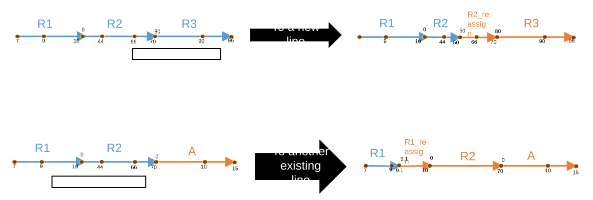
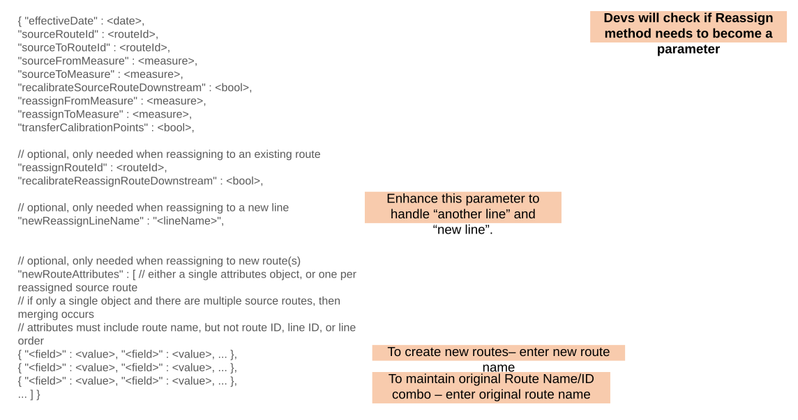
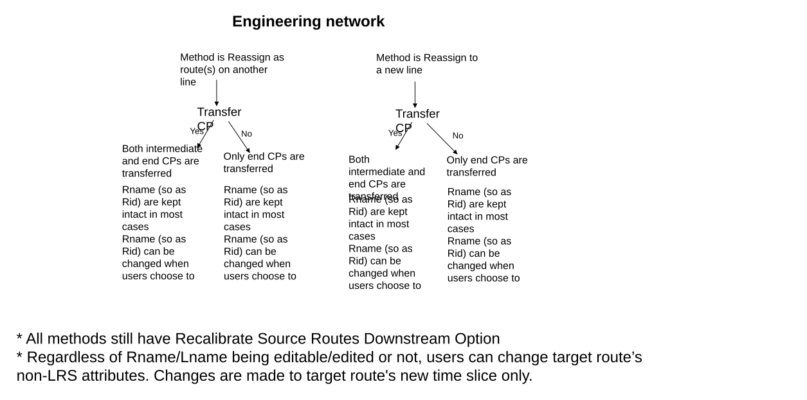
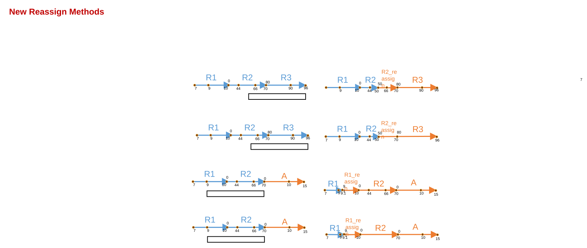
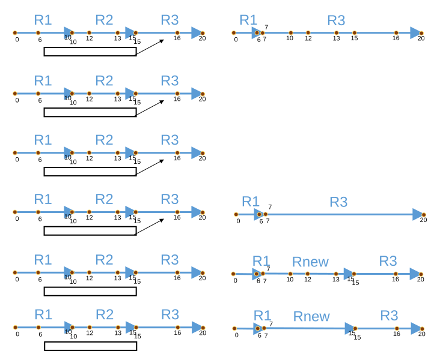
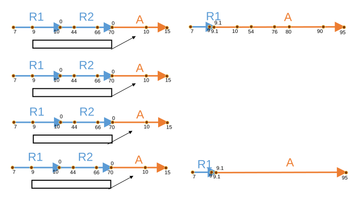
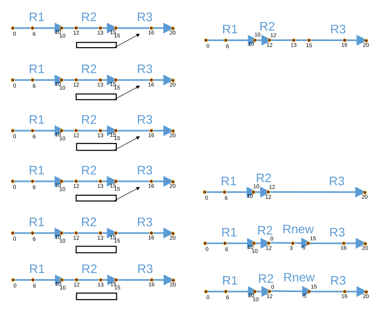

# Reassign to a new or existing line with original Route ID/Name maintained on the target line - REST

| Field | Value |
| --- | --- |
| **Doc** | 607 · User Story · Server |
| **Product** | Pipeline Referencing |
| **Release** | — |
| **Issues** | — |
| **Source** | [ReassignMethodsREST.pptx](<https://esriis.sharepoint.com/sites/LocationReferencing/Shared%20Documents/General/ReassignMethodsREST.pptx>) |
| **People** | author William Isley · PE — · dev — |
| **Edited** | 2023-02-28 23:04 by Claire Wang |
| **Extracted** | 2026-09-04 · lane xmlstrip · format 3.0 · prompt v2.0.2 |
| **Keywords** | route reassignment · rest api · line network · route id · route name · calibration points · route attributes · error handling |
| **Tools** | — |

## Summary

This document describes user stories and technical details for enhancing REST API methods to support reassigning routes in a line network to a new or existing line while maintaining the original Route ID and Route Name. It covers the new reassign methods, error handling, testing scenarios, automation updates, and documentation requirements. The focus is on preserving route attribution, handling calibration points transfer, and ensuring correct route attributes and measures after reassignment.

## Related documents

<!-- related:begin -->
- [Reassign to a New or Existing Line with Original Route ID/Name Maintained on the Target Line - REST](<https://esriis.sharepoint.com/sites/lrsworkspace/LRS Doc Index/User Stories/565-reassign-to-a-new-or-existing-line-with-original-route-id.md>) — similar text 0.84 · 6 title words · 3 filename words · same kind/surface/folder <!-- rel:594 s=11.509 -->
- [Support Reassign: Transfer as New Route(s) to Adjacent Line Method in ArcGIS Pro](<https://esriis.sharepoint.com/sites/lrsworkspace/LRS Doc Index/User Stories/support-reassign-transfer-as-new-route-s-to-adjacent-line.md>) — similar text 0.50 · 3 title words · 1 filename word · same kind/folder <!-- rel:583 s=6.078 -->
- [Reassign Routes to Another Line with Original Route ID/Name Maintenance - REST Test Plan](<https://esriis.sharepoint.com/sites/lrsworkspace/LRS Doc Index/Test Plans/reassign-routes-to-another-line-with-original-route-id-name.md>) — similar text 0.30 · 6 title words · 2 filename words · same surface <!-- rel:542 s=5.558 -->
- [Support Reassign: Transfer to a New Line Method in ArcGIS Pro](<https://esriis.sharepoint.com/sites/lrsworkspace/LRS Doc Index/User Stories/support-reassign-transfer-to-a-new-line-method-in-pro.md>) — similar text 0.49 · 2 title words · 1 filename word · same kind/folder <!-- rel:585 s=5.249 -->
- [Fix existing Reassign UI automations](<https://esriis.sharepoint.com/sites/lrsworkspace/LRS Doc Index/User Stories/fix-existing-reassign-ui-automations.md>) — similar text 0.47 · 2 title words · 1 filename word · same kind/folder <!-- rel:582 s=4.697 -->
<!-- related:end -->

<!-- docs:begin -->
## Esri documentation

[Route reassignment](https://doc.esri.com/en/arcgis-pro/latest/help/production/location-referencing-pipelines/reassign-routes.html)
<!-- docs:end -->

---

## Story
### Reassign to a new or existing line with original Route ID/Name maintained on the target line - REST <!-- slide 1 -->
User Story

### User Story <!-- slide 3 -->
As a pipeline editor, I need the ability to reassign routes in a line network to a new line (or another existing line) with original RouteID-Route Name combo maintained, so that I can maintain the original attribution for the route as well as the updated version after reassignment.

Persona
LRS Editor: This user is responsible for making edits to the LRS.  The edits they need to make come in from field crews/contractors in a variety of formats (shapefiles, engineering drawing, fgdbs).  The LRS Editor is responsible for making the route edits based on these documents. Pipeline companies use the line as an administrative unit for a group of pipes that are under the same administrator/operator. A pipe needs to be moved to a different line from time to time due to a variety of factors including ownership change, jurisdiction boundary change, other classification change, or more accurate analysis and management.  In these scenarios, the RouteID-Route Name combo would stay the same, only the line name would change.

## Acceptance Criteria
### Reassign to a new line Context: Buckeye Energy <!-- slide 2 -->
To a new line
To another existing line

[figure: R1 · R2 · R3 · 7 · 9 · 10 · 0 · 44 · 66 · 70 · 80 · 90 · 96 · 50 · A · 9.1 · R1_reassign · 15 · R2_reassign]



### Reassign Methods in REST <!-- slide 4 -->
- REST should now support two more reassign methods for Line network in addition to existing methods (structure already exists, only the ability to preserve Rid/name needs to be developed)
  - Reassign to a new line
  - Reassign as new route(s) on another line
- In either of these methods, original Route ID/Name combination can be maintained on target line in non-overlapping time slices for entire routes by passing in original Route Name in newRouteAttributes, and Route ID is maintained when REST proceeds. Partial routes need non-existing Route Names and will get a brand new Route ID when REST proceeds. This is what most users will do.
  - Unlike existing Reassign methods, routes are never merged as a result of reassignment in these 2 methods.
  - Users can choose to transfer calibration points or not. If true, all calibration points are transferred to target routes. If false, only end calibration points for each route are transferred, and intermediate calibration points are not kept.
  - Users can maintain original Route ID/Name combination on target line by passing in the original Route Name in newRouteAttributes. Users can also change route name for entire routes. In this case, target routes must have brand new Route Names and will be assigned brand new Route IDs. For partial routes, users always need to pass in non-existing Route Names in newRouteAttributes for REST to create brand new Route ID.
- Software Engineer that is assigned the story will update the signature and review with the team. Check if Reassign method needs to become a parameter. Utilize the existing Reassign Route signature (e.g. newReassignLineName parameter).
- Software Engineer will modify or create new readable error messages for inputs that are not allowed in each workflow
- Make sure Line Order is rearranged after reassignment
- Make sure reassignment results are correct in terms of route attributes and measures
All diagrams and graphics are attached at the end of user story. Dev and PE will refer to them.

### Devs will check if Reassign method needs to become a parameter <!-- slide 5 -->
{ "effectiveDate" : <date>,
"sourceRouteId" : <routeId>,
"sourceToRouteId" : <routeId>,
"sourceFromMeasure" : <measure>,
"sourceToMeasure" : <measure>,
"recalibrateSourceRouteDownstream" : <bool>,
"reassignFromMeasure" : <measure>,
"reassignToMeasure" : <measure>,
"transferCalibrationPoints" : <bool>,

// optional, only needed when reassigning to an existing route
"reassignRouteId" : <routeId>,
"recalibrateReassignRouteDownstream" : <bool>,

// optional, only needed when reassigning to a new line
"newReassignLineName" : "<lineName>",

```
// optional, only needed when reassigning to new route(s)
"newRouteAttributes" : [ // either a single attributes object, or one per reassigned source route
// if only a single object and there are multiple source routes, then merging occurs
// attributes must include route name, but not route ID, line ID, or line order
```

{ "<field>" : <value>, "<field>" : <value>, ... },
{ "<field>" : <value>, "<field>" : <value>, ... },
{ "<field>" : <value>, "<field>" : <value>, ... },
... ] }
To create new routes– enter new route name
 To maintain original Route Name/ID combo – enter original route name
Enhance this parameter to handle “another line” and “new line”.



### Error cases <!-- slide 6 -->
- Sanity check the error cases on existing Reassign methods still fail with correct error.
  - E.g. monotonicity, entering an existing route name in route attribute section, new line name is required but is left empty, and etc
- For the two new Reassign methods:
  - If user provides Route Name that already exists in other lines, return error
    - Whether time slices overlap or not does not matter. If an existing route (not retired) is put in, it will error out because a route can’t stay on multiple lines at the same time. If a retired route name is put it, even though time slices don’t overlap, it will still error out because reassignment to retired route is not allowed.
    - In a work, target route name must be source route name or brand new route name.
  - If user creates “Line in a line” scenario for non-PoM, return error
  - If method is Reassign as new route(s) to another line, the target line must touch the immediate upstream or downstream of source route or line. If not, return error
- More error conditions will be needed if Reassign method becomes a parameter.
  - A method is not passed in
  - Users specify parameters that are excessive or incorrect for that particular method (e.g. method is reassigning to a new line but target line is existing)

### Notes

In this case, the reassign portion should be either on the upstream or downstream ends of the target line or in the immediate upstream or downstream of a gap between routes in the target line.
*Note – we currently supported scenarios for non-overlapping time slices: same line name and same route name; same line name but different route name. We don’t currently support different line name but same route name.

## Testing
<!-- slide 7 -->
- Test on APR data in Feature Services
- Test with partial routes, entire routes, and combinations
- Test the 2 new reassign methods and associated options (transfer CP; change target route name)
  - Unlike existing Reassign methods, routes are never merged as a result of reassignment in these 2 methods.
  - Users can choose to transfer calibration points or not. If true, all calibration points are transferred to target routes. If false, only end calibration points for each route are transferred, and intermediate calibration points are not kept.
  - Users can choose to maintain original Route ID/Name combination on target line and this is default. They can also change route name. In this case, target routes must have brand new Route Names and will be assigned brand new Route IDs.
- Test on a variety of route geometries (simple, gapped, loop, lollipop, alpha, branch, vertical)
- Test few cases for conflict prevention with this method
- Validate all REST errors
- Verify target route(s)’ Non-LRS attributes are editable in all method, if there is any, and these attributes apply to target route(s)’ new time slice
- Verify the results of reassignment are correct in terms of route attributes and measures
- Make sure Line Order is rearranged after reassignment
- GP tools will be tested in a separate user story. Realign with Abandonment will not be affected.

## Automation
<!-- slide 8 -->
- Create multiple issues to fix any automation that is expected to break per the REST changes, if there is any caused by potential parameter change
- Add Reassign to a new line and Reassign as new route(s) to another line automation (3-5 cases each) to existing automations

## Documentation
<!-- slide 9 -->
Edit existing Reassign in REST topics to reflect new REST structure (e.g. newReassignLineName and newRouteAttributes annotations)
We need to make sure to document each reassign method and associate options as annotations. E.g. What method and options lead to route id/name being kept intact or not; routes never merge in new methods; how many calibration points are transferred.
Update the REST API doc with example urls
Software Engineer should work with Technical Writer on the REST doc

## Assignment
<!-- slide 10 -->
Story Points: (including new automation and correcting automation)
Dev:
PE:

## Other content
### Method is Reassign as route(s) on another line <!-- slide 11 -->
- All methods still have Recalibrate Source Routes Downstream Option
- Regardless of Rname/Lname being editable/edited or not, users can change target route’s non-LRS attributes. Changes are made to target route's new time slice only.
Method is Reassign to a new line
Both intermediate and end CPs are transferred
Rname (so as Rid) are kept intact in most cases
Rname (so as Rid) can be changed when users choose to

Only end CPs are transferred
Rname (so as Rid) are kept intact in most cases
Rname (so as Rid) can be changed when users choose to

Both intermediate and end CPs are transferred
Rname (so as Rid) are kept intact in most cases
Rname (so as Rid) can be changed when users choose to

Only end CPs are transferred
Rname (so as Rid) are kept intact in most cases
Rname (so as Rid) can be changed when users choose to

[figure: Engineering network · Transfer CP · Yes · No]



<!-- slide 12 -->
|  | Recal Target | Trans CP | Result | Before | After |
| --- | --- | --- | --- | --- | --- |
| Reassign to a new line | N/A (parameter does no matter to results) | Yes | Do not merge . Rid and Rname kept intact (can be changed in attribute table). All CPs are transferred. |  |  |
|  | N/A (parameter does no matter to results) | No | Do not merge . Rid and Rname kept intact (can be changed in attribute table). Only end CPs are transferred. |  |  |
| Reassign as new route(s) to another line | N/A (parameter does no matter to results) | Yes | Do not merge . Rid and Rname kept intact (can be changed in attribute table). All CPs are transferred. |  |  |
|  | N/A (parameter does no matter to results) | No | Do not merge . Rid and Rname kept intact (can be changed in attribute table). Only end CPs are transferred. |  |  |

[figure: R1 · R2 · R3 · 7 · 9 · 10 · 0 · 44 · 66 · 70 · 80 · 90 · 96 · 50 · R2_reassign · A · 15 · 9.1 · R1_reassign · New Reassign Methods]



<!-- slide 13 -->
| Existing Reassign Methods | Recal Target | Trans CP | Result | Before | After |
| --- | --- | --- | --- | --- | --- |
| Reassign to an existing route on the same line | Yes | Yes | Merge source and target –proportion kept |  |  |
|  | No | Yes | Monotonicity is checked: Non-monotonic error or merge with proportion |  | Non-monotonic error<br>or same as above |
|  | No | No | Monotonicity is checked: Non-monotonic error or merge w/o proportion |  | Non-monotonic error<br>or same as below |
|  | Yes | No | Merge source and target –proportion not kept |  |  |
| Reassign as a new route on the same line | N/A (no such option) | Yes | Merge – proportion kept |  |  |
|  | N/A (no such option) | No | Merge – proportion not kept |  |  |

[figure: R1 · R2 · R3 · 0 · 6 · 10 · 12 · 13 · 15 · 16 · 20 · 7 · Rnew]



<!-- slide 14 -->
| Existing Reassign Methods | Recal Target | Trans CP | Result | Before | After |
| --- | --- | --- | --- | --- | --- |
| Reassign to an existing route on another line | Yes | Yes | Merge source and target –proportion kept |  |  |
|  | No | Yes | Monotonicity is checked: Non-monotonic error or merge with proportion |  | Non-monotonic error<br>or same as above |
|  | No | No | Monotonicity is checked: Non-monotonic error or merge w/o proportion |  | Non-monotonic error<br>or same as below |
|  | Yes | No | Merge source and target –proportion not kept |  |  |

[figure: R1 · R2 · A · 7 · 9 · 10 · 0 · 44 · 66 · 70 · 15 · 54 · 76 · 80 · 90 · 9.1 · 95]



<!-- slide 15 -->
| Existing Reassign Methods | Recal Target | Trans CP | Result | Before | After |
| --- | --- | --- | --- | --- | --- |
| Reassign to an existing route (continuous network) | Yes | Yes | Merge source and target –proportion kept |  |  |
|  | No | Yes | Monotonicity is checked: Non-monotonic error or merge with proportion |  | Non-monotonic error<br>or same as above |
|  | No | No | Monotonicity is checked: Non-monotonic error or merge w/o proportion |  | Non-monotonic error<br>or same as below |
|  | Yes | No | Merge source and target –proportion not kept |  |  |
| Reassign to a new route (continuous network) | N/A (no such option) | Yes | Merge – proportion kept |  |  |
|  | N/A (no such option) | No | Merge – proportion not kept |  |  |

[figure: R1 · R2 · R3 · 0 · 6 · 10 · 12 · 13 · 15 · 16 · 20 · 3 · 5 · Rnew]


