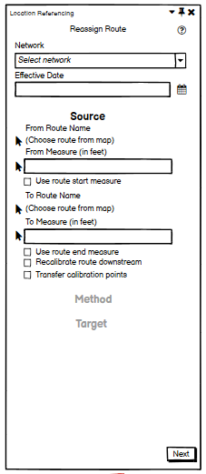
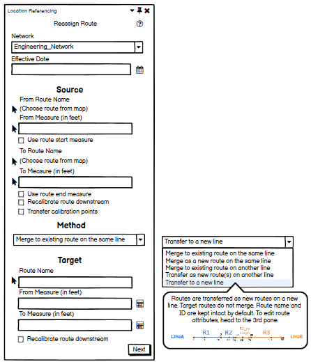
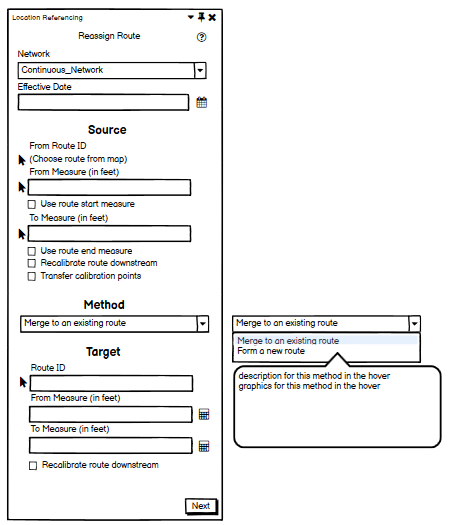
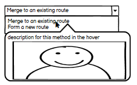
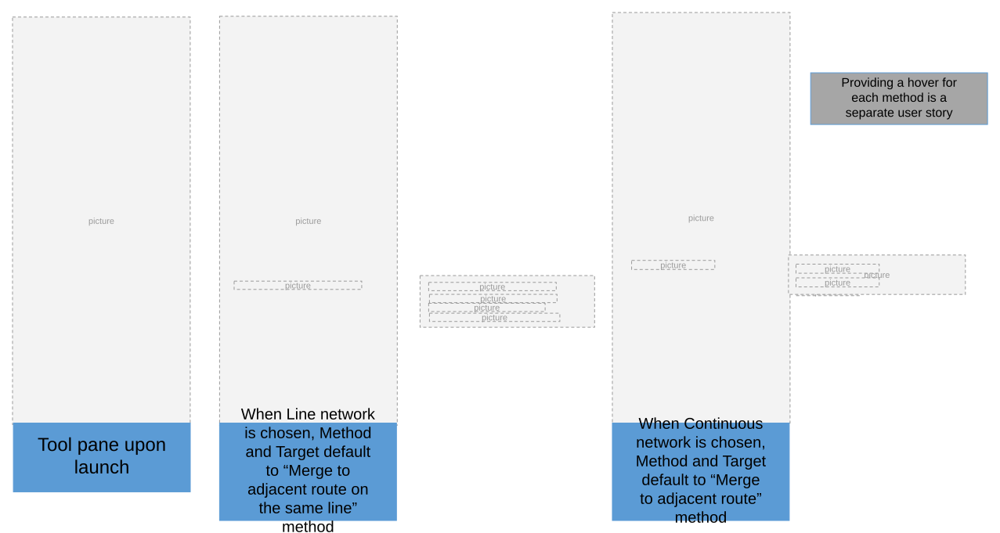
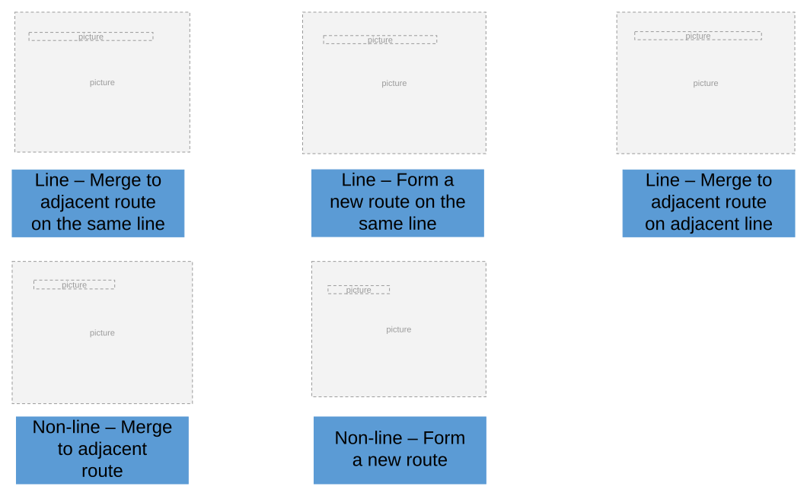
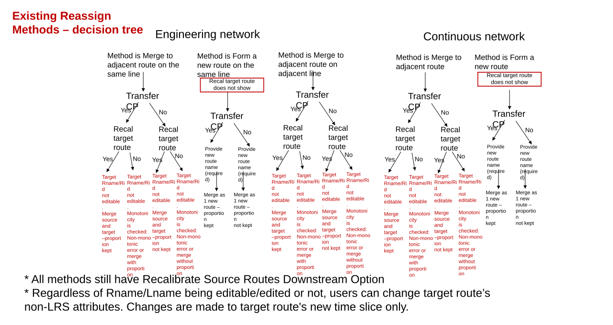
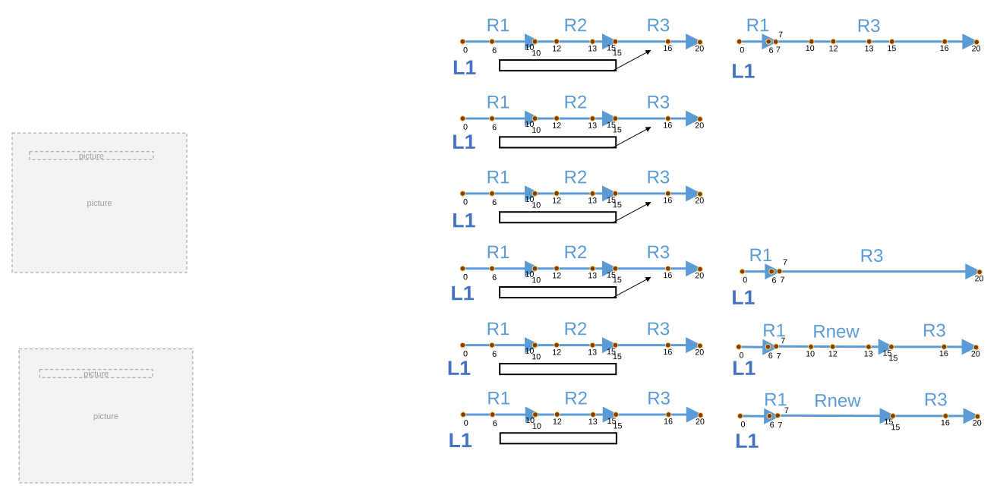
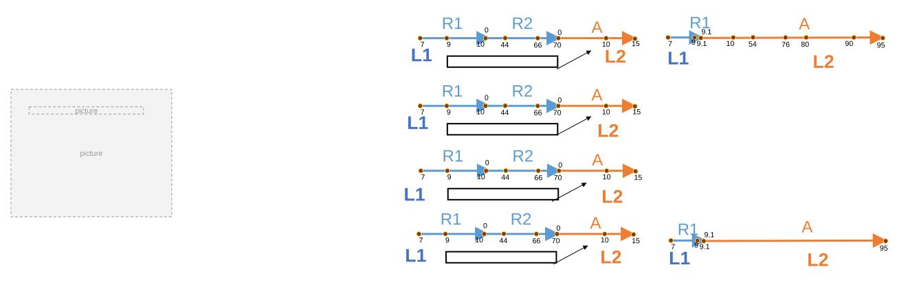
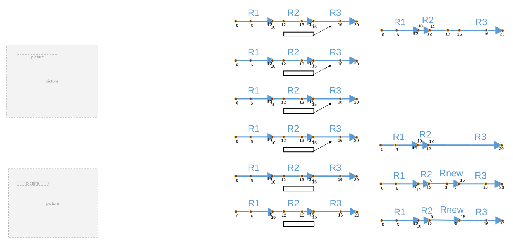

# Reassign UI Change to Dynamically Support Existing Reassign Methods - Pro

| Field | Value |
| --- | --- |
| **Doc** | 586 · User Story · Pro |
| **Product** | Roads & Highways · Pipeline Referencing |
| **Release** | — |
| **Issues** | — |
| **Source** | [ReassignUI_updateUI_sampletest.pptx](<https://esriis.sharepoint.com/sites/LocationReferencing/Shared%20Documents/General/ReassignUI_updateUI_sampletest.pptx>) |
| **People** | author William Isley · PE — · dev — |
| **Edited** | 2023-03-31 23:12 by Claire Wang |
| **Extracted** | 2026-09-04 · lane xmlstrip · format 3.0 · prompt v2.0.2 |
| **Keywords** | reassign methods · reassign routes · method dropdown · line network · non line network · route merging · route forming |
| **Tools** | Reassign Routes · Route Eyedropper |

## Summary

This document describes the update to the Reassign Routes tool UI in ArcGIS Pro to support five existing and two new reassign methods dynamically. It details the addition of a Method dropdown section that adapts based on the network type, the behavior of the tool panes, and the expected user interactions. Testing criteria for various network types, route geometries, and data projections are included, along with notes on documentation and automation coverage.

## Related documents

<!-- related:begin -->
- [Fix existing Reassign UI automations](<https://esriis.sharepoint.com/sites/lrsworkspace/LRS Doc Index/User Stories/fix-existing-reassign-ui-automations.md>) — similar text 0.56 · 2 title words · 1 filename word · same kind/surface/folder <!-- rel:582 s=6.26 -->
- [Support Reassign: Transfer to a New Line Method in ArcGIS Pro](<https://esriis.sharepoint.com/sites/lrsworkspace/LRS Doc Index/User Stories/support-reassign-transfer-to-a-new-line-method-in-pro.md>) — similar text 0.50 · 3 title words · 1 filename word · same kind/surface/folder <!-- rel:585 s=5.778 -->
- [Support Reassign: Transfer as New Route(s) to Adjacent Line Method in ArcGIS Pro](<https://esriis.sharepoint.com/sites/lrsworkspace/LRS Doc Index/User Stories/support-reassign-transfer-as-new-route-s-to-adjacent-line.md>) — similar text 0.50 · 3 title words · 1 filename word · same kind/surface/folder <!-- rel:583 s=5.63 -->
- [Reassign Route UI: Dynamic Support of Existing Methods Test Plan](<https://esriis.sharepoint.com/sites/lrsworkspace/LRS Doc Index/Test Plans/5152-reassign-route-ui-dynamic-support-of-existing-methods.md>) — similar text 0.49 · 4 title words · 1 filename word <!-- rel:550 s=5.061 -->
- [Reassign Methods in REST for Line Network](<https://esriis.sharepoint.com/sites/lrsworkspace/LRS%20Doc%20Index/User%20Stories/reassign-methods-in-rest-for-line-network__doc607.md>) — similar text 0.43 · 2 title words · 1 filename word · same kind/folder <!-- rel:607 s=4.565 -->
<!-- related:end -->

<!-- docs:begin -->
## Esri documentation

[Reassign routes](https://doc.esri.com/en/arcgis-pro/latest/help/production/roads-highways/reassign-routes.html) · [Reassign by merging to an adjacent route](https://doc.esri.com/en/arcgis-pro/latest/help/production/roads-highways/reassign-by-merging-to-an-adjacent-route.html)

_No page matched:_ [Route Eyedropper](https://www.google.com/search?q=%22Route%20Eyedropper%22+site%3Adoc.esri.com)
<!-- docs:end -->

---

## Story
### Reassign UI change to dynamically support existing reassign methods - Pro <!-- slide 1 -->
User Story

### User Story <!-- slide 2 -->
As 2 new Reassign methods are needed in Reassign Routes tool, team has decided to update Reassign UI to efficiently support all Reassign methods (5 existing methods and 2 new methods).
This is achieved by adding a Method section in UI that has a dropdown of Reassign methods, and modifying Target section to dynamically reflect the selected method.

## Acceptance Criteria
### Reassign Methods in Pro – Tool pane <!-- slide 3 -->
- In the 1st pane of Reassign tool, rename original Source Route and Target Route to Source and Target. This is because target can be a line in the 2 new methods we cover in separate user stories
- A Method section is added between Source and Target
  - The Method section contains a dropdown box only
  - Network determines what methods are available in the dropdown
    - For Line network, include these methods in dropdown
      - Merge to adjacent route on the same line
      - Form a new route on the same line (Form as a generic name – sub-scenarios, like rename, merge, and split, are identified in hover)
      - Merge to adjacent route on adjacent line
    - For non-line network, include these methods in dropdown
      - Merge to adjacent route
      - Form a new route
  - When user hovers on the method in the dropdown, a hover window shows
- The 1st pane has Network, Effective Date, and Source available with Line network template. Method and Target are unavailable until a network is chosen
- Before a network is chosen, Method and Target are unavailable (grayed out)
- Once a line network is chosen, Method section becomes available and defaults to “Merge to adjacent route on the same line”. Target also becomes available and shows parameters for this method only. Method dropdown contains 3 methods in total
- Once a non-line network is chosen, Method section becomes available and defaults to “Merge to adjacent route”. Target also becomes available and shows parameters for this method only. Method dropdown contains 2 methods in total

Providing a hover for each method is a separate user story

Tree diagram and graphics are attached at the end.

### Providing a hover for each method is a separate user story <!-- slide 4 -->
Tool pane upon launch
When Line network is chosen, Method and Target default to “Merge to adjacent route on the same line” method
When Continuous network is chosen, Method and Target default to “Merge to adjacent route” method

### Reassign Methods in Pro – Tool pane <!-- slide 5 -->
- Tool pane follows accordion design to support reassign methods upon users’ input
  - If user changes network type, clear everything already filled up and show new source/method sections that default to the selected network
  - If user selects a different method, a new, empty Target section shows up upon method re-selection
- All methods for line network will need a second pane showing retired routes, no matter how many routes are retired. The second pane has an additional line under the table
  - Merge to adjacent route on the same line & Merge to adjacent route on adjacent line: The route(s) will be retired on source line and merge into target route.
  - Form a new route on the same line: The route(s) will be retired on source line and form a single target line.
- The third pane do not change from the current experience
- Tool pane shows a scrollbar when contents exceed pane length

<!-- slide 6 -->
Line – Merge to adjacent route on the same line
Non-line – Merge to adjacent route
Line – Form a new route on the same line
Line – Merge to adjacent route on adjacent line
Non-line – Form a new route

### Existing Reassign Methods – decision tree <!-- slide 7 -->
Method is Merge to adjacent route on the same line

Method is Form a new route on the same line
Method is Merge to adjacent route on adjacent line

Method is Merge to adjacent route
Method is Form a new route
Target Rname/Rid not editable. Merge source and target –proportion kept

Target Rname/Rid not editable. Monotonicity is checked: Non-monotonic error or merge with proportion

Target Rname/Rid not editable. Merge source and target –proportion not kept

Target Rname/Rid not editable. Monotonicity is checked: Non-monotonic error or merge without proportion

Provide new route name (required)
Provide new route name (required)
Merge as 1 new route – proportion kept
Merge as 1 new route – proportion not kept
Recal target route does not show
Target Rname/Rid not editable. Merge source and target –proportion kept

Target Rname/Rid not editable. Monotonicity is checked: Non-monotonic error or merge with proportion

Target Rname/Rid not editable. Merge source and target –proportion not kept

Target Rname/Rid not editable. Monotonicity is checked: Non-monotonic error or merge without proportion

Target Rname/Rid not editable. Merge source and target –proportion kept

Target Rname/Rid not editable. Monotonicity is checked: Non-monotonic error or merge with proportion

Target Rname/Rid not editable. Merge source and target –proportion not kept

Target Rname/Rid not editable. Monotonicity is checked: Non-monotonic error or merge without proportion

Provide new route name (required)
Provide new route name (required)
Merge as 1 new route – proportion kept
Merge as 1 new route – proportion not kept
- All methods still have Recalibrate Source Routes Downstream Option
- Regardless of Rname/Lname being editable/edited or not, users can change target route’s non-LRS attributes. Changes are made to target route's new time slice only.
Recal target route does not show

[figure: Engineering network · Continuous network · Transfer CP · Yes · No · Recal target route]

## Testing
<!-- slide 8 -->
- Test with APR and RH data in Feature Services (do 1-2 tests on fgdb/dc sde)
- Test in both projected and unprojected data
- Test with auto-generated RouteID (APR and RH), single-field RouteID (RH), and multi-field RouteID (RH)
- Verify all elements in acceptance criteria
- Sample test on each existing methods and associated options and make sure reassignment results are correct in terms of route attributes, line orders, and measures
  - Test associated options (when applicable: transfer calibration points; recalibrate source/target route)
  - Test on a variety of route geometries (simple, gapped, loop, lollipop, alpha, branch, vertical)
  - Test with partial routes, entire routes, and combinations
- Test negative cases and validate new error message(s)
  - Tool pane should not show excessive/incorrect methods/options
    - If network is Line network, Method dropdown does not show the 2 methods for non-line network, and vice versa
    - Target section does not show parameters that are not designed for the chosen method, see next slide
    - If method is Form a new route on the same line or Form a new route, Route name cannot be an existing route – Create/validate an error message either when losing focus from Route name or when validating the pane
  - All other negative cases in current experience are intact (e.g. pane has missing parameters; target route is not adjoining; measures result in non-monotonic route; etc.)

### Notes

Projected and unprojected?

## Automation
<!-- slide 10 -->
- Automation is covered in a separate user story “Fixing existing UI automations”

## Documentation
<!-- slide 11 -->
Edit existing Reassign topic to reflect new UI structure for both RH and APR (https://pro.arcgis.com/en/pro-app/latest/help/production/location-referencing-pipelines/reassign-routes.htm and https://pro.arcgis.com/en/pro-app/latest/help/production/roads-highways/reassign-routes.htm)
We need to make sure to clearly document the flow of each reassign method and associate options, and expected results. E.g. What method and options lead to routes being kept intact vs. routes being merged
Add tool UI screenshots of each method
Mention hover

## Assignment
<!-- slide 12 -->
Story Points:
Dev:
PE:

## Other content
### Testing – Route Eyedropper tool <!-- slide 9 -->
- Test in Feature Service only.
- Test in APR ,RH & UPDM
- Verify the Eyedropper tool appears in the 3rd pane and works as expected. Refer to Eyedropper Tool for Routes User story and mimic a few cases from the Test Plan
- Test with Form a new route (Nonline Network) & Form a new route on the same line (Line Network) methods as Eyedropper tool will only show when a brand new route is created
- Test in either projected or unprojected data
- Test with a network that contains non-LRS attributes with subtypes, coded value domains, range domains and contingent values
- Test with a network that contains non-LRS attributes with attribute rules – calculation , constraint and validation

### Notes

Projected and unprojected?

<!-- slide 13 -->
| Line | Recal Target | Trans CP | Result | Before | After |
| --- | --- | --- | --- | --- | --- |
| Merge to adjacent route on the same line | Yes | Yes | Merge source and target –proportion kept |  |  |
|  | No | Yes | Monotonicity is checked: Non-monotonic error or merge with proportion |  | Non-monotonic error or same as above |
|  | No | No | Monotonicity is checked: Non-monotonic error or merge w/o proportion |  | Non-monotonic error or same as below |
|  | Yes | No | Merge source and target –proportion not kept |  |  |
| Form a new route on the same line | N/A (no such option) | Yes | Merge – proportion kept |  |  |
|  | N/A (no such option) | No | Merge – proportion not kept |  |  |

[figure: R1 · R2 · R3 · 0 · 6 · 10 · 12 · 13 · 15 · 16 · 20 · 7 · Rnew · L1]

<!-- slide 14 -->
| Line | Recal Target | Trans CP | Result | Before | After |
| --- | --- | --- | --- | --- | --- |
| Merge to adjacent route on adjacent line | Yes | Yes | Merge source and target –proportion kept |  |  |
|  | No | Yes | Monotonicity is checked: Non-monotonic error or merge with proportion |  | Non-monotonic error or same as above |
|  | No | No | Monotonicity is checked: Non-monotonic error or merge w/o proportion |  | Non-monotonic error or same as below |
|  | Yes | No | Merge source and target –proportion not kept |  |  |

[figure: R1 · R2 · A · 7 · 9 · 10 · 0 · 44 · 66 · 70 · 15 · 54 · 76 · 80 · 90 · 9.1 · 95 · L2 · L1]

<!-- slide 15 -->
| Non-line | Recal Target | Trans CP | Result | Before | After |
| --- | --- | --- | --- | --- | --- |
| Merge to adjacent route | Yes | Yes | Merge source and target –proportion kept |  |  |
|  | No | Yes | Monotonicity is checked: Non-monotonic error or merge with proportion |  | Non-monotonic error or same as above |
|  | No | No | Monotonicity is checked: Non-monotonic error or merge w/o proportion |  | Non-monotonic error or same as below |
|  | Yes | No | Merge source and target –proportion not kept |  |  |
| Form a new route | N/A (no such option) | Yes | Merge – proportion kept |  |  |
|  | N/A (no such option) | No | Merge – proportion not kept |  |  |

[figure: R1 · R2 · R3 · 0 · 6 · 10 · 12 · 13 · 15 · 16 · 20 · 3 · 5 · Rnew]

