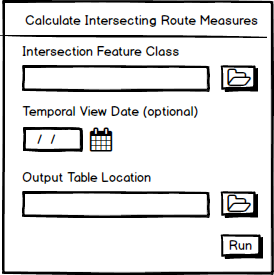

# Related Table for Intersection Measures

| Field | Value |
| --- | --- |
| **Doc** | 678 · User Story · Pro |
| **Product** | Roads & Highways · Pipeline Referencing |
| **Release** | — |
| **Issues** | — |
| **Source** | [RelatedTableIntersectionMeasures.pptx](<https://esriis.sharepoint.com/sites/LocationReferencing/Shared%20Documents/General/RelatedTableIntersectionMeasures.pptx>) |
| **People** | author William Isley · PE — · dev — |
| **Edited** | 2022-02-21 22:32 by Nathan Easley |
| **Extracted** | 2026-09-04 · lane xmlstrip · format 3.0 · prompt v2.0.2 |
| **Keywords** | intersection · route measures · related table · temporal view · python script · lrs analyst |
| **Tools** | Location Referencing toolbox |

## Summary

User story for creating a python script tool in ArcGIS Pro that generates a related table listing all routes and their measures at each LRS Intersection feature. The tool supports temporal filtering and outputs route measures with associated time slices for intersections, including self intersections. It is intended to help LRS analysts feed measure information into other systems.

## Related documents

<!-- related:begin -->
- [Support populating Route Name in Update Measures from LRS tool](<https://esriis.sharepoint.com/sites/lrsworkspace/LRS Doc Index/User Stories/support-populating-route-name-in-update-measures-from-lrs.md>) — similar text 0.38 · 1 title word · 1 filename word · same kind/surface/folder <!-- rel:704 s=4.041 -->
- [Update Intersection Referent Tool User Story](<https://esriis.sharepoint.com/sites/lrsworkspace/LRS Doc Index/User Stories/update-intersection-referent-tool.md>) — similar text 0.27 · 1 title word · 1 filename word · same kind/surface/folder <!-- rel:696 s=3.601 -->
- [Support Events Spanning Routes in Update Measures from LRS](<https://esriis.sharepoint.com/sites/lrsworkspace/LRS%20Doc%20Index/User%20Stories/support-events-spanning-routes-in-update-measures-from-lrs.md>) — similar text 0.36 · 1 title word · 1 filename word · same kind/surface/folder <!-- rel:266 s=3.473 -->
- [Consider concurrencies in Update Measures from LRS](<https://esriis.sharepoint.com/sites/lrsworkspace/LRS Doc Index/User Stories/consider-concurrencies-in-update-measures-from-lrs.md>) — similar text 0.29 · 1 title word · 1 filename word · same kind/surface/folder <!-- rel:710 s=3.259 -->
- [Generate Intersection at Self-Intersecting Routes](<https://esriis.sharepoint.com/sites/lrsworkspace/LRS Doc Index/User Stories/generate-intersection-at-self-intersecting-routes.md>) — similar text 0.23 · 1 title word · same kind/surface/folder <!-- rel:509 s=2.894 -->
<!-- related:end -->

<!-- docs:begin -->
## Esri documentation

[View LRS intersection properties](https://doc.esri.com/en/arcgis-pro/latest/help/production/roads-highways/view-lrs-intersection-properties.html)

_No page matched:_ [Location Referencing toolbox](https://www.google.com/search?q=%22Location%20Referencing%20toolbox%22+site%3Adoc.esri.com)
<!-- docs:end -->

---

## Story
### Related Table for Intersection Measures <!-- slide 1 -->
User Story

### User Story <!-- slide 2 -->
As a LRS Analyst, I want the measures for all routes that are part of an LRS Intersection feature, so I can continue to feed this measure information into other systems that require all the route measures at a given location.
Persona

- LRS Analyst: This user is responsible for analysis and reporting on LRS data.  This user may also have other titles/responsibilities within the organization, such as LRS editor or HPMS coordinator.  For the analyst role, this user utilizes other tools/capabilities within the Esri ecosystem as well as via home built and partner solutions. In this case, users need to have the measures for all the routes that compose an LRS Intersection feature to help with other 3rd party systems they have in their organization.  In ArcMap, we used to provide multiple points at a common location, so users had the ability to get this information.  With the new single point at each intersection model in Pro, users need a way to continue to get this information.

## Acceptance Criteria
### Related table with all intersecting route measures <!-- slide 3 -->
- Create a python script (that should still appear in the Location Referencing toolbox in Pro?) that creates a related table of all the routes and measures at each intersection location
- Input layers include:
  - Intersection Feature Class (must be an LRS Intersection feature class in the Pro format; let’s only support a direct connect to the feature class for now)
  - Temporal View Date (optional, if populated only run against Intersections active during that date; if empty, run against all intersections)
  - Output Location Table (can be a new table or can overwrite an existing table; the table can be in the LRS gdb or another gdb)
- The output table should include an IntersectionID (same field type and length as in Intersection FC), RouteID (same field type and length as in Network FC), Measure (double), From Date (date), and To Date (date)
- Each route that is a part of the Intersection should have a separate row in the output table with the IntersectionID, the measure for the route at that intersection location, and the From and To Date for the route time slice
- If the location of the intersection sits on a route at a self intersection/closing point, create records for all the valid measures on that route
- If the Temporal View Date is not populated, there could be multiple time slices of a given intersection, which could have different route time slices in the output

## Testing
<!-- slide 4 -->
- Test on one RH dataset and one APR dataset
- Verify the tool only executes against the Pro intersection type
- Test using intersections that are only routes as well as intersections of routes with other intersecting layers
- Run against intersections that are at self intersection points on routes

## Automation
<!-- slide 5 -->
Automate the tool in python following the established pattern for GP tools

## Documentation
<!-- slide 6 -->
Document the tool with a new GP topic that follows the GP format
Add a note to the topic https://pro.arcgis.com/en/pro-app/latest/help/production/roads-highways/create-and-modify-lrs-intersections.htm (and the Pipeline Referencing version) that mentions the tool and that it will create an output table of all the routes at each intersection and their measure

## Assignment
<!-- slide 7 -->
Story Points:
Dev:
PE:
