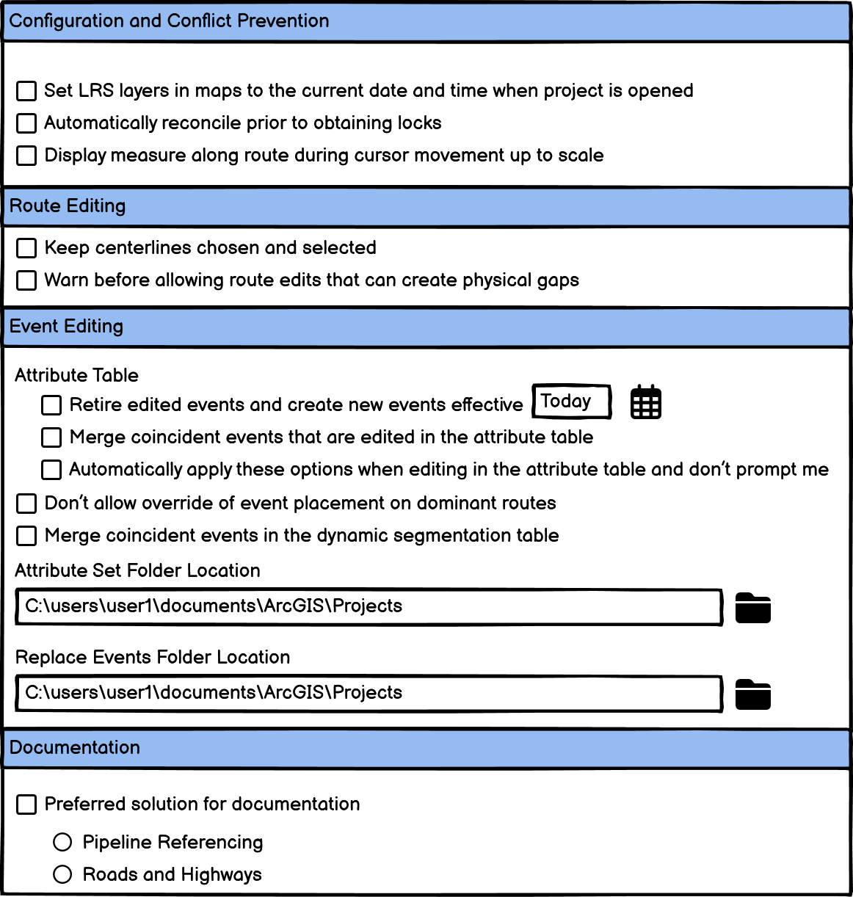

# Reorganize Location Referencing Pro options

| Field | Value |
| --- | --- |
| **Doc** | 371 · User Story · Pro |
| **Product** | — |
| **Release** | — |
| **Issues** | — |
| **Source** | [ReorganizeLocationReferencingProOptions.pptx](<https://esriis.sharepoint.com/sites/LocationReferencing/Shared%20Documents/General/ReorganizeLocationReferencingProOptions.pptx>) |
| **People** | author William Isley · PE — · dev — |
| **Edited** | 2024-05-16 17:43 by Nathan Easley |
| **Extracted** | 2026-09-04 · lane xmlstrip · format 3.0 · prompt v2.0.2 |
| **Keywords** | location referencing pro options · route editing · event editing · configuration · conflict prevention · accordion structure |
| **Tools** | — |

## Summary

This user story describes the need to reorganize the Location Referencing tab in ArcGIS Pro options to improve usability for LRS and event editors. It specifies using an accordion structure with sections for Configuration and Conflict Prevention, Route Editing, Event Editing, and Documentation. The goal is to enhance efficiency by allowing configuration of default options and handling exceptions.

## Related documents

<!-- related:begin -->
- [Advanced Table Editing Options in ArcGIS Pro](<https://esriis.sharepoint.com/sites/lrsworkspace/LRS Doc Index/User Stories/advanced-table-editing-options-in-pro.md>) — similar text 0.21 · 2 title words · 2 filename words · same kind/surface/folder <!-- rel:369 s=4.325 -->
- [Reorganize Location Referencing Pro Options Test Plan](<https://esriis.sharepoint.com/sites/lrsworkspace/LRS Doc Index/Test Plans/5826-reorganize-lr-pro-options-rh-apr-v2-2024-08-2.md>) — similar text 0.12 · 3 title words · 1 filename word · same surface <!-- rel:341 s=3.496 -->
- [Reorganize Location Referencing Pro Options Test Plan](<https://esriis.sharepoint.com/sites/lrsworkspace/LRS Doc Index/Test Plans/5826-reorganize-lr-pro-options-rh-apr-v2-2024-08.md>) — similar text 0.12 · 3 title words · 1 filename word · same surface <!-- rel:340 s=3.496 -->
- [Hide Lock Transfer in Event Editor for Pro Services](<https://esriis.sharepoint.com/sites/lrsworkspace/LRS%20Doc%20Index/User%20Stories/753-hide-lock-transfer-in-event-editor-for-pro-services.md>) — similar text 0.07 · 1 title word · 1 filename word · same kind/surface/folder <!-- rel:714 s=2.994 -->
- [Experience Builder Dynamic Segmentation Widget Additional Options](<https://esriis.sharepoint.com/sites/lrsworkspace/LRS Doc Index/User Stories/exb-dynseg-widget-additional-options.md>) — similar text 0.19 · 1 title word · 1 filename word · same kind/folder <!-- rel:361 s=2.595 -->
<!-- related:end -->

<!-- docs:begin -->
## Esri documentation

[Event editing using the attribute table](https://doc.esri.com/en/arcgis-pro/latest/help/production/location-referencing-pipelines/event-editing-using-the-attribute-table.html) · [Conflict prevention](https://doc.esri.com/en/arcgis-pro/latest/help/production/location-referencing-pipelines/conflict-prevention.html)
<!-- docs:end -->

---

## Story
### Reorganize Location Referencing Pro options <!-- slide 1 -->
User Story
ArcGIS Pro

### User Story <!-- slide 2 -->
As a LRS editor and event editor, I need to have a convenient way to select and maintain advanced LRS options for route and event editing tools, so that I can improve the efficiency of my work by configuring default options while still maintaining flexibility for exception type edits.
Persona
LRS Editor: This user is responsible for making edits to the LRS.  The edits they need to make come in from field crews/contractors in a variety of formats (shapefiles, engineering drawings, FGDBs, etc.).
Event Editor: These users are responsible for making edits to route characteristics and assets.  Typically located in different business units/departments than the LRS route editors, these users have varied GIS experience, but a high level of knowledge about the characteristics they maintain (safety, pavement, crashes, etc.).
Both editor types will need to access and utilize the Location Referencing Pro options tab to configure defaults and setup how to handle exceptions.  The number of options continues to grow, so organizing it will make it easier for users to utilize it to meet their needs.

## Acceptance Criteria
### Requirements <!-- slide 3 -->
- Reorganize the Location Referencing tab of the Pro options
- Utilize an accordion structure with the following sections: Configuration and Conflict Prevention, Route Editing, Event Editing, and Documentation
- Other tabs utilize this approach, use them as a guide if needed

## Testing
<!-- slide 4 -->
- Verify that each option continues to work as expected

## Automation
<!-- slide 5 -->
- No automation for this story

## Documentation
<!-- slide 6 -->
- Update the Set Location Referencing options topic with an updated screenshot and reorganize the topic into sections that align with the accordion design

## Assignment
### Story Points <!-- slide 7 -->
Story Points:
Dev:
PE:
